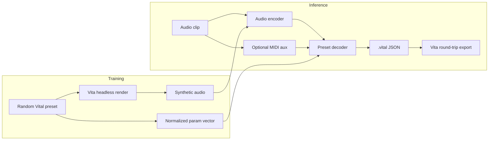
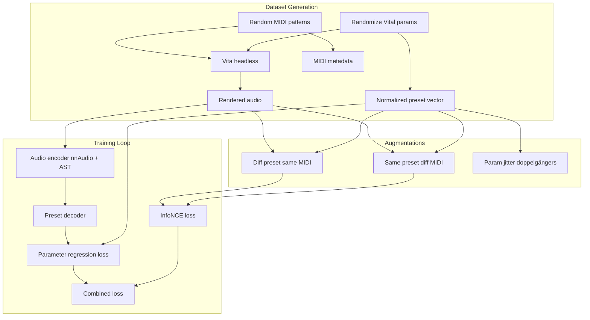

# NERETRAK Framework Plan

> Literature review and system design for a fully local, open-source pipeline that infers Vital synthesizer presets from audio clips.

---

## 1. Project Summary

**Goal:** Build a fully local, open-source system that takes an audio signal (optionally with a MIDI-derived representation in parallel), analyzes timbre and musical structure, and outputs a valid `.vital` preset that approximates the original sound.

**Core challenge:** Not just parameter regression, but learning a representation that separates:
- **Musical content** — notes, chords, polyphony, timing
- **Synthesis identity** — the preset configuration (oscillators, filters, envelopes, effects, modulation routing)

**Training strategy:** Offline synthetic dataset — randomly sample Vital presets, render to audio via headless Vital, learn the inverse mapping. Explore auxiliary structure (audio→MIDI transcription, contrastive "same preset, different MIDI" augmentations) to improve robustness to polyphony and musical variation.

**Scope of this document:** Framework and literature review only — no code.

**Key reference:** [DBraun/Vita headless bindings](https://github.com/DBraun/Vita/blob/main/src/headless/bindings.cpp)

---

## 2. System Architecture (Proposed)



**Phased complexity:**

| Phase | Scope | Rationale |
|-------|-------|-----------|
| A | ~700 scalar controls, factory wavetables, simple modulation | Covers most timbral identity; manageable output space |
| B | Modulation routing graph (source/dest classification + amounts) | VST APIs cannot set mod matrix; requires JSON-level I/O |
| C | Custom wavetables, LFO curves, embedded samples | High-dimensional; defer or treat as generative/retrieval |

---

## 3. Topic 1: `.vital` File Structure & ML Representation

### 3.1 Format overview

`.vital` files are **plain-text JSON** (not binary FXP). Serialization is implemented in Vital's `LoadSave` class ([load_save.cpp](https://github.com/mtytel/vital/blob/main/src/common/load_save.cpp)).

**Top-level keys:**

| Key | Type | Purpose |
|-----|------|---------|
| `synth_version` | string | e.g. `"1.5.3"` |
| `preset_name`, `author`, `comments`, `preset_style` | string | Metadata |
| `macro1` … `macro4` | string | Macro display names |
| `settings` | object | All synthesis state |

### 3.2 The `settings` object

Flat dict of scalar controls plus four structured subtrees:

```
settings
├── <param_name>: float          # ~775 keys total
├── modulations: [ {...}, ... ]
├── sample: { ... }              # optional embedded sample
├── wavetables: [ {...}, ... ]   # one per oscillator (3)
└── lfos: [ {...}, ... ]         # LFO curve shapes
```

**Scalar parameters (~771):**
- Stored in **native engine space**, not VST-normalized 0–1
- Hierarchical naming: `osc_1_level`, `filter_1_cutoff`, `env_1_attack`, `lfo_1_tempo`, `modulation_1_amount`, etc.
- Each has metadata in `ValueDetails` ([synth_parameters.cpp](https://github.com/mtytel/vital/blob/main/src/common/synth_parameters.cpp)): `min`, `max`, `default_value`, scale type (`kLinear`, `kExponential`, `kQuadratic`, `kIndexed`, etc.)

**Modulation routing:**
- Slot scalars: `modulation_N_amount`, `modulation_N_bipolar`, etc.
- Routing array: `{ "source": "lfo_1", "destination": "filter_1_cutoff", "line_mapping": {...} }`
- **Cannot be set via VST `getParameter`/`setParameter`** — only JSON or Vita API

**Wavetables / samples / LFO curves:**
- Wavetable keyframes: base64-encoded float32 arrays (~2048 samples/frame × keyframes × 3 oscs)
- Samples: base64 PCM; can dominate file size
- LFO curves: LineGenerator point data, not just scalar `lfo_N_*` params

### 3.3 Parsing & rendering tools

| Tool | Language | Capability | Limitation |
|------|----------|------------|------------|
| **[Vita](https://github.com/DBraun/Vita)** | Python | `load_preset()`, `load_json()`, `to_json()`, `get_controls()`, `connect_modulation()`, MIDI render | Unofficial; pin Vital version for datasets |
| **[vita-node](https://www.npmjs.com/package/vita-node)** | Node.js | Same API as Vita | Same constraints |
| **[DawDreamer](https://github.com/DBraun/DawDreamer)** | Python | VST host; `set_parameter` on Vital | ~771/775 scalars only; no mod matrix, wavetables, LFO curves, samples |
| Raw JSON | Any | Full dict access | No validation, migration, or render |

**Recommendation:** Use **Vita** as the FOSS backbone for dataset generation, audio rendering, and `.vital` export/validation.

### 3.4 ML I/O representation

**Do not** regress raw JSON blobs — variable length, megabyte-scale wavetables.

**Multi-part fixed schema:**

| Component | ML representation | Notes |
|-----------|-------------------|-------|
| Scalar controls | Fixed-length vector with index→name map | Normalize per `ValueDetails` scale; one-hot/ordinal for `kIndexed` |
| Modulation routing | Sparse graph: `(slot, source_id, dest_id, amount, bipolar, ...)` | Categorical over finite source/dest lists |
| LFO curves | Low-dim parametric (e.g. 32-point resample) or defer | High impact on motion |
| Wavetables | Phase A: `wave_frame` index into factory tables | Custom `wave_data` deferred |
| Sample | Exclude v1 (`sample_on=0` in training) | Separate modality |

**Normalization pitfalls:**
- Engine values ≠ VST normalized values; pick one convention (Vita exposes both `set()` and `set_normalized()`)
- Envelope times use quartic scale; levels use quadratic — normalize in display/log space
- `effect_chain_order` encodes a permutation as a float — treat as categorical
- Round indexed/boolean params at export

**Export pipeline:**
```
model output → denormalize via ValueDetails → build settings dict → Vita.load_json() → to_json() → write .vital
```

Round-tripping through Vita applies version migration and validates control names.

### 3.5 Prior art: synthesizer parameter estimation

| Paper | Approach | Relevance to NERETRAK |
|-------|----------|----------------------|
| [DAFx24 — AST for Massive](https://www.dafx.de/paper-archive/2024/papers/DAFx24_paper_95.pdf) | Audio Spectrogram Transformer → 16 params on Massive | Strong encoder baseline; general-purpose, synth-agnostic |
| [Neural Proxies (arXiv:2509.07635)](https://arxiv.org/pdf/2509.07635) | Preset encoder maps to pretrained audio embedding space | Solves non-differentiability of black-box synths; EfficientAT best encoder |
| [SynthRL (IJCAI 2025)](https://www.ijcai.org/proceedings/2025/1129.pdf) | RL with perceptual reward for cross-domain matching | Fine-tuning on out-of-domain sounds without parameter loss |
| [Equivariant Flow Matching (arXiv:2506.07199)](https://arxiv.org/abs/2506.07199) | Conditional generative model on Surge XT | Handles permutation symmetries in synth params; beats point regression |
| [Contrastive Synthetic Doppelgängers (arXiv:2406.05923)](https://arxiv.org/abs/2406.05923) | Perturb synth params for contrastive positive pairs | Directly applicable to Vita random preset pipeline |

**Key insight for Vital:** Vital has ~700+ params vs. Massive's 16 — phased approach is essential. Permutation symmetries (effect chain order, parallel routing) suggest generative or equivariant methods may outperform naive regression.

---

## 4. Topic 2: FOSS Audio → MIDI

### 4.1 Candidates

| Tool | License | Strengths | Weaknesses |
|------|---------|-----------|------------|
| **[Basic Pitch](https://github.com/spotify/basic-pitch)** (Spotify) | Apache 2.0 | Lightweight, polyphonic, pitch bend, `pip install`, instrument-agnostic | Best on single instrument; not synth-specific |
| **[Basic Pitch TS](https://github.com/spotify/basic-pitch-ts)** | Apache 2.0 | Same model in TypeScript/browser | Same limitations |
| **Onsets and Frames** (Magenta) | Apache 2.0 | Piano-focused, well-established | Less general; heavier |
| **piano_transcription_inference** (ByteDance) | MIT | High-quality piano | Piano-only |
| **MT3** (Google) | Apache 2.0 | Multi-instrument transcription | Heavy; overkill for auxiliary signal |

### 4.2 Recommendation

**Primary: Basic Pitch** — best balance of FOSS license, ease of integration, polyphonic support, and local inference.

**Role in NERETRAK:** Auxiliary conditioning signal, not ground truth:
- At **training time:** MIDI is known (we control rendering) — transcription is unnecessary for synthetic data
- At **inference time:** Basic Pitch provides a coarse note/pitch representation to help disentangle musical content from timbre
- For **contrastive augmentations:** Render same preset with different MIDI patterns; transcription on real-world input helps normalize pitch content

**Caveat:** Transcription errors on complex polyphonic synth sounds may hurt more than help. Treat as optional auxiliary input with ablation experiments. For training data, always use the known MIDI used for rendering.

---

## 5. Topic 3: Audio → Spectrogram — Prebuilt Layers

### 5.1 Options

| Library | Type | Trainable front-end | GPU | Notes |
|---------|------|---------------------|-----|-------|
| **[nnAudio](https://github.com/KinWaiCheuk/nnAudio)** | PyTorch layer | Yes (`trainable_STFT`, `trainable_mel`) | Yes | On-the-fly spectrogram as first NN layer; 50–100× faster than librosa offline |
| **torchaudio** | PyTorch | Fixed transforms | Yes | Standard; `MelSpectrogram`, `Spectrogram`; no trainable basis by default |
| **librosa** | NumPy | No | No | Offline preprocessing only; slow at scale |
| **torchaudio + custom** | PyTorch | Manual | Yes | Possible but reinventing nnAudio |

### 5.2 Recommendation

**Primary: nnAudio** for training pipeline — embed `MelSpectrogram` or `STFT` as the first layer of the audio encoder.

```python
from nnAudio.features.mel import MelSpectrogram
spec_layer = MelSpectrogram(
    sr=22050, n_fft=2048, n_mels=128, hop_length=512,
    trainable_mel=False,   # start fixed; ablate trainable=True later
    trainable_STFT=False,
)
```

**Encoder backbone:** Prior art strongly favors spectrogram-based transformers:
- **AST** (Audio Spectrogram Transformer) — DAFx24 synth matching baseline
- **PaSST / EfficientAT** — strong pretrained audio encoders (Neural Proxies paper)
- **AudioMAE, CLAP, OpenL3** — alternative pretrained backbones

**Suggested default stack:**
1. nnAudio mel layer (128 bins, 22.05 kHz, hop 512)
2. Pretrained EfficientAT or AST backbone (frozen initially)
3. Preset decoder head (MLP → Phase A; transformer + mod graph head → Phase B)

**Ablation:** Compare fixed vs. trainable nnAudio front-end; compare pretrained vs. from-scratch encoder.

---

## 6. Topic 4: Negative Sampling — Triplet / JEPA / Contrastive

### 6.1 The disentanglement problem

NERETRAK must learn: *same preset, different MIDI → same label; different preset, same MIDI → different label.*

This maps directly to contrastive / metric learning and self-supervised representation learning.

### 6.2 Triplet / contrastive approaches

| Method | Paper | Mechanism | Fit for NERETRAK |
|--------|-------|-----------|------------------|
| **Triplet loss** | Contrastive timbre representations (arXiv:2509.13285) | Anchor/positive/negative in embedding space | Natural fit: same preset + different MIDI = positive pair |
| **InfoNCE / SimCLR** | Same paper | Batch-level contrastive | Scales better than triplet; use preset ID as class |
| **Synthetic doppelgängers** | arXiv:2406.05923 | Perturb synth params for near-positive pairs | Built into dataset generation — slight param jitter |
| **MERIT** | arXiv:2605.27346 | Factor-specific projection heads (melody/rhythm/timbre) | Separate heads for musical content vs. synthesis identity |
| **Masked triplet loss** | Multidimensional disentangled representations | Binary mask selects instrument-specific dims | Could mask "timbre/preset" dims during contrastive loss |

**Recommended contrastive strategy:**

```
Positive pair:  (audio_render(preset_P, midi_A), audio_render(preset_P, midi_B))
Negative pair:  (audio_render(preset_P, midi_A), audio_render(preset_Q, midi_A))
Loss:           InfoNCE on audio encoder output, preset vector as supervised target
```

Combine with supervised parameter regression loss on the preset decoder.

### 6.3 JEPA approaches

| Method | Paper | Mechanism | Fit for NERETRAK |
|--------|-------|-----------|------------------|
| **I-JEPA** | Meta, 2023 | Predict masked latent representations | General audio encoder pretraining |
| **Audio-JEPA** | arXiv:2507.02915 | ViT on mel-spectrogram patches | Self-supervised pretrain on AudioSet before fine-tuning |
| **Stem-JEPA** | arXiv:2408.02514 | Predict compatible stem embeddings from mix | Models timbre/harmony/rhythm jointly |

**JEPA vs. triplet for NERETRAK:**

| | Triplet/InfoNCE | JEPA |
|--|-----------------|------|
| **Best for** | Explicit preset disentanglement from MIDI | General audio representation pretraining |
| **Supervision** | Requires preset-labeled pairs (we have this) | Self-supervised on unlabeled audio |
| **When to use** | Core training objective for disentanglement | Optional pretraining stage for audio encoder |

**Recommendation:** Use **InfoNCE/triplet contrastive loss** as the primary disentanglement mechanism (we control the data generating process). Optionally **pretrain the audio encoder with Audio-JEPA** on AudioSet or on our synthetic Vital renders before fine-tuning on preset regression.

Do **not** rely on JEPA alone for preset recovery — it learns general representations, not inverse synthesis.

### 6.4 Generative alternative for ill-posed inversion

[Equivariant Flow Matching (arXiv:2506.07199)](https://arxiv.org/abs/2506.07199) shows that point regression fails under permutation symmetries (multiple param configs → same sound). For Vital:
- Effect chain order permutations
- Parallel modulation routings
- Wavetable phase offsets

Consider a **conditional generative preset decoder** (flow matching or diffusion in normalized param space) as a Phase B+ alternative to direct regression, especially if regression metrics plateau.

---

## 7. Proposed Training Pipeline



**Loss function (proposed):**
```
L = λ_reg · L_param + λ_con · L_InfoNCE + λ_proxy · L_embedding (optional)
```

- `L_param`: MSE/Huber on normalized scalar params (Phase A)
- `L_InfoNCE`: contrastive on encoder embeddings with preset-ID labels
- `L_embedding`: optional neural proxy loss (audio embedding ↔ preset embedding alignment, per arXiv:2509.07635)

---

## 8. Evaluation Strategy

| Metric | Method |
|--------|--------|
| Parameter accuracy | MSE / categorical accuracy per param group on held-out synthetic presets |
| Audio reconstruction | Render predicted preset via Vita; compare mel/MFCC/CLAP distance to target |
| Perceptual quality | MUSHRA or ABX listening tests |
| Generalization | Test on hand-crafted presets (not random) and out-of-domain audio |
| Disentanglement | Same-preset-different-MIDI: param vector cosine similarity > 0.95 |
| Round-trip validity | Predicted `.vital` loads in Vital without error |

---

## 9. Open Questions & Risks

| Risk | Mitigation |
|------|------------|
| 700+ output dimensions | Phased rollout; param group masking; hierarchical decoder |
| Permutation symmetries | Generative decoder or equivariant architecture |
| Mod matrix not in VST API | Vita JSON API only; separate routing head |
| Custom wavetables | Phase C; start with factory wavetable indices |
| Polyphonic transcription noise | Use known MIDI at train time; Basic Pitch optional at inference |
| Vita version drift | Pin Vital version; store `synth_version` in dataset metadata |
| Synthetic → real preset distribution gap | Neural proxy pretraining; SynthRL fine-tuning |

---

## 10. Recommended Deliverables (Next Steps)

1. **`docs/vital-schema.md`** — Fixed parameter index map derived from `synth_parameters.cpp`, normalization rules per scale type
2. **`docs/dataset-spec.md`** — Vita-based generation loop, MIDI augmentation strategy, metadata format
3. **`docs/model-architecture.md`** — Encoder/decoder design, loss functions, phased rollout
4. **`docs/literature-review.md`** — Full citations and method comparisons (expand sections 3.5, 4, 5, 6)
5. **`docs/evaluation-protocol.md`** — Metrics, baselines, ablation plan

---

## 11. Key References

| Resource | URL |
|----------|-----|
| Vital preset I/O | https://github.com/mtytel/vital/blob/main/src/common/load_save.cpp |
| Parameter registry | https://github.com/mtytel/vital/blob/main/src/common/synth_parameters.cpp |
| Vita Python bindings | https://github.com/DBraun/Vita |
| Vita bindings source | https://github.com/DBraun/Vita/blob/main/src/headless/bindings.cpp |
| DawDreamer Vital limitations | https://github.com/DBraun/DawDreamer/issues/212 |
| DAFx24 AST synth matching | https://www.dafx.de/paper-archive/2024/papers/DAFx24_paper_95.pdf |
| Neural Proxies for synths | https://arxiv.org/pdf/2509.07635 |
| SynthRL | https://www.ijcai.org/proceedings/2025/1129.pdf |
| Equivariant flow matching | https://arxiv.org/abs/2506.07199 |
| Synthetic audio doppelgängers | https://arxiv.org/abs/2406.05923 |
| Basic Pitch | https://github.com/spotify/basic-pitch |
| nnAudio | https://github.com/KinWaiCheuk/nnAudio |
| Audio-JEPA | https://arxiv.org/abs/2507.02915 |
| Stem-JEPA | https://arxiv.org/abs/2408.02514 |
| Contrastive timbre representations | https://arxiv.org/abs/2509.13285 |
| MERIT disentangled music reps | https://arxiv.org/abs/2605.27346 |
