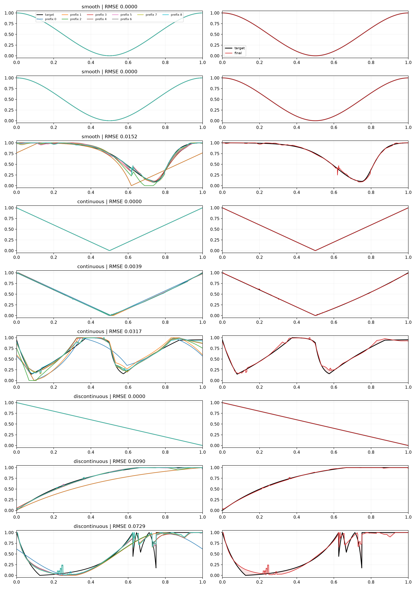

# Experiment 4 Findings: Phase-Factorized Residual Codebooks

## What did this experiment ask?

Can one base or residual code be reused at arbitrary circular phases instead of spending separate code slots on translated copies? Can shared and topology-specific residual dictionaries then be combined without losing control of the model-output budget?

Experiment 4 retained the 32-way base, four residual layers, frequency-weighted corpus fitting, explicit no-op codes, held-out authors, and 1,024-point evaluation used by Experiment 3.

## How were canonical codes and offsets constructed?

Candidate codes were compared with training curves at 128 circular translations. Selected offsets were locally refined against the full 1,024-point curve.

Every stored code retains training-source provenance. Its canonical orientation was chosen so that applying it with zero phase produced the largest summed error reduction across the relevant training population. A preset can then reuse that code with one continuous circular phase offset rather than selecting a translated duplicate.

The base receives one phase scalar. Every residual selection receives one clipped gain and one phase scalar. Residual code zero is an exact no-op and forces its gain and phase to zero.

## Did phase factorization help?

Substantially. For the shared B32/K16/four-layer representation:

| Controls | Dense outputs | Median RMSE | P95 RMSE |
|---|---:|---:|---:|
| Gains only on the phase-trained dictionary | 100 | 0.041890 | 0.194077 |
| Gains + base phase | 101 | 0.015964 | 0.126878 |
| Gains + residual phases | 104 | 0.019141 | 0.109909 |
| Gains + base and residual phases | 105 | 0.007051 | 0.076554 |

Both kinds of phase matter. Base phase contributes strongly, but residual phase is required for the best result. The phase-aware shared model's P95 is also well below Experiment 3's best topology-linear P95 of `0.093353`.

The poor phase-disabled result is not a contradiction: the new dictionaries deliberately treat translated shapes as equivalent and orient each code for its best global zero-phase effect. They are designed to be decoded with their phase controls.

## How much phase precision was needed?

Post-hoc phase quantization of the best sub-120-output configuration gave:

| Phase positions | Median RMSE | P95 RMSE |
|---|---:|---:|
| 8 | 0.042835 | 0.184050 |
| 16 | 0.034114 | 0.144886 |
| 32 | 0.030924 | 0.125037 |
| 64 | 0.015252 | 0.092368 |

Even 64 positions gave away much of the continuous-offset result. A continuous scalar is therefore better supported than a small categorical phase head.

## Which shared/topology combinations worked?

| Configuration | Dense outputs | Median RMSE | P95 RMSE |
|---|---:|---:|---:|
| Shared | 105 | 0.007051 | 0.076554 |
| Shared layer 1, topology layers 2–4 | 108 | 0.007806 | 0.071169 |
| Shared layers 1–2, topology layers 3–4 | 108 | 0.006913 | 0.071610 |
| Additive K8 shared + K8 topology | 116 | 0.005739 | 0.053648 |
| Additive K16 + K16 upper bound | 180 | 0.002900 | 0.043579 |

The layer-switch hybrids gave a modest tail improvement for three extra outputs. Partitioning 16 slots between shared and topology-specific codes did not beat the simpler switches.

The additive K8+K8 branch produced the strongest practical geometry result. It keeps the categorical width per layer at 16 total logits but selects and transforms one shared and one topology correction independently, increasing the continuous controls and decoder storage. The K16+K16 version remains an expensive upper bound.

## Layer visualization

The main visual shows common, median, and tail held-out examples for smooth, continuous, and discontinuous curves. Detailed SVGs show each canonical code, its phase/gain-transformed contribution, cumulative prefixes, and the final target overlay. The codebook atlas compares canonical atoms with translated uses of the same code.

## Is the environment ready for neural work?

Yes. Neural prediction was intentionally deferred, but the environment was verified:

- PyTorch `2.12.1+xpu`;
- Intel Arc 140T GPU with 16 GB, visible as `xpu:0`;
- circular Conv1d forward and backward passed;
- FFT round-trip maximum error `4.17e-7`;
- gradients were finite.

The machine-readable check is in `../artifacts/phase_factorized_residual/pytorch_environment.json`.

## Proposed research direction for Experiment 5

Experiment 5 should test inferability rather than expand the oracle codec grid again:

1. Freeze Grid64 and three phase-aware points: shared at 105 outputs, the best layer-switch hybrid near 108, and additive K8+K8 at 116.
2. Train circular 1D CNN and parameter-matched non-convolutional baselines on XPU, first from dense curves and then from controlled rendered modulation audio.
3. Optimize decoded reconstruction and rendered-effect loss as the primary objectives. Exact code accuracy should remain diagnostic because multiple code/phase/gain paths can reconstruct the same curve.
4. Measure median and tail reconstruction, circular phase error, topology routing, code stability under small perturbations, and performance by modulation destination, rate, and depth.
5. Fit predicted dense curves back to valid Vital points and powers before selecting the representation used by the complete audio-to-preset model.

