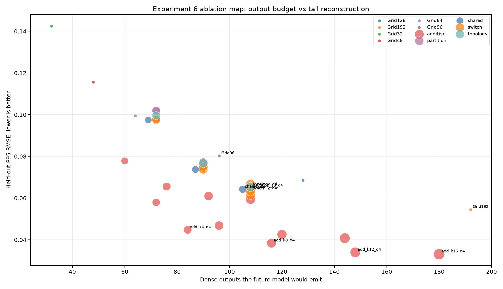
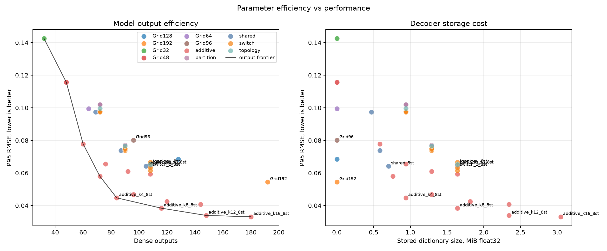
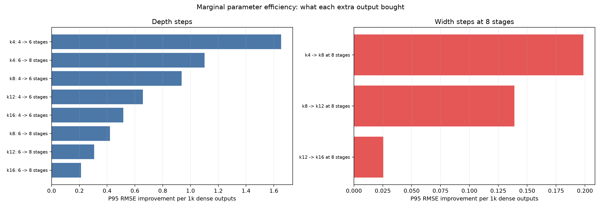
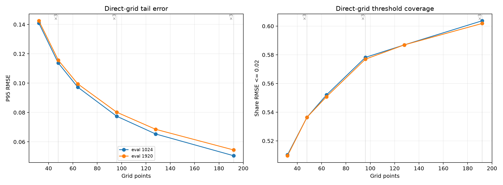
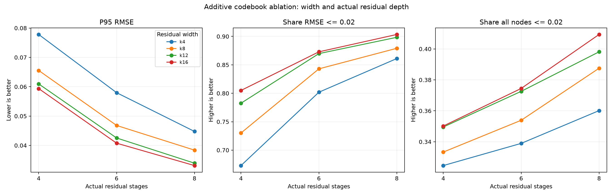
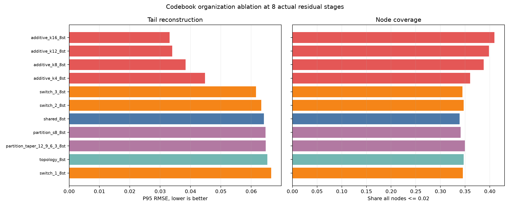
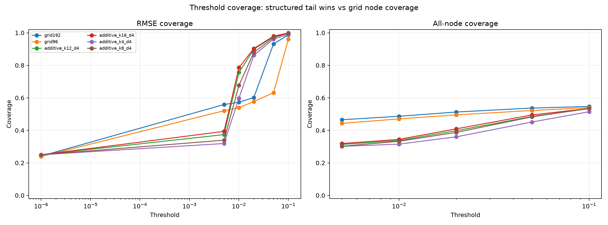
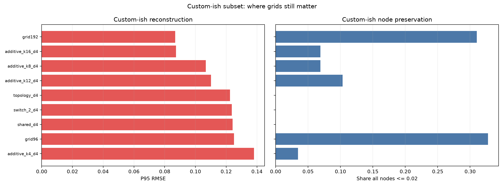
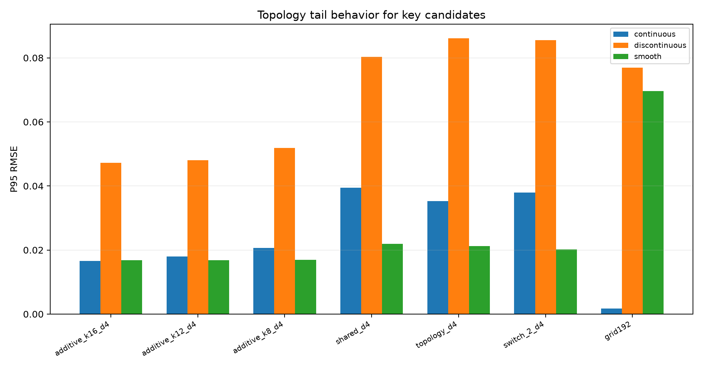
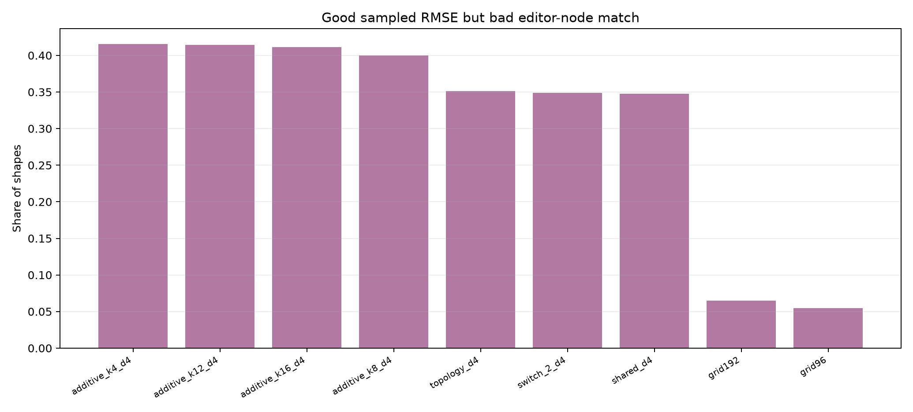

# Experiment 6 Analytics

This is the visual readout for the Experiment 6 sweep.

## Read this first

The structured additive codebooks are doing the best job on sampled-curve tail error. Direct grids are still stubbornly useful for custom-ish shapes and editor-node preservation. So the shape of the answer is probably hybrid: structured codebook for search reduction, plus a small direct/grid residual or fallback for cases where nodes matter more than code compactness.

Important naming footgun: the additive config suffixes are not the same as actual residual stages. In this run, additive `d2` means 4 actual stages, `d3` means 6, and `d4` means 8. The deepest tested additive variants are therefore the 8-stage variants.

_Overall ablation map at eval1920. Additive candidates form the useful structured frontier; Grid192 remains a strong dense fallback. Marker size reflects stored dictionary size._

## Parameter efficiency vs performance

This is the missing lens if we only stare at the best RMSE. Dense outputs are what the future model has to emit; stored floats are what the decoder/codebook has to carry. Those are different costs, and we should keep them separate.

_Parameter efficiency at eval1920. The left panel is model-output cost; the right panel is decoder dictionary storage._

| configuration | dense_outputs | categorical_logits | continuous_scalars | effective_index_bits | stored_mb_float32 | rmse_p95 | p95_gain_per_dense_output |
|---|---|---|---|---|---|---|---|
| phase_additive_k16_d4_bw32_eval1920 | 180 | 163 | 17 | 38.585 | 3.04688 | 0.0331399 | 0.000607734 |
| phase_additive_k12_d4_bw32_eval1920 | 148 | 131 | 17 | 35.2647 | 2.34375 | 0.0339565 | 0.000733619 |
| phase_additive_k8_d4_bw32_eval1920 | 116 | 99 | 17 | 30.585 | 1.64062 | 0.0384051 | 0.000897646 |
| phase_additive_k4_d4_bw32_eval1920 | 84 | 67 | 17 | 22.585 | 0.9375 | 0.0447656 | 0.00116389 |
| grid192_eval1920 | 192 | 0 | 192 | 0 | 0 | 0.0544862 | 0.000458572 |
| phase_switch_2_d4_bw32_eval1920 | 108 | 99 | 9 | 22.585 | 1.64062 | 0.063351 | 0.000733158 |
| phase_shared_d4_bw32_eval1920 | 105 | 96 | 9 | 21 | 0.703125 | 0.0641982 | 0.000746037 |
| phase_partition_s8_d4_bw32_eval1920 | 108 | 99 | 9 | 22.585 | 1.64062 | 0.0647008 | 0.00072066 |
| phase_topology_d4_bw32_eval1920 | 108 | 99 | 9 | 22.585 | 1.64062 | 0.0653022 | 0.000715092 |
| grid96_eval1920 | 96 | 0 | 96 | 0 | 0 | 0.0802016 | 0.000649276 |

The marginal view is the useful one for the additive family. Depth steps are still buying meaningful tail-error reduction; the k12 -> k16 width step is much less compelling than going deeper would likely be.

_Marginal additive efficiency. Depth is not saturated; width has clearer diminishing returns at the 8-stage setting._

| axis | step | extra_outputs | p95_improvement | p95_improvement_per_output |
|---|---|---|---|---|
| depth | k4: 4 -> 6 stages | 12 | 0.0198372 | 0.0016531 |
| depth | k4: 6 -> 8 stages | 12 | 0.0132125 | 0.00110104 |
| depth | k8: 4 -> 6 stages | 20 | 0.0187376 | 0.000936882 |
| depth | k12: 4 -> 6 stages | 28 | 0.0184133 | 0.000657619 |
| depth | k16: 4 -> 6 stages | 36 | 0.0185991 | 0.000516641 |
| depth | k8: 6 -> 8 stages | 20 | 0.00840681 | 0.00042034 |
| depth | k12: 6 -> 8 stages | 28 | 0.008591 | 0.000306821 |
| depth | k16: 6 -> 8 stages | 36 | 0.00762735 | 0.000211871 |
| width_at_8_stages | k4 -> k8 at 8 stages | 32 | 0.00636052 | 0.000198766 |
| width_at_8_stages | k8 -> k12 at 8 stages | 32 | 0.00444862 | 0.000139019 |
| width_at_8_stages | k12 -> k16 at 8 stages | 32 | 0.000816578 | 2.55181e-05 |

## Direct grid ablation

Grid is the "just predict sampled points" baseline. The factor-of-3 widths are not cosmetic: Grid48/Grid96/Grid192 consistently improve tail RMSE over the adjacent power-of-two-ish grids.

_Direct-grid width ablation. Factor-of-3 grids buy real RMSE coverage, while node preservation remains a separate issue._

| eval_resolution | factor3_grid | comparison_grid | extra_outputs | rmse_p95_delta | rmse_p95_relative | node_p95_delta | node_p95_relative |
|---|---|---|---|---|---|---|---|
| 1024 | Grid48 | Grid32 | 16 | -0.0272478 | -0.193315 | 0 | 0 |
| 1024 | Grid96 | Grid64 | 32 | -0.0198141 | -0.203713 | 0 | 0 |
| 1024 | Grid192 | Grid128 | 64 | -0.0148087 | -0.226557 | 0 | 0 |
| 1920 | Grid48 | Grid32 | 16 | -0.026893 | -0.18868 | 0 | 0 |
| 1920 | Grid96 | Grid64 | 32 | -0.0193053 | -0.19401 | 0 | 0 |
| 1920 | Grid192 | Grid128 | 64 | -0.0140636 | -0.205158 | 0 | 0 |

## Additive ablation

Additive means the oracle applies both shared and topology-specific residual corrections. This is the family that matters most from this run. Depth is doing at least as much work as width here: 4 -> 6 -> 8 actual stages keeps improving, and we should not treat depth as saturated. Width starts to flatten around k12 at the deepest tested setting, but depth needs a follow-up sweep.

_Additive width/depth ablation at eval1920. Focus on the 8-stage points: k12 is the current practical default, k16 is the tested upper-bound, and depth has not clearly saturated._

## Codebook organization ablation

Shared, topology, switch, and partition are offline decoder/codebook organizations, not learned predictors yet. This comparison is most useful at the deepest tested setting, because shallow stacks are mixing together organization quality and insufficient depth. Additive wins because it does not force common structure and topology-specific structure to compete for the same slot.

_Codebook organization ablation at 8 actual residual stages. Additive dominates switch/partition/shared/topology on reconstruction tail while staying in a plausible output budget._

## Threshold coverage

P95 is useful, but coverage makes the tradeoff easier to feel. The structured candidates put many more shapes below RMSE 0.02. Grids keep a stronger node-coverage story.

_Threshold coverage for key candidates. Structured codebooks win sampled-curve coverage; grids hold onto node coverage._

## Custom-ish subset

This is the warning light. On custom-ish shapes, direct grids remain very competitive or better. That does not invalidate the structured codebook; it says we should not pretend the codebook alone is the whole LFO representation.

_Custom-ish subset. Grid192 is still hard to beat here, especially for node preservation._

| configuration | subset | shapes | rmse_median | rmse_p95 | node_max_error_p95 | rmse_under_0.02 | all_nodes_under_0.02 |
|---|---|---|---|---|---|---|---|
| grid192_eval1024 | custom_ish | 58 | 0.00439358 | 0.0804125 | 1 | 0.706897 | 0.310345 |
| phase_additive_k16_d4_bw32_eval1024 | custom_ish | 58 | 0.0189051 | 0.0860528 | 0.989179 | 0.534483 | 0.0689655 |
| grid192_eval1920 | custom_ish | 58 | 0.00437469 | 0.0867863 | 1 | 0.706897 | 0.310345 |
| phase_additive_k16_d4_bw32_eval1920 | custom_ish | 58 | 0.0198985 | 0.0873893 | 0.964877 | 0.5 | 0.0689655 |
| phase_additive_k16_d3_bw32_eval1024 | custom_ish | 58 | 0.0242552 | 0.0919381 | 1 | 0.413793 | 0.0862069 |
| phase_additive_k16_d3_bw32_eval1920 | custom_ish | 58 | 0.0267689 | 0.0921632 | 0.935092 | 0.413793 | 0.0862069 |
| grid128_eval1024 | custom_ish | 58 | 0.00558433 | 0.102961 | 1 | 0.706897 | 0.310345 |
| phase_additive_k8_d4_bw32_eval1024 | custom_ish | 58 | 0.0243962 | 0.106319 | 0.976992 | 0.413793 | 0.0517241 |
| phase_additive_k8_d4_bw32_eval1920 | custom_ish | 58 | 0.0257833 | 0.106738 | 0.943097 | 0.413793 | 0.0689655 |
| grid128_eval1920 | custom_ish | 58 | 0.00565198 | 0.108161 | 1 | 0.706897 | 0.310345 |
| phase_additive_k12_d4_bw32_eval1024 | custom_ish | 58 | 0.019769 | 0.109822 | 0.97849 | 0.517241 | 0.0689655 |
| phase_additive_k12_d4_bw32_eval1920 | custom_ish | 58 | 0.0219556 | 0.110071 | 0.964877 | 0.465517 | 0.103448 |

## Topology behavior

Discontinuous and smooth tails are where simple grids and some structured variants get exposed. Additive is less brittle than the pure shared/topology/switch families, but topology-specific failure modes are still visible.

_Topology tail behavior for key candidates. This helps separate real robustness from doing well on the easy continuous cases._

## RMSE/node disagreement

This is the most important caveat for editor-state modeling: good sampled RMSE does not automatically mean the original editor nodes are plausible. The structured methods can reconstruct the sound-ish curve while missing node-level details.

_Good sampled RMSE but bad editor-node match. This is why a direct residual/fallback remains attractive._

| configuration | good_rmse_bad_nodes_share | bad_rmse_good_nodes_share | rmse_node_corr | median_node_given_rmse_under_0.02 |
|---|---|---|---|---|
| phase_additive_k12_d4_bw32_eval1024 | 0.429907 | 0 | 0.153882 | 0.0359232 |
| phase_additive_k4_d4_bw32_eval1024 | 0.427414 | 0 | 0.160914 | 0.0442941 |
| phase_additive_k16_d4_bw32_eval1024 | 0.424299 | 0 | 0.15641 | 0.0319873 |
| phase_additive_k16_d3_bw32_eval1024 | 0.42243 | 0 | 0.167689 | 0.0379116 |
| phase_additive_k12_d3_bw32_eval1024 | 0.419315 | 0 | 0.165675 | 0.0399999 |
| phase_additive_k4_d4_bw32_eval1920 | 0.415576 | 0 | 0.346966 | 0.0406685 |
| phase_additive_k12_d4_bw32_eval1920 | 0.41433 | 0 | 0.403433 | 0.0346577 |
| phase_additive_k8_d3_bw32_eval1024 | 0.413084 | 0 | 0.166336 | 0.0425786 |
| phase_additive_k8_d4_bw32_eval1024 | 0.413084 | 0 | 0.159731 | 0.0364833 |
| phase_additive_k16_d3_bw32_eval1920 | 0.411838 | 0 | 0.400836 | 0.0362086 |
| phase_additive_k16_d4_bw32_eval1920 | 0.411215 | 0 | 0.429088 | 0.030099 |
| phase_additive_k12_d3_bw32_eval1920 | 0.410592 | 0 | 0.381408 | 0.0387058 |
| phase_additive_k8_d4_bw32_eval1920 | 0.4 | 0 | 0.38098 | 0.0348173 |
| phase_additive_k8_d3_bw32_eval1920 | 0.4 | 0 | 0.361916 | 0.0386087 |
| phase_additive_k4_d3_bw32_eval1024 | 0.396885 | 0 | 0.166818 | 0.045308 |

## Balanced discussion table

Lower `balanced_discussion_score` is better, but this score is only a sorting aid. It mixes tail RMSE, node preservation, threshold coverage, dense outputs, and storage.

| configuration | family | dense_outputs | stored_floats | rmse_median | rmse_p95 | rmse_under_0.02 | node_max_error_p95 | all_nodes_under_0.02 | balanced_discussion_score |
|---|---|---|---|---|---|---|---|---|---|
| phase_additive_k16_d4_bw32_eval1920 | phase_residual | 180 | 798720 | 0.0073663 | 0.0331399 | 0.903427 | 0.880665 | 0.409346 | 0.273333 |
| phase_additive_k12_d4_bw32_eval1920 | phase_residual | 148 | 614400 | 0.00761702 | 0.0339565 | 0.898442 | 0.873585 | 0.398131 | 0.279487 |
| phase_additive_k4_d4_bw32_eval1920 | phase_residual | 84 | 245760 | 0.00827109 | 0.0447656 | 0.861059 | 0.903762 | 0.360125 | 0.283846 |
| phase_additive_k8_d4_bw32_eval1920 | phase_residual | 116 | 430080 | 0.00765277 | 0.0384051 | 0.879128 | 0.883744 | 0.387539 | 0.285128 |
| phase_additive_k8_d3_bw32_eval1920 | phase_residual | 96 | 337920 | 0.00842013 | 0.0468119 | 0.842991 | 0.895542 | 0.353894 | 0.315385 |
| phase_additive_k4_d4_bw32_eval1024 | phase_residual | 84 | 131072 | 0.00476801 | 0.0435536 | 0.871028 | 1 | 0.361371 | 0.322051 |
| phase_additive_k12_d3_bw32_eval1920 | phase_residual | 120 | 476160 | 0.00781831 | 0.0425475 | 0.869782 | 0.891257 | 0.372586 | 0.324359 |
| phase_additive_k4_d3_bw32_eval1920 | phase_residual | 72 | 199680 | 0.00949146 | 0.0579781 | 0.801869 | 0.911519 | 0.338941 | 0.336923 |
| phase_additive_k16_d3_bw32_eval1920 | phase_residual | 144 | 614400 | 0.00777716 | 0.0407672 | 0.872897 | 0.903782 | 0.374455 | 0.351282 |
| phase_additive_k12_d2_bw32_eval1920 | phase_residual | 92 | 337920 | 0.00905101 | 0.0609608 | 0.782555 | 0.897971 | 0.349533 | 0.355897 |
| phase_additive_k8_d4_bw32_eval1024 | phase_residual | 116 | 229376 | 0.00370277 | 0.0361493 | 0.894081 | 1 | 0.390031 | 0.364103 |
| phase_additive_k12_d4_bw32_eval1024 | phase_residual | 148 | 327680 | 0.00254281 | 0.0325208 | 0.917757 | 1 | 0.398754 | 0.366923 |

## Tail-error leaders

| configuration | family | dense_outputs | rmse_median | rmse_p95 | node_max_error_p95 | rmse_under_0.02 | all_nodes_under_0.02 |
|---|---|---|---|---|---|---|---|
| phase_additive_k16_d4_bw32_eval1024 | phase_residual | 180 | 0.0021054 | 0.0307617 | 1 | 0.920872 | 0.41433 |
| phase_additive_k12_d4_bw32_eval1024 | phase_residual | 148 | 0.00254281 | 0.0325208 | 1 | 0.917757 | 0.398754 |
| phase_additive_k16_d4_bw32_eval1920 | phase_residual | 180 | 0.0073663 | 0.0331399 | 0.880665 | 0.903427 | 0.409346 |
| phase_additive_k12_d4_bw32_eval1920 | phase_residual | 148 | 0.00761702 | 0.0339565 | 0.873585 | 0.898442 | 0.398131 |
| phase_additive_k8_d4_bw32_eval1024 | phase_residual | 116 | 0.00370277 | 0.0361493 | 1 | 0.894081 | 0.390031 |
| phase_additive_k16_d3_bw32_eval1024 | phase_residual | 144 | 0.00280128 | 0.0378715 | 1 | 0.88162 | 0.375701 |
| phase_additive_k8_d4_bw32_eval1920 | phase_residual | 116 | 0.00765277 | 0.0384051 | 0.883744 | 0.879128 | 0.387539 |
| phase_additive_k16_d3_bw32_eval1920 | phase_residual | 144 | 0.00777716 | 0.0407672 | 0.903782 | 0.872897 | 0.374455 |
| phase_additive_k12_d3_bw32_eval1024 | phase_residual | 120 | 0.00349569 | 0.0408091 | 1 | 0.879128 | 0.370717 |
| phase_additive_k12_d3_bw32_eval1920 | phase_residual | 120 | 0.00781831 | 0.0425475 | 0.891257 | 0.869782 | 0.372586 |
| phase_additive_k4_d4_bw32_eval1024 | phase_residual | 84 | 0.00476801 | 0.0435536 | 1 | 0.871028 | 0.361371 |
| phase_additive_k4_d4_bw32_eval1920 | phase_residual | 84 | 0.00827109 | 0.0447656 | 0.903762 | 0.861059 | 0.360125 |

## Node-preservation leaders

| configuration | family | dense_outputs | rmse_p95 | node_max_error_p95 | all_nodes_under_0.02 |
|---|---|---|---|---|---|
| phase_additive_k12_d4_bw32_eval1920 | phase_residual | 148 | 0.0339565 | 0.873585 | 0.398131 |
| phase_additive_k16_d4_bw32_eval1920 | phase_residual | 180 | 0.0331399 | 0.880665 | 0.409346 |
| phase_additive_k8_d4_bw32_eval1920 | phase_residual | 116 | 0.0384051 | 0.883744 | 0.387539 |
| phase_switch_2_d4_bw32_eval1920 | phase_residual | 108 | 0.063351 | 0.883836 | 0.34704 |
| phase_switch_1_d4_bw32_eval1920 | phase_residual | 108 | 0.0665786 | 0.890661 | 0.345171 |
| phase_additive_k12_d3_bw32_eval1920 | phase_residual | 120 | 0.0425475 | 0.891257 | 0.372586 |
| phase_additive_k8_d3_bw32_eval1920 | phase_residual | 96 | 0.0468119 | 0.895542 | 0.353894 |
| phase_switch_3_d4_bw32_eval1920 | phase_residual | 108 | 0.0615746 | 0.895767 | 0.344548 |
| phase_additive_k12_d2_bw32_eval1920 | phase_residual | 92 | 0.0609608 | 0.897971 | 0.349533 |
| phase_partition_s8_d4_bw32_eval1920 | phase_residual | 108 | 0.0647008 | 0.899983 | 0.34081 |
| phase_shared_d4_bw32_eval1920 | phase_residual | 105 | 0.0641982 | 0.900941 | 0.338941 |
| phase_additive_k16_d2_bw32_eval1920 | phase_residual | 108 | 0.0593663 | 0.901559 | 0.350156 |

## Topology sensitivity

Large gaps here mean a candidate is uneven across smooth/continuous/discontinuous shapes.

| configuration | topology_rmse_p95_gap | worst_topology_rmse | topology_node_p95_gap | worst_topology_node |
|---|---|---|---|---|
| grid32_eval1920 | 0.176676 | discontinuous | 0.828373 | discontinuous |
| grid32_eval1024 | 0.174365 | discontinuous | 0.828373 | discontinuous |
| grid48_eval1920 | 0.147671 | discontinuous | 0.886071 | discontinuous |
| grid48_eval1024 | 0.144463 | discontinuous | 0.886083 | discontinuous |
| grid64_eval1920 | 0.129894 | discontinuous | 0.909277 | discontinuous |
| grid64_eval1024 | 0.12671 | discontinuous | 0.909277 | discontinuous |
| grid96_eval1920 | 0.108256 | discontinuous | 0.954865 | discontinuous |
| grid96_eval1024 | 0.104334 | discontinuous | 0.954851 | discontinuous |
| grid128_eval1920 | 0.093489 | discontinuous | 0.95641 | discontinuous |
| phase_topology_d2_bw32_eval1920 | 0.0934625 | discontinuous | 0.772968 | discontinuous |
| phase_topology_d2_bw32_eval1024 | 0.0927964 | discontinuous | 0.781106 | discontinuous |
| phase_partition_s8_d2_bw32_eval1920 | 0.0912232 | discontinuous | 0.748138 | discontinuous |
| phase_partition_s8_d2_bw32_eval1024 | 0.0904169 | discontinuous | 0.766471 | discontinuous |
| phase_partition_taper_12_9_6_3_d2_bw32_eval1920 | 0.0896342 | discontinuous | 0.759699 | discontinuous |
| grid128_eval1024 | 0.0890111 | discontinuous | 0.95641 | discontinuous |

## Extra visuals

- `analytics/quality_complexity_dashboard.png`
- `analytics/rmse_threshold_heatmap.png`
- `analytics/node_threshold_heatmap.png`
- `analytics/topology_p95_heatmap.png`
- `analytics/factor3_grid_curve.png`
- `analytics/factor3_relative_deltas.png`
- `analytics/node_vs_rmse_scatter.png`
- `analytics/per_shape_rmse_node_disagreement.png`

## Current recommendation

Use additive k12 with 8 actual residual stages as the default structured candidate, additive k8 with 8 stages as the compact candidate, and additive k16 with 8 stages as the tested upper-bound structured reference. Do not freeze depth yet: run a deeper additive sweep before finalizing the production codebook. Keep Grid96/Grid192 in the design conversation as direct residual/fallback candidates, not as embarrassments to be swept under the rug.

