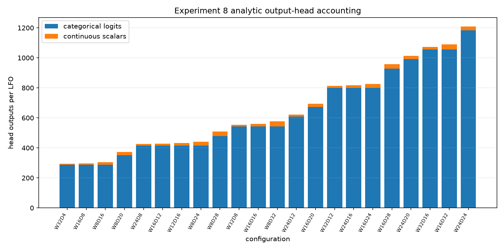
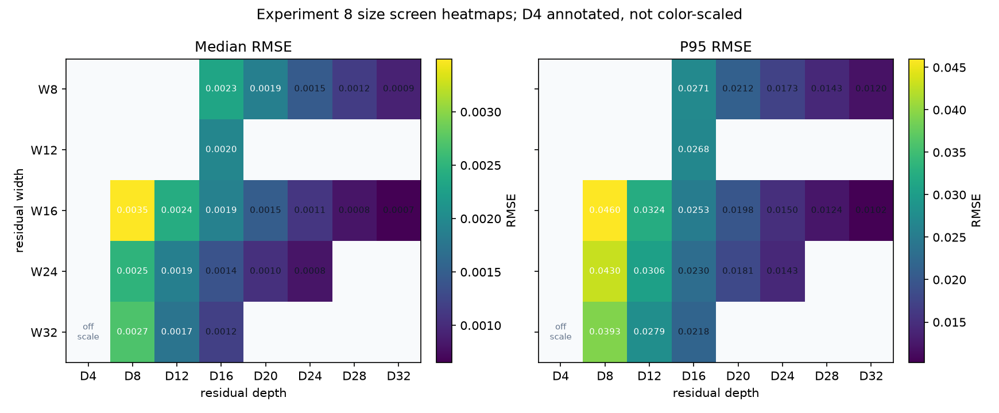
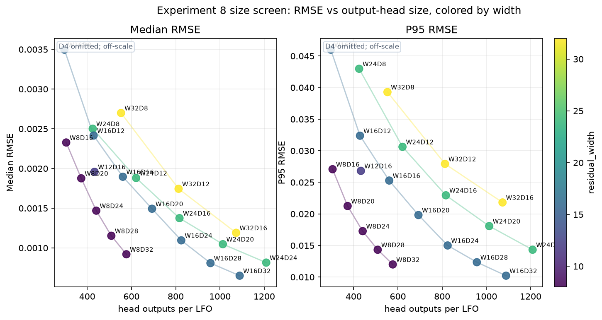
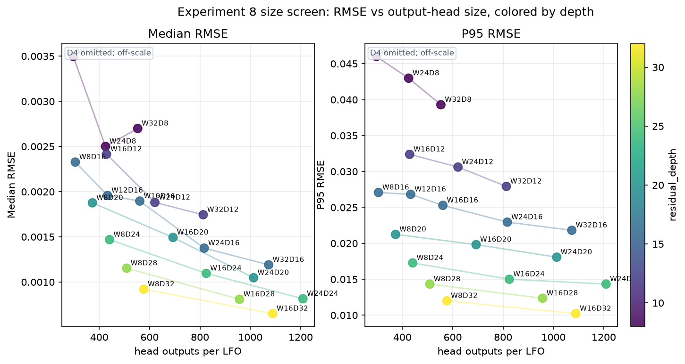
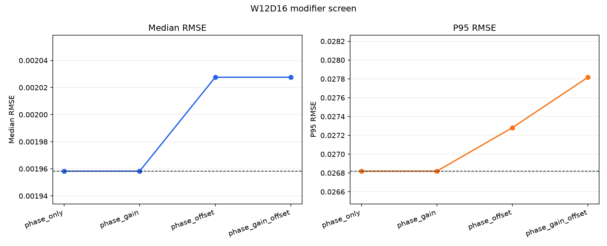
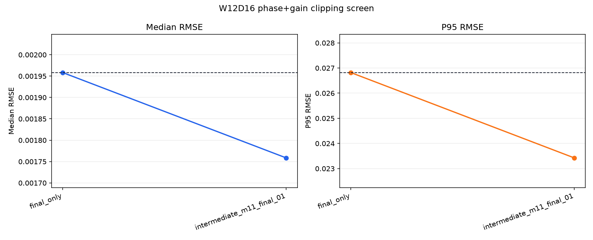
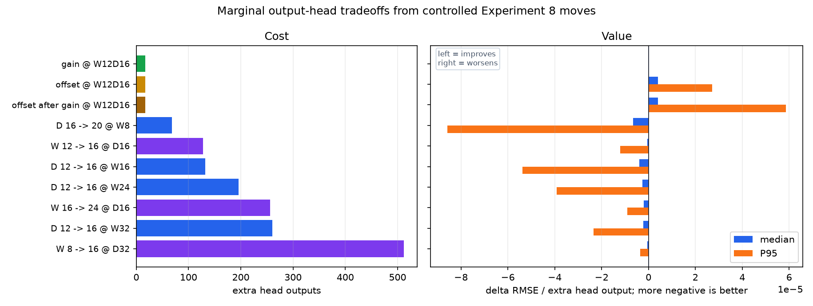
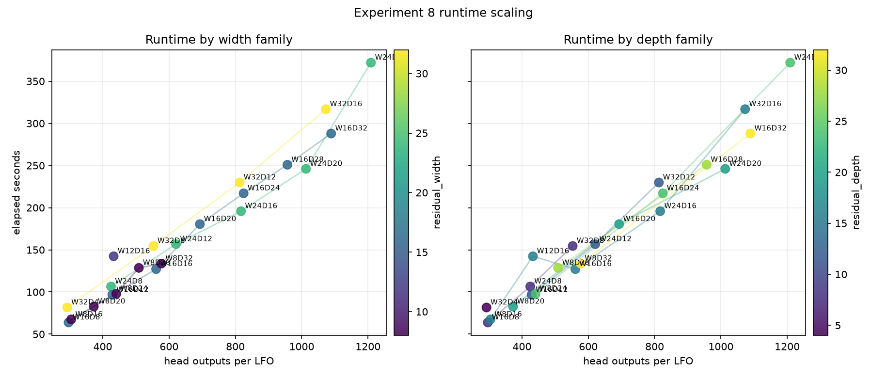
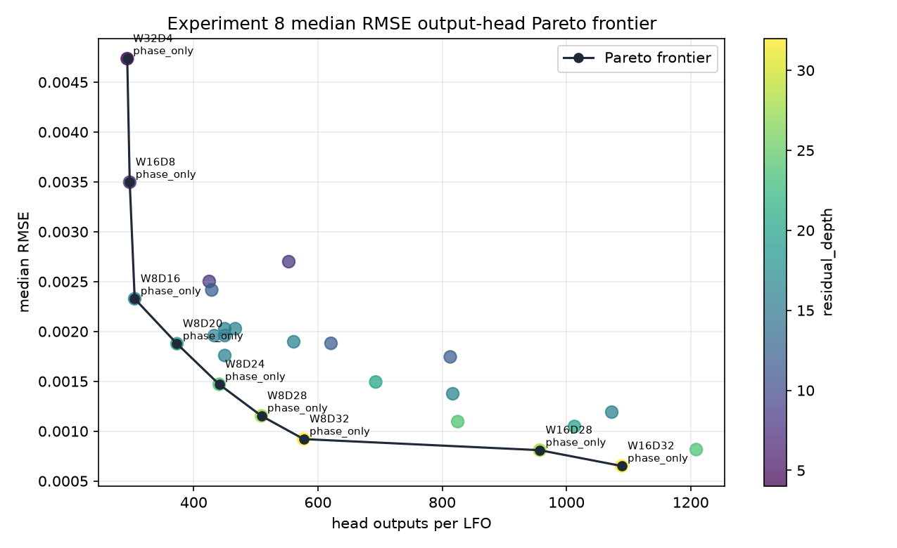
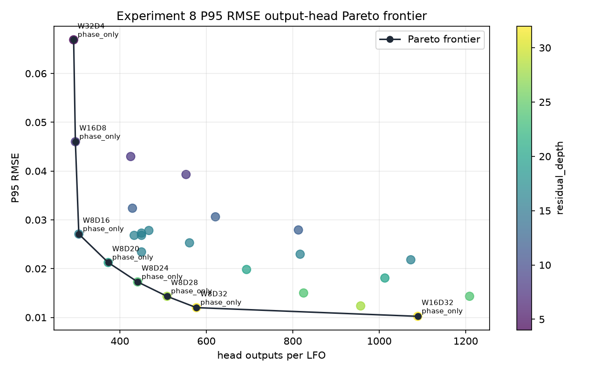

# Experiment 8 Findings

Experiment 8 is a 120-point, beam-4 screen on a fixed 1/3 train/validation sample. `W` is residual codebook width and `D` is actual residual-layer count. Phase is always enabled.

## Questions

- How much quality comes from width vs depth?
- Where is the useful `W x D` size band under a small screen budget?
- What is parameter-efficient in terms of output-head size the downstream model has to emit?
- Do gain and/or offset help once phase is always present?
- Does intermediate `[-1, 1]` clipping help before the final `[0, 1]` clip?

## Executive Read

- Best median RMSE is W16D32 at 0.000650555 median / 0.010222 P95.
- Best P95 RMSE is W16D32 at 0.010222 P95 / 0.000650555 median.
- W8D32 is the compact deep reference: P95 0.0120029 versus W16D32 P95 0.010222, with 577 head outputs versus 1089.
- At W12D16, modifier winner by P95 is `phase_only`: median 0.00195828, P95 0.0268194.
- For W12D16 phase+gain, clipping winner is `intermediate_m11_final_01`: median 0.00175855, P95 0.0234246.

The size screen strongly favors depth. The best configurations all use high `D`, and narrow deep models beat wide shallow models at comparable or smaller output-head size. Width helps, but only after enough residual layers are present.

## Output-Head Accounting

The corrected model-facing output-head size is:

```text
head_outputs = 32 + sum(layer_codebook_size) + (D + 1) * (I_phase + I_gain + I_offset)
```

For Experiment 8, phase is mandatory:

```text
head_outputs = 32 + sum(layer_codebook_size) + (D + 1) + (D + 1)(I_gain + I_offset)
```

For shared residual layers, `layer_codebook_size = W`. For topology-conditioned residual layers, the deployed interface flattens the topology dictionaries and uses `layer_codebook_size = 3W`. There is no separate topology classifier in this accounting; the model emits one categorical code per residual layer. Optional gain and optional offset each cost `D + 1` outputs. Phase is included in the baseline and is not treated as a free design knob in the Experiment 8 plots.

`serialized_fields` is kept only as a storage/decoder count. It is not the neural output-head burden, because a categorical code index is emitted by a softmax over its codebook.



## Size Screen



D4 is kept in the tables and source CSV, but omitted from the scatter/ablation plots because its error is too far above the useful comparison range.





Top size jobs by P95:

| W | D | cat_logits | scalar_outputs | head_outputs | serialized_fields | median_rmse | p95_rmse | p99_rmse | seconds | est_mem_mb |
| --- | --- | --- | --- | --- | --- | --- | --- | --- | --- | --- |
| 16 | 32 | 1056 | 33 | 1089 | 98 | 0.000650555 | 0.010222 | 0.0196805 | 287.935 | 20.3625 |
| 8 | 32 | 544 | 33 | 577 | 98 | 0.000920192 | 0.0120029 | 0.0216038 | 133.707 | 13.6828 |
| 16 | 28 | 928 | 29 | 957 | 86 | 0.00080914 | 0.0123547 | 0.0235634 | 250.893 | 20.2542 |
| 8 | 28 | 480 | 29 | 509 | 86 | 0.00115303 | 0.014326 | 0.0264239 | 128.582 | 13.6185 |
| 24 | 24 | 1184 | 25 | 1209 | 74 | 0.000815183 | 0.01433 | 0.0250172 | 371.989 | 26.7377 |
| 16 | 24 | 800 | 25 | 825 | 74 | 0.00109558 | 0.0150076 | 0.027537 | 217.016 | 20.1459 |
| 8 | 24 | 416 | 25 | 441 | 74 | 0.00146939 | 0.0172763 | 0.0320205 | 97.8933 | 13.5541 |
| 24 | 20 | 992 | 21 | 1013 | 62 | 0.00104746 | 0.0180742 | 0.0315798 | 246.045 | 26.5855 |
| 16 | 20 | 672 | 21 | 693 | 62 | 0.00149331 | 0.0198228 | 0.0340413 | 180.493 | 20.0376 |
| 8 | 20 | 352 | 21 | 373 | 62 | 0.00187679 | 0.0212465 | 0.0382153 | 82.7013 | 13.4898 |
| 32 | 16 | 1056 | 17 | 1073 | 50 | 0.00119065 | 0.0218171 | 0.037339 | 316.837 | 32.9371 |
| 24 | 16 | 800 | 17 | 817 | 50 | 0.00137504 | 0.0229514 | 0.0399834 | 195.809 | 26.4332 |

## Modifier Screen

At W12D16, gain/offset were tested on top of phase. The deltas below are versus phase-only at the same W/D. Gain and offset have equal structural head cost, but their empirical quality deltas are separate facts.



| modifier | cat_logits | scalar_outputs | head_outputs | serialized_fields | median_rmse | p95_rmse | p99_rmse | seconds | median_delta | p95_delta |
| --- | --- | --- | --- | --- | --- | --- | --- | --- | --- | --- |
| phase_only | 416 | 17 | 433 | 50 | 0.00195828 | 0.0268194 | 0.0400197 | 142.36 | 0 | 0 |
| phase_gain | 416 | 34 | 450 | 51 | 0.00195828 | 0.0268194 | 0.0399389 | 142.36 | 0 | 0 |
| phase_offset | 416 | 34 | 450 | 51 | 0.00202756 | 0.0272818 | 0.0431538 | 142.36 | 6.9273e-05 | 0.000462372 |
| phase_gain_offset | 416 | 51 | 467 | 52 | 0.00202756 | 0.0278172 | 0.0433159 | 142.36 | 6.9273e-05 | 0.000997825 |

The modifier result is not a broad endorsement of more continuous outputs. Offset alone and gain+offset both degrade P95 relative to phase-only. Gain alone is effectively tied with phase-only in this final-only setting; its value appears mainly in the clipping test.

## Clipping Screen

Intermediate clipping was tested only for W12D16 with phase+gain. It has zero output-head cost, so its quality-per-output ratio is undefined rather than merely large.



| clip_policy | cat_logits | scalar_outputs | head_outputs | serialized_fields | median_rmse | p95_rmse | p99_rmse | seconds | median_delta | p95_delta |
| --- | --- | --- | --- | --- | --- | --- | --- | --- | --- | --- |
| final_only | 416 | 34 | 450 | 51 | 0.00195828 | 0.0268194 | 0.0399389 | 142.36 | 0 | 0 |
| intermediate_m11_final_01 | 416 | 34 | 450 | 51 | 0.00175855 | 0.0234246 | 0.0402938 | 148.07 | -0.000199735 | -0.00339486 |

Intermediate `[-1, 1]` clipping improves both median and P95 versus phase+gain with final-only clipping in this screen.

## Marginal Cost And Value

Output cost is analytic. Quality value is empirical, measured with controlled finite differences between rows that differ by one design move where the screen contains such a pair. In the paired chart below, the left panel is the cost of asking the model to emit more outputs; the right panel is the observed RMSE change per added output. More negative is better.



The zero-output-cost decoder-policy move was `clip policy @ W12D16`: median RMSE delta -0.000199735, P95 RMSE delta -0.00339486.

The full row-level marginal table is saved as `analytics/marginal_efficiency.csv` for auditability, but it is not embedded here because the all-pairs version is visually noisy.

## Runtime And Memory



The measured elapsed time rises mostly with total residual work: more residual layers and wider dictionaries both cost. Estimated peak memory was not a decision driver in this screen: the phase-only size jobs ranged from 13.4 MB to 32.9 MB.

## Pareto Frontiers

For SOTA ML-style comparison, this is better treated as a rate-distortion / Pareto problem than as AIC or BIC. AIC/BIC require a likelihood model and count fitted statistical parameters; here the relevant cost is the output head the downstream model must emit.

The Pareto frontiers below keep only configurations where no smaller output-head model has equal or better error. Median and P95 are intentionally separate because they answer different modeling questions.



Median RMSE output-head frontier:

| W | D | modifier | clip_policy | cat_logits | scalar_outputs | head_outputs | serialized_fields | median_rmse | p95_rmse | seconds |
| --- | --- | --- | --- | --- | --- | --- | --- | --- | --- | --- |
| 32 | 4 | phase_only | final_only | 288 | 5 | 293 | 14 | 0.0047355 | 0.0668995 | 81.6015 |
| 16 | 8 | phase_only | final_only | 288 | 9 | 297 | 26 | 0.00349659 | 0.0460074 | 63.8211 |
| 8 | 16 | phase_only | final_only | 288 | 17 | 305 | 50 | 0.00232753 | 0.0270805 | 67.4633 |
| 8 | 20 | phase_only | final_only | 352 | 21 | 373 | 62 | 0.00187679 | 0.0212465 | 82.7013 |
| 8 | 24 | phase_only | final_only | 416 | 25 | 441 | 74 | 0.00146939 | 0.0172763 | 97.8933 |
| 8 | 28 | phase_only | final_only | 480 | 29 | 509 | 86 | 0.00115303 | 0.014326 | 128.582 |
| 8 | 32 | phase_only | final_only | 544 | 33 | 577 | 98 | 0.000920192 | 0.0120029 | 133.707 |
| 16 | 28 | phase_only | final_only | 928 | 29 | 957 | 86 | 0.00080914 | 0.0123547 | 250.893 |
| 16 | 32 | phase_only | final_only | 1056 | 33 | 1089 | 98 | 0.000650555 | 0.010222 | 287.935 |



P95 RMSE output-head frontier:

| W | D | modifier | clip_policy | cat_logits | scalar_outputs | head_outputs | serialized_fields | median_rmse | p95_rmse | seconds |
| --- | --- | --- | --- | --- | --- | --- | --- | --- | --- | --- |
| 32 | 4 | phase_only | final_only | 288 | 5 | 293 | 14 | 0.0047355 | 0.0668995 | 81.6015 |
| 16 | 8 | phase_only | final_only | 288 | 9 | 297 | 26 | 0.00349659 | 0.0460074 | 63.8211 |
| 8 | 16 | phase_only | final_only | 288 | 17 | 305 | 50 | 0.00232753 | 0.0270805 | 67.4633 |
| 8 | 20 | phase_only | final_only | 352 | 21 | 373 | 62 | 0.00187679 | 0.0212465 | 82.7013 |
| 8 | 24 | phase_only | final_only | 416 | 25 | 441 | 74 | 0.00146939 | 0.0172763 | 97.8933 |
| 8 | 28 | phase_only | final_only | 480 | 29 | 509 | 86 | 0.00115303 | 0.014326 | 128.582 |
| 8 | 32 | phase_only | final_only | 544 | 33 | 577 | 98 | 0.000920192 | 0.0120029 | 133.707 |
| 16 | 32 | phase_only | final_only | 1056 | 33 | 1089 | 98 | 0.000650555 | 0.010222 | 287.935 |

The efficient direction is not simply fewer outputs; deep enough models sharply reduce error. The practical trade is W8D32 versus W16D32: W8D32 is much cheaper in head outputs and runtime, while W16D32 is the quality leader.

## Working Recommendation

- Carry forward `topology_balanced_common_then_tail` with phase always enabled.
- Treat depth as the primary quality lever for the next experiment.
- Use W16D32 as the current best-quality reference from this screen.
- Keep W8D32 as the parameter-efficient deep-narrow reference.
- Include intermediate clipping with phase+gain in the next targeted test, because it is the only modifier/clipping variant that clearly improved W12D16.
- Do not carry offset forward unless a later targeted reason appears; it degraded P95 here.

## Files

- `analytics/summary.csv`
- `analytics/marginal_efficiency.csv`
- `analytics/results.csv`
- `analytics/thresholds.csv`
- `analytics/topology.csv`
- `analytics/usage.csv`
- `analytics/construction.csv`
- `analytics/paths.csv`
- `analytics/plots/`
