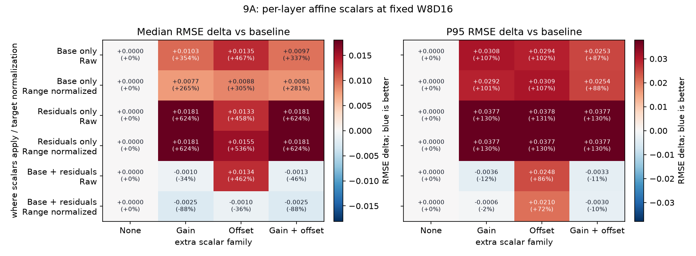
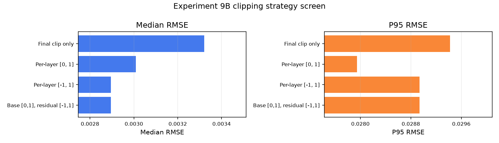
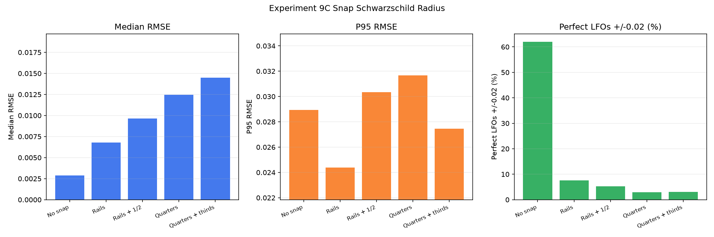
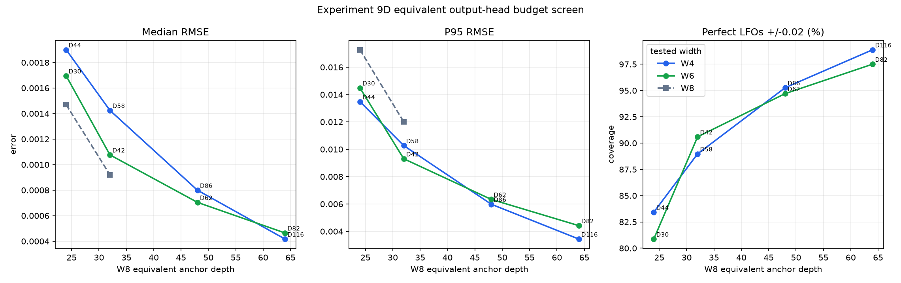
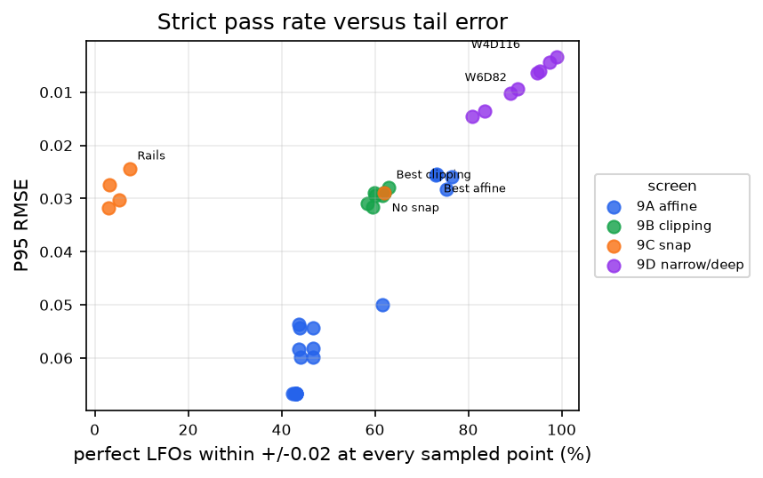
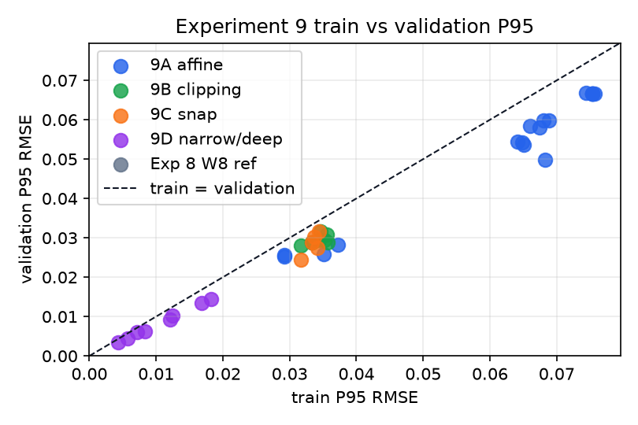
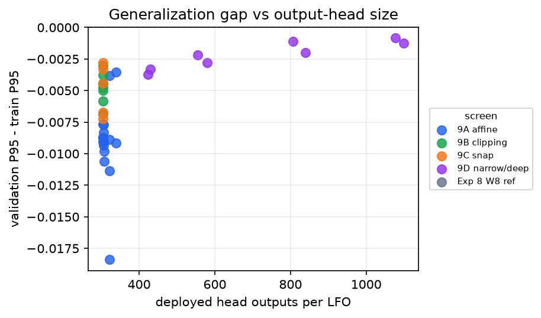
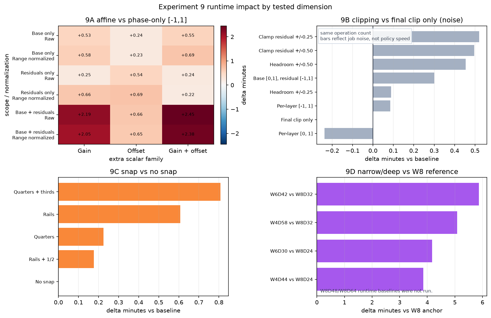
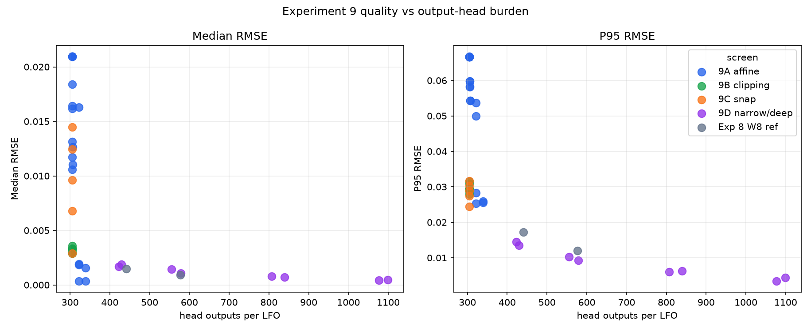

# Experiment 9 Findings

Experiment 9 is a quick fixed-budget W8D16 screen at 120-point evaluation resolution, beam 4, fixed 1/3 sample, and phase always enabled.

## Questions

- Do per-layer gain/offset scalars help when applied to base, residuals, or both?
- Does range normalization make those scalars useful?
- Which clipping or limiting policy should be the phase-only decoder baseline?
- Do data-derived snap anchors improve final output cheaply?
- At equivalent output-head budget, do very narrow/deep W4/W6 residual stacks beat W8 references?
- Do train and validation errors move together, or are any variants just fitting the train sample?

The third primary quality metric is `perfect_lfo_rate_eps_0.02`: the share of LFOs whose every sampled evaluation point is within +/-0.02 of the target curve. This is stricter than RMSE and different from editor-node preservation.

Experiment 9 is not a replacement for Experiment 8's size screen. It answers three follow-up questions from that report: whether gain/offset become useful under better normalization, whether zero-output clipping choices can improve W8D16, and whether very narrow/deep stacks are more output-head efficient than the W8 references.

## Executive Read

- Completed jobs in current analytics: 39/39 excluding reused Experiment 8 reference rows.
- Overall best P95 is `phase_only_W4_budget_W8D64` in section `9D`: median 0.000417038, P95 0.00343919, perfect-rate 98.9%.
- The strongest new signal is the equivalent-budget narrow/deep result: W4/W6 at larger depth substantially beat the W8D24 and W8D32 Experiment 8 references on P95 at similar output-head size.
- Clipping strategy is not settled by a single metric: unipolar per-layer clipping has the best 9B P95, while bipolar per-layer clipping has the best 9B median and is identical to base-unipolar/residual-bipolar here.
- Snap is not a safe default. Rails improve P95 relative to no snap, but the strict perfect-LFO rate collapses, so snapping is behaving like a tail repair that damages many otherwise close curves.
- Runtime should be read structurally, not as tiny per-policy timing claims. 9B clipping variants have the same operation count, so their small deltas are noise/cache/order effects. Real runtime pressure comes from affine base+residual scoring and narrow/deep stacks: 9A spans +0.22 to +2.45 min, and measured 9D W4/W6 rows add +3.85 to +5.87 min vs available W8 anchors.
- 9A best affine row: Base + residuals / Gain / Raw with P95 0.0253334.
- 9B best clipping strategy: Per-layer [0, 1] with P95 0.0279455.
- 9C best snap policy: Rails with P95 0.0243963.

## 9A Affine And Normalization

This section asks whether extra continuous scalar outputs are worth paying for at fixed W8D16. The comparison varies three things: where the scalar applies, which scalar family is emitted, and whether the target is raw or range-normalized before choosing the code.

The first column is the no-extra-scalar baseline: phase-only W8D16 with the same per-layer `[-1, 1]` clipping strategy. It is repeated down the rows so every challenger is visually compared against the same baseline. The remaining columns are the optional scalar family beyond mandatory phase: gain, offset, or gain+offset. The rows show where those extra scalars are active: base only, residual layers only, or both. Raw means the original target/residual is encoded directly; range normalized means each target/residual is normalized before code selection and denormalized after reconstruction.



The useful 9A result is narrower than "more scalars help." Applying gain to both base and residual layers is the best affine row by P95. Range normalization gives excellent medians for some rows, but the P95 winner remains raw. Offset remains suspect: the best offset-containing rows trail the best gain-only row on P95 despite paying the same or larger output-head cost. Many gain slots are effectively no-ops even in the better rows, so the scalar family is not being used uniformly across layers.

## 9B Clipping Strategy

This section keeps the model output head fixed and changes only the reconstruction rule between layers. These are zero-output-cost decoder policies: the downstream model emits the same code and phase outputs for every row. The question is whether clipping the running prefix after each residual layer is better than clipping only the final output.



The plot focuses on the final-only baseline plus the three strategies worth discussing. The omitted headroom and residual-limiter rows were worse enough that they are not useful visual comparisons here. "Final clip only" clips once to `[0, 1]` at the end. "Per-layer [0, 1]" and "Per-layer [-1, 1]" clip the running prefix after each residual layer. "Base [0,1], residual [-1,1]" clips the base reconstruction to the unipolar output range, then allows bipolar residual accumulation.

Relative to final-only clipping, unipolar per-layer clipping improves P95 by -0.00147718 and raises perfect-LFO rate by 2.92835 percentage points. Bipolar clipping gives the best median in this section, but does not win P95. The headroom and residual-limiter variants do not justify replacing the simpler per-layer clip policies.

## 9C Snap Schwarzschild Radius

This section keeps the W8D16 phase-only reconstruction fixed and changes only a final-output snap step. The snap anchors are inferred from training data and applied after the final clip. No prefix snapping is tested here.



Rails means the snap grid `{0, 1}`. The denser grids add `1/2`, then quarters, then thirds. For each anchor, the training data estimates a snap radius from values already near that anchor: collect points within `0.08`, take the 80th percentile distance, then clamp the radius to `[0.0075, 0.04]`. In this run every supported grid reports median radius `0.04`, so the learned radius hit the upper clamp rather than discovering a narrow natural basin.

The snap screen shows why P95 alone is not enough. Rails reduce P95 by -0.00454136 versus no snap, but increase median RMSE by 0.00390883 and reduce perfect-LFO rate by -54.5171 percentage points. That is not harmless cleanup; it is an aggressive final-output correction. If snap returns, it should be gated or learned, not a blanket default. The radius saturation is another warning: the current estimator is too willing to snap a broad neighborhood.

## 9D Equivalent Budget Narrow-Depth Screen



W4 and W6 jobs were scheduled as equivalent-budget checks against W8D24, W8D32, W8D48, and W8D64 anchors. After correcting the deployed accounting to flatten topology-conditioned dictionaries, the completed depths are not always the nearest possible depth under the new formula. The `head_delta_vs_anchor` column shows the actual mismatch. W8D24 and W8D32 reference rows are reused from Experiment 8 analytics when available; W8D48 and W8D64 are budget anchors only unless those rows are later produced.

| budget_source | residual_width | residual_depth | wd_product | phase_scalar_outputs | budget_anchor_width | budget_anchor_depth | head_outputs | anchor_head_outputs | head_delta_vs_anchor | rmse_median | rmse_p95 | perfect_lfo_percent_eps_0.02 |
| --- | --- | --- | --- | --- | --- | --- | --- | --- | --- | --- | --- | --- |
|  | 4 | 44 | 176 | 45 | 8 | 24 | 429 | 441 | -12 | 0.00189982 | 0.0134834 | 83.4268 |
|  | 6 | 30 | 180 | 31 | 8 | 24 | 423 | 441 | -18 | 0.00169544 | 0.0144849 | 80.8723 |
| experiment8_reused | 8 | 24 | 192 | 25 | 8 | 24 | 441 | 441 | 0 | 0.00146939 | 0.0172763 |  |
|  | 4 | 58 | 232 | 59 | 8 | 32 | 555 | 577 | -22 | 0.00142482 | 0.010271 | 88.972 |
|  | 6 | 42 | 252 | 43 | 8 | 32 | 579 | 577 | 2 | 0.0010764 | 0.00930753 | 90.5919 |
| experiment8_reused | 8 | 32 | 256 | 33 | 8 | 32 | 577 | 577 | 0 | 0.000920192 | 0.0120029 |  |
|  | 4 | 86 | 344 | 87 | 8 | 48 | 807 | 849 | -42 | 0.000799509 | 0.0059836 | 95.2648 |
|  | 6 | 62 | 372 | 63 | 8 | 48 | 839 | 849 | -10 | 0.000704289 | 0.00633684 | 94.704 |
|  | 4 | 116 | 464 | 117 | 8 | 64 | 1077 | 1121 | -44 | 0.000417038 | 0.00343919 | 98.8785 |
|  | 6 | 82 | 492 | 83 | 8 | 64 | 1099 | 1121 | -22 | 0.000464683 | 0.00441819 | 97.5078 |

This section is the strongest argument for depth as the next representation lever, but it is not a simple constant-`W x D` test. A phase-only topology-conditioned chain pays:

```text
head_outputs = 32 base logits + sum(layer_codebook_size) + (D + 1) phase scalars
```

For shared residual layers, `layer_codebook_size = W`. For topology-conditioned residual layers, the deployment interface flattens the topology-specific dictionaries, so `layer_codebook_size = 3W`. The model emits one categorical index for the layer and does not separately predict topology. Exact equality is also impossible in some rows because depth is restricted to even values. Future budget-matched runs should use this corrected formula directly; this report keeps the completed rows and shows their corrected budget deltas.

At the W8D24-equivalent and W8D32-equivalent budgets, the reused W8 references have better medians but worse P95 than W4/W6. That is a useful split: W8's wider per-layer alphabet captures common/easy curves slightly better, while W4/W6 get more sequential refinement steps and do better on the tail. The W4 and W6 lines are close enough that width is not the main story inside this narrow/deep band; depth and sequential correction are.

## Perfect Reconstruction Rate



`perfect_lfo_rate_eps_0.02` is the fraction of validation LFOs with `max_abs_error <= 0.02` over the sampled evaluation grid.

This metric is intentionally unforgiving: one bad sampled point makes the whole LFO fail. The chart pairs it with P95 because the two metrics catch different failure modes. The snap policies are the clearest example: rails improve P95, but their perfect-LFO rate is far below the no-snap baseline. The narrow/deep 9D rows are the opposite pattern: they improve tail error and push the strict pass rate upward together.

The y-axis is inverted so the upper-right corner is good: more perfectly reconstructed LFOs and lower P95 error.

## Train Vs Validation





The diagonal is train P95 equals validation P95. Rows below it have validation P95 lower than train P95; rows above it would be the suspicious "better on train than validation" cases. Most rows here sit below the diagonal, so this screen does not look like a conventional overfitting story. The richer decoders that lose are more likely losing because the construction/scoring objective is misaligned with the validation metric or because the decoder policy perturbs already-good curves.

## Runtime



`elapsed_seconds_total` is coarse wall time per completed job. It includes training, validation scoring, checkpoint/report writes, and cache effects for that job, so it is not a kernel-level XPU benchmark. The useful comparison is the incremental runtime impact inside each scenario.

The runtime baseline changes by section. 9A is compared against the W8D16 phase-only per-layer `[-1, 1]` row, because that is the matching no-extra-scalar policy. 9B is compared against final-only clipping. 9C is compared against no snap. 9D is compared against the W8 reference runtime only where that reference was actually run; W8D48 and W8D64 remain quality anchors without runtime baselines.

The pattern is sharper this way, but only for dimensions that change the amount of work. The 9B clipping rows all perform the same kind of clamp operation; `[0, 1]` and `[-1, 1]` are not fundamentally different, so the measured -0.24 to +0.52 minute spread should be treated as job-level noise from cache state, run order, process startup, checkpoint writes, and background load. It is evidence that clipping policy is cheap, not evidence that one clamp range is faster.

9C snap policies add a final snap pass, so some positive runtime delta is plausible, but the measured spread is still small: +0.00 to +0.81 minutes versus no snap. Rails specifically cost +0.61 minutes and damaged perfect-LFO rate, so they are not attractive despite the tail-RMSE improvement. 9A is the first section with a more believable runtime signal: residual-only and base-only affine rows are modest, while base+residual gain/gain+offset rows expand scoring enough to create the largest W8D16 runtime hits. 9D adds real runtime versus W8 where measured, but it is the only runtime increase here that also buys a large P95 and perfect-LFO improvement.

## Output-Head Accounting



`head_outputs` is the deployed model-facing output burden: categorical logits plus continuous scalar outputs per LFO. In 9A, gain/offset cost depends on whether the scalar family applies to base, residual layers, or both. Clipping and snap policies do not add model outputs.

Topology-conditioned stages are accounted as flattened dictionaries, not as a separate topology prediction followed by a local code prediction. The useful comparison is output-head budget, not `W x D` alone, because deeper chains also require more phase scalars and topology-conditioned layers cost `3W` logits. For the downstream model, the important distinction is that 9B and 9C policies are zero-output decoder choices, while 9A affine variants add scalar outputs. The equivalent-budget 9D result suggests a more promising way to spend output-head budget: keep the alphabet narrow and buy more residual layers.

## Working Recommendation

- Carry forward narrow/deep phase-only stacks as the main Experiment 10 candidate, with W4/W6 depths chosen by output-head budget rather than by matching W8D names.
- Keep per-layer clipping in the candidate set, but choose between unipolar and bipolar based on whether P95 or median/perfect-LFO rate is the priority.
- Do not carry blanket snap forward as a default; only revisit snap as a gated or learned post-process.
- Treat phase+gain on base and residuals as the only affine variant worth a small follow-up; offset and range normalization did not earn broad expansion here.
- Keep `perfect_lfo_rate_eps_0.02` beside median and P95 in future reports because it caught failures that P95 alone made look attractive.

## Files

- `analytics/summary.csv`
- `analytics/results.csv`
- `analytics/thresholds.csv`
- `analytics/topology.csv`
- `analytics/usage.csv`
- `analytics/construction.csv`
- `analytics/paths.csv`
- `analytics/plots/`
