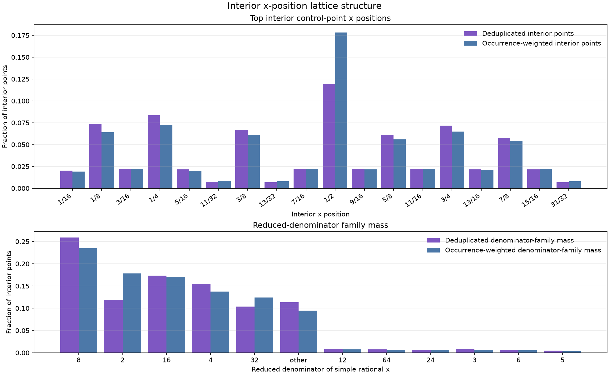
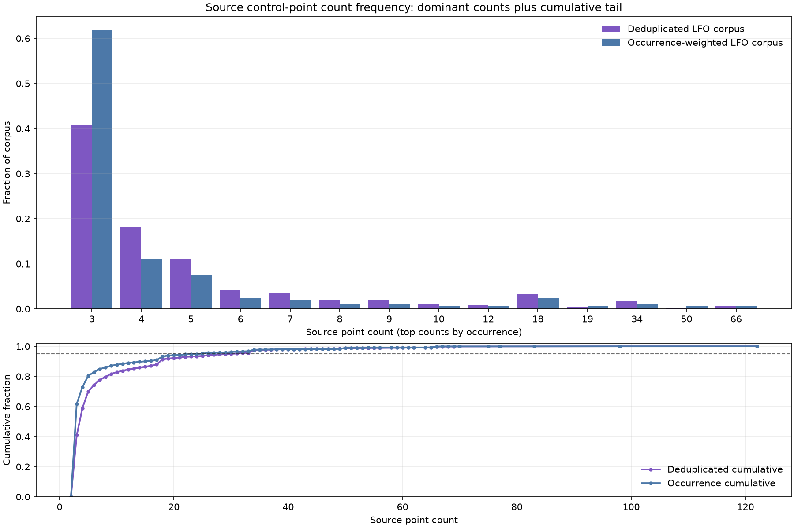
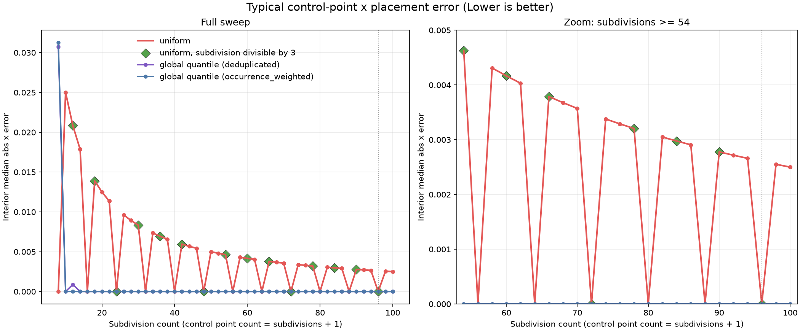
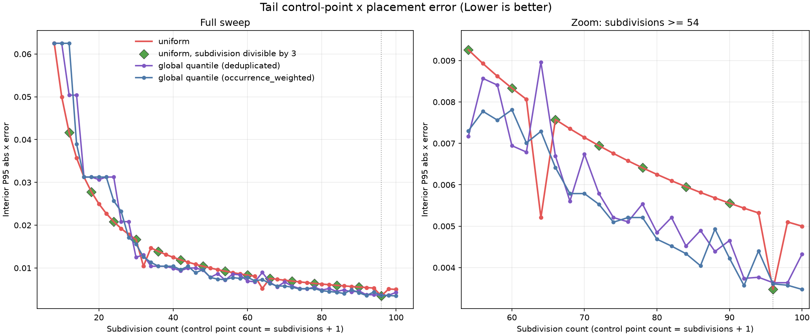
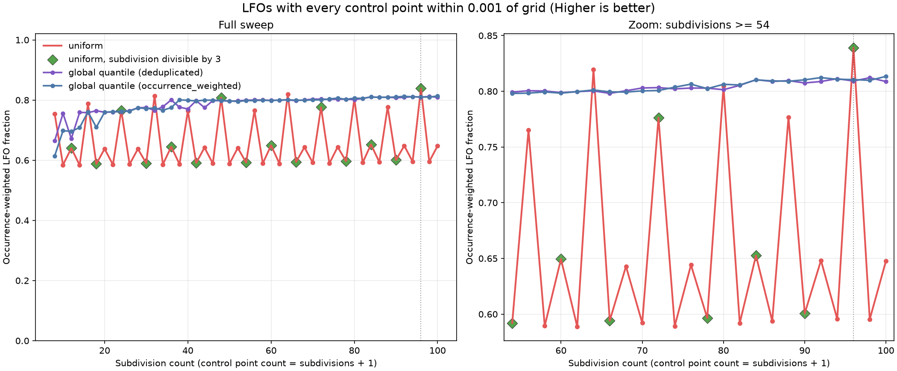
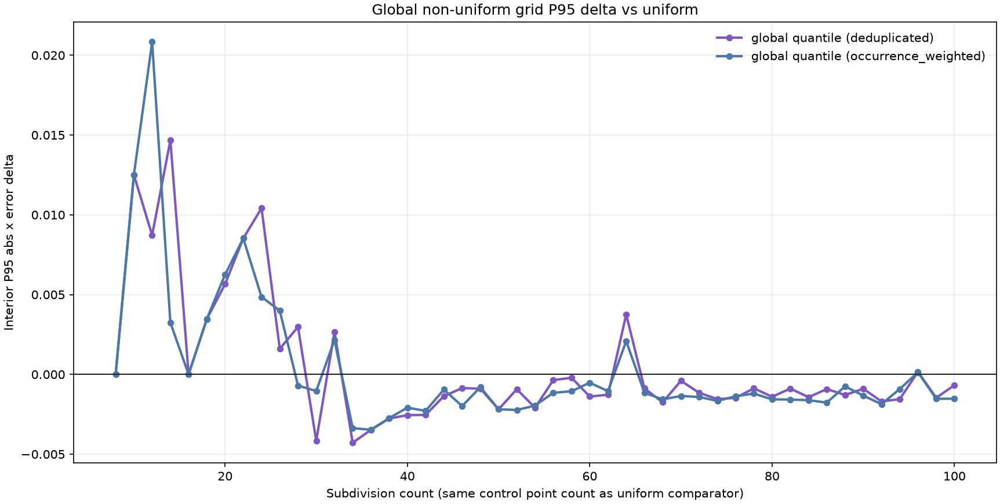
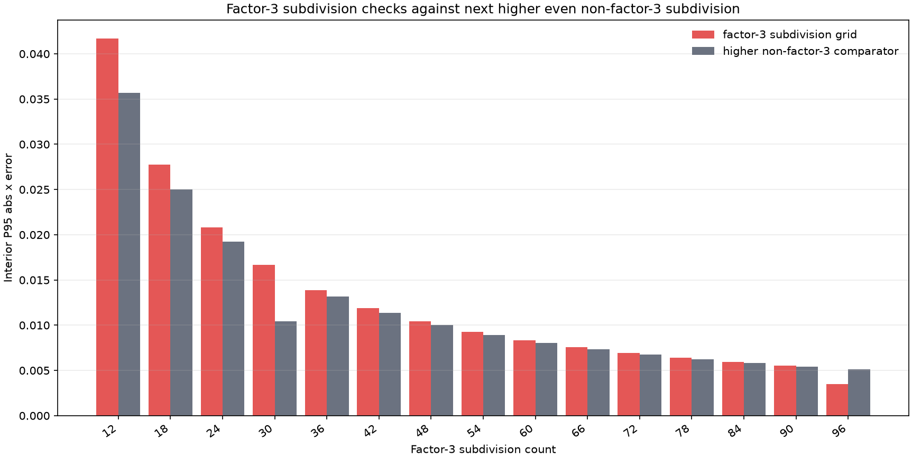

# Experiment 10: Control-Point X Grid Audit

## Main Findings

The main result is not that factor-3 grids are broadly special. The stronger pattern is that this corpus is heavily dyadic. Interior control-point x positions pile up on `1/2`, quarters, eighths, sixteenths, and thirty-seconds. Factor-3 helps only when it lands on top of that dyadic structure instead of competing with it.

The source corpus is also simple in point count. The most common occurrence-weighted source count is 3 points (61.745% of LFO occurrences). The most common deduplicated source count is 3 points (40.788% of unique LFO shapes). Source LFOs with at most 5 points cover 80.342% of occurrence-weighted usage and 69.934% of deduplicated shapes.

The top occurrence-weighted interior x positions are `1/2` (17.81%), `1/4` (7.26%), `3/4` (6.50%), `1/8` (6.41%), `3/8` (6.08%), `5/8` (5.59%). By reduced denominator, the largest families are `8` (23.49%), `2` (17.81%), `16` (17.05%), `4` (13.77%), `32` (12.42%), `other` (9.48%). Summing denominator families, dyadic positions account for 85.247% of occurrence-weighted interior point mass, while denominator families divisible by 3 account for 3.192%. This is why the plots have a sawtooth/periodic look.

Uniform median error hits zero at subdivision counts `8, 16, 24, 32, 40, 48, 56, 64, 72, 80, 88, 96`. That is not an accident: those rows align with enough of the dominant dyadic lattice that more than half of occurrence-weighted interior points are exact hits.

The P95 curve mostly rewards more subdivisions, but it also has sharp alignment drops at dyadic-friendly rows. The best valid high-end uniform row is `subdivision_count=96` (`control_point_count=97`) with interior P95 x error 0.00347222. That row matters because `subdivision_count=96` gives 97 control points, stays inside Vital's 100-point limit, and combines dyadic alignment with factor-3 alignment. The absolute best uniform row in the sweep is `subdivision_count=96` (`control_point_count=97`) with P95 0.00347222, but rows above 99 control points need to be read against the Vital limit.

The `0.001` whole-LFO pass-rate check is intentionally strict. Uniform spacing alone would only guarantee every in-range x position is within `0.001` at `subdivision_count >= 500`, because the worst in-range rounding error is `1 / (2 * subdivision_count)`. So in this sweep the `0.001` plot should be read as a lattice-alignment diagnostic, not as a dense-grid acceptability threshold. The first uniform grid where at least 95% of occurrence-weighted LFOs pass that strict whole-LFO check is not reached by the tested subdivision counts.

Fixed global non-uniform grids are mixed. At very low subdivision counts they often over-focus the most frequent x positions and leave the tail exposed. In the low band (`8` through `30`), 3 of 24 non-uniform P95 deltas are negative, with mean delta 0.00526223. In the mid band (`32` through `52`), 20 of 22 are negative, mean delta -0.00177949. In the high band (`54` through `100`), 44 of 48 are negative, mean delta -0.00103004. Negative is good, but the high-subdivision margins are small.

Factor-3 alone is not a general win. It beats or matches the next higher even non-factor-3 comparator in 1 of 15 tested pairings. Winning pairings: `96` vs `98`. The important case is `96`, because it is also dyadic-friendly.

## Why The Curves Look Periodic

The top subplot shows the actual interior x positions that dominate the corpus. The bottom subplot groups simple rational x positions by reduced denominator. If a uniform grid has `subdivision_count` divisible by one of these denominators, those points become exact hits. If it misses the denominator, the same points produce a visible jump in median, P95, or whole-LFO pass rate.

This is why the uniform median curve has clean zero drops at multiples of 8, and why `subdivision_count=96` is unusually strong: it is divisible by 32 and by 3. A pure factor-3 interpretation would miss the larger dyadic story.

## Plot Notes

### Source Point-Count Frequency

Higher bars mean more corpus mass at that source control-point count. The occurrence-weighted corpus is even more concentrated than the deduplicated corpus: repeated preset usage strongly favors 3-point shapes. The lower cumulative plot shows that the long tail exists, but most practical coverage is already inside low point counts.

### Median Interior X Error

Lower is better. The uniform median plot is the clearest periodicity signal: it repeatedly drops to zero at multiples of 8. That means the typical interior control point is not merely close to the grid; it is exactly on the grid for those subdivision counts. Global quantile grids reach near-zero median early because they place grid points directly on frequent corpus positions, but that does not mean the tail is solved.

### P95 Interior X Error

Lower is better. P95 mostly follows capacity: more subdivisions reduce the worst common rounding errors. The interesting deviations are the dyadic drops. `32`, `64`, and `96` are better than their immediate neighbors because they align with high-mass denominator families. The zoom panel is the useful decision region: it shows why `96` is the clean high-end uniform default under the 100-control-point constraint.

### Whole-LFO Pass Rate At 0.001

Higher is better. This plot asks a harder question than point-level P95: does every control point in the LFO land within `0.001` of the grid? At this threshold the curve should not saturate inside the tested sweep just because the grid is dense. Peaks are therefore telling us about exact or near-exact rational alignment, especially with the dyadic lattice.

### Global Non-Uniform Delta

Negative is good. This subtracts same-count uniform P95 from global non-uniform P95. The large positive spikes at low subdivision counts are the cost of spending scarce grid slots on the most frequent positions while leaving less common positions exposed. After roughly the low 30s, non-uniform grids are usually slightly better on P95, but the high-subdivision advantage is small enough that it should be treated as a candidate, not a conclusion.

### Factor-3 Subdivision Checks

Lower is better. Each red bar is a subdivision count divisible by 3; each grey bar is the next higher even subdivision count that is not divisible by 3. Most factor-3 rows lose because the comparator simply has more subdivisions. The exception at `96` is the meaningful one because `96` is also aligned with the dominant dyadic families.

## Practical Takeaways

- Carry forward fixed uniform `subdivision_count=96` as the Era 2 default: `control_point_count=97`, inside Vital's 100-point limit, and aligned with both dyadic and factor-3 structure.
- Do not describe factor-3 as a general rule. The better rule is: match the corpus x-position lattice, and note that this corpus is mostly dyadic.
- Use the `0.001` pass-rate plot as a strict lattice diagnostic. It is not an acceptability-style read because the density guarantee is far outside the current sweep.
- Future model experiments should not spend model prediction head budget on x-coordinate prediction, grid selection, or variable grid spacing.
- This audit still does not choose atoms, score y values, render segments, or make model prediction head budget claims. It only measures x-position damage from fixed control-point grids.

## Method Notes

Experiment 10 is a standalone corpus/grid audit, not an Era 2 model-runner experiment. It asks how many source control points real LFOs use, then tests how well inclusive x-grid subdivision counts place those ordered control-point x positions.

Naming contract:

- `W` is reserved for residual-layer atom choices in Era 2 model experiments.
- Experiment 10 varies `subdivision_count`.
- `control_point_count = subdivision_count + 1`.
- The CSV keeps `grid_point_count` as the implementation field name for the same value as `control_point_count`.
- Factor language applies to `subdivision_count`, not to `control_point_count`.
- Example: `subdivision_count = 96` means `control_point_count = 97`, and 96 is divisible by 2 and 3.

Control-point x contract:

- For each true ordered control point, predicted x is the nearest point in the fixed grid.
- For `uniform`, grid points are `k / subdivision_count` for integer `k` from 0 through `subdivision_count`.
- For `global_quantile`, grid points are fixed offline-learned non-uniform positions.
- Y is ignored, and no line, Bezier, power curve, or other segment is rendered.
- Repeated grid points are allowed because discontinuous LFOs can contain repeated x positions.
- `lfo_all_points_within_0p001_*` reports the fraction of LFOs whose maximum x error is at most 0.001.

Global non-uniform grids:

- `global_quantile` grids are learned once offline from corpus control-point x positions.
- The deployed model would still predict a grid slot; it would not predict the grid positions.
- Both deduplicated and occurrence-weighted learned grids are reported.

Generated artifacts:

- `point_count_frequency.csv`
- `control_point_x_lattice_frequency.csv`
- `control_point_x_summary.csv`
- `factor3_grid_point_comparisons.csv`
- `global_nonuniform_grids.json`
- `summary.csv`

Numerical anchors:

- The first uniform grid where occurrence-weighted interior P95 x error is at most `0.001` is not reached by the tested subdivision counts.
- The best overall P95 row in this sweep is `global_quantile` / `occurrence_weighted` at `subdivision_count=100` (`control_point_count=101`) with interior P95 x error 0.00347221.
- The strongest fixed global non-uniform P95 improvement versus same-count uniform is `deduplicated` at `subdivision_count=34` (`control_point_count=35`), delta -0.00428920.
- The worst fixed global non-uniform P95 regression versus same-count uniform is `occurrence_weighted` at `subdivision_count=12` (`control_point_count=13`), delta 0.02083333.
