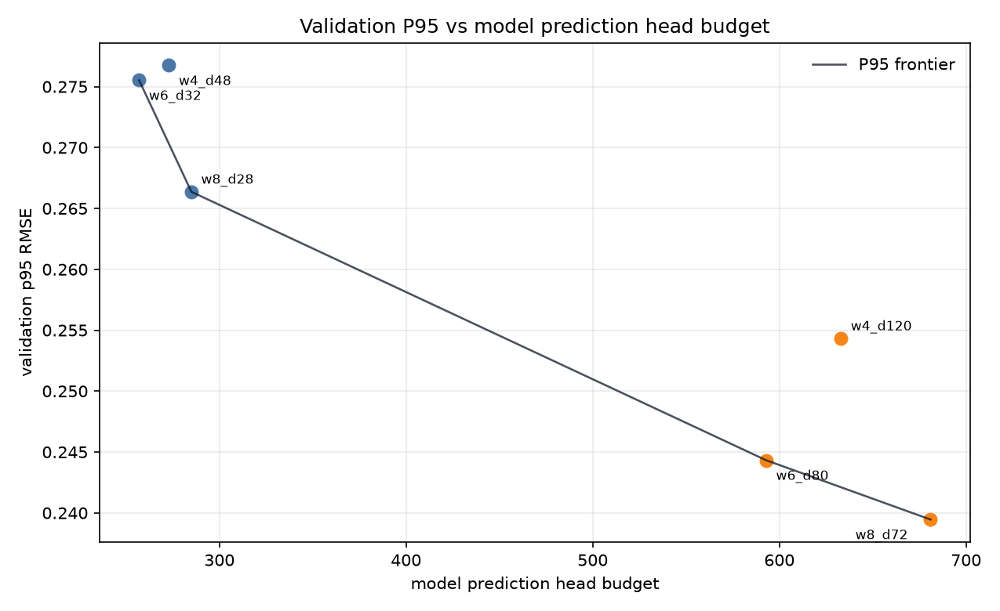
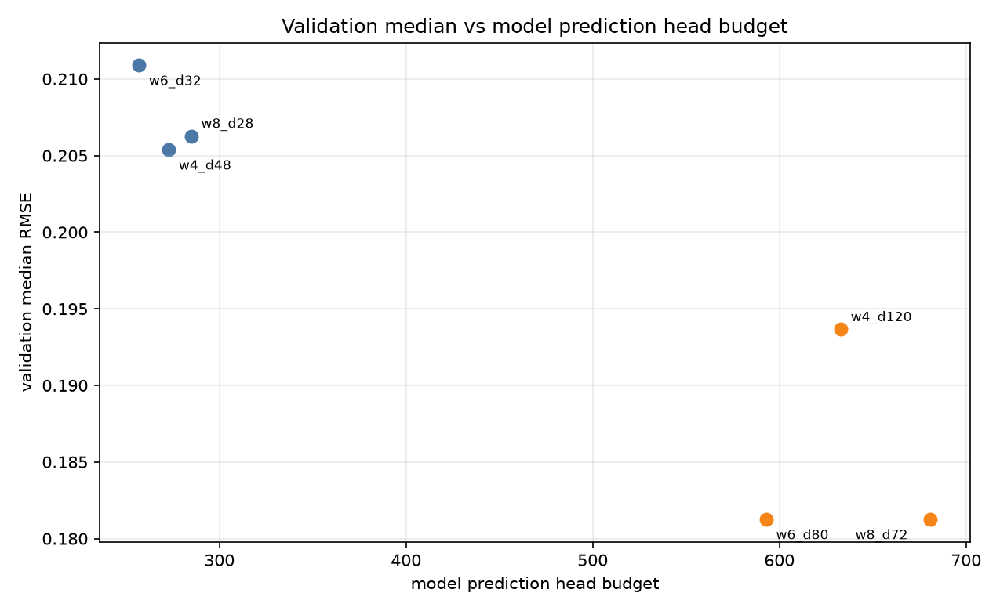
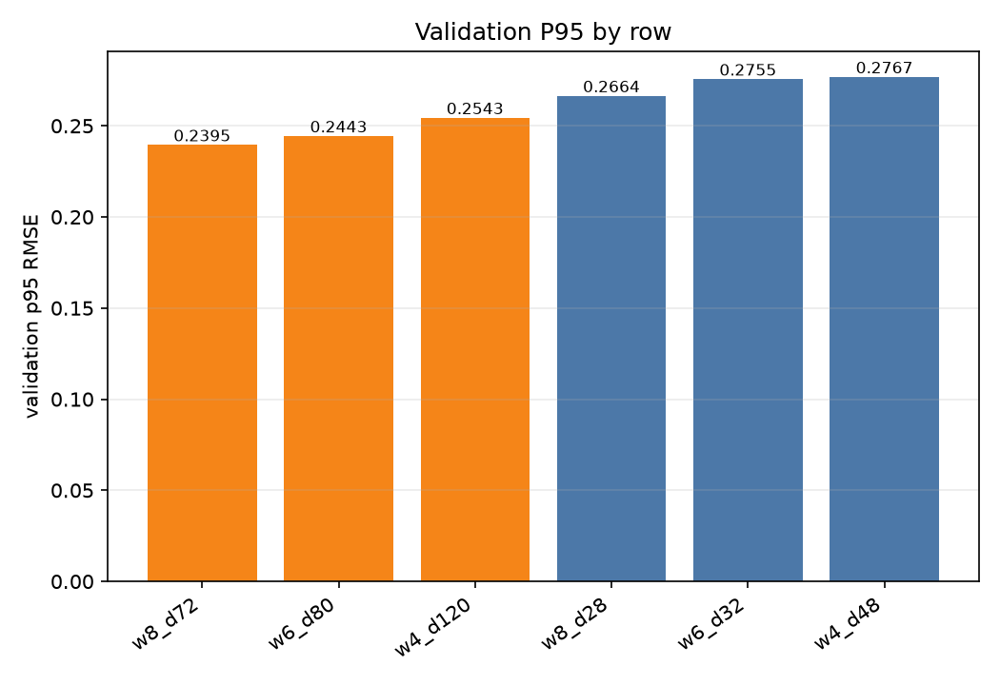
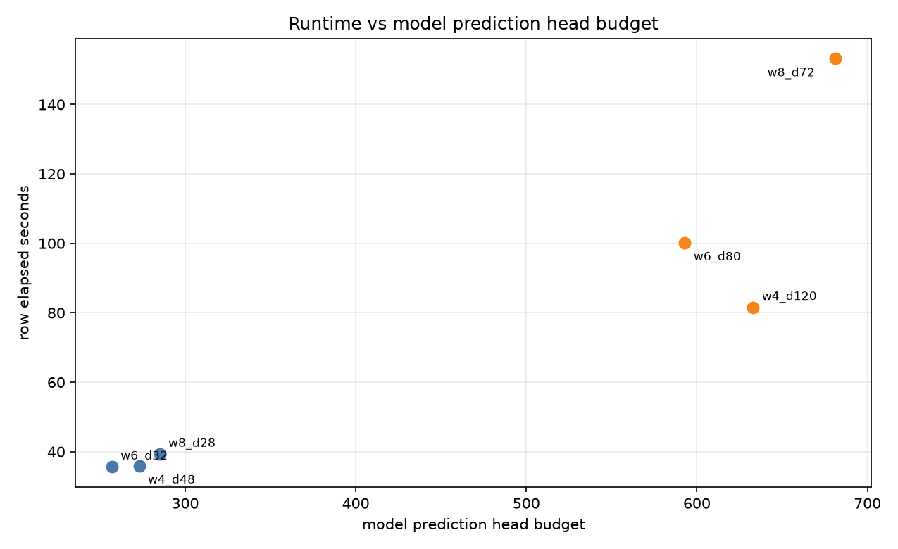
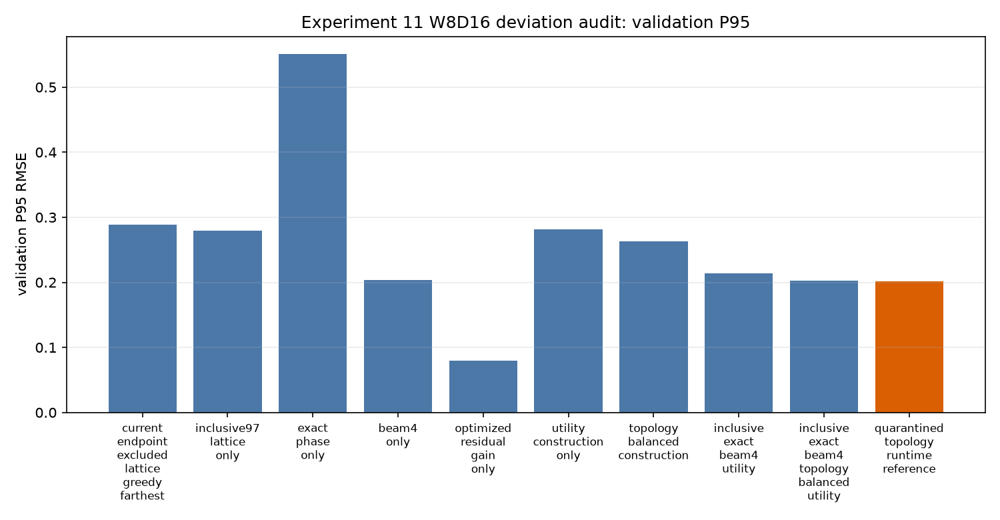
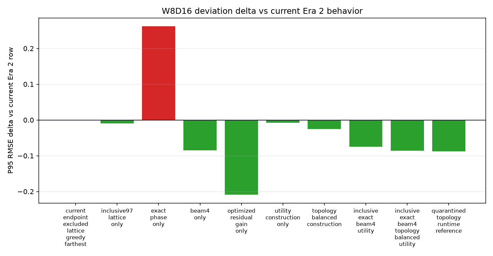
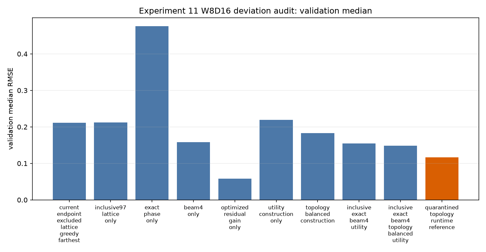
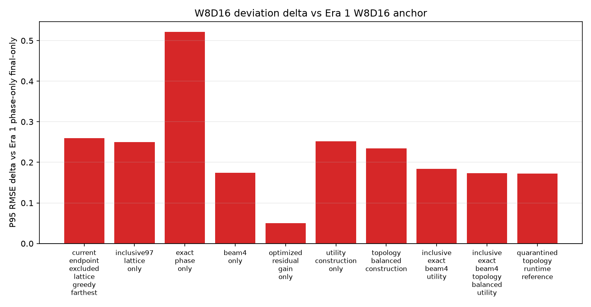
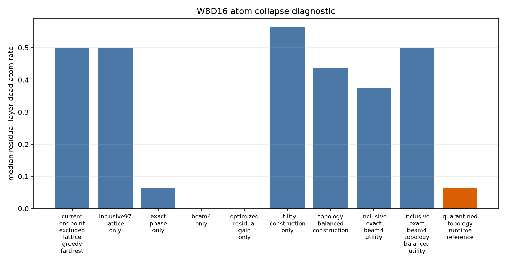
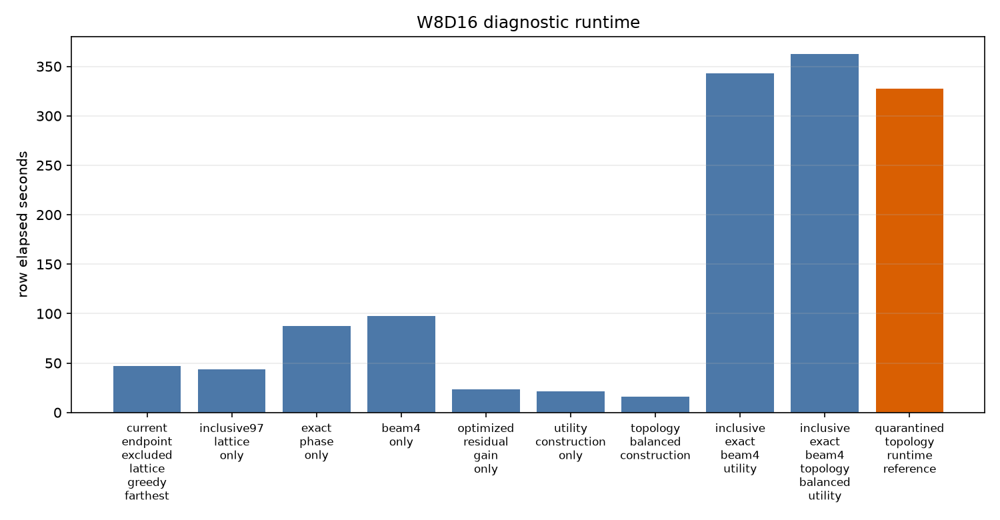

# Experiment 11 Flat-Categorical Report

## Main Findings

The active-phase Experiment 11 screen completed `6` rows and now looks like a real quality run, not just a framework check. The run used the full active corpus split (13295 train / 1605 validation, 14900 total active LFO rows).
The best tail result is `w8_d72` at validation P95 RMSE `0.2395` with `681` model prediction head outputs. That is `0.0049` better than the next row, `w6_d80`.
The best typical-case result is `w6_d80` at validation median RMSE `0.1812`. `w8_d72` reaches the same median, but spends more budget to improve the tail.
The useful frontier is `w6_d32 -> w8_d28 -> w6_d80 -> w8_d72`. Rows outside that frontier are dominated on this screen: `w4_d120, w4_d48`.
The fixed LFO vector shape is `97` control points. The x lattice is decoder-owned geometry and adds zero model prediction head outputs.
The topology contract passed for `6/6` rows, and active oracle phase search was recorded for `6/6` rows.

## Why This Happens

The screen is mostly comparing width/depth tradeoffs under the same flat-categorical runtime interface. `W` is the number of atom choices per residual layer; `D` is the residual-layer count. The model prediction head budget is `32 + D * W + (D + 1)`: 32 base atom logits, `D * W` residual-layer atom logits, and one continuous phase scalar for the base plus one per residual layer.

Within the small budget band, `w8_d28` wins P95 even though it has the largest small-band budget. That says the extra atom choices per residual layer are helping more than simply adding residual layers at `W=4` or `W=6` in this range.

Within the medium band, `w6_d80` is the efficient row and `w8_d72` is the quality row. `w8_d72` improves validation P95 by `0.0049` while adding `88` head outputs over `w6_d80`. This is the main practical tension coming out of the run: `W=6,D=80` is attractive if we care about budget efficiency, while `W=8,D=72` is the cleaner quality candidate.

The `W=4` rows are the weak signal. `w4_d48` is dominated in the small band, and `w4_d120` is dominated in the medium band. In this screen, pushing many low-width residual layers does not buy enough reconstruction quality to justify the head budget.

## Plot Notes

### Validation P95 Vs Model Prediction Head Budget

Lower is better. The x-axis is deployed model prediction head budget, not dictionary storage or oracle work. The plot shows a clear improvement when moving from the small band into the medium band, but the medium rows are not interchangeable: `w6_d80` gets most of the metric improvement, while `w8_d72` spends an extra 88 heads for the best tail.

### Validation Median Vs Model Prediction Head Budget

Lower is better. The median plot separates typical-case behavior from tail behavior. `w6_d80` and `w8_d72` land at the same median, so the extra `W=8` capacity is mainly buying tail cleanup, not a typical-case shift. `w4_d120` underperforms both even with a medium-band budget.

### Validation P95 By Row

Lower is better. This plot is the easiest row-level read: each bar is one planned screen row, colored by budget band. It makes the dominated rows visible without pretending this six-row screen is a dense sweep.

### Runtime Vs Model Prediction Head Budget

Lower is faster. Runtime broadly increases with row size, but this is oracle construction/encoding runtime on the current implementation, not deployed model runtime. Treat it as a workflow planning metric for Era 2 experiment velocity.

## Best Rows By Validation P95

Full numeric row metrics are in `analytics/summary.csv`; the markdown only keeps the decision-level facts.

1. `w8_d72`: P95 `0.2395`, median `0.1812`, `681` heads, `medium` band.
2. `w6_d80`: P95 `0.2443`, median `0.1812`, `593` heads, `medium` band.
3. `w4_d120`: P95 `0.2543`, median `0.1937`, `633` heads, `medium` band.
4. `w8_d28`: P95 `0.2664`, median `0.2063`, `285` heads, `small` band.
5. `w6_d32`: P95 `0.2755`, median `0.2109`, `257` heads, `small` band.
6. `w4_d48`: P95 `0.2767`, median `0.2054`, `273` heads, `small` band.

## Budget Band Read

- `medium`: `3` rows, best P95 `0.2395`, head range `593`-`681`.
- `small`: `3` rows, best P95 `0.2664`, head range `257`-`285`.

## Frontier Read

Lower validation P95 is better. `head_outputs_actual` is the model prediction head budget; the fixed x lattice is decoder-owned and does not add outputs.
Oracle phase-search resolution is also not part of this budget: the deployed model emits one continuous phase scalar per base/residual layer either way.

- `w6_d32`: `257` heads, P95 `0.2755`, `small` band.
- `w8_d28`: `285` heads, P95 `0.2664`, `small` band.
- `w6_d80`: `593` heads, P95 `0.2443`, `medium` band.
- `w8_d72`: `681` heads, P95 `0.2395`, `medium` band.

Reading left to right by budget, a row only belongs on the frontier if it improves validation P95 over every cheaper row. That is why the `W=4` rows are not decision candidates from this screen.

## Budget Projection Notes

Run-local `analytics/budget_projections.csv` includes formula-only views for alternate dictionary addressing strategies, currently including binary path addressing over the same residual-layer leaf capacity.

The important read is narrow: binary path addressing changes projected budget in two places: `w8_d28` drops from 285 to 229; `w8_d72` drops from 681 to 537. The `W=4, W=6` rows match the flat-categorical budget under the current formula. These are budget views, not quality claims, because changing atom indexing changes the learning problem and may require a different dictionary organization.

## Practical Takeaways

- Treat `w8_d72` as the current quality anchor for the flat-categorical interface.
- Treat `w6_d80` as the current budget-efficiency anchor; it matches the best median and is close on P95 with fewer heads.
- Do not spend more time on low-width, many-layer `W=4` rows until there is a new construction idea that specifically justifies them.
- The active-phase fix worked at the accounting level: phase is now an oracle-estimated continuous scalar target, and its search resolution does not change `head_outputs_actual`.
- Topology remains cleanly out of deployed runtime: it is not used in inputs, targets, loss, decoder lookup, or head accounting.

## Runtime And Readiness Notes

- Run id: `run_20260705_083841`
- Corpus mode: smoke=`False`, requested sample fraction=`1.0`.
- Screen: `experiment11`
- Dataset: `13295` train, `1605` validation, `14900` total active LFO rows.
- LFO vector shape: `97` control points.
- Topology may be used for offline construction, but runtime topology is not part of inputs, targets, loss, decoder lookup, or model prediction head budget.
- Any topology bucket metrics are analysis-only.
- `oracle_phase_search_policy` and `oracle_phase_candidate_count` describe oracle target generation, not deployed head-output cost.
- CSV analytics remain in the run artifact directory. This markdown file is the canonical Experiment 11 report.

## W8D16 Deviation Audit

This section is a fixed `W=8`, `D=16` diagnostic. It is not a new broad Experiment 11 screen. It asks which concrete deviations from the Era 1 setup explain the quality gap.

Follow-up forensic note: [Experiment 11 RMSE Gap Forensic Audit](./EXPERIMENT_11_RMSE_GAP_FORENSIC_AUDIT.md) is now the sharper source for the cross-era quality gap. It confirms that Era 1 `phase_only` rows still applied saved residual-layer gains, while the canonical Era 2 flat path was fixed-amplitude. It also fixed an Era 2 tiny-phase circular-shift precision bug. Read the row-by-row W8D16 audit below as useful diagnostic context, not the final root-cause statement.

### Main Findings

The current Era 2-like W8D16 row lands at validation P95 `0.2887`. The best diagnostic row is `optimized_residual_gain_only` at `0.0799`.
The Era 1 W8D16 `phase_only_final_only` anchor is `0.0294` P95, so the best diagnostic row is still `0.0505` away from that anchor.
Optimized residual-layer gain is the dominant confirmed deviation: it moves P95 from `0.2887` to `0.0799`. That is not the same thing as Era 1's optional modifier/base gain. It is a per-residual-layer reconstruction scalar, and it costs 16 additional model-facing scalar outputs for W8D16.
Beam search is the strongest zero-head-cost oracle/path improvement in this audit, improving P95 to `0.2039` without changing the runtime head formula.
The exact-phase row regresses badly (`0.5506` P95). Read this as an implementation/representation mismatch, not as evidence that exact phase is conceptually bad: the ported exact solver assumes a periodic sampled curve, while the settled 97-point representation is an inclusive control-point vector over 96 subdivisions.
Topology-balanced offline construction helps modestly (`0.2634` P95), but the quarantined runtime-topology reference is only `0.2014` P95. So forbidden runtime topology is not the main missing ingredient behind the Era 1 gap.
The terminology issue is real but secondary: analytics should use `metric_delta` or `metric_improvement` for score changes, while `gain` should mean a reconstruction scalar. The audit rows keep fixed residual gain, optimized residual gain, and model-facing gain budget separate.
Except for the explicit current-behavior control row, the diagnostic rows use the corrected inclusive 97-control-point grid. Labels like `beam4_only` mean the named axis changes relative to the `inclusive97_lattice_only` row.

### What Each Deviation Tests

- `current_endpoint_excluded_lattice_greedy_farthest`: baseline. P95 `0.2887`, median `0.2109`, heads `177`. Current Era 2 behavior: endpoint-excluded 97 samples, lattice phase, greedy path, topology-blind farthest-residual construction.
- `inclusive97_lattice_only`: confirmed improvement vs baseline by `0.0091` P95. P95 `0.2795`, median `0.2122`, heads `177`. Only the 97-control-point lattice is corrected to inclusive 96-subdivision geometry.
- `exact_phase_only`: regression vs baseline by `0.2619` P95. P95 `0.5506`, median `0.4756`, heads `177`. On the corrected inclusive grid, phase alignment changes to exact piecewise-linear phase search.
- `beam4_only`: confirmed improvement vs baseline by `0.0848` P95. P95 `0.2039`, median `0.1582`, heads `177`. On the corrected inclusive grid, path search changes from greedy to beam width 4.
- `optimized_residual_gain_only`: confirmed improvement vs baseline by `0.2088` P95. P95 `0.0799`, median `0.0580`, heads `193`. On the corrected inclusive grid, residual-layer atom gain becomes optimized and model-facing.
- `utility_construction_only`: confirmed improvement vs baseline by `0.0073` P95. P95 `0.2814`, median `0.2193`, heads `177`. On the corrected inclusive grid, residual atom construction changes from farthest residuals to sampled utility selection.
- `topology_balanced_construction`: confirmed improvement vs baseline by `0.0252` P95. P95 `0.2634`, median `0.1828`, heads `177`. Topology is used only to balance offline atom construction; runtime schema stays topology-free.
- `inclusive_exact_beam4_utility`: confirmed improvement vs baseline by `0.0748` P95. P95 `0.2138`, median `0.1547`, heads `177`. Cumulative likely-fix row: inclusive 97, exact phase, beam width 4, utility construction.
- `inclusive_exact_beam4_topology_balanced_utility`: confirmed improvement vs baseline by `0.0861` P95. P95 `0.2026`, median `0.1484`, heads `177`. Cumulative likely-fix row plus topology-balanced offline construction.
- `quarantined_topology_runtime_reference`: quarantined invalid-runtime reference. P95 `0.2014`, median `0.1163`, heads `177`. Invalid Era 2 deployment reference: topology selects a runtime dictionary. This is diagnostic only.

### Supporting Plots

Lower is better for validation median, validation P95, and runtime. Lower dead-atom rate is better when interpreting dictionary usage, but it is diagnostic rather than a direct quality objective.

### Method Notes

- `W` is atom choices per residual layer. It is not a grid subdivision count.
- `control_point_count=97` means 96 subdivisions for inclusive-grid rows.
- The endpoint-excluded row is intentionally retained as the old-behavior control.
- The topology-runtime row is quarantined: it is useful evidence, but not an Era 2 deployable candidate.
- CSV artifacts live under `research/experiments/lfo_representation/era2/artifacts/experiment_11/w8d16_deviation_audit/`.
