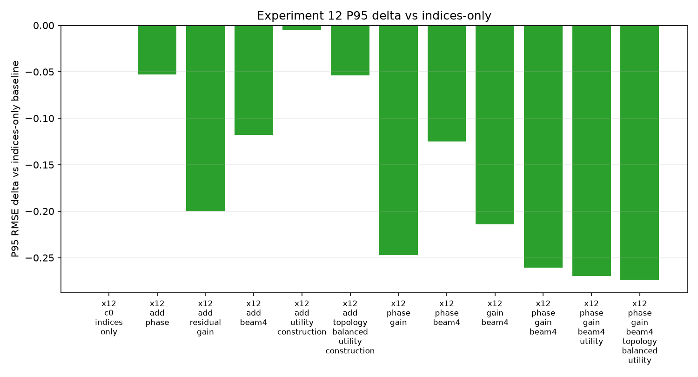

# Experiment 12: W8D16 First-Principles Component Ladder

## Main Findings

The indices-only W8D16 baseline lands at validation P95 `0.3285`. The best row in this run is `x12_phase_gain_beam4_topology_balanced_utility` at `0.0546`.
Residual-layer gain is the component to watch first: by itself it moves P95 from `0.3285` to `0.1286` while adding 16 model-facing scalar outputs.
Phase is measured as its own component, not assumed into the baseline. Its single-component row lands at `0.2759` P95.
Beam-4 is an oracle/path-search component with zero model prediction head cost. Its single-component row lands at `0.2103` P95.
The cumulative clean row with phase, residual gain, beam-4, and topology-balanced utility construction lands at `0.0546` P95 with `193` head outputs.

## Why The Components Behave This Way

This ladder deliberately separates model-facing degrees of freedom from oracle-side search. Beam search and offline construction can improve the selected path without changing `head_outputs`; phase and residual gain change what the deployed model must emit.

The key guardrail is residual gain. If a per-sample residual gain is optimized during oracle encoding, it is a reconstruction scalar and must appear in the model-facing target schema. Experiment 12 treats that as a real component rather than repeating the Era 1 free-gain ambiguity.

Topology-balanced construction is allowed only as offline atom construction. The runtime target schema, loss schema, decoder lookup, and head accounting remain topology-free.

## Independent Variables

Experiment 12 keeps `B=32`, `W=8`, `D=16`, `control_point_count=97`, per-residual-layer dictionaries, and flat-categorical atom addressing fixed. The variables under test split into model-facing variables and oracle/process variables.

Model-facing variables change what the deployed model must emit:

- Phase: adds one base phase plus one phase per residual layer, for `D + 1 = 17` continuous scalar outputs. The oracle uses the current FFT/lattice search to choose phase targets, but the deployed model still emits continuous phase scalars.
- Residual-layer gain: adds one optimized per-sample gain per residual layer, for `D = 16` continuous scalar outputs. If the oracle uses optimized gain, the gain is counted in the model-facing target schema; there is no free-gain row.

Oracle/process variables change how reconstruction targets are produced, but they do not change model prediction-head budget:

- Path policy / beam width: greedy encoding keeps one best partial reconstruction at each residual layer. Beam encoding keeps multiple partial reconstructions, expands each candidate path at the next layer, then keeps the best paths. `beam4` carries four paths, but the final target is still one selected path.
- Construction policy: farthest construction adds atoms from residual examples that are poorly covered by the current atoms. Utility construction scores candidate residual examples by aggregate loss reduction and adds the candidate with the largest measured improvement. Topology-balanced utility uses topology labels only to balance the offline candidate pool before utility scoring.
- Utility candidate budget: `max_utility_candidates` controls how many high-loss residual examples are scored at each utility-construction step. Larger values can find better atoms but increase construction time.
- Topology in construction: topology may help choose or balance offline atom candidates, but topology must not enter runtime inputs, targets, loss, decoder lookup, or head accounting.

## Plot Notes

Lower is better for validation P95, validation median, P95 delta, and runtime.

The P95 plot shows which components move the difficult tail. Read this before budget scatterplots; Experiment 12 is primarily about RMSE behavior and component interaction.

The median plot shows whether a component helps typical LFOs or mainly repairs tail cases.

Negative delta is good. This plot keeps the first-principles baseline visible and avoids treating Era 1 labels as the comparison target.

This plot records model prediction head budget, but it is not the main explanation. Rows with the same head count can differ because beam search and construction are oracle-side components.

Residual gain usage is shown separately so gain magnitude is not confused with metric improvement.

Dead-atom rate is diagnostic. Lower is usually healthier, but quality remains the primary decision metric.

Runtime shows oracle cost, not deployed model prediction cost.

## Practical Takeaways

Use Experiment 12 to decide which components deserve full-size follow-up rows. Do not promote a component because it matches an Era 1 label; promote it because it improves the W8D16 ladder under the Era 2 runtime contract.

The next report should discuss component interactions directly. If phase plus gain behaves differently from either single-component row, that interaction is the finding.

A larger follow-up should keep `W=8` and `D=16` fixed, then vary process-side variables more deeply: beam width, utility candidate budget, and construction-policy interactions. These variables are free only in model prediction-head budget; they can still change oracle construction time, oracle encoding time, and target quality.

Recommended fixed-W/D follow-up rows: keep the existing controls, then sweep `x12_gain_beam4` and `x12_phase_gain_beam4` over `beam_width = 2, 4, 8`; sweep the utility and topology-balanced cumulative rows over `max_utility_candidates = 8, 12, 24, 48`.

## Method Notes

- `W=8` means eight atom choices per residual layer.
- `D=16` means sixteen residual layers.
- `control_point_count=97` is fixed decoder geometry.
- The indices-only baseline has `head_outputs = 32 + 16 * 8 = 160`.
- Phase adds `D + 1 = 17` model-facing scalar outputs.
- Residual gain adds `D = 16` model-facing scalar outputs.
- Beam and construction policies add zero model prediction head outputs.
- The current component ladder holds `max_utility_candidates=24`; future fixed-W/D sweeps should vary this explicitly.
- CSV artifacts live under `research/experiments/lfo_representation/era2/artifacts/experiment_12/component_ladder/`.
