# Experiment 12: Fixed-W8D16 Screening Grid

## Main Findings

The main result is that `PhaseAndResidualGain` is the dominant quality unlock for fixed `W=8,D=16`. Under the default construction policy, median RMSE moves from `0.1395` to `0.0409`, validation P95 moves from `0.2085` to `0.0580`, and node-max P95 moves from `0.6795` to `0.1830`. That gain costs model prediction head budget: `IndicesOnly` uses `160` heads, while `PhaseAndResidualGain` uses `193`.

Construction policy is the most important process-like variable in the run. `CommonCaseRepair` is the median and strict-perfect outlier: with `PhaseAndResidualGain`, it reaches median RMSE `0.0034` and strict perfect-LFO rate `0.1651`, but its P95 is `0.1280`. `FinishRepairRescue` is the cleaner balanced construction candidate: median `0.0087`, strict perfect rate `0.1277`, P95 `0.0511`, and node-max P95 `0.1500`.

End-of-layer normalization is a real free decoder-policy lever. `LayerClip0To1` has the best validation P95 in the run at `0.0509`, while `LayerCenterPreserveClip` is essentially tied on P95 at `0.0510` and has the best node-max P95 among the layer-normalization rows at `0.1563`. The soft-clip variants, bounded residual step, and overshoot-penalty/no-clip variant are weaker in this screen.

`no_damage_policy` and duplicate suppression are mostly flat. They do not move quality enough to justify treating them as primary Experiment 13 axes unless the grid has spare room. Duplicate suppression is especially weak here: quality is identical to the default row while construction time is higher.

The report contains `72` rows from the current `72`-row `AllRows` view. Every row keeps `W=8`, `D=16`, `control_point_count=97`, flat-categorical per-residual-layer addressing, and one required `NoOpAtom` per residual layer. This is still a screening read, not an automatic winner selection: median RMSE, strict perfect-LFO rate, P95 RMSE, and node-max P95 disagree in meaningful ways.

## Why This Happens

The scalar result is expected. Residual atoms need phase and scale invariance: a useful residual shape may be shifted in cycle phase or appear at a different amplitude. `IndicesOnly` can only choose an atom slot, so it often needs later layers to compensate for a phase or amplitude mismatch. `PhaseAndResidualGain` gives the decoder the missing alignment degrees of freedom directly.

`NoOpAtom` changes how atom usage should be read. Explicit no-op handling appears correctly applied in the encoder: atom index `0` keeps the prefix unchanged and resets phase/gain to `0`. The apparent no-op collapse under `PhaseAndResidualGain` is probably not a broken no-op path. An active atom can receive a near-zero optimized gain, which behaves like an implicit no-op while not counting as `NoOpAtom`. For that reason the report now tracks both explicit no-op usage and effective no-op usage, where effective no-op means explicit no-op or `abs(gain) <= 1e-4`.

The construction-policy split is a finish-vs-repair tradeoff. `CommonCaseRepair` spends atoms on residuals that many LFOs share, so it strongly improves the median and creates many exact reconstructions. It leaves some hard cases under-repaired, which is why its P95 stays high. `FinishRepairRescue` mixes finishing behavior with broader repair and later hard-case rescue, so it gives up some perfect-rate upside for a much better tail.

`utility_candidate_budget` is an offline construction knob. Each residual layer needs seven active atoms plus the required no-op. For each active atom slot, the constructor does not score every possible residual in the corpus as a candidate atom. `CandidateBudgetN` is the number of candidate residual shapes it pulls into that scoring round before choosing the next atom. It changes oracle construction work and atom quality; it is not model prediction head budget and does not change deployed runtime outputs.

Layer clipping helps because residual additions can overshoot the legal LFO y range before the final decoder clip. Hard clipping after each layer can stop overshoot from propagating through later residual choices. This is a decoder/free policy: it changes deterministic reconstruction behavior and adds zero model prediction head outputs. It should not be confused with oracle/offline construction work or with deployed runtime inputs.

Soft clipping is different from hard clipping because the sigmoid-style transform is not identity-preserving inside the valid range. It slightly compresses values even when they were already good, which is hostile to perfect reconstruction. That explains why `LayerSoftClip0To1` and `LayerSoftClipNeg0p1To1p1` show high no-op/dead-usage behavior and poor perfect reconstruction despite reducing boundary violations.

## Experiment 13 Candidate Read

This section is manual selection guidance, not an automatic ranking. The right Experiment 13 grid should preserve candidates that win different co-primary metrics.

- `path_search_policy`: keep both `Beam4Path` and `Beam8Path` unless grid size must shrink. `Beam8Path` is modestly better on P95 (`0.0567` vs `0.0580`) but costs more encoding time.
- `construction_policy`: shortlist `FinishRepairRescue`, `CommonCaseRepair`, and `FamilyBalancedRepair` or `ShapeClusterRepair`. `FinishRepairRescue` is the balanced choice; `CommonCaseRepair` is the median/perfect-rate stress test.
- `utility_candidate_budget`: shortlist `CandidateBudget48`, `CandidateBudget24`, and `CandidateBudget12`. `CandidateBudget8` is cheap, but under `PhaseAndResidualGain` it is less compelling on tail quality.
- `layer_normalization_policy`: shortlist `LayerClip0To1`, `LayerCenterPreserveClip`, and `LayerClipNeg0p1To1p1`. Treat soft clips, `BoundedResidualStep`, and `OvershootPenaltyNoClip` as weak unless a later run gives them a different role.
- `no_damage_policy`: if keeping three values, use `NoDamageOff`, `LateLayerNoDamage`, and `LateLayerNoDamageAndPerfectLocking`. The variable looks low-impact in this run.
- `atom_preprocessing_policy`: shortlist `EnergyNormalizedAtoms`, `RawAtoms`, and `CenteredEnergyNormalizedAtoms`. Keep the warning that centered normalization hurts `IndicesOnly` badly.
- `duplicate_suppression_policy`: keep both only if Experiment 13 budget allows. Current quality metrics are identical, while duplicate suppression costs more construction time.

## Independent Variable Chapters

### Path Search Policy

This family asks whether the decoder should keep a wider path beam while choosing atom sequences. The family plot shows `Beam8Path` buys a small P95 improvement over `Beam4Path`, but the duration row shows the expected encoding-time cost. It is worth keeping both only if Experiment 13 can afford the extra rows.

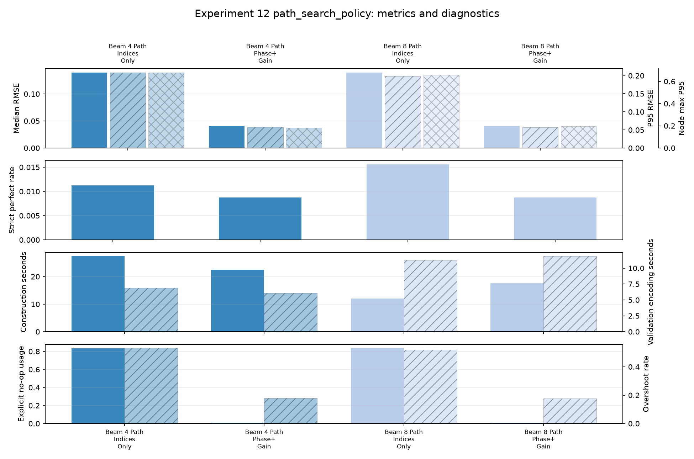

### Construction Policy

This is the most important process-like family. The family plot shows why there is no single automatic winner: `CommonCaseRepair` dominates median and strict-perfect behavior, while `FinishRepairRescue` gives the better balanced tail and node-max result. This family should get real width in Experiment 13.

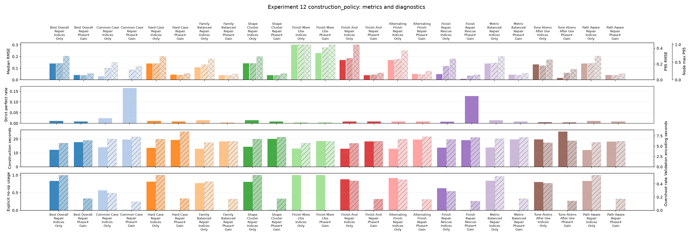

### Utility Candidate Budget

In plain language, this is how many residual-shape candidates the offline constructor bothers to score before choosing the next atom. The family plot shows diminishing returns rather than a clean monotonic curve. `CandidateBudget48` is the best quality candidate under `PhaseAndResidualGain`, but `CandidateBudget24` and `CandidateBudget12` remain useful cost controls.

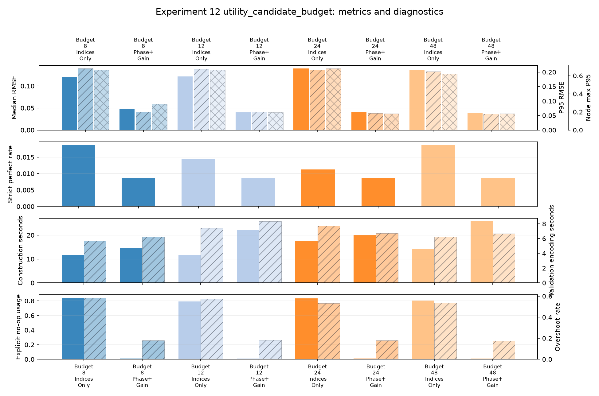

### Layer Normalization Policy

This family tests decoder/free end-of-layer state policies. The family plot shows hard clipping is genuinely useful for the tail: `LayerClip0To1` and `LayerCenterPreserveClip` are the clean candidates. The soft-clipping rows are visibly poor because the transform compresses already-valid values instead of preserving exact reconstructions.

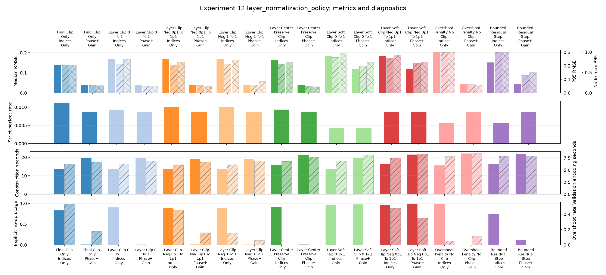

### No Damage Policy

This family tests whether late layers should be prevented from making an already-good reconstruction worse. The family plot is mostly flat, which means the required `NoOpAtom` already handles much of the safety behavior. Keep this axis small in Experiment 13.

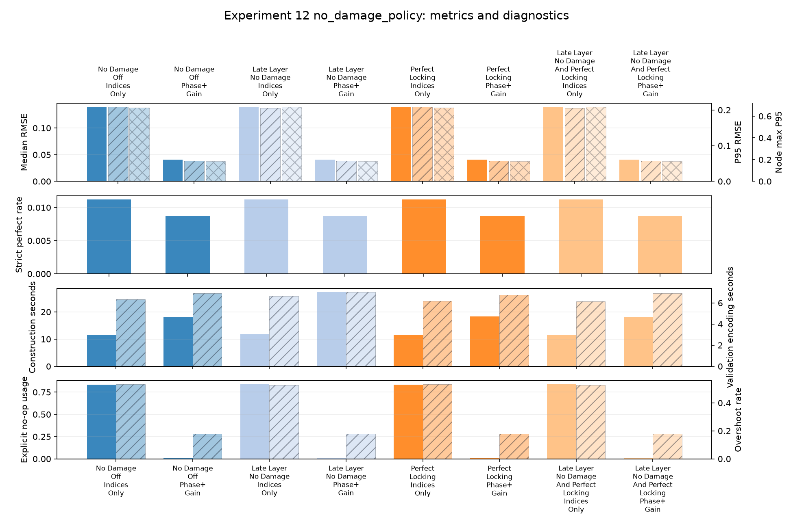

### Atom Preprocessing Policy

This family tests whether residual atoms should be normalized before being put into layer dictionaries. `EnergyNormalizedAtoms` is a plausible keeper because it is competitive under `PhaseAndResidualGain`; `CenteredEnergyNormalizedAtoms` is riskier because the `IndicesOnly` plot shows a clear degradation.

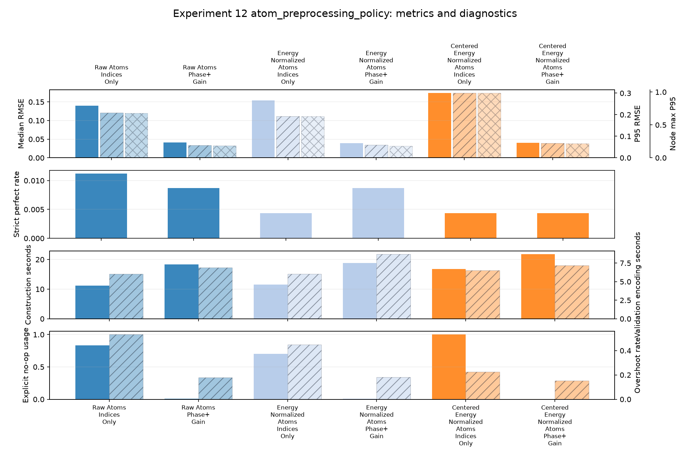

### Duplicate Suppression Policy

This family tests whether phase/scale-near-duplicate atoms should be removed during construction. The quality plot is essentially unchanged, while the diagnostic plot shows extra construction cost. Keep both only if Experiment 13 has room; otherwise this is a lower-priority axis.

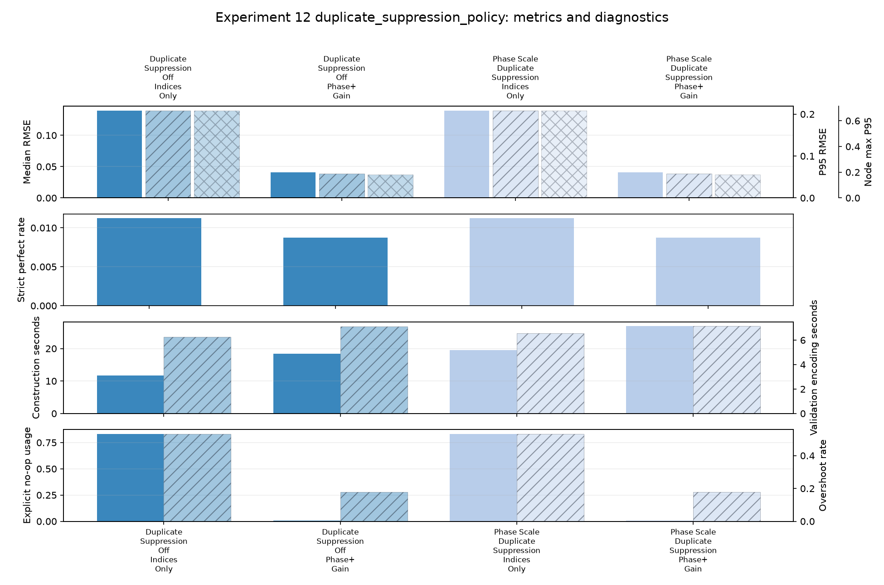

## Global Plot Notes

Lower is better for validation P95, validation median, max-point error, overshoot, and runtime. Higher is better for strict perfect-LFO rate.

### Validation P95 By Row

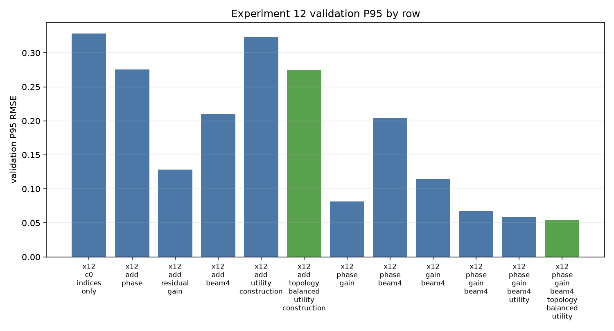

The x-axis is the screened row; the y-axis is validation P95 RMSE, where lower is better. The visible split is that most `PhaseAndResidualGain` rows sit far below their `IndicesOnly` partners. The best rows are mostly layer-normalization and balanced-construction variants, which supports carrying clipping and construction-policy candidates into Experiment 13.

### Validation Median By Row

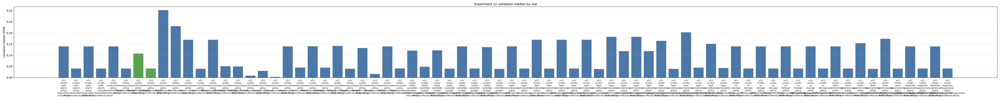

The x-axis is the screened row; the y-axis is validation median RMSE, where lower is better. The plot has a small cluster near zero plus a broader band of ordinary rows. `CommonCaseRepair` creates the clearest near-zero median bar, while finish-only and soft-clip rows remain visibly high. This is why median remains co-primary instead of being folded into P95.

### P95 Vs Model Prediction Head Budget

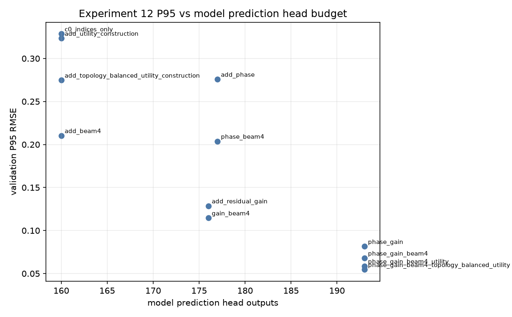

The x-axis is deployed model prediction head budget; the y-axis is validation P95 RMSE. The plot should be read as two vertical clusters, not as individual labels: `160`-head `IndicesOnly` rows and `193`-head `PhaseAndResidualGain` rows. Most of the best tail rows are in the `193`-head cluster, but the vertical spread inside each cluster proves that process and decoder policies matter even when head budget is fixed.

### Residual Gain Usage

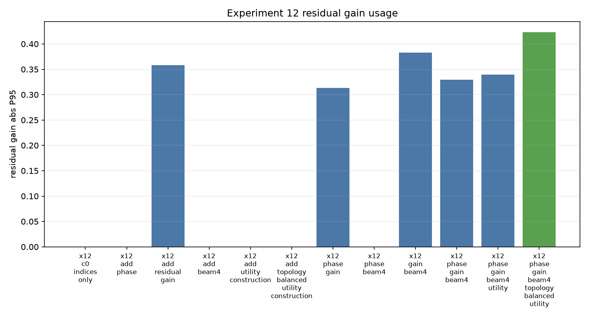

The x-axis is the screened row; the y-axis is residual-gain absolute P95. Higher is not automatically better here: it means the optimized residual scalar is being used more strongly. Most `PhaseAndResidualGain` rows form a moderate band, while a few construction/normalization rows spike close to the gain bounds. Those spikes are diagnostics for aggressive correction or overshoot compensation, not quality wins by themselves.

### Atom Usage

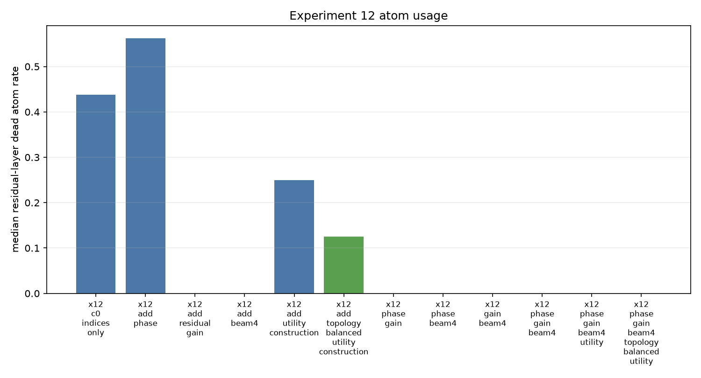

The x-axis is the screened row; the y-axis is median residual-layer dead-atom rate. Lower means more dictionary slots are used, but this is diagnostic rather than a direct objective. The tallest spikes line up with policies that collapse much of the residual ladder into no-op or unused active atoms, especially finish-heavy and soft/bounded normalization variants. That pattern helps explain why some policies look safe but do not repair the tail well.

### Runtime

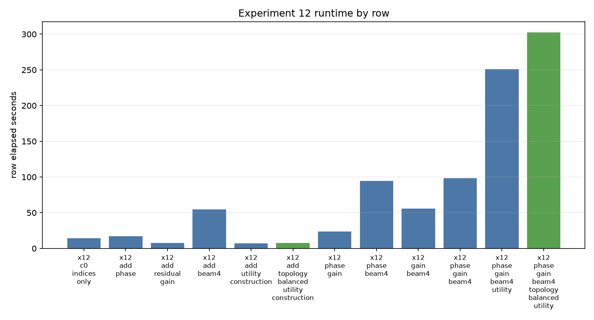

The x-axis is the screened row; the y-axis is row elapsed seconds, where lower is faster. Most rows sit in a broad middle band, but a few construction-heavy rows stand out as clear runtime outliers. This is oracle construction and encoding runtime on the current implementation, not deployed model runtime. It matters for experiment velocity and for sizing Experiment 13, but not for the model prediction head budget.

## Grouped Evidence Tables

Co-primary metrics: `validation_median_rmse`, `validation_strict_perfect_lfo_rate`, `validation_p95_rmse`, and `validation_node_max_error_p95`. The tables are grouped by screened variable. Both scalar contexts are shown side by side.

### `path_search_policy`

| Value | ScalarSchema | Median RMSE | Perfect Rate | P95 RMSE | Node Max P95 | Construct s | Encode s | NoOp Median | Effective NoOp | Overshoot Rate |
|---|---|---|---|---|---|---|---|---|---|---|
| `Beam4Path` | `IndicesOnly` | 0.1395 | 0.0112 | 0.2085 | 0.6795 | 27.4010 | 6.8874 | 0.8321 | n/a | 0.5318 |
| `Beam4Path` | `PhaseAndResidualGain` | 0.0409 | 0.0087 | 0.0580 | 0.1830 | 22.5015 | 6.0689 | 0.0087 | n/a | 0.1779 |
| `Beam8Path` | `IndicesOnly` | 0.1395 | 0.0156 | 0.1983 | 0.6562 | 12.0049 | 11.2460 | 0.8364 | n/a | 0.5188 |
| `Beam8Path` | `PhaseAndResidualGain` | 0.0406 | 0.0087 | 0.0567 | 0.1970 | 17.5831 | 11.8806 | 0.0087 | n/a | 0.1772 |

### `construction_policy`

| Value | ScalarSchema | Median RMSE | Perfect Rate | P95 RMSE | Node Max P95 | Construct s | Encode s | NoOp Median | Effective NoOp | Overshoot Rate |
|---|---|---|---|---|---|---|---|---|---|---|
| `BestOverallRepair` | `IndicesOnly` | 0.1395 | 0.0112 | 0.2085 | 0.6795 | 12.2199 | 5.7683 | 0.8321 | n/a | 0.5318 |
| `BestOverallRepair` | `PhaseAndResidualGain` | 0.0409 | 0.0087 | 0.0580 | 0.1830 | 17.7621 | 6.4351 | 0.0087 | n/a | 0.1779 |
| `CommonCaseRepair` | `IndicesOnly` | 0.0300 | 0.0243 | 0.1501 | 0.5000 | 14.0598 | 6.7463 | 0.5688 | n/a | 0.2599 |
| `CommonCaseRepair` | `PhaseAndResidualGain` | 0.0034 | 0.1651 | 0.1280 | 0.3891 | 19.5441 | 7.2809 | 0.0109 | n/a | 0.1297 |
| `HardCaseRepair` | `IndicesOnly` | 0.1395 | 0.0112 | 0.2080 | 0.6667 | 13.6633 | 6.6916 | 0.8140 | n/a | 0.5344 |
| `HardCaseRepair` | `PhaseAndResidualGain` | 0.0451 | 0.0087 | 0.0606 | 0.1837 | 19.2506 | 8.5541 | 0.0087 | n/a | 0.1790 |
| `FamilyBalancedRepair` | `IndicesOnly` | 0.1075 | 0.0150 | 0.1933 | 0.5984 | 13.0408 | 5.8906 | 0.7729 | n/a | 0.4346 |
| `FamilyBalancedRepair` | `PhaseAndResidualGain` | 0.0406 | 0.0044 | 0.0546 | 0.1684 | 18.2513 | 6.2020 | 0.0044 | n/a | 0.1701 |
| `ShapeClusterRepair` | `IndicesOnly` | 0.1421 | 0.0150 | 0.2095 | 0.6630 | 14.4564 | 6.7292 | 0.8081 | n/a | 0.5347 |
| `ShapeClusterRepair` | `PhaseAndResidualGain` | 0.0395 | 0.0087 | 0.0582 | 0.1846 | 20.0846 | 7.2252 | 0.0087 | n/a | 0.1761 |
| `FinishMoreLfos` | `IndicesOnly` | 0.3022 | 0.0044 | 0.4460 | 1.0000 | 13.1673 | 5.7439 | 1.0000 | n/a | 0.0000 |
| `FinishMoreLfos` | `PhaseAndResidualGain` | 0.2303 | 0.0044 | 0.4094 | 1.0000 | 18.5619 | 6.1920 | 1.0000 | n/a | 0.0000 |
| `FinishAndRepair` | `IndicesOnly` | 0.1696 | 0.0087 | 0.2747 | 1.0000 | 12.9944 | 5.7352 | 0.8813 | n/a | 0.4488 |
| `FinishAndRepair` | `PhaseAndResidualGain` | 0.0398 | 0.0087 | 0.0660 | 0.1994 | 18.1996 | 6.2228 | 0.0103 | n/a | 0.1712 |
| `AlternatingFinishRepair` | `IndicesOnly` | 0.1696 | 0.0087 | 0.2615 | 0.8333 | 12.9919 | 6.6810 | 0.9165 | n/a | 0.4654 |
| `AlternatingFinishRepair` | `PhaseAndResidualGain` | 0.0511 | 0.0087 | 0.0674 | 0.2530 | 19.5840 | 7.3052 | 0.0106 | n/a | 0.1664 |
| `FinishRepairRescue` | `IndicesOnly` | 0.0497 | 0.0081 | 0.1753 | 0.5980 | 13.8405 | 6.6473 | 0.6243 | n/a | 0.2902 |
| `FinishRepairRescue` | `PhaseAndResidualGain` | 0.0087 | 0.1277 | 0.0511 | 0.1500 | 19.1698 | 7.1602 | 0.0097 | n/a | 0.1405 |
| `MetricBalancedRepair` | `IndicesOnly` | 0.1401 | 0.0150 | 0.2136 | 0.6667 | 13.9641 | 6.8416 | 0.8399 | n/a | 0.5142 |
| `MetricBalancedRepair` | `PhaseAndResidualGain` | 0.0446 | 0.0087 | 0.0611 | 0.1868 | 19.6579 | 7.1354 | 0.0087 | n/a | 0.1750 |
| `TuneAtomsAfterUse` | `IndicesOnly` | 0.1324 | 0.0056 | 0.1783 | 0.5756 | 19.7019 | 5.8626 | 0.8006 | n/a | 0.4125 |
| `TuneAtomsAfterUse` | `PhaseAndResidualGain` | 0.0165 | 0.0044 | 0.0899 | 0.3051 | 25.3123 | 6.3464 | 0.0044 | n/a | 0.1426 |
| `PathAwareRepair` | `IndicesOnly` | 0.1395 | 0.0112 | 0.2085 | 0.6795 | 12.0938 | 5.9215 | 0.8321 | n/a | 0.5318 |
| `PathAwareRepair` | `PhaseAndResidualGain` | 0.0414 | 0.0087 | 0.0581 | 0.1810 | 18.0874 | 6.2295 | 0.0087 | n/a | 0.1748 |

### `utility_candidate_budget`

| Value | ScalarSchema | Median RMSE | Perfect Rate | P95 RMSE | Node Max P95 | Construct s | Encode s | NoOp Median | Effective NoOp | Overshoot Rate |
|---|---|---|---|---|---|---|---|---|---|---|
| `CandidateBudget8` | `IndicesOnly` | 0.1210 | 0.0187 | 0.2120 | 0.6667 | 11.6297 | 5.7086 | 0.8417 | n/a | 0.5839 |
| `CandidateBudget8` | `PhaseAndResidualGain` | 0.0484 | 0.0087 | 0.0619 | 0.2875 | 14.5487 | 6.1955 | 0.0087 | n/a | 0.1791 |
| `CandidateBudget12` | `IndicesOnly` | 0.1218 | 0.0143 | 0.2101 | 0.6659 | 11.6481 | 7.4297 | 0.7925 | n/a | 0.5756 |
| `CandidateBudget12` | `PhaseAndResidualGain` | 0.0402 | 0.0087 | 0.0624 | 0.1960 | 22.0455 | 8.3261 | 0.0087 | n/a | 0.1830 |
| `CandidateBudget24` | `IndicesOnly` | 0.1395 | 0.0112 | 0.2085 | 0.6795 | 17.3911 | 7.7125 | 0.8321 | n/a | 0.5318 |
| `CandidateBudget24` | `PhaseAndResidualGain` | 0.0409 | 0.0087 | 0.0580 | 0.1830 | 20.1140 | 6.7153 | 0.0087 | n/a | 0.1779 |
| `CandidateBudget48` | `IndicesOnly` | 0.1363 | 0.0187 | 0.2013 | 0.6190 | 14.1409 | 6.2079 | 0.8028 | n/a | 0.5354 |
| `CandidateBudget48` | `PhaseAndResidualGain` | 0.0390 | 0.0087 | 0.0561 | 0.1803 | 25.7701 | 6.6890 | 0.0087 | n/a | 0.1744 |

### `layer_normalization_policy`

| Value | ScalarSchema | Median RMSE | Perfect Rate | P95 RMSE | Node Max P95 | Construct s | Encode s | NoOp Median | Effective NoOp | Overshoot Rate |
|---|---|---|---|---|---|---|---|---|---|---|
| `FinalClipOnly` | `IndicesOnly` | 0.1395 | 0.0112 | 0.2085 | 0.6795 | 13.6648 | 6.2006 | 0.8321 | n/a | 0.5318 |
| `FinalClipOnly` | `PhaseAndResidualGain` | 0.0409 | 0.0087 | 0.0580 | 0.1830 | 19.6227 | 6.7517 | 0.0087 | n/a | 0.1779 |
| `LayerClip0To1` | `IndicesOnly` | 0.1696 | 0.0093 | 0.2158 | 0.8263 | 13.5272 | 6.2558 | 0.8997 | n/a | 0.0000 |
| `LayerClip0To1` | `PhaseAndResidualGain` | 0.0401 | 0.0087 | 0.0509 | 0.1641 | 19.5482 | 6.9451 | 0.0087 | n/a | 0.0000 |
| `LayerClipNeg0p1To1p1` | `IndicesOnly` | 0.1696 | 0.0100 | 0.2087 | 0.7668 | 13.6399 | 6.1366 | 0.8922 | n/a | 0.4580 |
| `LayerClipNeg0p1To1p1` | `PhaseAndResidualGain` | 0.0408 | 0.0087 | 0.0545 | 0.1795 | 18.9346 | 6.7073 | 0.0087 | n/a | 0.1595 |
| `LayerClipNeg1To1` | `IndicesOnly` | 0.1696 | 0.0100 | 0.2154 | 0.8046 | 13.8189 | 6.1555 | 0.8891 | n/a | 0.1517 |
| `LayerClipNeg1To1` | `PhaseAndResidualGain` | 0.0383 | 0.0087 | 0.0582 | 0.2821 | 19.0457 | 6.8430 | 0.0087 | n/a | 0.0578 |
| `LayerCenterPreserveClip` | `IndicesOnly` | 0.1647 | 0.0093 | 0.2126 | 0.7652 | 15.8999 | 6.8167 | 0.9069 | n/a | 0.0000 |
| `LayerCenterPreserveClip` | `PhaseAndResidualGain` | 0.0390 | 0.0087 | 0.0510 | 0.1563 | 21.2112 | 7.7517 | 0.0087 | n/a | 0.0000 |
| `LayerSoftClip0To1` | `IndicesOnly` | 0.1828 | 0.0044 | 0.2626 | 0.9820 | 13.7608 | 6.8298 | 0.9651 | n/a | 0.0000 |
| `LayerSoftClip0To1` | `PhaseAndResidualGain` | 0.1187 | 0.0044 | 0.1978 | 0.7510 | 19.3392 | 8.1602 | 0.9717 | n/a | 0.0000 |
| `LayerSoftClipNeg0p1To1p1` | `IndicesOnly` | 0.1828 | 0.0087 | 0.2558 | 0.9362 | 16.5611 | 7.4728 | 0.9530 | n/a | 0.4766 |
| `LayerSoftClipNeg0p1To1p1` | `PhaseAndResidualGain` | 0.1188 | 0.0087 | 0.2199 | 0.7676 | 21.5257 | 8.2844 | 0.9782 | n/a | 0.3528 |
| `OvershootPenaltyNoClip` | `IndicesOnly` | 0.2029 | 0.0056 | 0.2993 | 1.0000 | 15.6429 | 7.7986 | 0.9822 | n/a | 0.0552 |
| `OvershootPenaltyNoClip` | `PhaseAndResidualGain` | 0.0445 | 0.0087 | 0.0638 | 0.1974 | 22.0703 | 8.4366 | 0.0044 | n/a | 0.1133 |
| `BoundedResidualStep` | `IndicesOnly` | 0.1515 | 0.0056 | 0.3009 | 1.0000 | 16.3438 | 7.8585 | 0.7449 | n/a | 0.0000 |
| `BoundedResidualStep` | `PhaseAndResidualGain` | 0.0429 | 0.0087 | 0.1303 | 0.5158 | 21.8500 | 7.9036 | 0.1128 | n/a | 0.0001 |

### `no_damage_policy`

| Value | ScalarSchema | Median RMSE | Perfect Rate | P95 RMSE | Node Max P95 | Construct s | Encode s | NoOp Median | Effective NoOp | Overshoot Rate |
|---|---|---|---|---|---|---|---|---|---|---|
| `NoDamageOff` | `IndicesOnly` | 0.1395 | 0.0112 | 0.2085 | 0.6795 | 11.5192 | 6.3150 | 0.8321 | n/a | 0.5318 |
| `NoDamageOff` | `PhaseAndResidualGain` | 0.0409 | 0.0087 | 0.0580 | 0.1830 | 18.2375 | 6.9013 | 0.0087 | n/a | 0.1779 |
| `LateLayerNoDamage` | `IndicesOnly` | 0.1395 | 0.0112 | 0.2059 | 0.6845 | 11.8241 | 6.6501 | 0.8368 | n/a | 0.5277 |
| `LateLayerNoDamage` | `PhaseAndResidualGain` | 0.0409 | 0.0087 | 0.0580 | 0.1830 | 27.3323 | 7.0330 | 0.0087 | n/a | 0.1779 |
| `PerfectLocking` | `IndicesOnly` | 0.1395 | 0.0112 | 0.2085 | 0.6795 | 11.5147 | 6.1855 | 0.8321 | n/a | 0.5318 |
| `PerfectLocking` | `PhaseAndResidualGain` | 0.0409 | 0.0087 | 0.0580 | 0.1830 | 18.3230 | 6.7490 | 0.0087 | n/a | 0.1779 |
| `LateLayerNoDamageAndPerfectLocking` | `IndicesOnly` | 0.1395 | 0.0112 | 0.2059 | 0.6845 | 11.4345 | 6.1322 | 0.8368 | n/a | 0.5277 |
| `LateLayerNoDamageAndPerfectLocking` | `PhaseAndResidualGain` | 0.0409 | 0.0087 | 0.0580 | 0.1830 | 18.0694 | 6.9222 | 0.0087 | n/a | 0.1779 |

### `atom_preprocessing_policy`

| Value | ScalarSchema | Median RMSE | Perfect Rate | P95 RMSE | Node Max P95 | Construct s | Encode s | NoOp Median | Effective NoOp | Overshoot Rate |
|---|---|---|---|---|---|---|---|---|---|---|
| `RawAtoms` | `IndicesOnly` | 0.1395 | 0.0112 | 0.2085 | 0.6795 | 11.2318 | 6.0370 | 0.8321 | n/a | 0.5318 |
| `RawAtoms` | `PhaseAndResidualGain` | 0.0409 | 0.0087 | 0.0580 | 0.1830 | 18.2910 | 6.9124 | 0.0087 | n/a | 0.1779 |
| `EnergyNormalizedAtoms` | `IndicesOnly` | 0.1541 | 0.0044 | 0.1919 | 0.6319 | 11.6017 | 6.0565 | 0.7022 | n/a | 0.4493 |
| `EnergyNormalizedAtoms` | `PhaseAndResidualGain` | 0.0389 | 0.0087 | 0.0590 | 0.1804 | 18.8382 | 8.7149 | 0.0087 | n/a | 0.1827 |
| `CenteredEnergyNormalizedAtoms` | `IndicesOnly` | 0.1737 | 0.0044 | 0.3003 | 0.9839 | 16.8027 | 6.5017 | 1.0000 | n/a | 0.2250 |
| `CenteredEnergyNormalizedAtoms` | `PhaseAndResidualGain` | 0.0402 | 0.0044 | 0.0677 | 0.2147 | 21.8282 | 7.1741 | 0.0056 | n/a | 0.1531 |

### `duplicate_suppression_policy`

| Value | ScalarSchema | Median RMSE | Perfect Rate | P95 RMSE | Node Max P95 | Construct s | Encode s | NoOp Median | Effective NoOp | Overshoot Rate |
|---|---|---|---|---|---|---|---|---|---|---|
| `DuplicateSuppressionOff` | `IndicesOnly` | 0.1395 | 0.0112 | 0.2085 | 0.6795 | 11.7624 | 6.2696 | 0.8321 | n/a | 0.5318 |
| `DuplicateSuppressionOff` | `PhaseAndResidualGain` | 0.0409 | 0.0087 | 0.0580 | 0.1830 | 18.3394 | 7.1177 | 0.0087 | n/a | 0.1779 |
| `PhaseScaleDuplicateSuppression` | `IndicesOnly` | 0.1395 | 0.0112 | 0.2085 | 0.6795 | 19.5394 | 6.5678 | 0.8321 | n/a | 0.5318 |
| `PhaseScaleDuplicateSuppression` | `PhaseAndResidualGain` | 0.0409 | 0.0087 | 0.0580 | 0.1830 | 26.8901 | 7.1420 | 0.0087 | n/a | 0.1779 |


## Fixed Contract

| Variable | Fixed Value |
|---|---|
| `base_dictionary_size` | `32` |
| `residual_width` | `8` |
| `reserved_atom` | `NoOpAtom` |
| `active_atoms_per_layer` | `7` |
| `residual_depth` | `16` |
| `control_point_count` | `97` |
| `runtime_interface` | `FlatCategoricalPerResidualLayer` |
| `dictionary_scope` | `PerResidualLayer` |
| `runtime_topology` | `None` |

## Screening Variables

| Variable | Values |
|---|---|
| `path_search_policy` | `Beam4Path`, `Beam8Path` |
| `construction_policy` | `BestOverallRepair`, `FamilyBalancedRepair`, `FinishMoreLfos`, `FinishAndRepair`, `AlternatingFinishRepair`, `FinishRepairRescue`, `CommonCaseRepair`, `HardCaseRepair`, `MetricBalancedRepair`, `ShapeClusterRepair`, `TuneAtomsAfterUse`, `PathAwareRepair` |
| `utility_candidate_budget` | `CandidateBudget8`, `CandidateBudget12`, `CandidateBudget24`, `CandidateBudget48` |
| `layer_normalization_policy` | `FinalClipOnly`, `LayerClip0To1`, `LayerClipNeg0p1To1p1`, `LayerClipNeg1To1`, `LayerSoftClip0To1`, `LayerSoftClipNeg0p1To1p1`, `LayerCenterPreserveClip`, `OvershootPenaltyNoClip`, `BoundedResidualStep` |
| `no_damage_policy` | `NoDamageOff`, `LateLayerNoDamage`, `PerfectLocking`, `LateLayerNoDamageAndPerfectLocking` |
| `atom_preprocessing_policy` | `RawAtoms`, `EnergyNormalizedAtoms`, `CenteredEnergyNormalizedAtoms` |
| `duplicate_suppression_policy` | `DuplicateSuppressionOff`, `PhaseScaleDuplicateSuppression` |

## Method Notes

- `W=8` means eight atom choices per residual layer.
- `D=16` means sixteen residual layers.
- `control_point_count=97` is fixed decoder geometry.
- The indices-only baseline has `head_outputs = 32 + 16 * 8 = 160`.
- `PhaseAndResidualGain` has `head_outputs = 32 + 16 * 8 + 17 phase_scalars + 16 residual_gain_scalars = 193`.
- Every residual layer reserves `Atom0 = NoOpAtom`, leaving seven active repair atoms.
- PascalCase is used for variable values in reports and artifacts; variable field names remain implementation-friendly.
- Offline/oracle construction may use corpus residuals to build atoms. Deployed runtime still uses flat categorical per-residual-layer atom selection and does not receive topology or corpus metadata.
- Decoder/free policies such as layer clipping change reconstruction deterministically and add zero model prediction head outputs.

## Run And Artifact Notes

Full run command:

```powershell
conda run --no-capture-output -n py312 python .\research\experiments\lfo_representation\era2\code\experiment12_component_ladder.py --mkl-threading-layer SEQUENTIAL --native-threads 1 run --async --backend xpu --metadata .\datasets\presetshare\raw\presetshare_vital_metadata.csv --corpus-sample-fraction 1.0 --monitor-refresh-seconds 15
```

Regenerate this report from completed artifacts:

```powershell
conda run --no-capture-output -n py312 python .\research\experiments\lfo_representation\era2\code\experiment12_component_ladder.py --mkl-threading-layer SEQUENTIAL --native-threads 1 analyze --run-dir .\research\experiments\lfo_representation\era2\artifacts\experiment_12\component_ladder
```

- Completed rows in this report view: `72/72`.
- CSV artifacts live under `research/experiments/lfo_representation/era2/artifacts/experiment_12/component_ladder/`.
- Report images live under `C:\Users\angert\Documents\projects\OBRUXO\research\experiments\lfo_representation\era2\reports\images\experiment_12`.
- XPU acceleration was added for optimized phase/gain lattice alignment during the run work. Treat that as workflow/runtime context only; it is not a model-quality variable.

