# Experiment 13A: Complete Fixed-W8D16 Strategy Grid

> **13A complete · 90/90 rows.** This report is authoritative for the unfiltered `AllResiduals` strategy grid. The automatic epsilon selector did not pass, no epsilon is frozen, and Experiment 13B has not run; therefore this is not the final AllResiduals-versus-UnresolvedOnly report.

## Main Findings

Layer-wise clipping is the clearest global result. `LayerClip0To1` improves validation P95 RMSE in `45/45` matched pairs, with median delta `-0.0069147758` and range `-0.020405114` to `-0.00089984387`. It is a decoder-free constraint and changes no model prediction heads.
This complete 13A result fixes Experiment 13B at `LayerClip0To1`. The filtered phase retains every construction, schedule, and applicable candidate-budget cell while omitting the 45 losing `FinalClipOnly` counterparts, reducing 13B from 90 to 45 rows.

A larger repair shortlist is a secondary, mixed lever. `CandidateBudget48` improves `25/42`, worsens `13`, and ties `4` P95 comparisons; its median effect is only `-0.00043479912`. More offline search is not a guaranteed quality win.

`TwoPhase` improves `21/36` schedule pairs with median P95 delta `-0.0011320245`. The slight aggregate edge remains family-dependent, so schedule should remain an interaction rather than a universal default.

The quality frontier has three distinct jobs rather than one universal winner: `AllClusterMeans + LayerClip0To1` gives the lowest P95 RMSE; `DiverseCoverageHardRepairTwoPhase + CandidateBudget48 + LayerClip0To1` gives the best median RMSE and node-max P95; and the clipped `CommonCaseRepair + CandidateBudget24` anchor preserves the highest strict-perfect rate.

The automatic epsilon rule did not pass. All candidates satisfy the retired unexplained-energy limits, but the best early/middle median reconstructed fraction is only `2.054%`, below the required `5%`. The prescribed `0.001` versus `0.0025` restricted pilot is therefore required before 13B.

## Research Questions

This complete 13A analysis asks seven questions: which strategies occupy the four-objective quality frontier; whether validation behavior tracks training behavior; which policy effects survive matched controls; where those effects interact with construction family; how quickly residual layers and atom slots earn their capacity; what decoder and dictionary diagnostics explain failure modes; and how much offline work each strategy consumes under the fixed 193-head deployed contract.

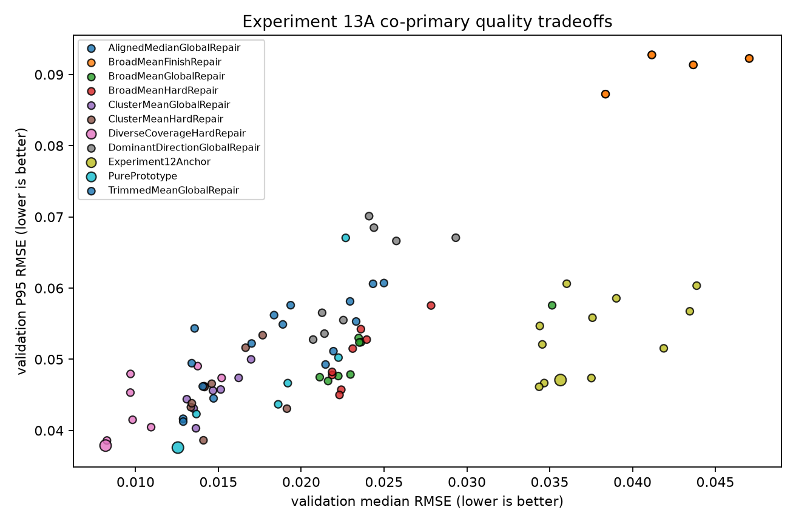

The x-axis is validation median RMSE and the y-axis is validation P95 RMSE; lower-left is better. Outlined points remain non-dominated after strict-perfect rate and node-max P95 are also considered. The plot is navigation across tradeoffs, not a scalar leaderboard.

## Four Co-Primary Validation Metrics

| Co-primary metric | Better | Best value | Strategy row |
| --- | --- | ---: | --- |
| Median RMSE | lower | 0.008189681 | `x13a_diverse_coverage_hard_repair_two_phase_candidate_budget48_layer_clip0_to1` |
| Strict-perfect LFO rate | higher | 1.246% | `x13a_common_case_repair_candidate_budget24_final_clip_only` |
| P95 RMSE | lower | 0.037600964 | `x13a_all_cluster_means_null_layer_clip0_to1` |
| Node-max error P95 | lower | 0.10100925 | `x13a_diverse_coverage_hard_repair_two_phase_candidate_budget48_layer_clip0_to1` |

| Pareto strategy | Median RMSE ↓ | Strict-perfect ↑ | P95 RMSE ↓ | Node-max P95 ↓ |
| --- | ---: | ---: | ---: | ---: |
| `x13a_all_cluster_means_null_layer_clip0_to1` | 0.012555717 | 0.810% | 0.037600964 | 0.11244357 |
| `x13a_diverse_coverage_hard_repair_two_phase_candidate_budget48_layer_clip0_to1` | 0.008189681 | 0.810% | 0.037883807 | 0.10100925 |
| `x13a_common_case_repair_candidate_budget24_layer_clip0_to1` | 0.035652492 | 1.246% | 0.047089189 | 0.14439343 |

Strict-perfect rate has only two observed values across the 90 rows. RMSE improvements therefore must not be described as automatically improving exact finishes at the fixed `1e-5` threshold.

### Strict-perfect threshold sensitivity

| Max-absolute tolerance | RMSE tolerance | Best validation strict-perfect rate | Median row rate | Distinct rates | Pareto rows |
| ---: | ---: | ---: | ---: | ---: | ---: |
| `1e-2` | `1e-03` | 34.330% | 0.872% | 6 | 4 |
| `1e-3` | `1e-04` | 9.844% | 0.872% | 4 | 2 |
| `1e-4` | `1e-05` | 1.246% | 0.810% | 2 | 3 |
| `1e-5` | `1e-06` | 1.246% | 0.810% | 2 | 3 |

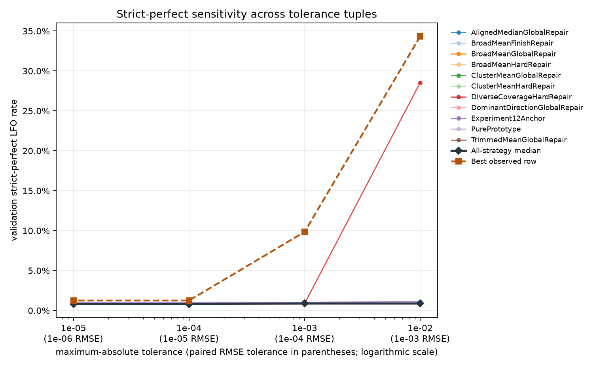

The tolerance parameter preserves the original two-condition definition: per-LFO RMSE must be at most one tenth of the selected tolerance and maximum absolute point error must be at most the selected tolerance. The interactive report recomputes the strict-perfect leader, four-objective Pareto membership, ranks, correlations, and matched strict-perfect deltas when the tolerance changes. Continuous RMSE and node-max metrics do not change.

### Metric agreement and disagreement

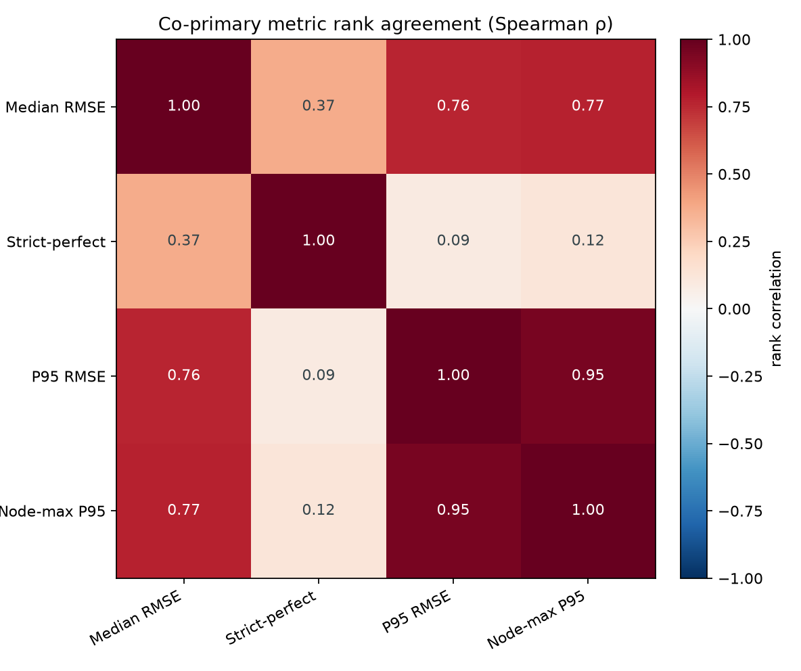

| Metric pair | Spearman ρ | Interpretation |
| --- | ---: | --- |
| Median RMSE vs Strict-perfect LFO rate | +0.372 | weak / distinct signal |
| Median RMSE vs P95 RMSE | +0.765 | partial agreement |
| Median RMSE vs Node-max error P95 | +0.766 | partial agreement |
| Strict-perfect LFO rate vs P95 RMSE | +0.091 | weak / distinct signal |
| Strict-perfect LFO rate vs Node-max error P95 | +0.123 | weak / distinct signal |
| P95 RMSE vs Node-max error P95 | +0.947 | strong agreement |

| High-disagreement strategy row | Family | Median rank | Strict-perfect rank | P95 rank | Node-max rank | Rank spread |
| --- | --- | ---: | ---: | ---: | ---: | ---: |
| `x13a_finish_repair_rescue_candidate_budget24_final_clip_only` | Experiment12Anchor | 88.0 | 3.5 | 74.0 | 73.0 | 84.5 |
| `x13a_family_balanced_repair_candidate_budget24_final_clip_only` | Experiment12Anchor | 85.0 | 3.5 | 68.0 | 68.0 | 81.5 |
| `x13a_finish_repair_rescue_candidate_budget24_layer_clip0_to1` | Experiment12Anchor | 84.0 | 3.5 | 48.0 | 63.0 | 80.5 |
| `x13a_common_case_repair_candidate_budget24_final_clip_only` | Experiment12Anchor | 81.0 | 3.5 | 73.0 | 65.0 | 77.5 |
| `x13a_family_balanced_repair_candidate_budget24_layer_clip0_to1` | Experiment12Anchor | 77.0 | 3.5 | 32.0 | 42.0 | 73.5 |
| `x13a_common_case_repair_candidate_budget24_layer_clip0_to1` | Experiment12Anchor | 75.0 | 3.5 | 31.0 | 34.0 | 71.5 |
| `x13a_trimmed_mean_global_repair_two_phase_candidate_budget24_final_clip_only` | TrimmedMeanGlobalRepair | 15.0 | 48.5 | 60.0 | 67.0 | 52.0 |
| `x13a_diverse_coverage_hard_repair_two_phase_candidate_budget48_layer_clip0_to1` | DiverseCoverageHardRepair | 1.0 | 48.5 | 2.0 | 1.0 | 47.5 |

Median RMSE, P95 RMSE, and node-max P95 share substantial ordering information, but they are not interchangeable. Strict-perfect rate is nearly orthogonal to the tail metrics because it is both thresholded and coarse: only two observed values split the grid. This is why the frontier retains all four objectives instead of reporting one synthetic score.

The rows with the largest rank spread are particularly useful audit cases: they are strong on one objective and weak on another. The generated `metric_rankings.csv` retains tied ranks, mean co-primary rank, and rank spread for every strategy.

## Train-to-Validation Stability

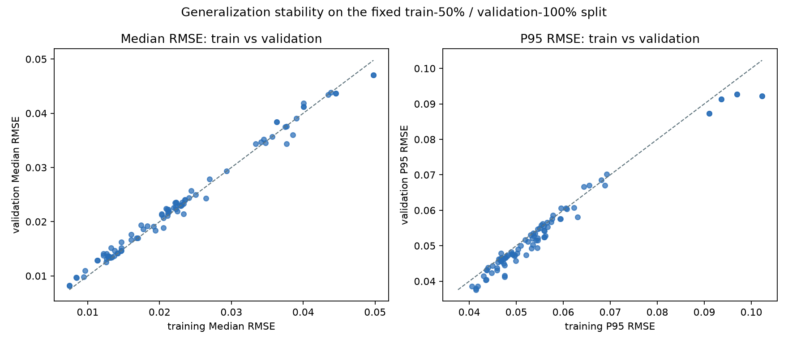

| Metric | Validation − training median gap | Range | Rows where validation is better |
| --- | ---: | ---: | ---: |
| Median RMSE | +0.000481585 | -0.00327621 to +0.00207933 | 14/90 |
| Strict-perfect rate | -0.694469 pp | -0.980312 to -0.544025 pp | 0/90 |
| P95 RMSE | -0.00143455 | -0.0100199 to +0.00225234 | 75/90 |
| Node-max P95 | -0.00463641 | -0.0236447 to +0.00950006 | 67/90 |

The train/validation relationship is stable but not a conventional overfitting story. Validation median RMSE is slightly higher on the median row, while validation P95 is often lower. The fixed 50% construction sample is therefore not simply an easier subset than validation. Strong train-P95 versus validation-P95 rank agreement supports using training construction diagnostics, but the non-zero gaps prohibit substituting training metrics for held-out quality.

## Matched Policy Effects

| Matched factor | Metric | Right wins / left wins / ties | Median right-minus-left delta |
| --- | --- | ---: | ---: |
| LayerClip0To1 vs FinalClipOnly | Median RMSE | 44 / 1 / 0 | -0.0025784886 |
| LayerClip0To1 vs FinalClipOnly | Strict-perfect LFO rate | 0 / 0 / 45 | +0.00000 pp |
| LayerClip0To1 vs FinalClipOnly | P95 RMSE | 45 / 0 / 0 | -0.0069147758 |
| LayerClip0To1 vs FinalClipOnly | Node-max error P95 | 45 / 0 / 0 | -0.030743808 |
| CandidateBudget48 vs CandidateBudget24 | Median RMSE | 30 / 8 / 4 | -0.00059053162 |
| CandidateBudget48 vs CandidateBudget24 | Strict-perfect LFO rate | 0 / 6 / 36 | +0.00000 pp |
| CandidateBudget48 vs CandidateBudget24 | P95 RMSE | 25 / 13 / 4 | -0.00043479912 |
| CandidateBudget48 vs CandidateBudget24 | Node-max error P95 | 26 / 12 / 4 | -0.0049522445 |
| TwoPhase vs Interleaved | Median RMSE | 32 / 4 / 0 | -0.0021913247 |
| TwoPhase vs Interleaved | Strict-perfect LFO rate | 0 / 0 / 36 | +0.00000 pp |
| TwoPhase vs Interleaved | P95 RMSE | 21 / 15 / 0 | -0.0011320245 |
| TwoPhase vs Interleaved | Node-max error P95 | 25 / 11 / 0 | -0.0075820833 |

Negative RMSE and node-max deltas favor the policy named before `vs`; positive strict-perfect deltas favor it. These matched comparisons isolate one design factor while holding the others fixed.

### Layer normalization

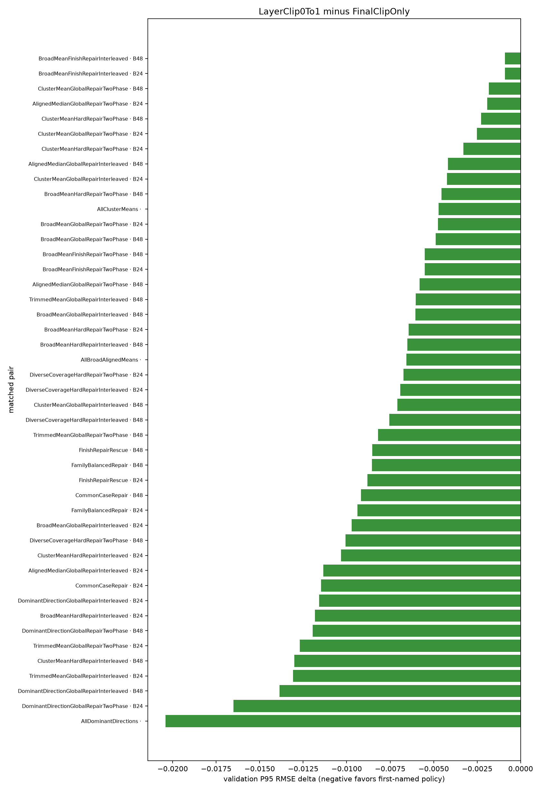

Every bar is below zero: clipping after each residual layer consistently prevents physical-range overshoot from accumulating into the validation tail.

### Candidate budget

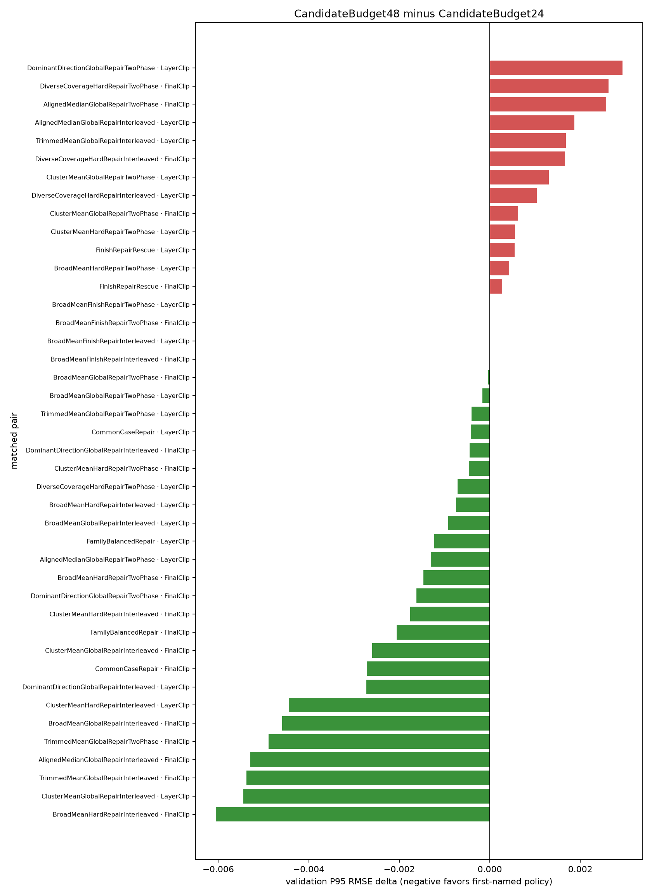

Bars fall on both sides of zero. CandidateBudget48 can find better observed repairs, but later slots and Beam4 encoding frequently compensate for the smaller shortlist.

### Layer schedule

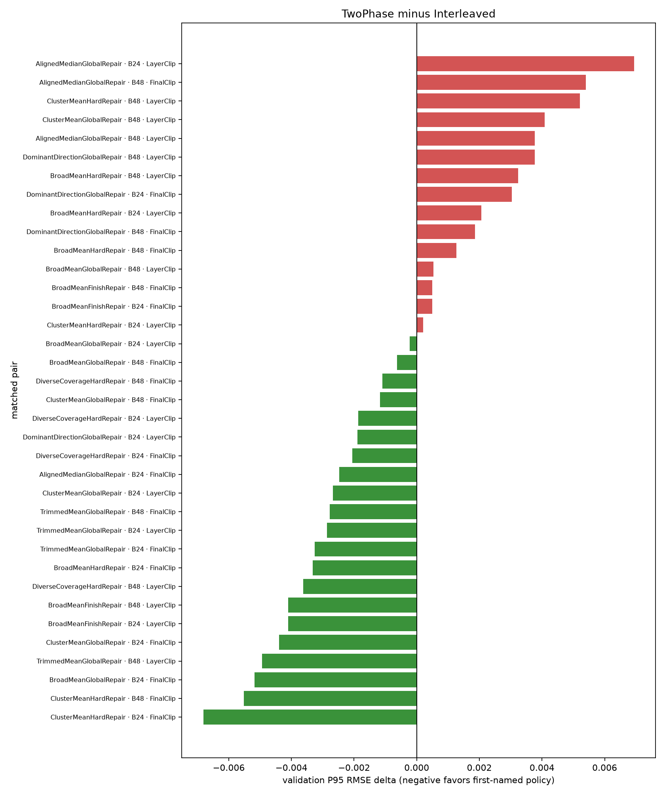

The signs remain mixed. TwoPhase works especially well for some diversity-aware and robust prototype families, while other families benefit from earlier repair interleaving.

### Factor interactions by construction family

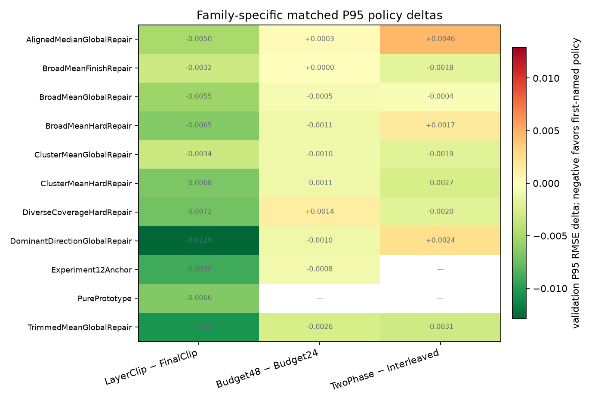

| Construction family | LayerClip − FinalClip | Budget48 − Budget24 | TwoPhase − Interleaved |
| --- | ---: | ---: | ---: |
| AlignedMedianGlobalRepair | -0.00499115 | +0.000281226 | +0.00458274 |
| BroadMeanFinishRepair | -0.00320326 | +0 | -0.00180343 |
| BroadMeanGlobalRepair | -0.00545869 | -0.000539724 | -0.000422481 |
| BroadMeanHardRepair | -0.00647518 | -0.0011046 | +0.00166562 |
| ClusterMeanGlobalRepair | -0.00337222 | -0.000987941 | -0.00191871 |
| ClusterMeanHardRepair | -0.00680745 | -0.00110843 | -0.00265561 |
| DiverseCoverageHardRepair | -0.00722719 | +0.00135231 | -0.00196148 |
| DominantDirectionGlobalRepair | -0.0129034 | -0.00103509 | +0.00244756 |
| Experiment12Anchor | -0.00898976 | -0.000823775 | — |
| PurePrototype | -0.00656247 | — | — |
| TrimmedMeanGlobalRepair | -0.0104462 | -0.00264358 | -0.0030618 |

Each cell is a within-family median of matched validation-P95 deltas. The normalization column is consistently negative, so clipping generalizes across construction mechanisms. Budget and schedule change sign by family. Aggregating those signs into one global winner would erase the main design interaction.

## Construction-Family Interpretation

Pure cluster prototypes are competitive at the tail: `AllClusterMeans + LayerClip0To1` is the P95 leader. The best median and node-max row instead combines diverse broad coverage with hard-tail repair, supporting a mechanism in which dissimilar population prototypes remove reusable structure before observed examples address the remaining difficult cases. The CommonCaseRepair anchor retains the strict-perfect lead, showing that finishing behavior is not captured by aggregate RMSE alone.

| Construction family | Rows | Median RMSE | Median P95 RMSE | Median node-max P95 | Best P95 row |
| --- | ---: | ---: | ---: | ---: | --- |
| AlignedMedianGlobalRepair | 8 | 0.022446662 | 0.055761877 | 0.17325836 | `x13a_aligned_median_global_repair_interleaved_candidate_budget24_layer_clip0_to1` |
| BroadMeanFinishRepair | 8 | 0.042417876 | 0.091810528 | 0.333869 | `x13a_broad_mean_finish_repair_two_phase_candidate_budget24_layer_clip0_to1` |
| BroadMeanGlobalRepair | 8 | 0.023221108 | 0.050120478 | 0.15693868 | `x13a_broad_mean_global_repair_interleaved_candidate_budget48_layer_clip0_to1` |
| BroadMeanHardRepair | 8 | 0.022763863 | 0.049870443 | 0.15861025 | `x13a_broad_mean_hard_repair_interleaved_candidate_budget48_layer_clip0_to1` |
| ClusterMeanGlobalRepair | 8 | 0.014407272 | 0.045683289 | 0.13539042 | `x13a_cluster_mean_global_repair_interleaved_candidate_budget48_layer_clip0_to1` |
| ClusterMeanHardRepair | 8 | 0.014380157 | 0.044974005 | 0.13437615 | `x13a_cluster_mean_hard_repair_interleaved_candidate_budget48_layer_clip0_to1` |
| DiverseCoverageHardRepair | 8 | 0.0097592035 | 0.043419212 | 0.12488288 | `x13a_diverse_coverage_hard_repair_two_phase_candidate_budget48_layer_clip0_to1` |
| DominantDirectionGlobalRepair | 8 | 0.023319611 | 0.061586564 | 0.20333387 | `x13a_dominant_direction_global_repair_interleaved_candidate_budget48_layer_clip0_to1` |
| Experiment12Anchor | 12 | 0.036774285 | 0.053392088 | 0.16432059 | `x13a_family_balanced_repair_candidate_budget48_layer_clip0_to1` |
| PurePrototype | 6 | 0.018899045 | 0.045169635 | 0.13519917 | `x13a_all_cluster_means_null_layer_clip0_to1` |
| TrimmedMeanGlobalRepair | 8 | 0.013810951 | 0.047824396 | 0.15417859 | `x13a_trimmed_mean_global_repair_two_phase_candidate_budget48_layer_clip0_to1` |

The ten lowest-P95 rows are:

1. `x13a_all_cluster_means_null_layer_clip0_to1` — P95 `0.037600964`, median `0.012555717`, strict-perfect `0.810%`, node-max P95 `0.11244357`.
2. `x13a_diverse_coverage_hard_repair_two_phase_candidate_budget48_layer_clip0_to1` — P95 `0.037883807`, median `0.008189681`, strict-perfect `0.810%`, node-max P95 `0.10100925`.
3. `x13a_diverse_coverage_hard_repair_two_phase_candidate_budget24_layer_clip0_to1` — P95 `0.038598217`, median `0.0082718218`, strict-perfect `0.810%`, node-max P95 `0.11814735`.
4. `x13a_cluster_mean_hard_repair_interleaved_candidate_budget48_layer_clip0_to1` — P95 `0.038626019`, median `0.014098603`, strict-perfect `0.810%`, node-max P95 `0.11522713`.
5. `x13a_cluster_mean_global_repair_interleaved_candidate_budget48_layer_clip0_to1` — P95 `0.040312462`, median `0.013645125`, strict-perfect `0.810%`, node-max P95 `0.11487934`.
6. `x13a_diverse_coverage_hard_repair_interleaved_candidate_budget24_layer_clip0_to1` — P95 `0.040468305`, median `0.010938331`, strict-perfect `0.810%`, node-max P95 `0.11869422`.
7. `x13a_trimmed_mean_global_repair_two_phase_candidate_budget48_layer_clip0_to1` — P95 `0.041253194`, median `0.012876331`, strict-perfect `0.810%`, node-max P95 `0.1255862`.
8. `x13a_diverse_coverage_hard_repair_interleaved_candidate_budget48_layer_clip0_to1` — P95 `0.041508205`, median `0.0098211784`, strict-perfect `0.810%`, node-max P95 `0.12005837`.
9. `x13a_trimmed_mean_global_repair_two_phase_candidate_budget24_layer_clip0_to1` — P95 `0.041652802`, median `0.012870583`, strict-perfect `0.810%`, node-max P95 `0.12339681`.
10. `x13a_all_cluster_means_null_final_clip_only` — P95 `0.042315565`, median `0.013672336`, strict-perfect `0.810%`, node-max P95 `0.13565724`.

## Partial-Codebook Progression

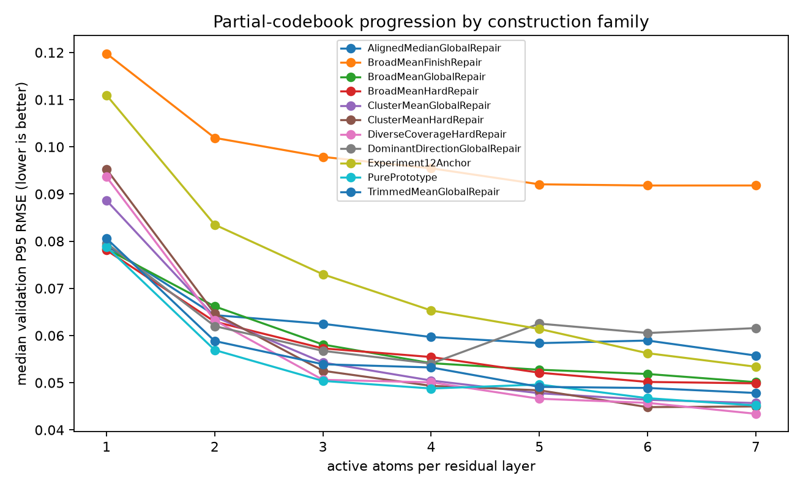

Move left to right as each residual layer gains another active atom; lower validation P95 is better. The early slope measures capacity efficiency, while late flattening shows diminishing returns. The first few atoms carry most of the quality gain, but family curves continue to separate through slot seven, so this fixed-W8 design does not support removing late slots without a separate head-budget experiment.

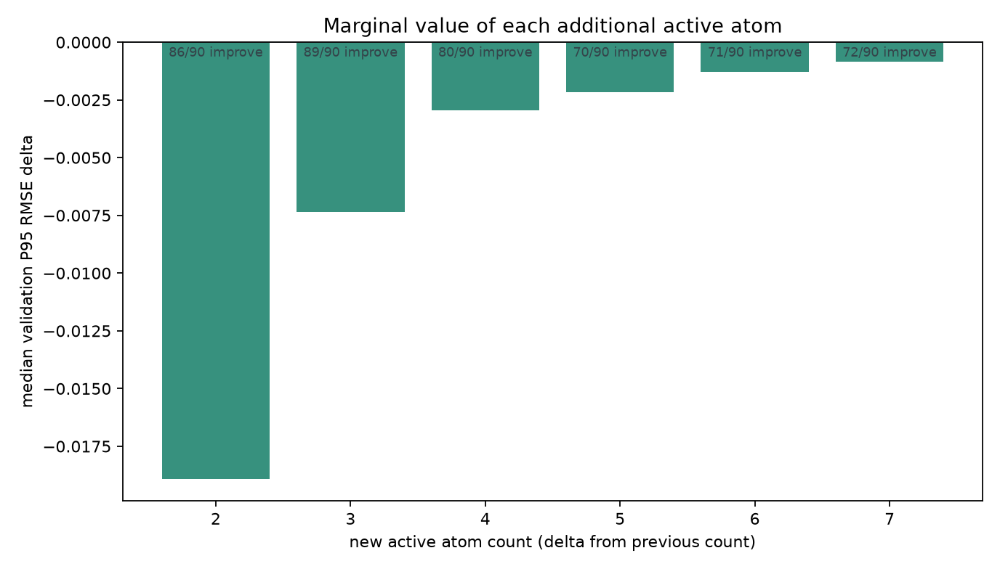

| Added active atom | Median validation P95 delta | Rows improved | Median validation median-RMSE delta |
| ---: | ---: | ---: | ---: |
| 2 | -0.018925648 | 86/90 | -0.013201891 |
| 3 | -0.007343933 | 89/90 | -0.0044388706 |
| 4 | -0.0029466916 | 80/90 | -0.0019048378 |
| 5 | -0.0021641478 | 70/90 | -0.00081035681 |
| 6 | -0.0012801718 | 71/90 | -0.00052270899 |
| 7 | -0.00083152018 | 72/90 | -0.00039379019 |

The second atom produces the largest typical improvement, and the next two still remove substantial tail error. Later atoms have smaller median gains but remain beneficial for most strategies: the seventh improves validation P95 in the majority of rows. Strict-perfect rate has a median marginal change of zero at every slot, another indication that thresholded finishes and continuous reconstruction quality answer different questions.

## Residual-Layer Learning Curve

| Residual layer completed | Median training P95 RMSE | Median layer-to-layer change |
| ---: | ---: | ---: |
| 1 | 0.27216336 | — |
| 2 | 0.2075095 | -0.064653866 |
| 3 | 0.177326 | -0.030183494 |
| 4 | 0.1557093 | -0.021616705 |
| 5 | 0.13595096 | -0.019758336 |
| 6 | 0.12292903 | -0.013021927 |
| 7 | 0.11149444 | -0.011434589 |
| 8 | 0.10264254 | -0.0088519044 |
| 9 | 0.094757929 | -0.0078846104 |
| 10 | 0.088168029 | -0.0065899007 |
| 11 | 0.082083289 | -0.0060847402 |
| 12 | 0.076838426 | -0.0052448623 |
| 13 | 0.07126873 | -0.0055696964 |
| 14 | 0.065620303 | -0.0056484267 |
| 15 | 0.061303694 | -0.0043166094 |
| 16 | 0.057216484 | -0.0040872097 |

This view follows the completed seven-atom codebook after every residual layer. Tail error falls monotonically from layer 1 through layer 16, with diminishing but still material reductions late in the stack. The result supports D16 for this experiment: it does not prove that every layer is cost-optimal, but it rules out the claim that the later layers are doing nothing.

## Decoder and Dictionary Diagnostics

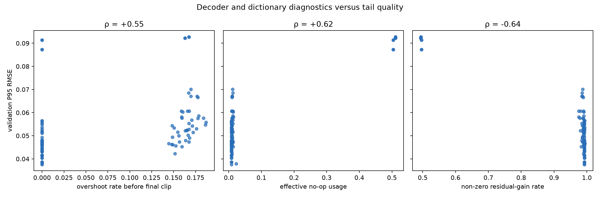

| Diagnostic | Spearman ρ with validation P95 | Reading |
| --- | ---: | --- |
| Training P95 RMSE | +0.974 | higher tracks worse tail quality |
| Validation node-max P95 | +0.947 | higher tracks worse tail quality |
| Validation median RMSE | +0.765 | higher tracks worse tail quality |
| Pre-final-clip overshoot rate | +0.553 | higher tracks worse tail quality |
| Effective no-op usage | +0.616 | higher tracks worse tail quality |
| Dead-atom rate | +0.505 | higher tracks worse tail quality |
| Non-zero residual-gain rate | -0.642 | higher tracks better tail quality |
| Duplicate-atom rate | +0.196 | higher tracks worse tail quality |
| Oracle construction time | -0.022 | higher tracks better tail quality |

Overshoot, effective no-op usage, and dead atoms all track worse tail quality, while frequent non-zero residual gains track better tail quality. These are associations across deliberately different strategy families, not isolated causal effects. The matched clipping result supplies the stronger causal design evidence for overshoot: LayerClip0To1 removes overshoot and improves every matched P95 pair.

| Construction family | Median slot P95 gain | Prototype convergence | Prototype iterations | Duplicate-alignment reuse | Candidate evaluations |
| --- | ---: | ---: | ---: | ---: | ---: |
| AlignedMedianGlobalRepair | 0.00023035333 | 0.0% | 8.0 | 2.7% | 2016 |
| BroadMeanFinishRepair | 0 | 0.0% | 8.0 | 50.9% | 2016 |
| BroadMeanGlobalRepair | 0.00035914406 | 0.0% | 8.0 | 0.9% | 2016 |
| BroadMeanHardRepair | 0.00034208223 | 0.0% | 8.0 | 0.9% | 2016 |
| ClusterMeanGlobalRepair | 0.00041214377 | 100.0% | 1.0 | 0.0% | 2016 |
| ClusterMeanHardRepair | 0.0003968291 | 100.0% | 1.0 | 0.0% | 2016 |
| DiverseCoverageHardRepair | 0.00038682111 | 100.0% | 1.0 | 0.0% | 2016 |
| DominantDirectionGlobalRepair | 0.00033923797 | 0.0% | 8.0 | 1.8% | 2016 |
| Experiment12Anchor | 0.00048267096 | — | — | 0.0% | 4032 |
| PurePrototype | 0.00033169426 | 0.0% | 8.0 | 0.9% | 0 |
| TrimmedMeanGlobalRepair | 0.00031697564 | 0.0% | 8.0 | 0.9% | 2016 |

Broad and repair atoms solve different problems. Synthesized prototypes seek reusable population structure; observed residuals perform concrete cleanup. Several iterative prototype builders reach their iteration cap rather than declaring convergence, while one-shot cluster/diversity builders are structurally different. Duplicate-alignment reuse is a small but non-zero signal of redundant atom proposals and is retained as an audit diagnostic rather than treated as a failure by itself.

## Eligibility Calibration and Gate Result

Completed-layer and slot quantiles show how the reconstruction-error threshold required to cover a fixed curve percentile falls as codebook construction proceeds. Coverage plots invert the question: higher reconstructed fraction means more training curves would be retired at a fixed epsilon.

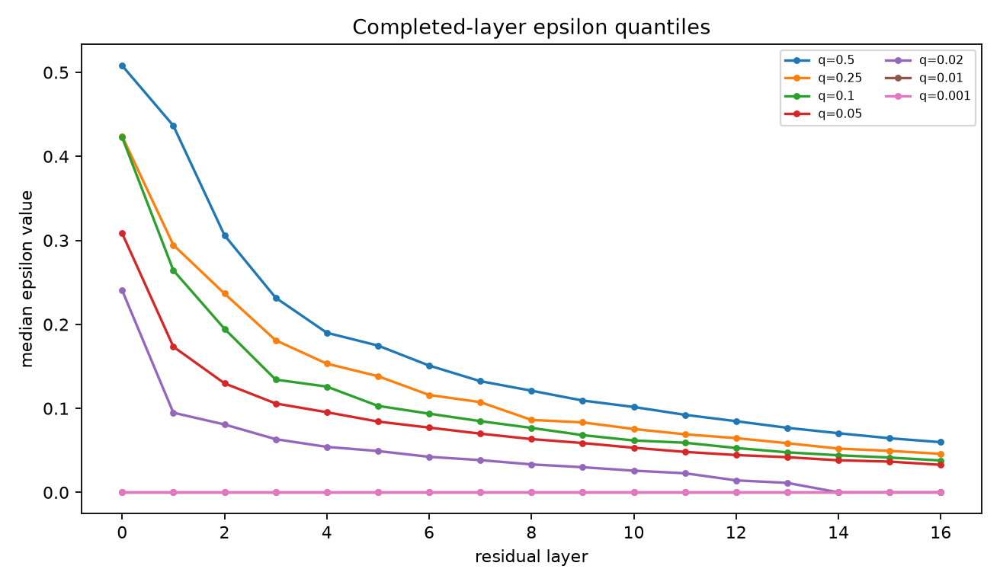

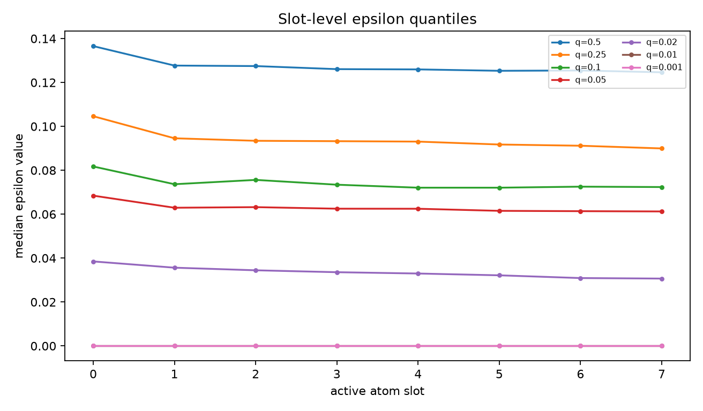

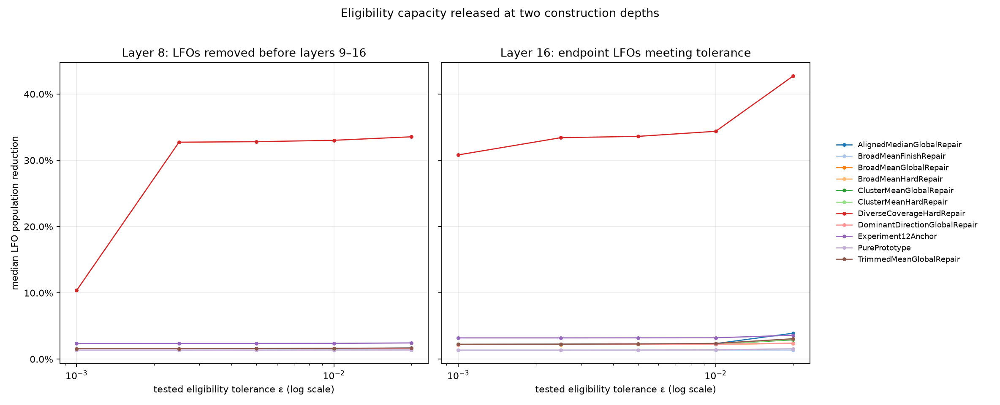

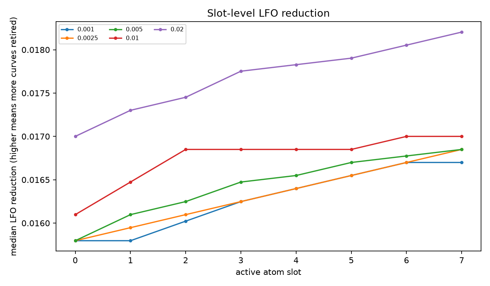

The retirement plots ask whether excluding more LFOs would abandon meaningful unexplained residual energy. The desired direction is lower-right: more LFOs retired with less unexplained energy. The energy safety criteria pass, but the coverage criterion does not, so these plots motivate the pilot rather than an epsilon override.

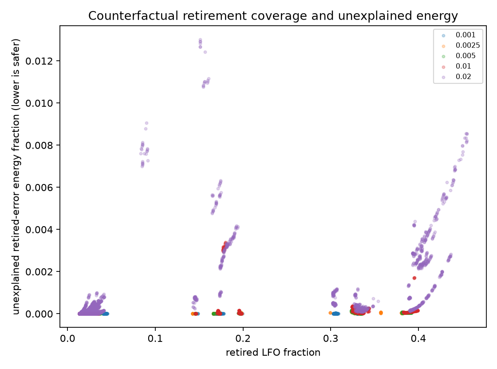

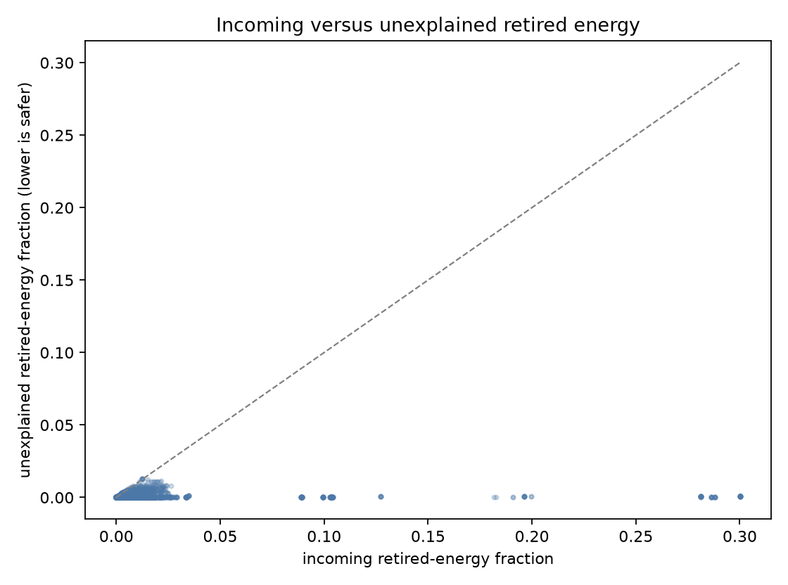

## Training-Data Scaling Ablation

The preserved full-training prefix supplies `39` matched rows with identical validation membership. It is a non-random execution-order prefix, so this is a bounded method-level ablation rather than a balanced estimate over all construction families.

| Co-primary metric | Median 50%-minus-100% delta | 50% better / 100% better / ties |
| --- | ---: | ---: |
| Median RMSE | +0.002360452 | 13 / 26 / 0 |
| Strict-perfect LFO rate | +0.37383178 pp | 33 / 6 / 0 |
| P95 RMSE | +0.0011711642 | 17 / 22 / 0 |
| Node-max error P95 | -0.0025390834 | 27 / 12 / 0 |

The 50%-training run has modestly worse median and P95 RMSE on the matched prefix, while strict-perfect rate and node-max P95 improve on most rows. This mixed direction argues against describing the sample reduction as uniformly harmful or uniformly beneficial. Runtime is excluded because the legacy fragment includes Modern Standby and a superseded execution implementation.

## Same-Run Runtime Diagnostics

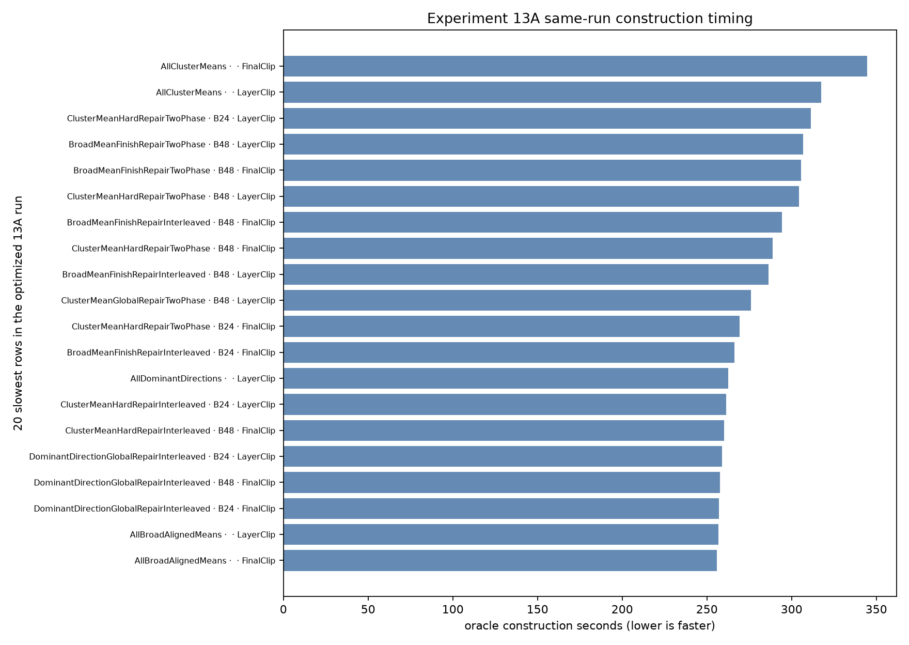

This chart compares rows only inside the optimized train-50% run. Median oracle construction time is `211.639` seconds and the maximum is `344.741` seconds. The scale is continuous because this run contains no host-sleep outliers. These timings support within-run cost comparisons only.

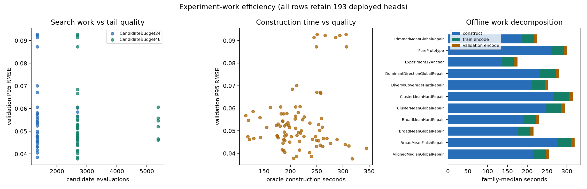

CandidateBudget48 exactly doubles deterministic repair-candidate evaluation relative to CandidateBudget24 wherever repair search applies, yet its median quality gain is small and the sign is mixed. Oracle construction time has essentially no monotonic relationship with validation P95, so spending longer is not evidence of a better dictionary. The timing decomposition separates construction, training encoding, and validation encoding; all three are offline experiment costs. Every row still emits the same 193 deployed prediction heads, so none of these charts is an inference-latency comparison.

## Practical Takeaways

- Lock Experiment 13B to the 45 `LayerClip0To1` counterparts; do not rerun `FinalClipOnly`.
- Carry all three Pareto strategies into the 13B interpretation; no scalar winner represents all four quality objectives.
- Treat CandidateBudget48 and TwoPhase as interaction-dependent choices, not unconditional defaults.
- Preserve all seven active atoms and all 16 residual layers for 13B; 13A shows diminishing returns, not dead capacity.
- Use overshoot, no-op, gain-use, duplicate, and convergence diagnostics to explain results, not to replace matched quality evidence.
- Run the prescribed restricted epsilon pilot before any full Experiment 13B launch.
- Do not compare legacy and optimized wall-clock timings or claim a general 50%-training scaling law from the 39-row prefix.

## Method Notes and Generated Artifacts

The completed source run is `../artifacts/experiment_13/strategy_grid_train50_val100_exactopt_v1` relative to this report. The scaling baseline is `../artifacts/experiment_13/strategy_grid_train100_val100_interrupted_39rows_20260716`. Derived analysis tables, report images, and the interactive payload are written outside both source runs.

The audit artifacts now include `strategy_diagnostics.csv`, `metric_rankings.csv`, `factor_interaction_summary.csv`, `marginal_atom_value.csv`, `residual_layer_progression.csv`, and `construction_mechanism_diagnostics.csv` in addition to the original coverage, frontier, matched-effect, partial-codebook, and calibration tables.

All rows preserve W8D16, 32 base choices, one no-op plus seven active atoms per residual layer, 97 control points, PhaseAndResidualGain scalars, Beam4 encoding, and 193 model prediction outputs. Codebook construction is offline/oracle work; topology is not a deployed runtime input.

### Audit boundaries

This report does not claim an eligibility benefit, a selected epsilon, a complete Experiment 13 winner, deployed runtime differences, or a general training-data scaling law. It reports complete 13A AllResiduals evidence, a bounded 39-row scaling ablation, and same-run offline timing diagnostics. Those boundaries mirror the more forensic reporting standard used in Experiments 8–12.
