# Experiment 13: Provisional Fixed-W8D16 Strategy-Grid Report

> **Provisional evidence only.** This report covers a non-random execution-order prefix of `39/90` Experiment 13A rows from an interrupted legacy full-training run. Experiment 13A did not complete, no eligibility epsilon has been selected, and Experiment 13B has not run.

## Main Findings

Within the covered rows, layer-wise clipping is the clearest repeatable effect. `LayerClip0To1` improves validation P95 RMSE in `19/19` matched pairs; the median right-minus-left change is `-0.0070837811` (range `-0.015529744` to `-0.0033567026`). Lower is better, so every available matched normalization comparison favors clipping.

Increasing the offline candidate shortlist from 24 to 48 has a smaller and inconsistent effect. `CandidateBudget48` improves `12/19` matched pairs, with median validation-P95 change `-0.0011559017` (range `-0.0093696564` to `0.0012622103`). This does not support treating the larger shortlist as an automatic quality win.

Schedule choice is unresolved in this fragment. `TwoPhase` improves `6/12` matched pairs and worsens the others; its median validation-P95 change versus `Interleaved` is `0.00047237426`. The covered policies therefore provide no global schedule winner.

The lowest observed validation P95 RMSE is `0.040208414` from `x13a_broad_mean_global_repair_interleaved_candidate_budget48_layer_clip0_to1`. It is only the best observed row in this prefix: absent and partially covered families prevent a full-grid ranking.

There are `5` provisional Pareto candidates across validation median RMSE, strict-perfect rate, P95 RMSE, and node-max P95. They are retained as tradeoffs rather than collapsed into one scalar score.

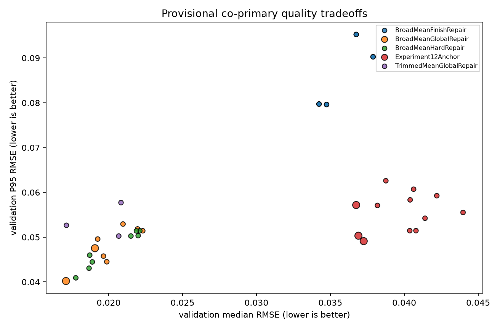

The scatter's x-axis is validation median RMSE and its y-axis is validation P95 RMSE; lower-left is better on both. Color identifies the covered construction family. Larger black-outlined points are provisional Pareto candidates after also accounting for strict-perfect rate and node-max P95, so no single point is declared the automatic winner.

## Why These Patterns Appear

`LayerClip0To1` applies a decoder-free physical range constraint after every residual layer. In the covered rows it consistently suppresses accumulated overshoot, so its P95 benefit is both larger and more stable than the changes caused by shortlist size or layer schedule.

The candidate budget changes how many observed residual candidates the offline constructor scores; it does not add model prediction heads. A larger shortlist can find a stronger repair atom, but later atoms and Beam4 encoding can compensate for an earlier local choice. That makes the effect non-monotonic and usually much smaller than clipping.

`Interleaved` and `TwoPhase` reorder broad and repair residual layers without changing W8D16 or the deployed runtime interface. Their split result is consistent with an interaction: alternating repair can help some objectives, while reserving repair for later residuals can help others.

## Plot Notes

### Matched Normalization Effect

Each bar is one matched construction policy and candidate budget. The x-axis is `LayerClip0To1` minus `FinalClipOnly` validation P95 RMSE; negative is better for layer clipping. Every bar lies below zero, supporting layer-wise clipping inside the covered strategy families.

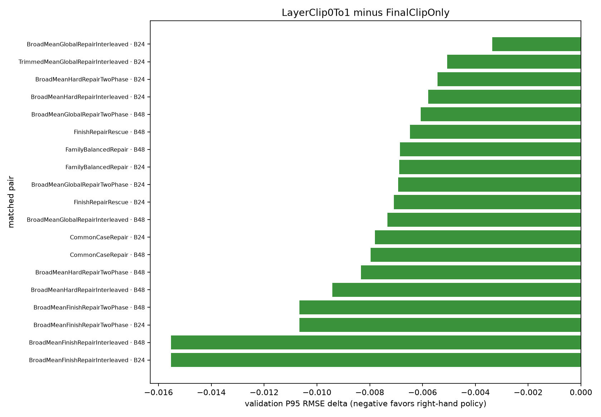

### Matched Candidate-Budget Effect

Each bar is one matched policy and normalization. The x-axis is CandidateBudget48 minus CandidateBudget24 validation P95 RMSE; negative favors 48. Bars fall on both sides of zero, showing that the extra offline search is not reliably converted into validation quality.

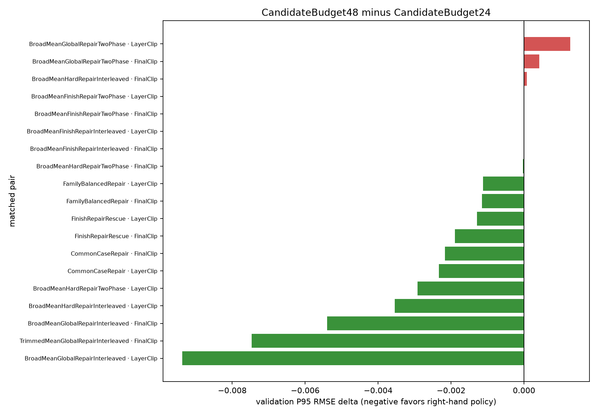

### Matched Schedule Effect

Each bar is one matched construction family, budget, and normalization. The x-axis is TwoPhase minus Interleaved validation P95 RMSE; negative favors TwoPhase. The balanced signs and near-zero median mean schedule should remain an interaction term, not a global default, until the grid is complete.

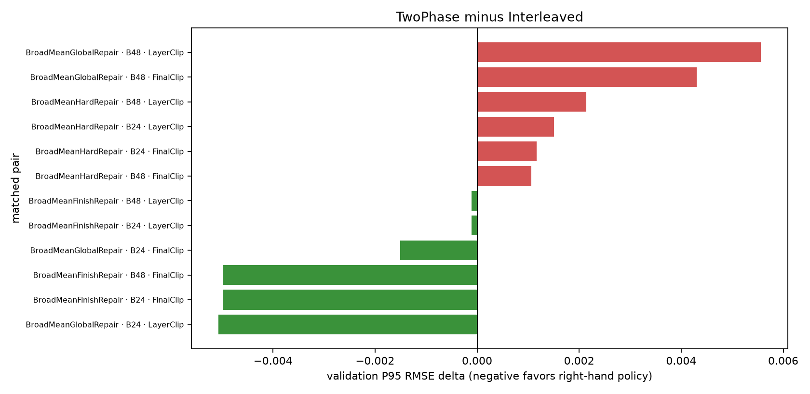

### Partial-Codebook Progression

The x-axis is the number of active atoms retained per residual layer and the y-axis is family-median validation P95 RMSE, where lower is better. Every covered family improves sharply from one to two active atoms, then shows diminishing returns; BroadMeanGlobalRepair and BroadMeanHardRepair form the lowest curves, while BroadMeanFinishRepair plateaus highest. This suggests the first few codebook choices carry most of the quality, but it is descriptive only for the families present in the fragment.

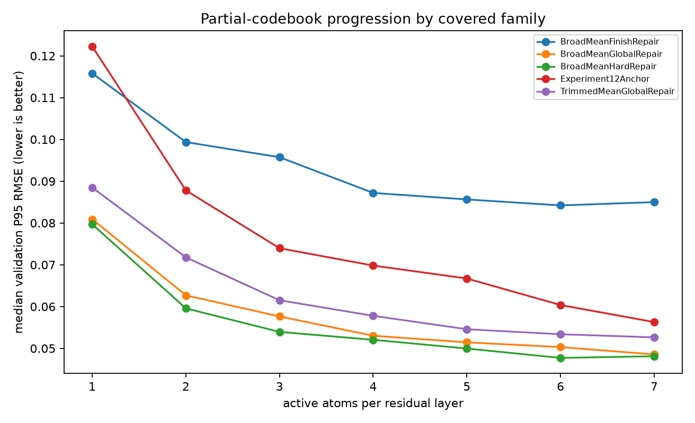

### Historical Oracle Runtime

Lower is faster. The x-axis is legacy oracle construction time on a logarithmic scale and the y-axis ranks the completed rows. The two largest observations are `41678.422` and `10435.226` seconds. These measurements include the superseded implementation and Modern Standby effects, so they diagnose the aborted run but must not be compared with optimized-run timing.

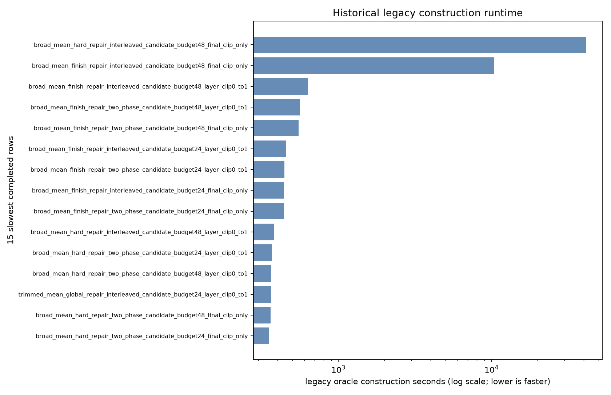

## Provisional Experiment 13A Calibration

These plots summarize counterfactual epsilon behavior for the 39 completed unfiltered rows. They do not satisfy the deterministic selection rule, which requires all 90 Experiment 13A rows. No curve or apparent elbow in this section is an epsilon decision.

The completed-layer and slot quantile plots show the epsilon needed to cover different fractions of curves as construction progresses. Lower values mean the partial reconstruction is closer. Completed-layer quantiles fall quickly in the first few residual layers and then flatten, showing large early gains followed by diminishing returns. The coverage plots invert that view: higher reconstructed fraction means more training curves are already below a fixed candidate epsilon. Even the largest candidate reaches only a small median fraction in this prefix, so these curves do not justify freezing a threshold.

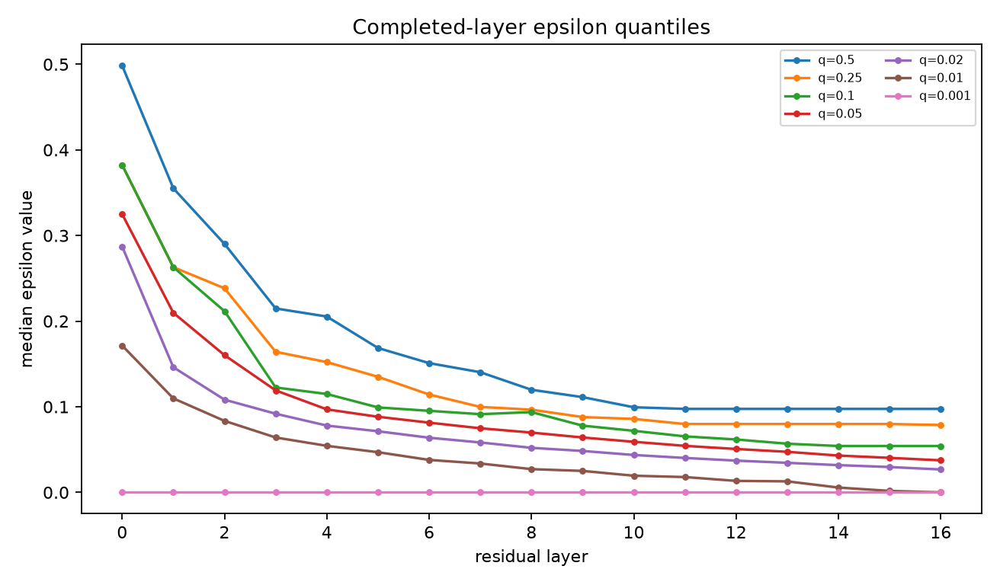

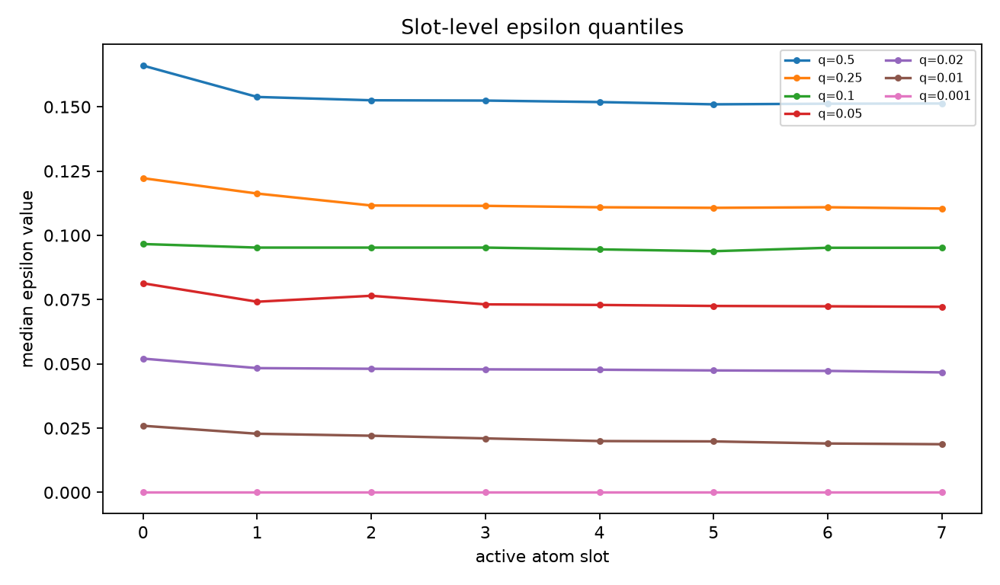

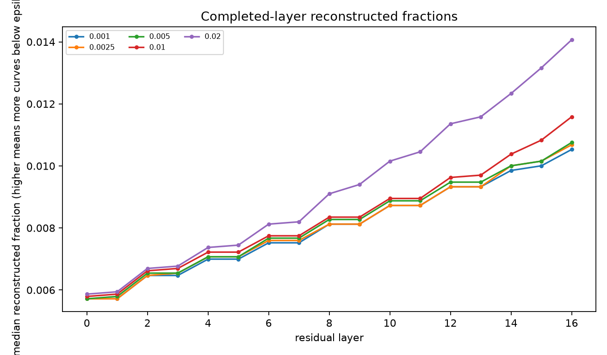

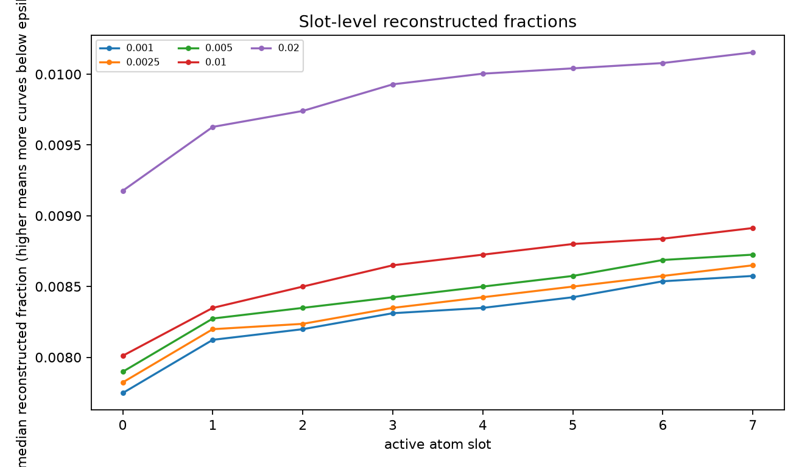

The retirement scatter compares how many LFOs would be excluded with how much unexplained residual energy those LFOs still carry. Lower unexplained energy is safer. The larger candidate epsilons extend both retirement coverage and the upper tail of unexplained energy, exposing the intended safety-versus-work tradeoff. The final plot separates incoming retired energy from unexplained retired energy; points below the diagonal indicate that the current partial codebook already explains some of the energy that would be retired.

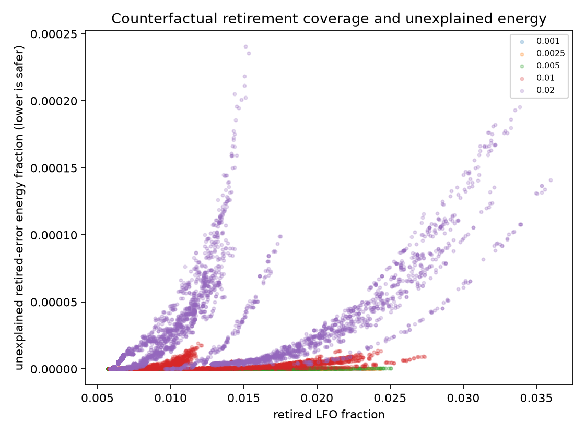

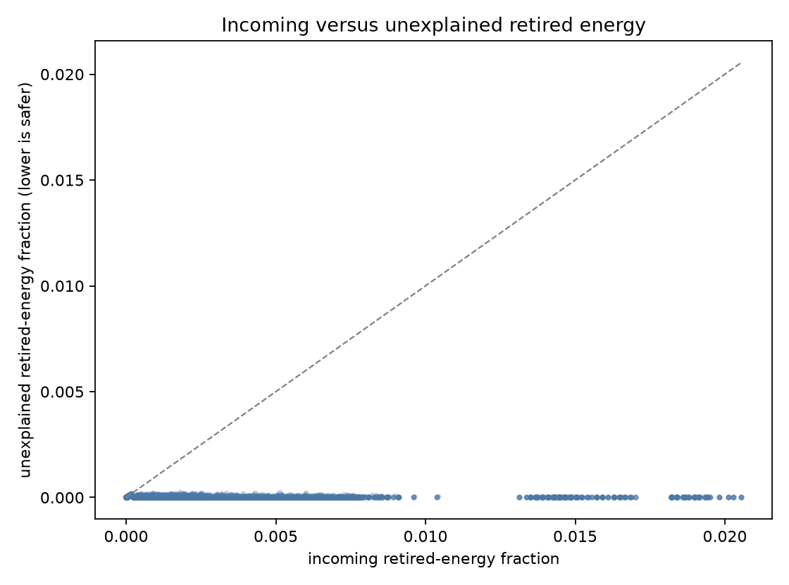

## Source Coverage

Zero completed rows are available for these planned construction families: `AlignedMedianGlobalRepair`, `ClusterMeanGlobalRepair`, `ClusterMeanHardRepair`, `DiverseCoverageHardRepair`, `DominantDirectionGlobalRepair`, `PurePrototype`.

These represented families are still incomplete: `TrimmedMeanGlobalRepair` (3/8).

The five lowest observed validation-P95 rows are:

1. `x13a_broad_mean_global_repair_interleaved_candidate_budget48_layer_clip0_to1` — P95 `0.040208414`, median `0.01711541`, strict-perfect `0.0043613707`, node-max P95 `0.12179944`.
2. `x13a_broad_mean_hard_repair_interleaved_candidate_budget48_layer_clip0_to1` — P95 `0.040924542`, median `0.017780783`, strict-perfect `0.0043613707`, node-max P95 `0.13109203`.
3. `x13a_broad_mean_hard_repair_two_phase_candidate_budget48_layer_clip0_to1` — P95 `0.043067619`, median `0.018676387`, strict-perfect `0.0043613707`, node-max P95 `0.13346419`.
4. `x13a_broad_mean_hard_repair_interleaved_candidate_budget24_layer_clip0_to1` — P95 `0.044474032`, median `0.018897872`, strict-perfect `0.0043613707`, node-max P95 `0.12851933`.
5. `x13a_broad_mean_global_repair_two_phase_candidate_budget24_layer_clip0_to1` — P95 `0.044507936`, median `0.019876968`, strict-perfect `0.0043613707`, node-max P95 `0.13855973`.

## Practical Takeaways

- Keep `LayerClip0To1` as the strongest provisional decoder-free policy candidate.
- Keep both candidate budgets until complete-grid interactions are available; 48 is not a universal improvement.
- Do not choose a global layer schedule from the fragment.
- Do not select the Experiment 13B eligibility epsilon from these incomplete calibration artifacts.
- Do not use legacy runtime to estimate the optimized run or the 50%-training scaling ablation.

## Method Notes and Generated Artifacts

The immutable source is `../artifacts/experiment_13/strategy_grid_train100_val100_interrupted_39rows_20260716` relative to this report. The report reads completed row shards and writes all derived CSVs outside that archive. `completed_row_coverage.csv` records the exact planned cells present or absent; `co_primary_metrics.csv` retains detailed metrics and Pareto membership; `matched_factor_deltas.csv` contains every matched comparison; and `partial_codebook_progression.csv` retains the one-through-seven-atom results.

All results use the fixed W8D16 runtime contract: 32 base choices, eight residual-layer atom choices across 16 residual layers, PhaseAndResidualGain scalars, Beam4 encoding, and 193 model prediction outputs. Codebook construction is offline/oracle work; topology is not a deployed runtime input.
