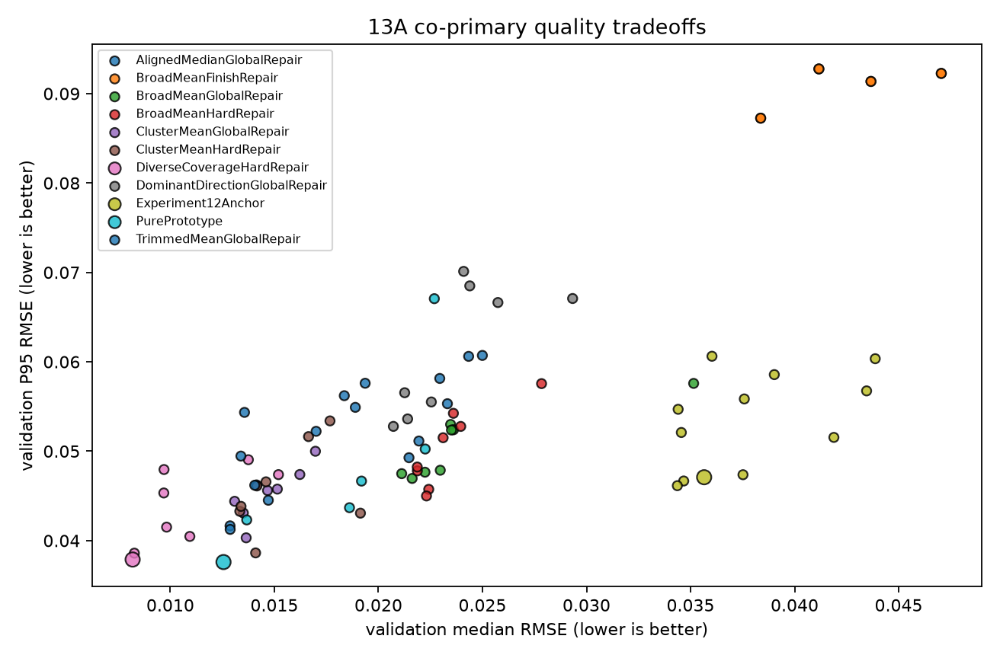
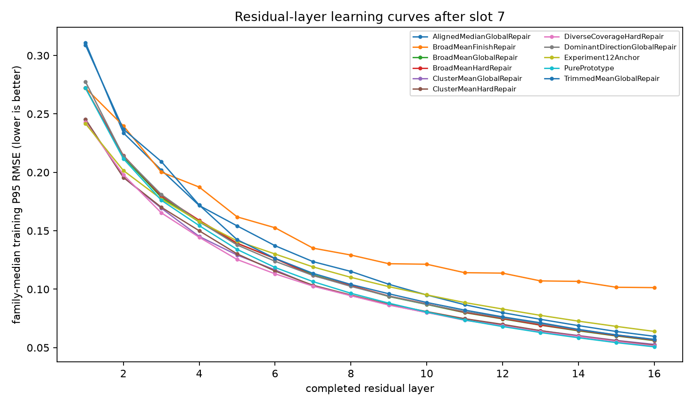
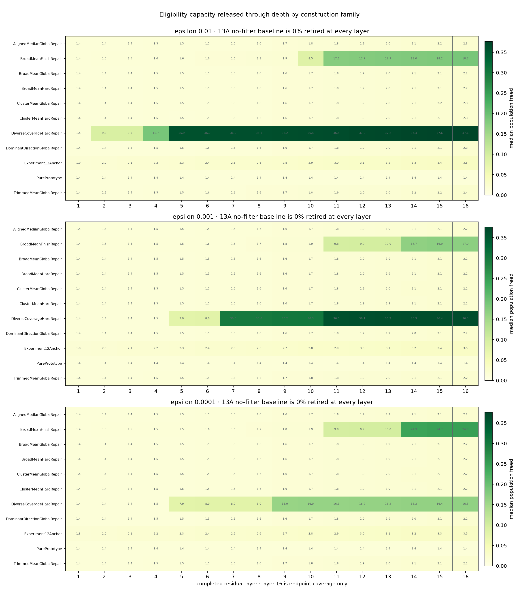
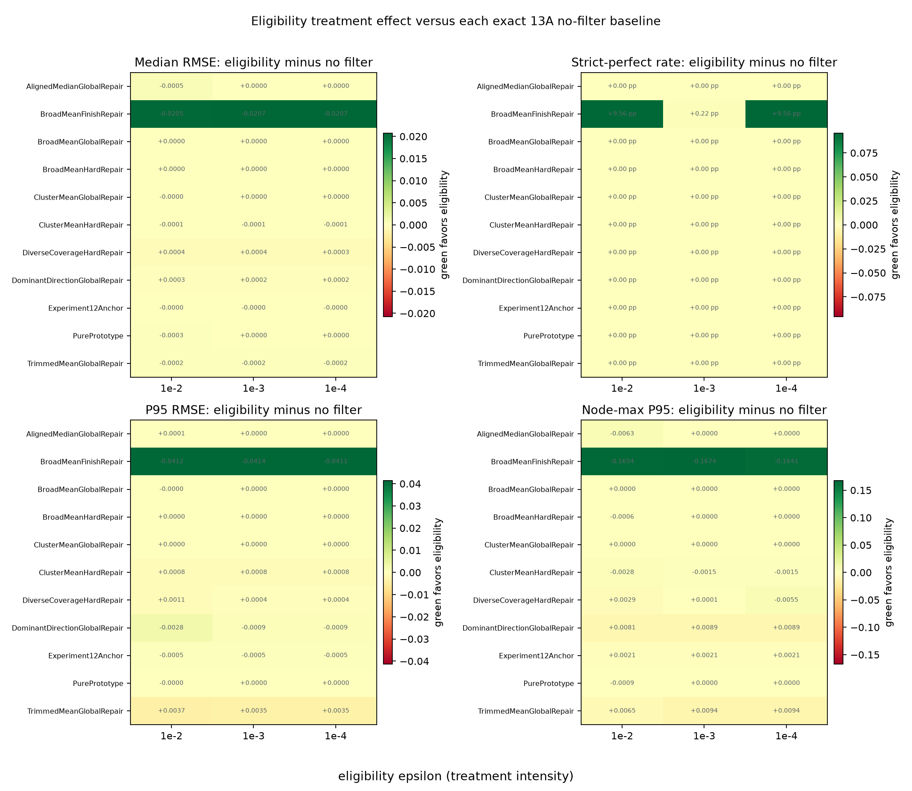
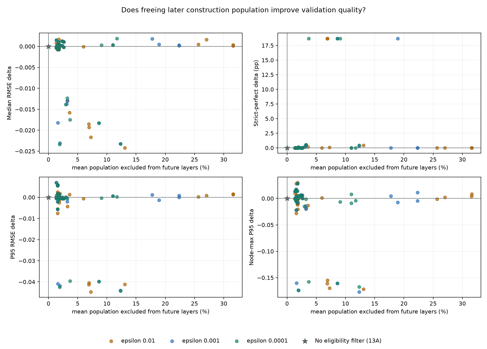
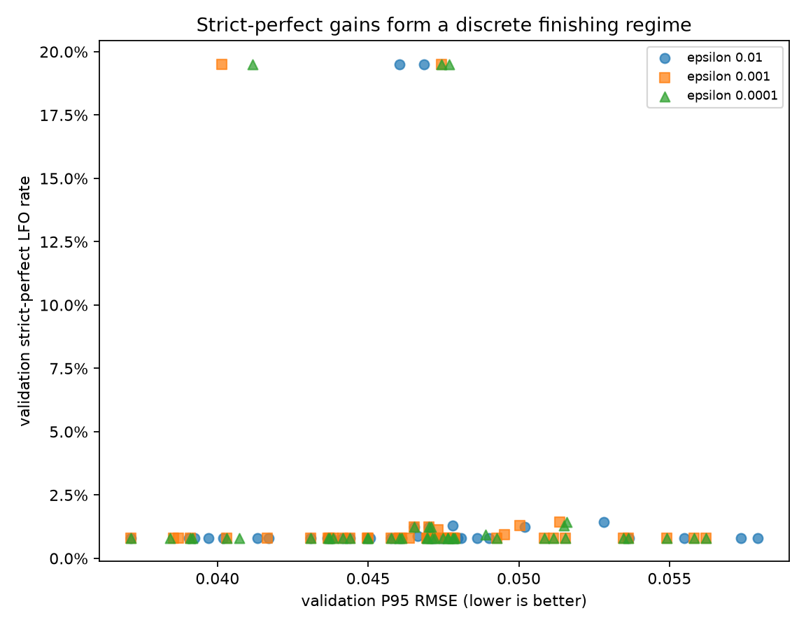
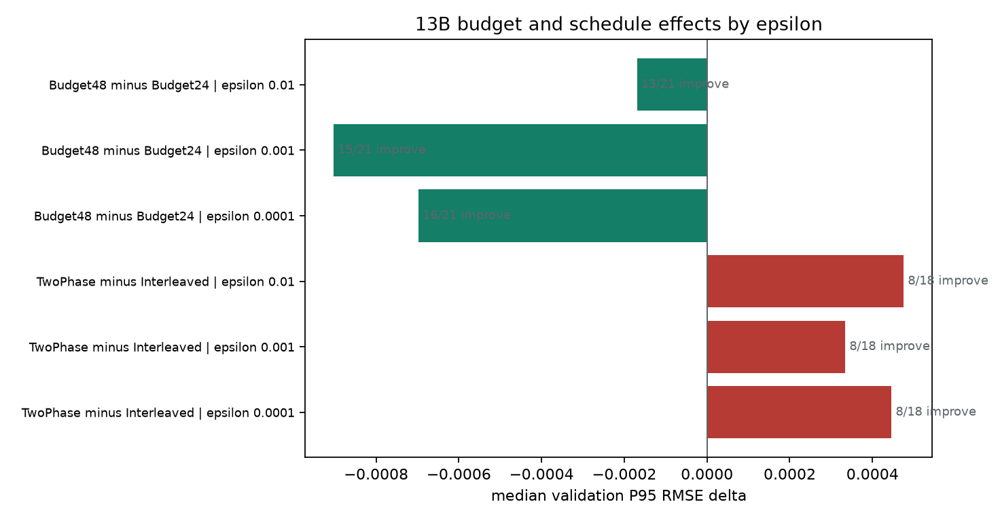
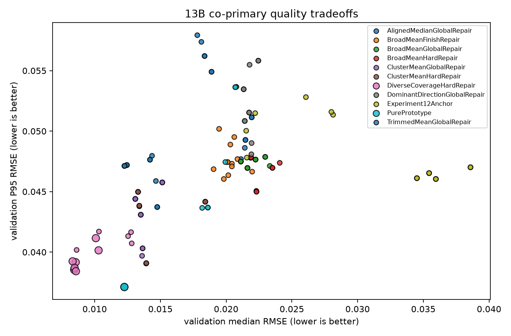
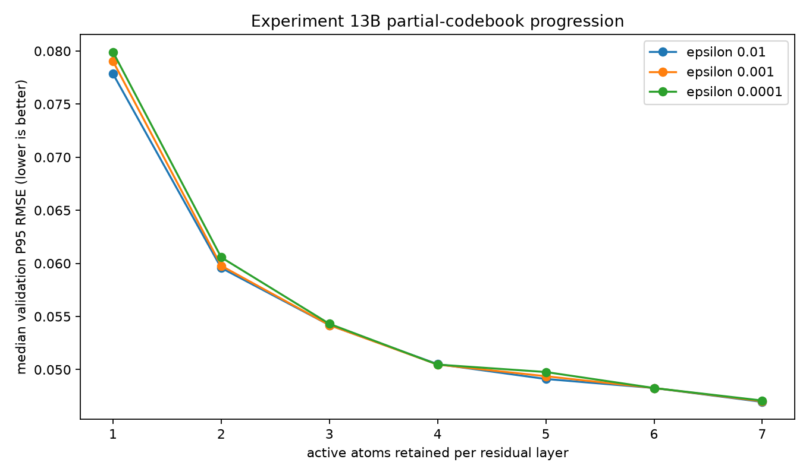
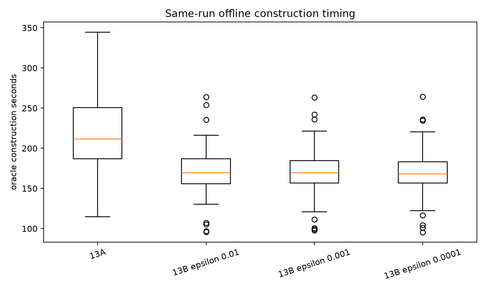

# Experiment 13: Fixed-W8D16 Strategy Grid

**Complete evidence · 90/90 Experiment 13A rows · 135/135 Experiment 13B rows · no failures**

## Experiment Question and Answer

Experiment 13 asks whether removing already-solved LFOs from later dictionary construction frees useful capacity and improves the remaining reconstruction problem. Experiment 13A is the no-filter foundation. Experiment 13B applies three eligibility thresholds to the exact same 45 clipped strategies, so every treatment has a deterministic paired baseline.

The answer is family-specific. Eligibility releases measurable construction population, but more capacity released does not monotonically produce better validation outcomes. `BroadMeanFinishRepair` receives a large rescue; several other families show small, mixed, or adverse changes. Epsilon is therefore a treatment intensity, not the primary contest and not a globally selected winner.

## Experiment 13A Foundation: What the Unfiltered Grid Established

Layer-wise clipping is the clearest global result: `LayerClip0To1` improves validation P95 in all `45/45` matched pairs. CandidateBudget48 and TwoPhase have smaller mixed effects whose signs change by construction family. Those conclusions remain part of the final experiment rather than being replaced by 13B.

| 13A co-primary metric | Better | Best no-filter value | Strategy |
| --- | --- | ---: | --- |
| Median RMSE | lower | 0.008189681 | `x13a_diverse_coverage_hard_repair_two_phase_candidate_budget48_layer_clip0_to1` |
| Strict-perfect LFO rate | higher | 1.246% | `x13a_common_case_repair_candidate_budget24_final_clip_only` |
| P95 RMSE | lower | 0.037600964 | `x13a_all_cluster_means_null_layer_clip0_to1` |
| Node-max error P95 | lower | 0.10100925 | `x13a_diverse_coverage_hard_repair_two_phase_candidate_budget48_layer_clip0_to1` |

The 13A four-objective frontier contains `3` strategies with distinct jobs: simple cluster prototypes lead P95, diverse-coverage hard repair leads median and node-max quality, and the Experiment 12 anchor family supplies the strongest thresholded finishing behavior.

### Metric tension and strict-tolerance sensitivity

Median RMSE, P95 RMSE, and node-max P95 share substantial ordering information, while strict-perfect rate remains a distinct thresholded signal. The 13A replay at four tolerance tuples is retained below; it changes the strict-perfect definition only and does not alter continuous RMSE metrics.

| 13A max-absolute tolerance | RMSE tolerance | Best strict-perfect rate | Median row rate |
| ---: | ---: | ---: | ---: |
| `1e-2` | `1e-03` | 34.330% | 0.872% |
| `1e-3` | `1e-04` | 9.844% | 0.872% |
| `1e-4` | `1e-05` | 1.246% | 0.810% |
| `1e-5` | `1e-06` | 1.246% | 0.810% |

### Matched policy effects and construction-family interactions

| 13A matched lever | Metric | Improved / tied / worsened | Median right-minus-left delta |
| --- | --- | ---: | ---: |
| LayerClip0To1 vs FinalClipOnly | Median RMSE | 44 / 0 / 1 | -0.0025784886 |
| LayerClip0To1 vs FinalClipOnly | Strict-perfect LFO rate | 0 / 45 / 0 | +0.000 pp |
| LayerClip0To1 vs FinalClipOnly | P95 RMSE | 45 / 0 / 0 | -0.0069147758 |
| LayerClip0To1 vs FinalClipOnly | Node-max error P95 | 45 / 0 / 0 | -0.030743808 |
| CandidateBudget48 vs CandidateBudget24 | Median RMSE | 30 / 4 / 8 | -0.00059053162 |
| CandidateBudget48 vs CandidateBudget24 | Strict-perfect LFO rate | 0 / 36 / 6 | +0.000 pp |
| CandidateBudget48 vs CandidateBudget24 | P95 RMSE | 25 / 4 / 13 | -0.00043479912 |
| CandidateBudget48 vs CandidateBudget24 | Node-max error P95 | 26 / 4 / 12 | -0.0049522445 |
| TwoPhase vs Interleaved | Median RMSE | 32 / 0 / 4 | -0.0021913247 |
| TwoPhase vs Interleaved | Strict-perfect LFO rate | 0 / 36 / 0 | +0.000 pp |
| TwoPhase vs Interleaved | P95 RMSE | 21 / 0 / 15 | -0.0011320245 |
| TwoPhase vs Interleaved | Node-max error P95 | 25 / 0 / 11 | -0.0075820833 |

| 13A construction family | Rows | Median RMSE | Strict-perfect | P95 RMSE | Node-max P95 |
| --- | ---: | ---: | ---: | ---: | ---: |
| AlignedMedianGlobalRepair | 8 | 0.022446662 | 0.810% | 0.055761877 | 0.17325836 |
| BroadMeanFinishRepair | 8 | 0.042417876 | 0.810% | 0.091810528 | 0.333869 |
| BroadMeanGlobalRepair | 8 | 0.023221108 | 0.810% | 0.050120478 | 0.15693868 |
| BroadMeanHardRepair | 8 | 0.022763863 | 0.810% | 0.049870443 | 0.15861025 |
| ClusterMeanGlobalRepair | 8 | 0.014407272 | 0.810% | 0.045683289 | 0.13539042 |
| ClusterMeanHardRepair | 8 | 0.014380157 | 0.810% | 0.044974005 | 0.13437615 |
| DiverseCoverageHardRepair | 8 | 0.0097592035 | 0.810% | 0.043419212 | 0.12488288 |
| DominantDirectionGlobalRepair | 8 | 0.023319611 | 0.810% | 0.061586564 | 0.20333387 |
| Experiment12Anchor | 12 | 0.036774285 | 1.028% | 0.053392088 | 0.16432059 |
| PurePrototype | 6 | 0.018899045 | 0.810% | 0.045169635 | 0.13519917 |
| TrimmedMeanGlobalRepair | 8 | 0.013810951 | 0.810% | 0.047824396 | 0.15417859 |

### Atom capacity, residual depth, and mechanism diagnostics

The largest typical tail gain arrives when moving from one to two active atoms per residual layer. Later atoms have diminishing but still positive value for most rows. Training P95 also continues falling through residual layer 16, so 13A supports the retained W8D16 contract while motivating a separate head-budget ablation.

| Added active atom | Median 13A validation-P95 delta | 13A rows improved |
| ---: | ---: | ---: |
| 2 | -0.018925648 | 86/90 |
| 3 | -0.007343933 | 89/90 |
| 4 | -0.0029466916 | 80/90 |
| 5 | -0.0021641478 | 70/90 |
| 6 | -0.0012801718 | 71/90 |
| 7 | -0.00083152018 | 72/90 |

Overshoot, effective no-op use, and dead atoms correlate with worse validation tails, while non-zero residual-gain use correlates with better tails. These are mechanism diagnostics, not substitutes for matched interventions.

### Eligibility gate and bounded scaling ablation

The automatic 13A eligibility gate did not pass: the best early/middle median reconstructed fraction was about `2.054%`, below the required `5%`, despite satisfying retired-energy limits. That failure is why the three 13B thresholds are exploratory treatments rather than a frozen selector output.

| 50%-minus-100% training comparison | Median delta | 50% better / 100% better / ties |
| --- | ---: | ---: |
| Median RMSE | +0.002360452 | 13 / 26 / 0 |
| Strict-perfect LFO rate | +0.374 pp | 33 / 6 / 0 |
| P95 RMSE | +0.0011711642 | 17 / 22 / 0 |
| Node-max error P95 | -0.0025390834 | 27 / 12 / 0 |

The scaling comparison remains a non-random 39-row prefix and excludes runtime. It is useful as a bounded sensitivity check, not a general data-scaling law.

## Experiment 13B: How Much Capacity Was Freed?

The no-filter 13A baseline retires no LFOs from construction. For 13B, capacity is measured as the mean training-population fraction excluded after layers 1–15, because those exclusions affect at least one later residual layer. Layer-16 coverage is reported separately: it describes endpoint eligibility but frees no remaining construction.

| Population policy | Treatment epsilon | Mean future-layer population freed | Layer-8 population freed | Layer-16 endpoint coverage |
| --- | ---: | ---: | ---: | ---: |
| No eligibility filter (13A) | — | 0.000% | 0.000% | 0.000% |
| UnresolvedOnly | `0.01` | 1.775% | 1.805% | 2.302% |
| UnresolvedOnly | `0.001` | 1.755% | 1.775% | 2.227% |
| UnresolvedOnly | `0.0001` | 1.757% | 1.775% | 2.227% |

Family-specific depth trajectories are essential. The all-row median is nearly flat because many strategies retire few LFOs, while finish-oriented and diversity-aware families create much larger regimes.

## Paired Validation Effects Versus No Filtering

Each cell and count below is 13B minus its exact `AllResiduals + LayerClip0To1` 13A counterpart. Negative deltas improve RMSE metrics; positive deltas improve strict-perfect rate.

| Treatment epsilon | Metric | Improved / tied / worsened vs exact no-filter baseline | Median paired delta |
| ---: | --- | ---: | ---: |
| `0.01` | Median RMSE | 27 / 0 / 18 | -7.4505806e-09 |
| `0.01` | Strict-perfect LFO rate | 6 / 39 / 0 | +0.000 pp |
| `0.01` | P95 RMSE | 23 / 1 / 21 | -3.7252903e-09 |
| `0.01` | Node-max error P95 | 25 / 1 / 19 | -5.2154064e-08 |
| `0.001` | Median RMSE | 14 / 15 / 16 | +0 |
| `0.001` | Strict-perfect LFO rate | 6 / 39 / 0 | +0.000 pp |
| `0.001` | P95 RMSE | 18 / 14 / 13 | +0 |
| `0.001` | Node-max error P95 | 14 / 14 / 17 | +0 |
| `0.0001` | Median RMSE | 14 / 15 / 16 | +0 |
| `0.0001` | Strict-perfect LFO rate | 7 / 38 / 0 | +0.000 pp |
| `0.0001` | P95 RMSE | 16 / 14 / 15 | +0 |
| `0.0001` | Node-max error P95 | 15 / 14 / 16 | +0 |

## Does Freed Capacity Improve the Rest?

The capacity-to-quality comparison puts the experiment's mechanism on the x-axis and its paired validation consequence on the y-axis. The global rank correlations are descriptive across intentionally different families; the paired point for each strategy remains the stronger unit of evidence.

| Paired validation benefit | Spearman ρ with mean future-layer population freed | Reading |
| --- | ---: | --- |
| Median RMSE | -0.003 | little global monotonic relationship; family confounding remains |
| Strict-perfect LFO rate | +0.489 | more released capacity tends to align with more benefit; family confounding remains |
| P95 RMSE | +0.239 | more released capacity tends to align with more benefit; family confounding remains |
| Node-max error P95 | +0.199 | little global monotonic relationship; family confounding remains |

## Strict-Perfect Regime and Post-Filter Interactions

The best 13B strict-perfect rate is `19.502%`. Seven rows reach the same 313-of-1605 validation count, showing a discrete finishing regime rather than a gentle shift in average error. The strongest balanced exact-finish candidates come from `DiverseCoverageHardRepairInterleaved + CandidateBudget48`; finish-repair rows reach the same rate with much worse median and tail quality.

CandidateBudget48 remains the more repeatable post-filter lever. TwoPhase still changes sign by family and should not be promoted to a universal schedule rule.

The generated interaction audit contains `90` family-by-epsilon summaries.

## Final Cross-Phase Interpretation

| Final co-primary metric | Better | Best 13B value | Strategy | Epsilon |
| --- | --- | ---: | --- | ---: |
| Median RMSE | lower | 0.0083231162 | `x13b_diverse_coverage_hard_repair_two_phase_candidate_budget48_layer_clip0_to1_epsilon_1e_02` | `0.01` |
| Strict-perfect LFO rate | higher | 19.502% | `x13b_broad_mean_finish_repair_two_phase_candidate_budget24_layer_clip0_to1_epsilon_1e_02` | `0.01` |
| P95 RMSE | lower | 0.037116494 | `x13b_all_cluster_means_null_layer_clip0_to1_epsilon_1e_02` | `0.01` |
| Node-max error P95 | lower | 0.10879421 | `x13b_diverse_coverage_hard_repair_two_phase_candidate_budget48_layer_clip0_to1_epsilon_1e_04` | `0.0001` |

The 13B four-objective frontier contains `9` rows. `AllClusterMeans` remains the simplest low-P95 option. `DiverseCoverageHardRepairTwoPhase + CandidateBudget48` supplies the strongest median/node-max tradeoff, while the interleaved CandidateBudget48 variant provides the most credible high strict-perfect alternative.

The partial-codebook result remains consistent with 13A: most tail improvement arrives early, but later atoms continue to help enough that shrinking W8 requires a dedicated contract-changing ablation.

## Recommendations

1. Keep `LayerClip0To1`; its 45/45 matched P95 result is the strongest general Experiment 13 conclusion.
2. Treat eligibility as a family-specific intervention. Use the paired capacity-effect table, not an epsilon-only leaderboard.
3. Keep `AllClusterMeans` as the simple low-P95 candidate and the `DiverseCoverageHardRepair + CandidateBudget48` variants as the balanced frontier candidates.
4. Preserve CandidateBudget48 only where its family-specific gain justifies doubled offline search; keep schedule coupled to family.
5. Do not shrink W8D16 or infer deployed latency changes from these offline construction diagnostics.

## Method and Audit Boundaries

Source run: `../artifacts/experiment_13/strategy_grid_train50_val100_exactopt_v1`.

The automatic selector recorded `selection_passed=False`. No tested epsilon is relabeled as a frozen selector choice.

All paired eligibility comparisons use the exact 45 `LayerClip0To1` 13A rows. The baseline is labeled `No eligibility filter (13A)` and is never represented as epsilon zero. The capacity measure excludes layer 16 from future-layer savings. Validation quality retains four separate co-primary metrics.

All timing is offline experiment work. Every row preserves Beam4, PhaseAndResidualGain, 97 control points, W8D16, and 193 deployed prediction outputs.

Configuration fingerprint: `901df3d8ed4e1287a023e2a7a8abe3c05070da1a248f81e205688af13c229dd1`.
