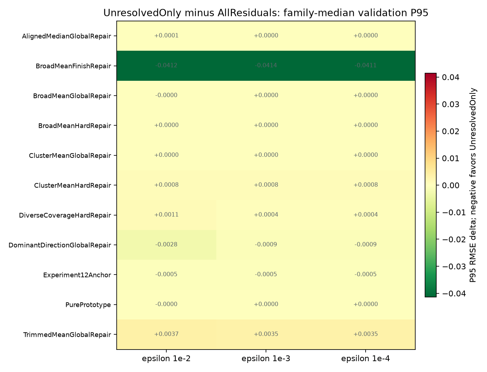
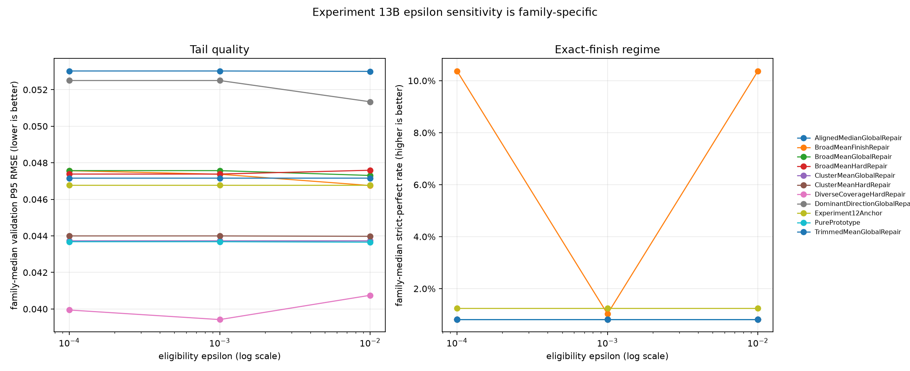
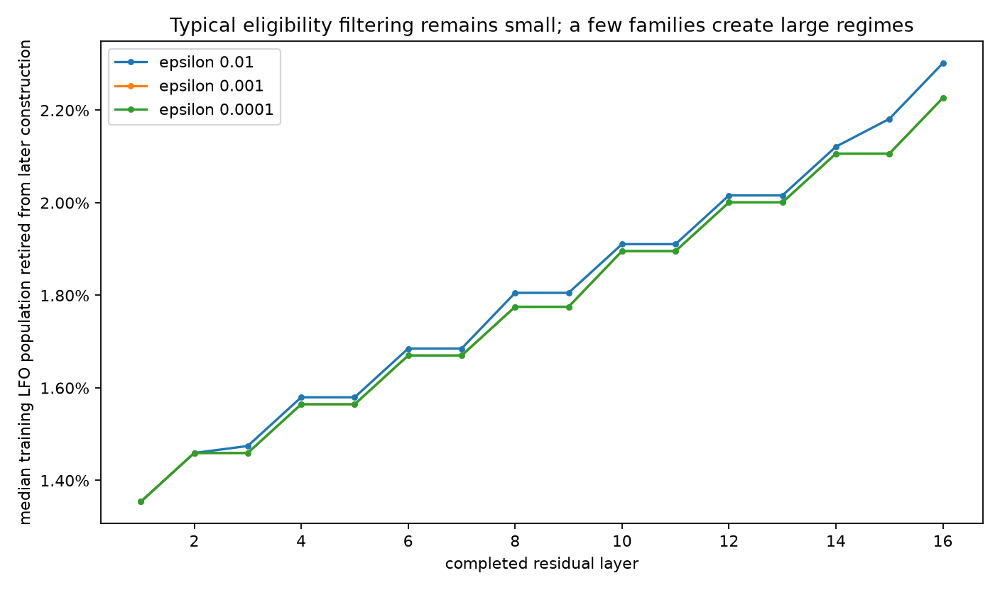

# Experiment 13: Fixed-W8D16 Strategy Grid

**Complete evidence · 90/90 Experiment 13A rows · 135/135 Experiment 13B rows · no failures**

## Main Findings

Experiment 13 does not produce one scalar winner. It produces a small, interpretable frontier: `AllClusterMeans` has the best validation P95, while `DiverseCoverageHardRepairTwoPhase` supplies the best median and node-max solutions, and a separate `DiverseCoverageHardRepairInterleaved` regime preserves many more exact reconstructions.

The best 13B P95 is `0.037116494` from `AllClusterMeans`; all three epsilon variants tie. The best median is `0.0083231162` at epsilon `1e-2`, and the best node-max P95 is `0.10879421` at epsilon `1e-4`, both from `DiverseCoverageHardRepairTwoPhase + CandidateBudget48`.

`UnresolvedOnly` is a targeted rescue, not a global free win. Across the 45 matched clipped strategies the median P95 change is effectively zero at every epsilon. The negative mean is driven by `BroadMeanFinishRepair`, whose P95 falls from roughly `0.087–0.091` in 13A to `0.046–0.050` in 13B. Other families include both gains and regressions.

No epsilon wins globally. `1e-2` has the lowest across-strategy median P95 by a very small margin, `1e-3` gives the best median P95 inside `DiverseCoverageHardRepair`, and `1e-4` contains the best node-max row. Epsilon changes the population used to build later atoms, so the final quality curves are legitimately non-monotonic.

7 13B rows share the best strict-perfect rate of `19.502%`. In the completed run, five are `BroadMeanFinishRepairTwoPhase`; the two scientifically stronger rows are `DiverseCoverageHardRepairInterleaved + CandidateBudget48` at `1e-3` and `1e-4`, because they retain that exact-finish rate with P95 near `0.040–0.041`.

| Co-primary validation metric | Better | Best 13B value | Strategy | Eligibility epsilon |
| --- | --- | ---: | --- | ---: |
| Median RMSE | lower | 0.0083231162 | `x13b_diverse_coverage_hard_repair_two_phase_candidate_budget48_layer_clip0_to1_epsilon_1e_02` | `0.01` |
| Strict-perfect LFO rate | higher | 19.502% | `x13b_broad_mean_finish_repair_two_phase_candidate_budget24_layer_clip0_to1_epsilon_1e_02` | `0.01` |
| P95 RMSE | lower | 0.037116494 | `x13b_all_cluster_means_null_layer_clip0_to1_epsilon_1e_02` | `0.01` |
| Node-max error P95 | lower | 0.10879421 | `x13b_diverse_coverage_hard_repair_two_phase_candidate_budget48_layer_clip0_to1_epsilon_1e_04` | `0.0001` |

## Why UnresolvedOnly Helps Some Families

`AllResiduals` lets every training residual continue influencing every later atom. `UnresolvedOnly` removes a curve from later construction after its maximum point error falls below the eligibility epsilon. This is useful when nearly solved curves would otherwise monopolize finish-oriented proposals, but it can remove stabilizing mass from families whose broad prototypes benefit from the full population.

The paired result is therefore skewed rather than uniform. The median strategy is unchanged, while a handful of formerly pathological finish-repair rows improve dramatically. Win/loss counts and family medians are more informative than the overall mean.

| Epsilon | P95 improved / tied / worse vs paired 13A | Median P95 delta | Mean P95 delta | Strict-perfect improved / tied / worse |
| ---: | ---: | ---: | ---: | ---: |
| `0.01` | 23 / 1 / 21 | -3.7252903e-09 | -0.0036046127 | 6 / 39 / 0 |
| `0.001` | 18 / 14 / 13 | +0 | -0.0034215018 | 6 / 39 / 0 |
| `0.0001` | 16 / 14 / 15 | +0 | -0.0033634125 | 7 / 38 / 0 |

### Family-specific paired effects

| Construction family | Epsilon 1e-2 | Epsilon 1e-3 | Epsilon 1e-4 | Interpretation |
| --- | ---: | ---: | ---: | --- |
| AlignedMedianGlobalRepair | +0.000070 (2 wins) | +0.000000 (0 wins) | +0.000000 (0 wins) | mixed or strategy-dependent |
| BroadMeanFinishRepair | -0.041190 (4 wins) | -0.041371 (4 wins) | -0.041141 (4 wins) | large repeatable rescue |
| BroadMeanGlobalRepair | -0.000000 (3 wins) | +0.000000 (0 wins) | +0.000000 (0 wins) | mixed or strategy-dependent |
| BroadMeanHardRepair | +0.000034 (2 wins) | +0.000000 (1 wins) | +0.000000 (1 wins) | mixed or strategy-dependent |
| ClusterMeanGlobalRepair | +0.000000 (1 wins) | +0.000000 (1 wins) | +0.000000 (1 wins) | mixed or strategy-dependent |
| ClusterMeanHardRepair | +0.000764 (1 wins) | +0.000778 (0 wins) | +0.000778 (0 wins) | consistent regression |
| DiverseCoverageHardRepair | +0.001105 (0 wins) | +0.000377 (2 wins) | +0.000397 (1 wins) | consistent regression |
| DominantDirectionGlobalRepair | -0.002772 (3 wins) | -0.000878 (2 wins) | -0.000878 (2 wins) | consistent but smaller improvement |
| Experiment12Anchor | -0.000458 (5 wins) | -0.000458 (6 wins) | -0.000458 (5 wins) | consistent but smaller improvement |
| PurePrototype | -0.000024 (2 wins) | +0.000000 (1 wins) | +0.000000 (1 wins) | mixed or strategy-dependent |
| TrimmedMeanGlobalRepair | +0.003657 (0 wins) | +0.003494 (1 wins) | +0.003494 (1 wins) | consistent regression |

## The Three-Epsilon Sweep

The epsilon value is a construction policy, not a post-hoc scoring threshold. A looser epsilon can retire more curves early, but because the remaining curves then define different atoms, a looser epsilon does not guarantee a monotonic improvement or regression in final validation quality.

| Eligibility epsilon | Median RMSE | Strict-perfect rate | P95 RMSE | Node-max P95 | Median LFO population retired after layer 16 |
| ---: | ---: | ---: | ---: | ---: | ---: |
| `0.01` | 0.019825101 | 0.810% | 0.046954501 | 0.14125767 | 2.302% |
| `0.001` | 0.020437574 | 0.810% | 0.047014061 | 0.14065427 | 2.227% |
| `0.0001` | 0.020436043 | 0.810% | 0.047084909 | 0.14228487 | 2.227% |

Typical retirement is modest: the median strategy has only about two percent of training LFOs removed by layer 16. The mean and maximum are much larger because `BroadMeanFinishRepair` and `DiverseCoverageHardRepair` create high-retirement regimes. This is why one aggregate retirement percentage would conceal the mechanism.

## Strict-Perfect Finishing Is a Distinct Regime

The original strict-perfect definition remains RMSE `<= 1e-6` and maximum point error `<= 1e-5`. It is deliberately much stricter than the 13B eligibility epsilons. The 13B jump to 19.5% is not a gentle shift in average RMSE; seven rows land on exactly the same 313-of-1605 validation count.

A validation-only forensic replay of saved codebooks confirmed that a representative `DiverseCoverageHardRepair` row and a representative `BroadMeanFinishRepair` row finish the exact same 313 LFOs. The ordinary 13-of-1605 exact set is a subset. Of the 313, 299 are analysis-labeled `continuous` curves and 14 are `discontinuous`; only seven are bit-exact, while the rest satisfy the strict numerical tolerance. This topology label is post-hoc analysis only and does not enter construction or deployed runtime.

| Strategy | Family | Epsilon | Strict-perfect | Median RMSE | P95 RMSE |
| --- | --- | ---: | ---: | ---: | ---: |
| `x13b_diverse_coverage_hard_repair_interleaved_candidate_budget48_layer_clip0_to1_epsilon_1e_03` | DiverseCoverageHardRepair | `0.001` | 19.502% | 0.010298005 | 0.040146742 |
| `x13b_diverse_coverage_hard_repair_interleaved_candidate_budget48_layer_clip0_to1_epsilon_1e_04` | DiverseCoverageHardRepair | `0.0001` | 19.502% | 0.010087625 | 0.041154746 |
| `x13b_broad_mean_finish_repair_two_phase_candidate_budget24_layer_clip0_to1_epsilon_1e_02` | BroadMeanFinishRepair | `0.01` | 19.502% | 0.019825101 | 0.046045594 |
| `x13b_broad_mean_finish_repair_two_phase_candidate_budget48_layer_clip0_to1_epsilon_1e_02` | BroadMeanFinishRepair | `0.01` | 19.502% | 0.019046294 | 0.046858694 |
| `x13b_broad_mean_finish_repair_two_phase_candidate_budget48_layer_clip0_to1_epsilon_1e_03` | BroadMeanFinishRepair | `0.001` | 19.502% | 0.020115115 | 0.047441408 |
| `x13b_broad_mean_finish_repair_two_phase_candidate_budget48_layer_clip0_to1_epsilon_1e_04` | BroadMeanFinishRepair | `0.0001` | 19.502% | 0.020115115 | 0.047441408 |
| `x13b_broad_mean_finish_repair_two_phase_candidate_budget24_layer_clip0_to1_epsilon_1e_04` | BroadMeanFinishRepair | `0.0001` | 19.502% | 0.020860437 | 0.047693208 |

The separate complete-13A report retains the replayed `1e-2`, `1e-3`, `1e-4`, and `1e-5` strict-perfect tolerance sensitivity. Those toggles are not mixed into this final cross-phase frontier because the replay artifact covers 13A rows only.

## Budget and Schedule

CandidateBudget48 is the more repeatable 13B lever: it improves P95 in 13/21, 15/21, and 16/21 matched pairs as epsilon tightens. TwoPhase is not a global winner; it improves only 8/18 matched schedule pairs at each epsilon and has a slightly worse median P95 delta. Its strong showing in the best `DiverseCoverage` rows is a family interaction, not a universal schedule rule.

| Lever | Epsilon | Right-hand policy | P95 improves / loses | Median P95 delta |
| --- | ---: | --- | ---: | ---: |
| utility candidate budget | `0.01` | CandidateBudget48 | 13 / 8 | -0.00016926974 |
| utility candidate budget | `0.001` | CandidateBudget48 | 15 / 6 | -0.00090221688 |
| utility candidate budget | `0.0001` | CandidateBudget48 | 16 / 5 | -0.00069680437 |
| layer schedule | `0.01` | TwoPhase | 8 / 10 | +0.00047559105 |
| layer schedule | `0.001` | TwoPhase | 8 / 10 | +0.00033439882 |
| layer schedule | `0.0001` | TwoPhase | 8 / 10 | +0.00044621713 |

## Partial Codebook and Residual Depth

The first two active atoms do most of the tail work: the across-row median P95 drops from `0.079035` with one active atom to `0.059828` with two. Later atoms still matter, but the median step from six to seven is only `-0.001250`. This supports the current ordering logic while also identifying a future head-budget ablation; it does not by itself authorize shrinking W8.

## Runtime and Deployment Boundary

All timings are offline experiment work. Every row preserves the same deployed 193-output W8D16 interface, Beam4 encoding, phase and residual gain, and topology-free runtime contract. The optimized 13B rows are somewhat faster to construct than 13A on the median, but this is descriptive same-run evidence, not a claim that filtering reduces deployed inference cost.

## Practical Takeaways

1. Keep `LayerClip0To1`; Experiment 13B correctly avoided spending another 45 rows on the inferior clipping branch.
2. Use `AllClusterMeans` when the primary objective is the lowest P95 with a simple prototype-only construction.
3. Use `DiverseCoverageHardRepairTwoPhase + CandidateBudget48` as the balanced low-median/low-node-max candidate; retain epsilon as a small family-specific choice rather than a global constant.
4. Preserve `DiverseCoverageHardRepairInterleaved + CandidateBudget48` at epsilon `1e-3` as the strongest exact-finish candidate: it reaches 19.5% strict-perfect without the large median/tail penalty of finish-repair rows.
5. Do not generalize `UnresolvedOnly` to every construction family. Its value is largest where the unfiltered family was visibly pathological.
6. If the deployed head budget must be reduced, run a dedicated atom-count/depth ablation. Partial-codebook curves are motivation, not proof of a smaller contract.

## Method Notes

Source run: `../artifacts/experiment_13/strategy_grid_train50_val100_exactopt_v1`.

The automatic 13A selector recorded `selection_passed=False`. The three 13B epsilons were an explicit exploratory sweep; none is relabeled as the selector's frozen choice.

The report uses the four co-primary validation metrics separately: median RMSE, strict-perfect LFO rate, P95 RMSE, and node-max error P95. Pareto membership means no other row is at least as good on all four and strictly better on at least one.

`AllResiduals` versus `UnresolvedOnly` comparisons use only the 45 matched `LayerClip0To1` 13A rows. Epsilon comparisons use matched construction strategies inside 13B. Runtime comparisons are limited to same-run offline diagnostics.

Configuration fingerprint: `901df3d8ed4e1287a023e2a7a8abe3c05070da1a248f81e205688af13c229dd1`.
