# Experiment 7A Findings: Additive Finalization Policy Selection

## Decision read

Experiment 7A completed the full 20-job additive policy comparison on 1,605 held-out curves: `K=12`, 16 residual stages, beam-4, eval-960, five additive-code construction policies times four modifier policies. This report filters out older smoke/checkpoint rows and uses only configurations containing `_bw4_eval960`.

This is not the same axis as Experiment 6's `phase_additive_k8`, `phase_additive_k12`, `phase_switch`, `phase_partition`, etc. Experiment 6 compared representation families. Experiment 7A locks onto the additive shared+topology family and asks how to build the residual atoms inside that family for finalization.

The full screen included `frequency_first`, and it is important as a failed speed baseline: it was much faster, but its best full eval-960 tail error was P95 `0.21937`, far outside the usable cluster. It is therefore kept in the early construction-policy definition/ranking sections, then excluded from modifier/topology/runtime plots where it compresses the useful policies into unreadable scale.

The clear winner is **`topology_balanced_common_then_tail / none`**. It has the best common-case and tail reconstruction among viable construction policies, with no extra modifier outputs: median RMSE `0.0026222`, P95 `0.034651`, P99 `0.054708`, and `260` dense outputs. The `base_gain` variant ties P95/P99 but adds an output without improving the decision metric, so `none` is the cleaner 7B seed.

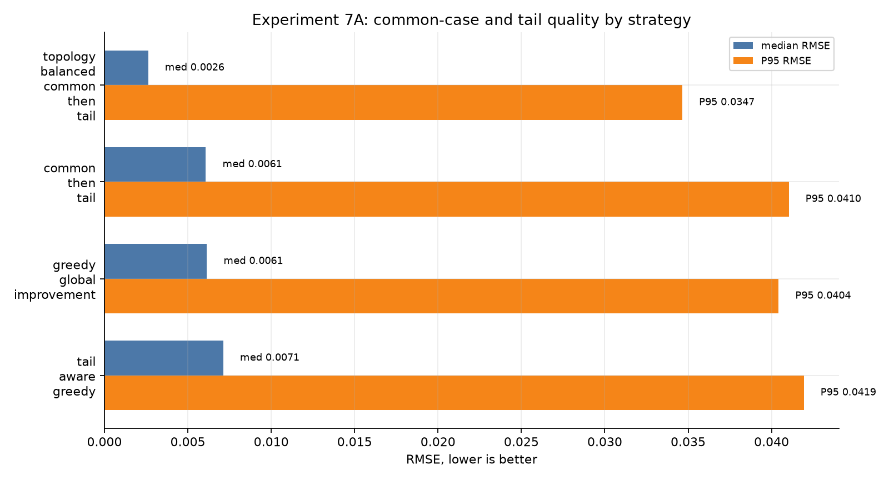

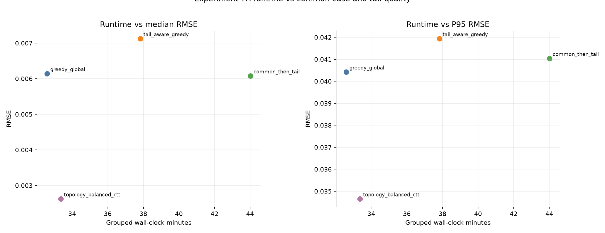

## Representation Glossary

Experiment 7A is easier to read if the representation pieces are separated from the training policies.

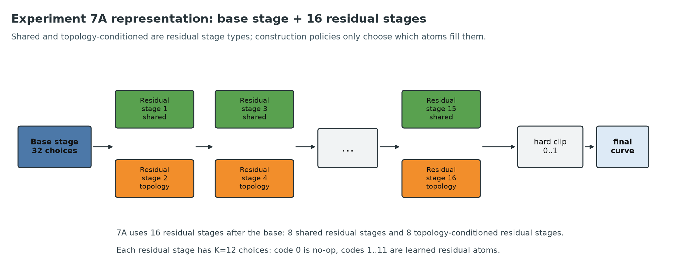

For a future model, the codebooks behave like fixed embedding tables. The model predicts compact indices and scalars; the decoder gathers codebook rows, applies circular phase shifts and gains, adds the selected atoms, and clips the final curve.

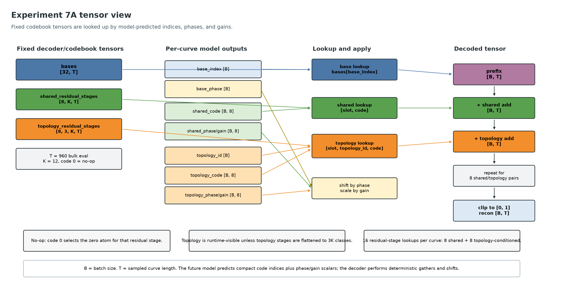

A **curve** is the normalized LFO shape sampled on the evaluation grid. In this run the bulk 7A comparison used eval-960, so each held-out shape is scored as 960 values in `[0, 1]`.

A **base** is the first coarse shape choice. The encoder chooses one of 32 base curves, circularly shifts it by a phase, then uses that as the starting prefix. The base is not expected to solve the full curve; it gives the decoder a broad initial shape.

A **residual** is what remains after the current prefix:

```text
residual = target curve - current prefix
```

A **residual atom** is a learned correction curve selected from observed training residuals. A **residual stage** is one dictionary of residual atoms plus the predicted code/phase/gain used to apply one atom from that dictionary. In 7A, each residual stage has `K=12` choices: code `0` is no-op, and codes `1..11` are learned residual atoms.

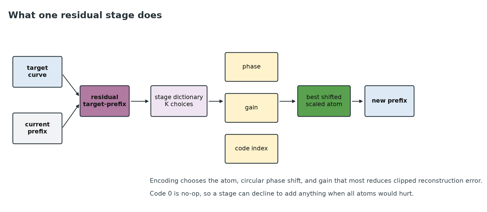

During encoding, each stage gets the current residual, tries its K choices, finds the best circular phase and gain for each useful candidate, and adds the best shifted/scaled correction to the prefix. The prefix then moves to the next stage. The final result is hard-clipped to `[0, 1]` before scoring.

A **residual stage type** describes which dictionary a residual stage uses:

```text
shared residual stage: one dictionary reused for all topology buckets
topology-conditioned residual stage: topology bucket selects which dictionary row is active
```

7A uses 16 residual stages after the base: 8 shared residual stages and 8 topology-conditioned residual stages. The implementation stores them in shared/topology pairs, but the model-facing count is still 16 residual stages.

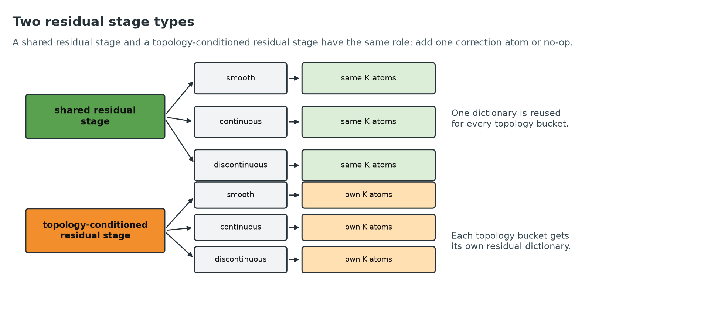

A **shared residual stage** uses one residual dictionary for all curves. Smooth, continuous, and discontinuous curves all choose from the same K atoms.

A **topology-conditioned residual stage** uses the curve's topology bucket to select a dictionary row first. Smooth curves choose from smooth-specific atoms, continuous curves from continuous-specific atoms, and discontinuous curves from discontinuous-specific atoms. This is still additive: the topology correction is added after the shared correction rather than replacing it.

That is why Experiment 7A is still testing the Experiment 6 additive direction. The fixed 7A decoder is:

```text
shifted base
+ shared residual stage 1
+ topology-conditioned residual stage 2
+ ...
+ shared residual stage 15
+ topology-conditioned residual stage 16
=> hard clip => final curve
```

The names `frequency_first`, `greedy_global_improvement`, `tail_aware_greedy`, `common_then_tail`, and `topology_balanced_common_then_tail` are **construction policies**, not new representation families. They only decide which observed training residuals become the non-zero atoms inside the fixed additive stages.

## Construction Policy Definitions

All 7A policies build the same final representation family: additive shared+topology residuals. Concretely, every configuration has 32 base choices followed by 16 residual stages: 8 shared residual stages and 8 topology-conditioned residual stages. Each residual stage has K=12 choices, where code 0 is the no-op and the remaining 11 codes are selected from observed training residuals. The policies differ only in how those non-zero residual atoms are chosen during training.

| construction_policy | what it does | expected tradeoff | 7A result |
| --- | --- | --- | --- |
| `frequency_first` | Builds a candidate pool by grouping identical shape signatures, then directly takes the most common/high-energy residual representatives. It does not run the expensive global improvement search. | Very fast, but can keep choosing common shapes even when the remaining residual error needs different atoms. | Fastest, but failed badly at full eval-960: best P95 `0.21937`; not suitable for 7B. |
| `greedy_global_improvement` | Builds an energy-ranked residual candidate pool, aligns every training residual against the pool, then greedily picks atoms that reduce the most total corpus error. | Much slower than frequency-first, but directly optimizes aggregate residual improvement. | Strong baseline: best P95 `0.04042`, about 32.6 log wall-clock minutes. |
| `tail_aware_greedy` | Uses the same expensive alignment pool as greedy, but weights the worst 20% current residuals much more heavily while downweighting easy/common residuals. | Intended to improve tail error, but can over-focus on hard outliers and sacrifice broad coverage. | Did not pay off: best P95 `0.04194`, slower than greedy. |
| `common_then_tail` | Uses global greedy selection for the first half of the residual-stage pairs, then switches to tail-weighted selection for the second half. | Lets early residual stages solve common structure before spending later stages on hard residuals. | Competitive but not best: best P95 `0.04104`; slowest group in the final run. |
| `topology_balanced_common_then_tail` | Same common-then-tail selection schedule, but the shared-residual-stage candidate pool is balanced across smooth/continuous/discontinuous topology classes before selection. Topology-conditioned residual stages still fit within each topology. | Adds diversity early so the shared path does not get dominated by the largest/high-energy topology population. | Clear winner: P95 `0.03465`, P99 `0.05471`, with no modifier needed. |

Mechanically, the expensive construction policies pay for this line of work during fitting: align all current residuals against a candidate pool of up to `max(64, (K-1)*24)` candidates, then score candidate utility. With K=12 that pool is up to 264 candidates per fit. That is why construction-policy choice dominates runtime.

## Construction Policy Ranking

The ranking should be read on **median RMSE and P95 RMSE together**. Median quality matters because this representation will be used constantly on ordinary shapes; P95 matters because bad tails are visible/audible and stress downstream refitting. On that combined read, `topology_balanced_common_then_tail / none` is the clean choice: it wins median (`0.00262`) and P95 (`0.03465`) without modifier outputs.

This table intentionally includes `frequency_first` so the full 7A screen is visible. The plots in later sections intentionally omit it so the viable policies can be compared at useful resolution.

| construction_strategy | modifier_policy | dense_outputs | rmse_median | rmse_p95 | rmse_p99 | max_error_p95 | elapsed_minutes | rmse_under_0.02 | rmse_under_0.05 | all_nodes_under_0.05 |
| --- | --- | --- | --- | --- | --- | --- | --- | --- | --- | --- |
| topology_balanced_common_then_tail | none | 260 | 0.0026222 | 0.034651 | 0.054708 | 0.22562 | 33.2 | 89.3% | 98.4% | 50.6% |
| common_then_tail | base_gain | 261 | 0.0060781 | 0.041036 | 0.059621 | 0.28197 | 43.8 | 78.8% | 98.2% | 48.9% |
| greedy_global_improvement | base_gain | 261 | 0.0061416 | 0.040424 | 0.058736 | 0.28402 | 32.5 | 78.6% | 98.1% | 48.4% |
| tail_aware_greedy | base_gain | 261 | 0.0071243 | 0.041936 | 0.056127 | 0.26154 | 37.7 | 74.5% | 97.8% | 48.1% |
| frequency_first | base_gain | 261 | 0.032966 | 0.22383 | 0.29845 | 0.72872 | 6.2 | 46.7% | 55.5% | 33.1% |

Key read:

- `topology_balanced_common_then_tail` is best on both central tendency and tail: median `0.002622`, P95 `0.034651`.
- The next viable cluster has much worse median and worse P95: greedy median `0.006142` / P95 `0.040424`; common-then-tail median `0.006165` / P95 `0.041036`.
- `frequency_first` has a deceptively decent modifier median only because modifiers repair some common cases, but its P95 remains `0.21937`; it is not a 7B candidate.
- `tail_aware_greedy` did not improve either median or P95 enough to justify its cost.

## Modifier effects

The modifier policies mostly add outputs without changing the median-or-tail decision. `frequency_first` is intentionally excluded from this section onward because its full-run error is far outside the useful cluster and compresses the plots. Among viable construction policies, the winning policy's `none`, `base_gain`, and `global_offset` variants are effectively tied at P95, but `none` has fewer continuous scalars and slightly cleaner P99/max-error behavior than the combined modifier.

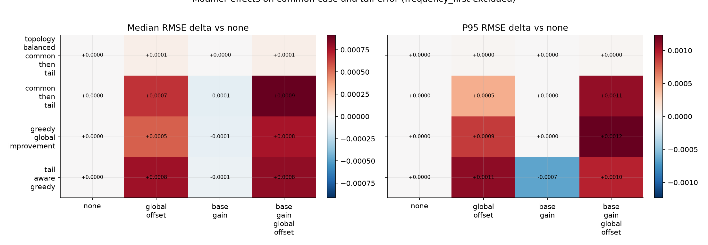

| construction_strategy | modifier_policy | delta_rmse_p95 | delta_rmse_median | extra_dense_outputs |
| --- | --- | --- | --- | --- |
| common_then_tail | base_gain | 2.4e-09 | -8.6936e-05 | 1 |
| common_then_tail | global_offset | 0.00045051 | 0.00066093 | 1 |
| common_then_tail | base_gain_global_offset | 0.0010878 | 0.00091545 | 2 |
| greedy_global_improvement | base_gain | 0 | -7.2568e-05 | 1 |
| greedy_global_improvement | global_offset | 0.00086714 | 0.00054954 | 1 |
| greedy_global_improvement | base_gain_global_offset | 0.0012352 | 0.00075342 | 2 |
| tail_aware_greedy | base_gain | -0.00065158 | -5.6641e-05 | 1 |
| tail_aware_greedy | base_gain_global_offset | 0.00095375 | 0.00081268 | 2 |
| tail_aware_greedy | global_offset | 0.0011001 | 0.00077314 | 1 |
| topology_balanced_common_then_tail | base_gain | 0 | 0 | 1 |
| topology_balanced_common_then_tail | global_offset | 2.5673e-05 | 5.3395e-05 | 1 |
| topology_balanced_common_then_tail | base_gain_global_offset | 2.5673e-05 | 5.3395e-05 | 2 |

## Topology breakdown

The remaining error profile is split between common-case smoothness and discontinuous-tail/node-probe behavior. With `frequency_first` removed from the plot, the viable construction policies separate cleanly: topology-balanced common-then-tail reduces every topology bucket, including discontinuous P95.

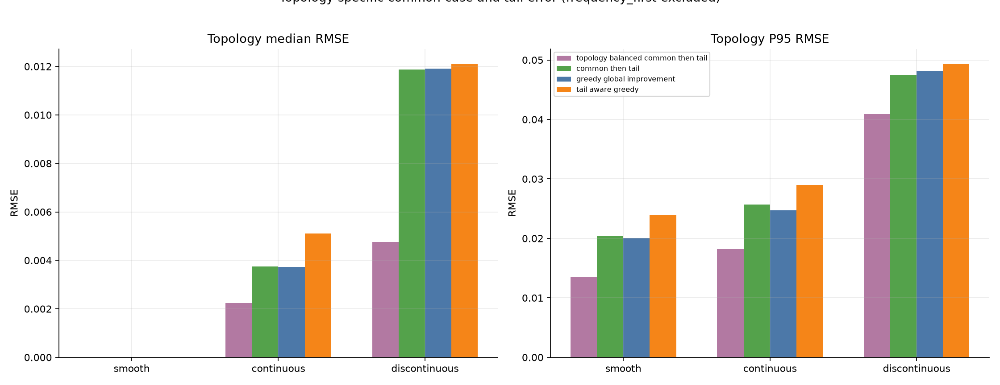

| strategy_modifier | smooth | continuous | discontinuous |
| --- | --- | --- | --- |
| common_then_tail / none | 0.020428 | 0.025885 | 0.047509 |
| greedy_global_improvement / base_gain | 0.020096 | 0.024701 | 0.048157 |
| tail_aware_greedy / base_gain | 0.023896 | 0.029023 | 0.049402 |
| topology_balanced_common_then_tail / none | 0.013501 | 0.018205 | 0.040892 |

## Coverage and error shape

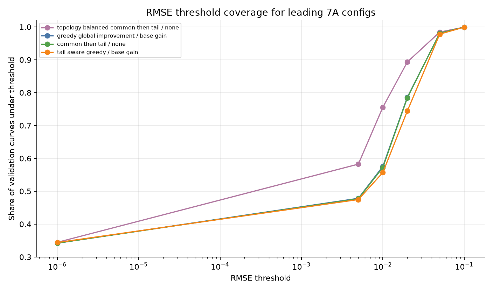

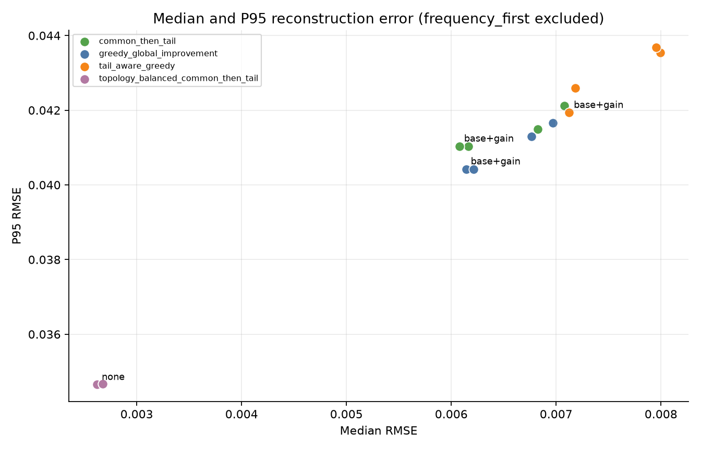

The best 7A policy gets `89.3%` of held-out curves under RMSE `0.02`, `98.4%` under RMSE `0.05`, and `99.9%` under RMSE `0.1`. These plots exclude `frequency_first` so the useful construction policies can be compared at readable scale. Node-threshold coverage remains weak across all policies, so node preservation should be treated as a separate downstream refit/problem rather than solved by this additive representation alone.

## Runtime breakdown

The four modifier policies are evaluated as a grouped construction-policy run. The expensive part is training/building the shared chain plus one shared validation encode; modifier-specific scoring/checkpointing is only seconds. `frequency_first` is excluded here for visual scale and because it is no longer a viable 7B candidate.

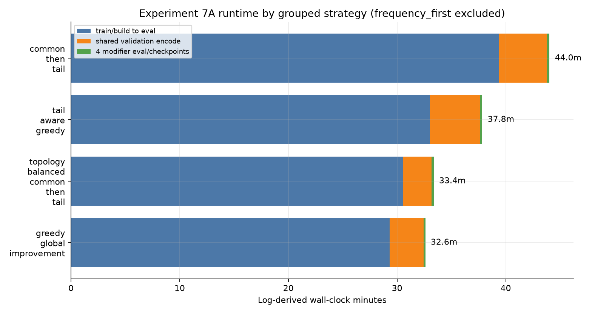

| construction_strategy | best_modifier | best_rmse_p95 | log_group_wall_minutes | log_train_to_eval_minutes | log_shared_encode_minutes | log_modifier_eval_minutes | reported_elapsed_minutes |
| --- | --- | --- | --- | --- | --- | --- | --- |
| greedy_global_improvement | base_gain | 0.040424 | 32.60 | 29.32 | 3.13 | 0.15 | 32.45 |
| topology_balanced_common_then_tail | none | 0.034651 | 33.37 | 30.52 | 2.67 | 0.18 | 33.19 |
| tail_aware_greedy | base_gain | 0.041936 | 37.83 | 33.03 | 4.62 | 0.18 | 37.65 |
| common_then_tail | none | 0.041036 | 44.02 | 39.37 | 4.45 | 0.20 | 43.83 |

Notes:

- The winning `topology_balanced_common_then_tail` group took about 33.37 wall-clock minutes in the final run, with about 30.52 minutes before validation encode and 2.67 minutes for shared validation encode.
- `common_then_tail` was the slowest viable group at about 44.02 minutes without beating the topology-balanced result.

## 7B recommendation

Use this generated config as the primary 7B seed:

```text
artifacts/additive_finalization_7a/candidate_7b_configs/experiment7b_topology_balanced_common_then_tail_none.json
```

Secondary challengers, only if 7B budget allows:

```text
artifacts/additive_finalization_7a/candidate_7b_configs/experiment7b_topology_balanced_common_then_tail_global_offset.json
artifacts/additive_finalization_7a/candidate_7b_configs/experiment7b_greedy_global_improvement_none.json
```

Do **not** use `frequency_first` for 7B based on the complete 960 run. Do **not** expand modifiers first; spend 7B budget on residual-stage width/count scaling of the topology-balanced policy while tracking both median and P95.

## Files

- `analytics/experiment7a_current_run_summary.csv`
- `analytics/experiment7a_best_by_strategy.csv`
- `analytics/experiment7a_best_by_strategy_no_frequency_first_median_first.csv`
- `analytics/experiment7a_modifier_deltas.csv`
- `analytics/experiment7a_current_topology.csv`
- `images/experiment-07a/experiment7a_architecture_stack.png`
- `images/experiment-07a/experiment7a_tensor_view.png`
- `images/experiment-07a/experiment7a_residual_stage.png`
- `images/experiment-07a/experiment7a_shared_vs_topology.png`
- `images/experiment-07a/experiment7a_strategy_p95.png`
- `images/experiment-07a/experiment7a_runtime_vs_p95.png`
- `images/experiment-07a/experiment7a_modifier_delta_heatmap.png`
- `images/experiment-07a/experiment7a_topology_p95.png`
- `images/experiment-07a/experiment7a_threshold_coverage.png`
- `images/experiment-07a/experiment7a_median_vs_tail.png`

## Reminder

Experiment 7 uses one final hard clip only. Residual no-op is included inside K. Phase is serialized as a cycle fraction in `[0, 1)`.

