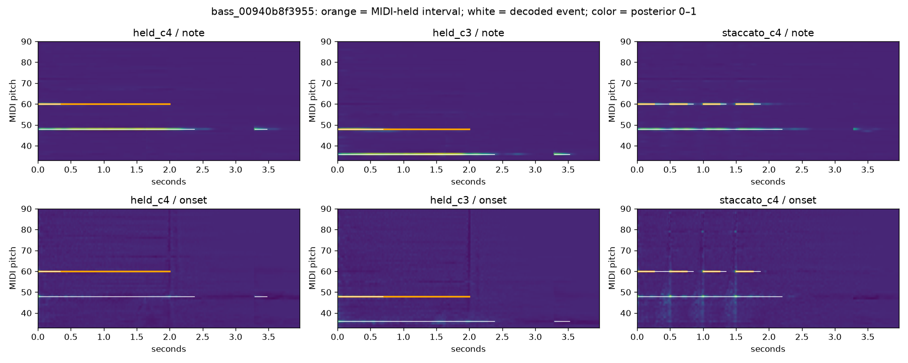
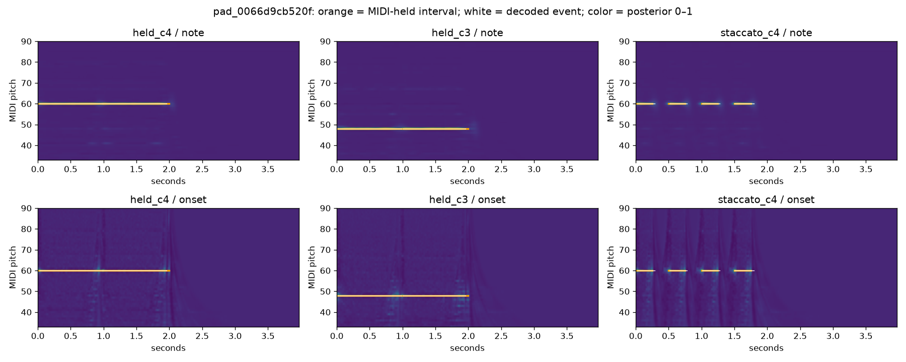
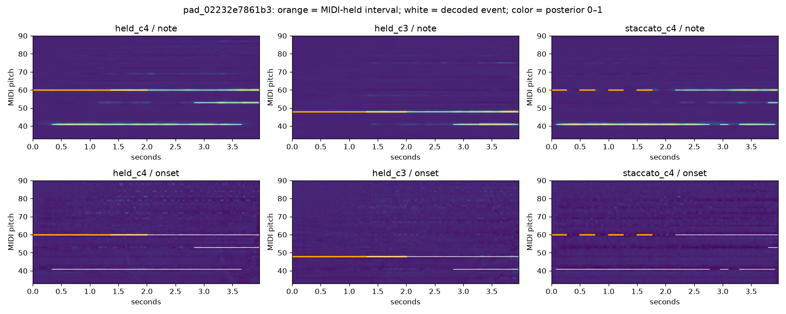
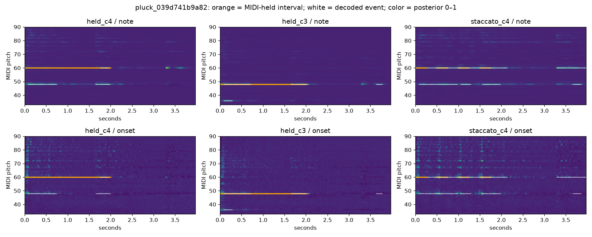
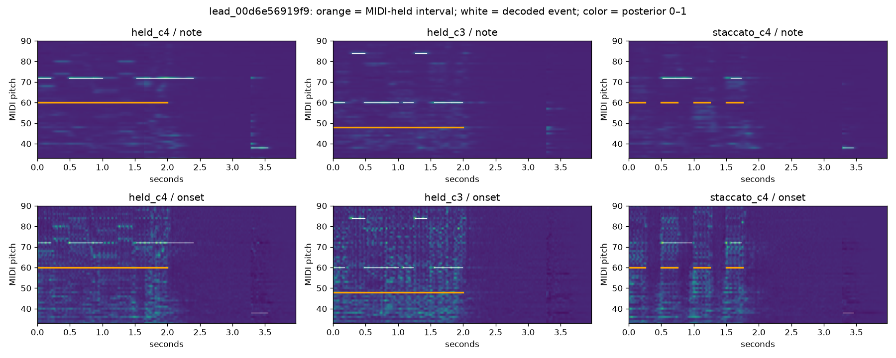

# Controlled Basic Pitch failures

Status: complete_with_failures. Scored 15/24 planned cases. Backend: pytorch_xpu, float32.

Compare each performance across the same eight fixtures. Dense note/onset posteriors and stock-decoded events localize observed pitch, onset, or segmentation failures. Reference spans are MIDI-held intervals; post-note-off acoustic release is distinct and remains in the audio.

Orange overlays show known MIDI, white shows decoded events, and color shows posterior strength. Missing/late onset support versus fragmented events over strong note support are diagnostic patterns to inspect, not automatic causal labels.

These fixture-level observations do not establish category-wide rankings, disentanglement, or downstream conditioning benefit. No inference receives MIDI. No model is trained.

Promoted evidence: [posterior diagnostics](data/posterior_diagnostics.csv) and [summary](data/encoder_summary.json).

