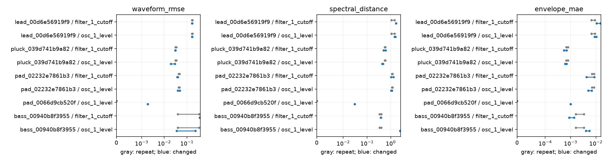

# Measurement signal and variability

Status: complete_with_failures. Attempted 54/54 renders; 33 passed QA. Observed separation in 9 fixture/control/metric combinations.

The unchanged range uses all three baseline pairs. Changed comparisons share baseline repeat 0; comparisons are not independent replicates. QA failures and missing comparisons cannot establish separation. Silent or clipped perturbations remain treatment outcomes.

Separation establishes detection on these fixtures at a 5% raw-range perturbation, not perceptual importance or a universally superior loss. Overlap can reflect stochastic variance, inaudible routing, or a small response; it does not establish unidentifiability.

Gray: repeat variation; blue: parameter change. The x-axis is diagnostic distance on a symmetric-log scale. Separation supports local detectability; lower is not automatically better.

Promoted evidence: [measurement ranges](data/measurement_ranges.csv), [comparisons](data/comparisons.csv), and [summary](data/measurement_summary.json). The path-bearing render manifest remains a private local artifact.
