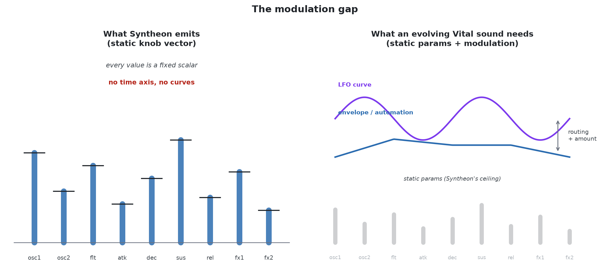

# Syntheon — research notes

> Collaborative notes on Syntheon as prior art for OBRUXO.
> Repo: https://github.com/gudgud96/syntheon · Author: Hao Hao Tan (`gudgud96`)
> There is an older report in this folder (`syntheon_research_report.md`, generated).
> These notes supersede it; we kept the old one for the trail.

## TL;DR

Syntheon is the closest thing to what we're building: feed it audio, get back a
playable preset for a soft synth (Vital). It's a differentiable-wavetable model
that infers synth parameters end-to-end with a spectral loss. It is our most
relevant baseline.

But it has one defining limitation, and it happens to be the exact thing OBRUXO
exists to solve: **Syntheon only infers static parameters.** It has no concept of
modulation — no LFOs, no envelopes-as-modulation, no automation. Vital sounds
live and die by modulation, so Syntheon caps out well short of a usable Vital
sound for most real patches.

That gap is not a footnote. It is the reason this project exists.

## The thing that matters: Syntheon is static-only

This deserves to be up front, not buried in a limitations section.



Syntheon predicts a flat vector of synthesizer parameters. The moment a sound's
character comes from a filter sweep, an LFO on pitch, an envelope shaping a
wavetable position — i.e. the majority of interesting Vital patches — Syntheon
literally has nowhere to put that information. ~98% of Serum presets use
modulation (per the WASPAA 2025 paper); there's no reason to expect Vital to be
different.

The same author (Tan) later co-authored the paper that closes exactly this gap —
*Modulation Discovery with Differentiable Digital Signal Processing* (WASPAA
2025). We have separate notes on that in
[`modulation_discovery_ddsp.md`](./modulation_discovery_ddsp.md). The short
version: they discover time-varying modulation signals from audio using LFO-net
plus a differentiable synth, and they test three parameterizations of those
signals (framewise, low-pass filtered, 2D Bézier curves — the last one maps
almost exactly onto Vital's drawable XY modulation grids).

So the intellectual arc we're plugging into is:

```text
  Syntheon (static params)                ──┐
       │ "static-only" gap                  │  same author (Tan),
       ▼                                    │  same DDSP foundation
  Modulation Discovery (WASPAA 2025)       ──┤
       │ LFO-net + Bézier/LPF curves        │
       ▼                                    │
  OBRUXO  (audio → playable .vital         ──┘
           patches with full modulation)
```

## Where Syntheon's model comes from (conceptual lineage)

Syntheon doesn't have a formal paper — only an ADC22 talk. So to understand the
*ideas* behind it, you read its lineage. Four threads feed in:

```text
  DDSP (Engel et al. 2020) ──────────────┐  differentiable DSP primitives +
                                          │  end-to-end training with spectral loss
  Diff. Wavetable Synthesis ─────────────┤  wavetable bank + differentiable mixing
   (Shan et al. ICASSP 2022) ────────────┤  ◄── this is what "WTSv2" actually is
                                          │
  CREPE (Kim et al. 2018) ───────────────┤  CNN pitch tracker, used as preprocessing
                                          │
  DiffSynth (Masuda & Shimamura 2021) ───┘  differentiable ADSR + differentiable
                                             synth for sound matching
                                         │
                                         ▼
                        Syntheon / WTSv2  (gudgud96, ADC22 talk)
```

What each actually contributed, weighted by how much of it Syntheon carried
over:

**Differentiable Wavetable Synthesis — Shan et al., ICASSP 2022** *(heaviest
contribution; this is effectively the model).*
"WTSv2" is this paper — Tan's own `diff-wave-synth` repo is an unofficial
PyTorch implementation of it, and Syntheon's model is the adapted version.
The core idea: replace a single fixed oscillator waveform with a *bank* of
wavetables and learn a differentiable mixing weight (an attention mechanism)
over them. That gives you a compact, continuous representation of timbre — you
shape sound by interpolating between a few stored single-cycle waveforms rather
than summing hundreds of additive harmonics. It's cheaper and more
synth-native than DDSP's additive harmonic oscillator, which matters because it
maps directly onto how a wavetable synth like Vital actually works. Syntheon
inherits the wavetable bank, the attention-mixing, the linear interpolation
between table samples, and the phase-accumulation oscillator pretty much as-is.

**DDSP: Differentiable Digital Signal Processing — Engel et al., ICML 2020**
*(foundational contribution; defines the training paradigm).*
The move that makes all of this trainable: build the synthesizer out of
differentiable signal-processing primitives — harmonic oscillators, filtered
noise, reverb — so you can backpropagate an audio-domain loss all the way back
to the synth's controls. Instead of treating synthesis as a fixed black box and
training a separate model to mimic its output, you train *through* the synth.
Syntheon takes several concrete things from the DDSP-PyTorch reference
implementation: the multiscale STFT spectral loss (its exact 6-scale setup), the
A-weighted loudness extraction, and the MLP/GRU module builders. Less directly
but more importantly, DDSP is the reason a "predict params, render audio,
compare to target, update params" loop is even possible — that loop *is*
Syntheon's training objective.

**DiffSynth — Masuda & Shimamura, 2021** *(medium contribution; the envelope
design).*
DiffSynth is a differentiable synthesizer built specifically for
sound-matching — i.e. the same task as Syntheon, just framed as resynthesis.
Syntheon's envelope handling is lifted from here: the differentiable ADSR with
power-function shaping (pow > 0 for convex curves, pow < 0 for concave), the
custom autograd function for differentiable rounding, and the soft-minimum
clamping with a temperature parameter. The differentiable rounding matters
because it lets gradients flow through the discrete time-quantization of the
envelope, which you need for end-to-end training. Syntheon borrows the envelope
module but swaps the oscillator for the wavetable approach above.

**CREPE — Kim et al., ISMIR 2018** *(lightest contribution; just a preprocessing
step).*
A CNN pitch estimator trained on a huge semi-supervised corpus — at the time,
the state of the art for monophonic f0 tracking. Syntheon uses the large
variant purely as a front-end: run audio through CREPE, get an f0 contour, feed
that to the wavetable oscillator. It's not integrated into the differentiable
graph; it's a fixed feature extractor. Slow (the large model is heavy), but
accurate, and it's the obvious off-the-shelf choice for pitch — there's no
reason for us to look elsewhere for that job.

## The architecture in brief

Salvaged from the generated report (these parts were accurate) and trimmed hard.

```text
  audio.wav (16 kHz, fixed 4 s)
      │
      ├──► CREPE (large) ──► f0
      ├──► A-weighted loudness
      │
      ▼
  ┌─────────────────────────────────────────┐
  │  Inferencer   (WTSv2 / Diff-WTS)        │
  │                                          │
  │   load_model()                           │
  │      └─ 10 wavetables, 100 harmonics,    │
  │         65 bands, 30 MFCC, hidden 256    │
  │   inference()                            │
  │      └─ differentiable wavetable synth + │
  │         attention mixing + differentiable│
  │         ADSR + learnable reverb IR       │
  │   convert_to_preset()                    │
  └─────────────────────────────────────────┘
      │
      ▼  parameter dict (raw model outputs)
  ┌─────────────────────────────────────────┐
  │  Converter   (Vital-specific)            │
  │                                          │
  │   Vital scaling:  attack/decay = quartic │
  │                    sustain    = linear   │
  │   wavetables → Base64                    │
  │   parseToPluginFile()                    │
  └─────────────────────────────────────────┘
      │
      ▼
  preset.vital
```

A few facts worth keeping:

- **Multiscale STFT loss.** Six FFT sizes `[4096, 2048, 1024, 512, 256, 128]`,
  75% overlap, Hann window. This is the perceptual-loss proxy — the model is
  trained to minimize spectral distance between reference and rendered audio.
- **Converter / Inferencer split.** Clean separation: the Inferencer owns the
  model and outputs a parameter dict; the Converter owns preset-file format
  translation and synth-specific parameter scaling. Each supported synth
  implements both.
- **Fixed 16 kHz, 4-second input.** Hard constraint. Simplifies the model but
  rules out anything longer or higher-resolution.
- **Vital's non-linear parameter scaling.** Attack/decay use quartic (4th-root)
  scaling, sustain is linear. Without applying this, inferred values don't map
  to audible changes. Vital's source (`synth_parameters.cpp`, `value_bridge.h`)
  is the reference.

## Inherit / Reject / Extend

This is the part the generated report never did, and the part that actually
matters for us.

| Inherit | Reject | Extend |
|---|---|---|
| **Converter/Inferencer split.** Maps cleanly onto our preset-IO vs. model separation. Preset serialization is genuinely separable from inference and should stay that way. | **Static-only parameters.** The whole frame. We can't ship a Vital tool that ignores modulation. | **Modulation / LFOs.** This is our entire `lfo_representation` program — choosing a compact, model-predictable representation of Vital custom LFO curves. |
| **Multiscale STFT as a perceptual-loss proxy.** Proven, cheap, differentiable. Likely our training loss too (at least as a component). | **Fixed 4 s / 16 kHz.** Evolving modulation often plays out over longer windows. We'll likely need to relax this. | **The modulation-discovery line** (LFO-net, Bézier/LPF parameterizations). See `modulation_discovery_ddsp.md`. |
| **CREPE as preprocessing.** Pitch is a necessary input to any wavetable-style resynthesis; no reason to reinvent it. | **The wavetable-inference silence-detection hack.** Their extractor is prone to pulling silent wavelets and falls back to "first pitch." Brittle. | **Learnability of the code.** Syntheon never had to *learn* discrete codes from audio — its wavetables come from signal extraction. Our residual-stack representation has to be predictable by a model, which is a harder and separate question (see the LFO README's "Learnability" open question). |
| **Differentiable-synth + spectral-loss paradigm.** The DDSP move. Our training signal is "does the rendered patch sound like the reference," and differentiable synthesis is how you make that trainable. | | |

```text
  ┌─────────────────────────────────────────────┐
  │            full Vital sound space            │
  │                                              │
  │   ┌──────────────────────────────┐           │
  │   │  static params  (Syntheon)   │           │
  │   │                              │           │
  │   └──────────────────────────────┘           │
  │                                              │
  │   ◄── OBRUXO extends outward: modulation,    │
  │       routing, amounts, variable length      │
  └─────────────────────────────────────────────┘
```

## Known weaknesses that bound how hard we lean on it

These set a ceiling on Syntheon's usefulness as a reference, and they're mostly
the reasons we're not just using it directly:

- **Static-only.** Covered above. This is the big one.
- **Wavetable inference is fragile.** Silence-detection bugs, fails on plucks,
  pitch bends, vibrato. The extractor assumes stable pitch regions; lots of real
  audio doesn't have those.
- **No training pipeline docs.** There's no documented way to retrain or improve
  the model. The shipped checkpoint is what you get.
- **"Evaluation" is six files.** The repo's test suite runs six audio samples
  with loss thresholds `[0.11, 0.06, 0.37, 0.42, 0.18, 0.15]`. That's a CI
  smoke test, not generalization evidence. We learn nothing about what types of
  sounds it handles well.
- **Single synth at a time, no variable-length input.** Architecture choices,
  but they constrain reuse.

## How this connects to our work

The relationship is concrete:

1. **Syntheon defines the static-parameter ceiling.** If all you want is "given a
   static timbre, find the knob settings," it's a strong reference point.
2. **The modulation gap is our wedge.** Everything in
   `research/experiments/lfo_representation/` is about the representation question
   that has to be answered *before* a model can emit playable Vital patches with
   modulation: what should the downstream model emit so it can reconstruct useful
   variable-length LFO shapes? Syntheon doesn't ask that question; we have to.
3. **The learnability gap is ours alone.** Syntheon extracts wavetables from
   audio by signal processing. Our residual-stack codes have to be *predicted*
   from audio by a learned model. That's a harder problem and Syntheon offers no
   precedent for it.

The short version: Syntheon is prior art for the *static* half of our problem and
a non-solution for the half we actually care about. Worth studying for the
architecture and the differentiable-synth paradigm; not something to extend
directly.

## References

- **Syntheon** (repo) — https://github.com/gudgud96/syntheon
  Parameter inference for music synthesizers. Supports Vital. No formal paper;
  see the ADC22 talk below.
- **"Parameter Inference of Music Synthesizers using Deep Learning"** — Hao Hao
  Tan, ADC 2022 (talk). https://www.youtube.com/watch?v=nZ560W6bA3o
  The only primary source on Syntheon itself.
- **DDSP: "DDSP: Differentiable Digital Signal Processing"** — Engel, Hantrakul,
  Bittner, Sarroff, Slaney, ISMIR 2020. https://arxiv.org/abs/2001.04643
  Differentiable DSP + spectral loss; the training paradigm Syntheon inherits.
- **"Differentiable Wavetable Synthesis"** — Shan, Caciularu, Li, Herremans,
  ICASSP 2022. https://arxiv.org/abs/2202.11486
  What "WTSv2" is adapted from (per Tan's `diff-wave-synth` repo).
- **CREPE: "CREPE: A Convolutional Representation for Pitch Estimation"** — Kim,
  Salamon, Li, Bittner, ISMIR 2018. https://arxiv.org/abs/1802.06182
  CNN pitch tracker Syntheon uses for f0 extraction.
- **DiffSynth** (repo) — https://github.com/hyakuchiki/diffsynth
  Differentiable ADSR / sound matching; source of Syntheon's envelope design.
- **diff-wave-synth** (repo) — https://github.com/gudgud96/diff-wave-synth
  Tan's unofficial PyTorch implementation of Differentiable Wavetable Synthesis.
- **"Modulation Discovery with Differentiable Digital Signal Processing"** —
  Mitcheltree, Tan, Reiss, WASPAA 2025. https://arxiv.org/abs/2510.06204
  Same author, closes the modulation gap. Notes: `modulation_discovery_ddsp.md`.
