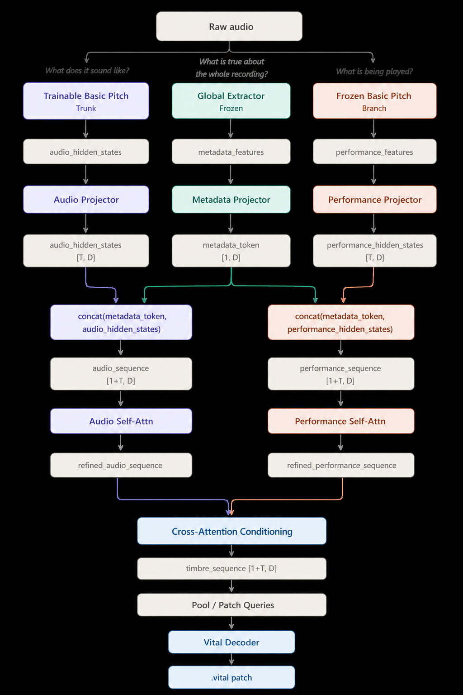

# OBRUXO Model Architecture

## Core Idea

Raw audio contains three things tangled together:

1. **What is being played** - pitch, timing, note starts, contours, phrasing.
2. **What it sounds like** - oscillator shape, filter character, envelope, noise, distortion, effects.
3. **What is true about the whole recording** - duration, loudness, density, broad spectral shape.

OBRUXO uses separate streams for these signals, then fuses them before decoding a Vital patch.

## Macro Flow

<div style="background-color: white; padding: 20px; display: inline-block;">
  
</div>

```text
                                      Raw Audio
                                          |
                 ---------------------------------------------------
                 |                        |                        |
                 v                        v                        v
        "What does it sound        "What is being          "What is true about
             like?"                    played?"            the whole recording?"

       Trainable Basic Pitch       Frozen Basic Pitch       Global Extractor
              Trunk                    Branch                      |
                 |                        |                        |
                 v                        v                        v
        <audio_hidden_states>   <performance_features>    <metadata_features>
                 |                        |                        |
                 v                        v                        v
          Audio Projector        Performance Projector     Metadata Projector
                 |                        |                        |
                 v                        v                        v
        <audio_hidden_states>  <performance_hidden_states>  <metadata_token>
              [T, D]                    [T, D]                  [1, D]
                 |                        |                        |
                 |                        |                        |
                 |                        |                        |
                 |        ---------------------------------        |
                 |        |                               |        |
                 |        v                               v        |
            concat(metadata_token,                 concat(metadata_token,
            audio_hidden_states)                   performance_hidden_states)
                     |                                         |
                     v                                         v
              <audio_sequence>                       <performance_sequence>
                  [1+T, D]                                 [1+T, D]
                     |                                         |
                     v                                         v
                Audio Self-Attn                       Performance Self-Attn
                     |                                         |
                     v                                         v
           <refined_audio_sequence>              <refined_performance_sequence>
                     |                                         |
                     -------------------------------------------
                                          |
                                          v
                            Cross-Attention Conditioning
                                          |
                                          v
                                 <timbre_sequence>
                                      [1+T, D]
                                          |
                                          v
                                Pool / Patch Queries
                                          |
                                          v
                                   <patch_latent>
                                          |
                                          v
                                    Vital Decoder
                                          |
                                          v
                                    .vital patch
```

## What Each Stream Does

- The **trainable Basic Pitch trunk** starts from Basic Pitch-style audio features, but is allowed to adapt toward timbre and patch reconstruction.
- The **frozen Basic Pitch branch** acts as a stable performance prior. It tells the model what the audio seems to be playing, without needing a separate MIDI input at runtime.
- The **metadata token** gives both streams shared recording-level context. It is concatenated into both the audio and performance sequences.
- The **cross-attention step** conditions the audio stream on the performance stream. This is not literal subtraction; it is the model learning which parts of the audio imply the patch after accounting for what was played.
- The **patch latent** is pooled from the timbre sequence because a Vital patch is a structured parameter set, not a frame-by-frame output.

## Runtime Input

The intended runtime input is raw audio.

Submitted MIDI files are still useful during training as supervision for performance understanding, but the model should infer performance information inside the flow rather than requiring a separate MIDI input path.


## Decoder

Related reading: arXiv 2509.07635, Combes et al., Sept 2025

The decoder maps `<patch_latent>` to a `.vital` patch.

### The core problem

The mapping from patch to audio is many-to-one — two different `.vital` patches can
produce perceptually identical audio. Direct parameter supervision would penalize the
decoder for finding valid alternative solutions. The correct objective is reconstruction
quality in audio space, not parameter-space distance, pointing toward:

> `L = STFT_distance(Vital(P_pred, MIDI_true), audio_true)`

> `audio_true = Vital(P_true, MIDI_true)` where `P` is the `.vital patch`

### The differentiability problem

`Vital()` is not differentiable — it has no backward pass and produces no Jacobian.
Gradients from the STFT loss cannot flow back into the decoder. The options identified are:

1. **Neural surrogate** — a differentiable approximation of `Vital(patch, MIDI) → audio` Can be trained on the same dataset as OBRUXO. Requires pretraining before connecting to decoder to avoid corrupt early gradients.
2. **[EASY - but doesn't work well on nonlinear controls] Straight-through estimator** — treat Vital as identity and pass gradients straight back. Theoretically wrong but may work in practice for smooth continuous parameters.
3. **[IGNORE] Finite differences** — numerically estimate `∂L/∂P_pred` by perturbing each parameter and running Vital twice. Honest but expensive.

**No decision has been made.**

### Mod matrix

The mod matrix is the variable-length relational sub-output of the decoder — a set of 0–32 edges each with `from` (modulation source), `to` (destination parameter), `amount` (float), and `active` (bool). Because it is an unordered set, standard flat-vector decoding is a poor fit.

Three structural approaches were identified:

1. **Fixed output + masking** — always output 32 slots, use `active` flag to mask inactive edges at inference. Simple, no recurrence.
2. **Autoregressive** — decode one edge per step, emit a `<STOP>` token to terminate. Handles variable length naturally, allows each edge to condition on previous ones.
3. **Set prediction (DETR-style)** — 32 learned slot query embeddings cross-attend to `<patch_latent>`, all slots decoded in parallel. Requires Hungarian matching during training to align predicted slots to ground-truth.

**No decision has been made.**
