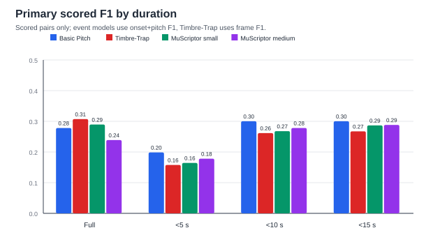
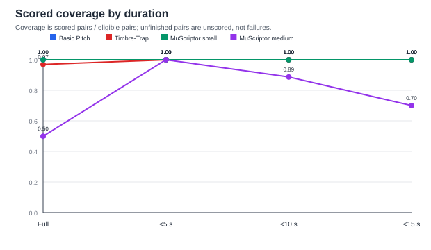
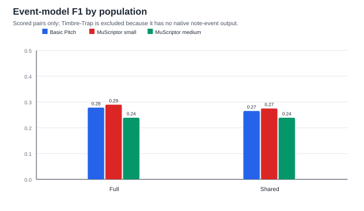
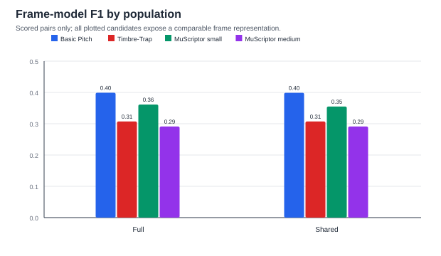

# Performance transcription benchmark

## Research status

**Comparative status: `partial_executable_candidates`.** `4` of `8` configured candidates produced executable evidence; `4` remain externally blocked or unavailable before measurement. The report separates measured candidates from genuine blockers and does not infer a composite winner.

The JSON is authoritative, but this Markdown is intended to stand alone as the research finding. Quality, execution/resource cost, backward cost, representation, licensing, and quantization remain separate evidence classes; no composite winner is computed.

## What was successfully established

- Measured candidates: `basic_pitch, timbre_trap_base, muscriptor_small, muscriptor_medium`.
- Partial scored-population candidates: `timbre_trap_base, muscriptor_medium`; unfinished rows are unscored, not failures, and these candidates are not treated as completed correctness evaluations.
- Metadata-only or unavailable candidates: `ymt3_plus, yptf_multi, yptf_moe_multi, muscriptor_large`.
- Directly measured scope: Executable evidence is present for basic_pitch, timbre_trap_base, muscriptor_small, muscriptor_medium. Basic Pitch quality and cost evidence are inherited from #25/#24; timbre_trap_base, muscriptor_small, muscriptor_medium produced new #26 evidence in the unchanged py312 runtime. Partial scored populations are explicitly identified for timbre_trap_base, muscriptor_medium; rows not reached before the experiment ended are unscored, not failures.
- Sourced/model-level scope: Candidate source, checkpoint, representation, architecture boundary, native sample rate, batch semantics, and license fields are verified inventory facts; they are not performance measurements.
- Adapter implementation scope: The repository contains an implemented pinned-official adapter path for every required candidate family. An implemented adapter is not treated as executed when its source, checkpoint, dependency, or credential prerequisite is unavailable.
- Unresolved comparative scope: The intended comparative benchmark remains incomplete for unavailable candidates `ymt3_plus, yptf_multi, yptf_moe_multi, muscriptor_large` and partial scored populations `timbre_trap_base, muscriptor_medium`; measured candidates are reported separately and no unavailable candidate receives a fabricated score.

## Candidate identity and known properties

These are verified inventory facts, separated from observations produced by executing a model. A known source, representation, or license does not imply that the candidate was runnable here.

| Candidate | Family | Status | Measurement | Output / representation | Native rate | Native batch | Code / weight license | Differentiable boundary |
| --- | --- | --- | --- | --- | ---: | --- | --- | --- |
| `basic_pitch` | `basic_pitch` | `ok` | `complete` | `note_and_frame`; dense=note_posterior_on_model_frames; event=stock_polyphonic_decoder | 22050 | `1, 2, 4, 8` | `Apache-2.0 / Apache-2.0` | `native_pytorch_forward` |
| `timbre_trap_base` | `timbre_trap` | `ok` | `partial_unscored_population` | `frame_pitch`; native_frame_pitch | 22050 | `1` | `MIT / upstream_space_license_not_separately_declared` | `native_forward_if_upstream_runtime_is_present` |
| `ymt3_plus` | `yourmt3` | `unavailable` | `not_measured` | `note_events`; stock_midi_note_events | 16000 | `1` | `GPL-3.0-only / Apache-2.0` | `not_exposed_by_stock_inference_path` |
| `yptf_multi` | `yourmt3` | `unavailable` | `not_measured` | `note_events`; stock_midi_note_events | 16000 | `1` | `GPL-3.0-only / Apache-2.0` | `not_exposed_by_stock_inference_path` |
| `yptf_moe_multi` | `yourmt3` | `unavailable` | `not_measured` | `note_events`; stock_midi_note_events | 16000 | `1` | `GPL-3.0-only / Apache-2.0` | `not_exposed_by_stock_inference_path` |
| `muscriptor_small` | `muscriptor` | `ok` | `complete` | `note_events`; timing_corrected_midi_note_events | 16000 | `1` | `MIT / CC-BY-NC-4.0` | `not_exposed_by_stock_generation_path` |
| `muscriptor_medium` | `muscriptor` | `ok` | `partial_unscored_population` | `note_events`; timing_corrected_midi_note_events | 16000 | `1` | `MIT / CC-BY-NC-4.0` | `not_exposed_by_stock_generation_path` |
| `muscriptor_large` | `muscriptor` | `unavailable` | `not_measured` | `note_events`; timing_corrected_midi_note_events | 16000 | `1` | `MIT / CC-BY-NC-4.0` | `not_exposed_by_stock_generation_path` |

### Identity/source inventory

| Candidate | Source identity | Checkpoint identity | Availability reason |
| --- | --- | --- | --- |
| `basic_pitch` | `spotify/basic-pitch @ 9991303bba609a3b93089d13ec80d1d495083596` | `noisedoctrine/obruxo @ 918a1678465815c6f0a70009910737c164ed5a02` | available and verified |
| `timbre_trap_base` | `sony/timbre-trap @ 7afe7e9b327929c099baeccd4b21973aedb94d9b` | `cwitkowitz/timbre-trap @ 84fbd38582435c863a2d65197a75edd794888f19` | approved py312 storage has no pinned Timbre-Trap checkout or checkpoint |
| `ymt3_plus` | `mimbres/YourMT3 @ 5e66c1ea173a8186e0d20432b841d3180cc015b5` | `mimbres/YourMT3 @ 5e66c1ea173a8186e0d20432b841d3180cc015b5` | official source and checkpoint are not present in permitted local storage |
| `yptf_multi` | `mimbres/YourMT3 @ 5e66c1ea173a8186e0d20432b841d3180cc015b5` | `mimbres/YourMT3 @ 5e66c1ea173a8186e0d20432b841d3180cc015b5` | official source and checkpoint are not present in permitted local storage |
| `yptf_moe_multi` | `mimbres/YourMT3 @ 5e66c1ea173a8186e0d20432b841d3180cc015b5` | `mimbres/YourMT3 @ 5e66c1ea173a8186e0d20432b841d3180cc015b5` | official source and checkpoint are not present in permitted local storage |
| `muscriptor_small` | `muscriptor/muscriptor @ c3a50ec3f7a54361495b79ed8875ba330240324c` | `MuScriptor/muscriptor-small @ 8c127f603b807520fa465c838e9bfee8a91ada4e` | available and verified |
| `muscriptor_medium` | `muscriptor/muscriptor @ c3a50ec3f7a54361495b79ed8875ba330240324c` | `MuScriptor/muscriptor-medium @ f32236969308476e01fd3aae67357de5feb05a2d` | available and verified |
| `muscriptor_large` | `muscriptor/muscriptor @ c3a50ec3f7a54361495b79ed8875ba330240324c` | `MuScriptor/muscriptor-large @ 8809fdfbed2affa7ade94a7059e746e3880720e7` | exact pinned checkpoint acquisition returned gated access (HTTP 403); no authorized account access is available |

Checkpoint lock status is explicit in the JSON source of truth: `locked` means the public digest and byte size are fixed; `gated_digest_not_exposed_without_access` means the immutable model revision and public size are recorded but the upstream gated service did not expose a digest without access. Neither state implies local executability.

Sourced representation notes: Timbre-Trap is retained as a native frame/pitch output and is not given a fabricated note-event decoder; YourMT3 variants expose stock note-event output; MuScriptor exposes timing-corrected MIDI note events with stock prelude forcing. These facts describe upstream interfaces, not measured OBRUXO performance.

## What was actually executed

Basic Pitch quality/cost evidence is consumed from the landed #25/#24 reports. Executed #26 alternatives are `timbre_trap_base, muscriptor_small, muscriptor_medium`; partial scored-population alternatives are identified separately and are not treated as completed correctness evaluations. Blocked candidates are reported separately. No new rendering or Basic Pitch rerun is implied.

### Cached quality by duration and comparison population

These views are derived from already-cached observations; no model inference was rerun. The charts show the full eligible population, duration cutoffs, and the shared scored population without turning pairs that were never reached before wrap-up into failures. F1 is therefore computed from scored pairs only, with coverage shown separately. The JSON retains the detailed aggregate diagnostics, counts, category groups, and bootstrap intervals.

<table>
<tr>
<td valign="top"></td>
<td valign="top"></td>
</tr>
<tr>
<td valign="top"></td>
<td valign="top"></td>
</tr>
</table>

Open the charts directly: [quality by duration](charts/quality_by_duration.svg) | [coverage by duration](charts/coverage_by_duration.svg) | [event F1](charts/event_f1_population.svg) | [frame F1](charts/frame_f1_population.svg).

| Candidate | Primary plotted metric | Full scored | Full unscored | Full scored-only F1 | Shared scored-only F1 |
| --- | --- | ---: | ---: | ---: | ---: |
| `basic_pitch` | `onset+pitch F1` | 1769 | 0 | 0.278 | 0.265 |
| `timbre_trap_base` | `frame F1` | 1715 | 54 | 0.307 | 0.307 |
| `muscriptor_small` | `onset+pitch F1` | 1769 | 0 | 0.289 | 0.275 |
| `muscriptor_medium` | `onset+pitch F1` | 883 | 886 | 0.239 | 0.239 |
- The `Full unscored` column is the number of eligible pairs with no cached prediction at wrap-up. It is not a failure count. Timbre-Trap is frame/pitch output only; it has no onset/offset event score because no MIDI/event decoder was used.
### Basic Pitch quality evidence inherited from #25

- Source: `landed_issue_25_report`; eligible population: `1769`; coverage: `1.000`.
- Recorded #25 backend: `pytorch_xpu`; boundary: `end_to_end_audio_to_note_event`; precision: `float32`.
- #25 route provenance assessment: `exact_issue_24_decision_consumed`. The full-corpus quality result is attributed to the exact #24-selected runtime. It does not establish quality equivalence for any other backend.

| Quality view | Eligible | Succeeded | Failed | Coverage | Onset+pitch F1 | Onset+pitch+offset F1 | Frame F1 |
| --- | ---: | ---: | ---: | ---: | ---: | ---: | ---: |
| `success_only` | 1769 | 1769 | 0 | 1.000 | 0.278 | 0.098 | 0.399 |
| `failure_penalized` | 1769 | 1769 | 0 | 1.000 | 0.278 | 0.098 | 0.399 |

- Uncertainty: `10000` seed-`0` preset-cluster replicates over `1769` clusters. These are Basic Pitch baseline intervals, not alternative-model comparisons.

### Basic Pitch execution and resource evidence inherited from #24

- Source: `landed_issue_24_report`; Routes and findings are consumed from the landed #24 report; #26 does not rerun Basic Pitch cost measurements.
- Cost evidence is route-specific; a route failure is not converted into a score or a fallback result.
- The table below consumes the current #24 route rows. The historical default OpenVINO GPU failure and the bounded corrected parity diagnostic remain separate from the corrected timed route row.

| Mode | Route | Evidence state | Batch-1 throughput | Batch-8 throughput | E2E rate | Startup (s) | Host RSS (MiB) | XPU allocated/reserved (MiB) | OpenVINO GPU memory (MiB) |
| --- | --- | --- | ---: | ---: | ---: | ---: | ---: | --- | ---: |
| `inference` | `pytorch_cpu` | `ok` | 78.610 | 179.190 | 51.896 | 0.783 | 609.1 | n/a / n/a | n/a |
| `inference` | `pytorch_xpu` | `ok` | 238.368 | 727.274 | 96.027 | 0.804 | 2331.6 | 70.3 / 124.0 | n/a |
| `inference` | `openvino_cpu` | `parity_failed` | n/a | n/a | n/a | n/a | n/a | n/a / n/a | n/a |
| `inference` | `openvino_gpu` | `measured_corrected_fp32_performance` | 111.703 | 304.494 | 44.868 | 2.700 | 1209.5 | n/a / n/a | 241.5 / 16762.6 |
| `training` | `pytorch_cpu` | `ok` | 28.533 | 28.735 | n/a | 0.804 | 910.0 | n/a / n/a | n/a |
| `training` | `pytorch_xpu` | `ok` | 87.951 | 227.634 | n/a | 0.776 | 2925.7 | 182.1 / 316.0 | n/a |

Historical route records:
- `openvino_cpu`: `parity_failed`. The landed #24 report suppresses timing for this route.

### OpenVINO GPU evidence state

- Historical pre-fix/default result: requested `plugin default (observed float16)`, observed `plugin default (observed PERFORMANCE)`; status `parity_failed` before timing. Non-finite contour/note/onset values were `227040` / `75680` / `75680`; candidate/reference event counts were `0` / `8`. No performance or resource result is inferred from this failed route.
- Bounded diagnostic result (corrected): requested `INFERENCE_PRECISION_HINT=float32`, compiled `float32` + `PERFORMANCE`; status `parity_passed` on `5` public synthetic windows.
- Bounded parity metrics: non-finite values and threshold/event disagreements were `0`; maximum contour/note/onset errors were `0.000001431`, `0.000000715`, and `0.000001132`.
- Corrected measured result: the actual #24 smoke route compiled `float32` on `Intel(R) Arc(TM) 140T GPU (16GB) (iGPU)` with `PERFORMANCE` execution; timed-route parity is `passed`.
- Corrected startup medians: backend import `0.777` s, model conversion `1.592` s, GPU compilation `0.346` s, total startup `2.700` s; first-call / warmup at batch 1 `0.038` / `0.062` s.
- Corrected steady-state audio-equivalent throughput (audio-s/s): batch 1 `111.703`, batch 2 `242.847`, batch 4 `287.862`, batch 8 `304.494`.
- Corrected end-to-end throughput: `44.868` audio-s/s; host peak RSS `1209.5` MiB; OpenVINO GPU memory `241.5` / `16762.6` MiB where reported.
- Timed-route parity errors: non-finite values and threshold/event disagreements were `0`; maximum contour/note/onset errors were `0.000001431`, `0.000000715`, and `0.000001132`.

### Basic Pitch quantization evidence

- Status: `not recorded`; ordinary Linear modules `n/a` -> `n/a`; engine `n/a`.
- No quantized artifact was produced, and no quantized XPU/OpenVINO/backward/batch-sweep result exists.

## Executed alternative-candidate evidence

These rows are measured #26 results from the exact #25 eligible population. Timbre-Trap contributes frame quality only; native note-event metrics are shown only for event-output candidates. `n/a` means the metric is not applicable, not zero.

| Candidate | Scored coverage | Onset+pitch F1 | Frame F1 | CPU E2E audio-s/s | XPU E2E audio-s/s | CPU host RSS MiB | Quantization |
| --- | ---: | ---: | ---: | ---: | ---: | ---: | --- |
| `timbre_trap_base` | 0.969 | n/a | 0.307 | n/a | n/a | n/a | `not_run` |
| `muscriptor_small` | 1.000 | 0.289 | 0.361 | n/a | n/a | n/a | `not_run` |
| `muscriptor_medium` | 0.499 | 0.239 | 0.291 | n/a | n/a | n/a | `not_run` |

### Alternative quality and route details

#### `timbre_trap_base`

- Measurement status: `partial_unscored_population`; a later apples-to-apples correctness run is still required before this candidate can be treated as complete.
- `scored_only`: 1715 scored, 54 unscored of `1769` eligible, coverage `0.969`, onset+pitch F1 `n/a`, onset+pitch+offset F1 `n/a`, frame F1 `0.307`.
- Category range (scored-only frame F1): highest `type=Sub` = `0.465` over `2` pairs; lowest `type=Drums` = `0.027` over `43` pairs. Small supports should not be treated as robust rankings.
#### `muscriptor_small`

- `success_only`: 1769 scored of `1769` eligible, coverage `1.000`, onset+pitch F1 `0.289`, onset+pitch+offset F1 `0.163`, frame F1 `0.361`.
- `failure_penalized`: 1769 scored of `1769` eligible, coverage `1.000`, onset+pitch F1 `0.289`, onset+pitch+offset F1 `0.163`, frame F1 `0.361`.
- Category range (scored-only onset+pitch F1): highest `type=Sub` = `0.830` over `2` pairs; lowest `type=Reese` = `0.041` over `16` pairs. Small supports should not be treated as robust rankings.
#### `muscriptor_medium`

- Measurement status: `partial_unscored_population`; a later apples-to-apples correctness run is still required before this candidate can be treated as complete.
- `scored_only`: 883 scored, 886 unscored of `1769` eligible, coverage `0.499`, onset+pitch F1 `0.239`, onset+pitch+offset F1 `0.129`, frame F1 `0.291`.

## What could not be executed

The table distinguishes a genuine candidate-level blocker or load failure from a measured candidate. No unavailable candidate receives an invented quality or cost result.

| Candidate | Status | Concrete blocker/failure | What this prevents |
| --- | --- | --- | --- |
| `ymt3_plus` | `unavailable` | official source and checkpoint are not present in permitted local storage | no comparative quality/cost result |
| `yptf_multi` | `unavailable` | official source and checkpoint are not present in permitted local storage | no comparative quality/cost result |
| `yptf_moe_multi` | `unavailable` | official source and checkpoint are not present in permitted local storage | no comparative quality/cost result |
| `muscriptor_large` | `unavailable` | exact pinned checkpoint acquisition returned gated access (HTTP 403); no authorized account access is available | no comparative quality/cost result |

## Partial or incomplete candidate execution

These candidates produced some pair-level evidence but did not complete the exact-population correctness gate. The remaining pairs were not reached before wrap-up, so they are unscored rather than failures; no failure-penalized score is published for those rows.

| Candidate | Scored pairs | Unscored pairs | Remaining requirement |
| --- | ---: | ---: | --- |
| `timbre_trap_base` | 1715 | 54 | apples-to-apples correctness run on the full #25 population |
| `muscriptor_medium` | 883 | 886 | apples-to-apples correctness run on the full #25 population |

## Conclusions by evidence class

### Directly supported by measured results

- Measured evidence exists for basic_pitch, timbre_trap_base, muscriptor_small, muscriptor_medium. Basic Pitch contributes the inherited #25 quality and #24 route/cost baseline; executable alternatives contribute their own #26 corpus quality and applicable CPU/XPU cost measurements. Partial scored populations are not complete correctness results, and their unscored rows are not treated as failures.
- Basic Pitch remains the inherited baseline for the landed #24/#25 contracts; alternative rows are separate #26 measurements and do not replace that provenance.
- The measured #24 model-call throughput winners were batch 1: `pytorch_xpu` (238.368 audio-s/s), batch 2: `pytorch_xpu` (417.493 audio-s/s), batch 4: `pytorch_xpu` (616.100 audio-s/s), batch 8: `pytorch_xpu` (727.274 audio-s/s); the end-to-end winner was `pytorch_xpu` (96.027 audio-s/s). These are Basic Pitch route findings, not alternative-model results.
- The #25 quality result is explicitly provenanced to the exact #24-selected `pytorch_xpu` route on `xpu:0`; it does not establish quality equivalence for any other backend.

### Bounded diagnostic results

- A separate bounded #24 diagnostic compiled OpenVINO GPU with INFERENCE_PRECISION_HINT=float32 while retaining PERFORMANCE and passed parity on five public synthetic windows. This is a parity result, not a performance/resource result.
- The bounded corrected parity diagnostic remains a correctness result; the corrected GPU timing/resource rows above are the separate measured result.

### Supported only by verified model characteristics

- The candidate inventory establishes model identity, representation, architecture boundary, native rate/batch semantics, and licensing where verified, but none of these facts ranks execution quality or cost.
- Representation and licensing facts can inform later integration design, but they do not establish transcription quality, runtime cost, memory, or suitability.

### Comparative questions that remain unanswered

- Comparative questions remain for unavailable candidates `ymt3_plus, yptf_multi, yptf_moe_multi, muscriptor_large` and partial scored populations `timbre_trap_base, muscriptor_medium`; measured candidates must be compared by separate quality and cost evidence rather than a composite winner.
- The remaining candidate execution states are ymt3_plus, yptf_multi, yptf_moe_multi, muscriptor_large; their quality, cost, memory, backward, and quantization results are not inferred from metadata or from other models. Partial scored-population candidates still require full-population correctness confirmation.
- Quality is published only for candidates with an executed #25-compatible population; globally unavailable models receive no invented F1.

## What is required before the intended comparison can be completed

The remaining blocked candidates require the following concrete external prerequisites:

- `ymt3_plus`: official source and checkpoint are not present in permitted local storage.
- `yptf_multi`: official source and checkpoint are not present in permitted local storage.
- `yptf_moe_multi`: official source and checkpoint are not present in permitted local storage.
- `muscriptor_large`: exact pinned checkpoint acquisition returned gated access (HTTP 403); no authorized account access is available.
- After those prerequisites become available, run only the fixed common #25 population and applicable #24 cost routes; do not infer their results from measured candidates.

## Contract and privacy limits

- Quality: `landed_issue_25_metrics_and_10000_replicate_seed_0_bootstrap`; cost: `landed_issue_24_end_to_end_boundary`; quantization: `cpu_dynamic_qint8_ordinary_linear_only`.
- #26 reused the exact #25 eligible population/audio provenance and the landed #24 results; it did not render, rebuild audio, rerun Basic Pitch, or use alternative fallbacks.
- Private paths, pair identifiers, source filenames, row predictions, gated weights, and local run state are excluded from this public report.
