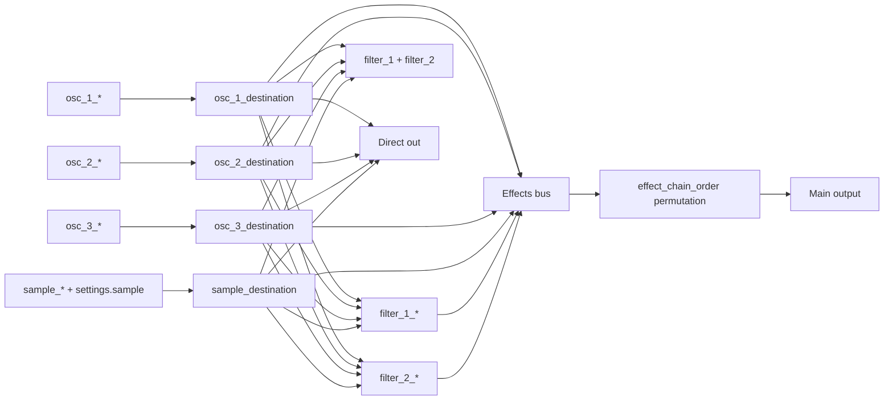
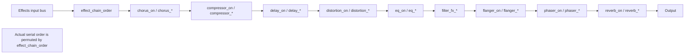

# Vital Preset JSON and Settings Schema

## Executive summary

A `.vital` preset is a JSON document. At the outermost level, Vital writes preset metadata such as `synth_version`, `preset_name`, `author`, `comments`, `preset_style`, and `macro1` through `macro4`, plus a large `settings` object. When loading a preset, Vital parses the JSON text directly and then applies `settings` into the synth state; any missing scalar control key falls back to the parameter metadata default from the built-in parameter table. citeturn36view1turn36view2turn33search0

For modeling, the crucial point is that `settings` is not just a small “main controls” object. It is the **full control-state carrier**. It contains: a flat map of scalar control values keyed by control name; a nested `sample` object; a `modulations` array; a `wavetables` array; and an `lfos` array. Vital serializes all current control values first, then appends those nested structures. citeturn36view0turn39view5

The most important corrections to earlier descriptions are these. `beats_per_minute` is stored in **beats per second** in raw JSON, not BPM; Vital’s metadata applies a display multiplier of `60`, so raw `2.0` displays as `120 BPM`. `voice_priority` and `voice_override` are stored as **numeric enum ordinals**, not strings. `distortion_drive` is `-30..30 dB`, coming directly from the distortion DSP header. The compressor block is not sparse; it is a **21-scalar family** in the top-level flat controls. citeturn44view0turn28view1turn28view2turn28view3turn40view0

The maximal `settings` schema is therefore best understood as four layers. First, a flat scalar control namespace. Second, repeated scalar families for oscillators, filters, envelopes, LFOs, random modulators, and modulation slots. Third, nested state-bearing objects like `sample`, `wavetables`, and drawable `lfos`. Fourth, relationship objects in `settings.modulations`, where each modulation connection stores `source`, `destination`, and optionally a non-linear `line_mapping`. citeturn39view5turn39view4turn36view0

For an audio→`.vital` model under your stated constraints—**default sample oscillator** and **default wavetables only**—the cleanest target representation is: emit raw scalar controls exactly as Vital stores them; emit modulation connections explicitly; and either hold `settings.sample`, `settings.wavetables`, and the custom drawable `settings.lfos` at canonical defaults or predict them in a constrained secondary stage. That avoids unit-conversion ambiguity and prevents display-space errors. citeturn36view0turn24view3turn22view5

## Schema overview

Vital’s save path makes the outer preset schema relatively clear. `LoadSave::stateToJson` serializes all controls into `settings_data`, then appends `sample`, `modulations`, `wavetables`, and `lfos`, and finally wraps that `settings` object with preset-level metadata. citeturn36view0turn36view1

A maximal structural skeleton looks like this:

```json
{
  "synth_version": "…",
  "preset_name": "…",
  "author": "…",
  "comments": "…",
  "preset_style": "…",
  "macro1": "…",
  "macro2": "…",
  "macro3": "…",
  "macro4": "…",
  "settings": {
    "<flat scalar control key>": <number>,
    "sample": { "...": "..." },
    "modulations": [
      {
        "source": "<mod source name>",
        "destination": "<destination name>",
        "line_mapping": { "...": "..." }
      }
    ],
    "wavetables": [
      { "...": "..." },
      { "...": "..." },
      { "...": "..." }
    ],
    "lfos": [
      { "...": "..." }
    ]
  }
}
```

That skeleton is directly supported by Vital’s serializer and loader, with one important nuance: `line_mapping` is omitted for a modulation when the remap is linear. citeturn36view0turn39view4

A breadth-first inventory of the `settings` object is below.

| Settings substructure | Shape | Status | Notes | Source |
|---|---|---:|---|---|
| Flat scalar controls | object mapping control-name → number | Resolved | Vital iterates all controls and writes their raw numeric value. | `load_save.cpp` `stateToJson` citeturn36view0 |
| `sample` | object | Partly unresolved | Serialized from `sample->stateToJson()`. Exact inner field schema was not fully recoverable from accessed sources. | `load_save.cpp` citeturn36view0turn35view7 |
| `modulations` | array of objects | Resolved | Each element stores `source`, `destination`, and optional `line_mapping`. | `load_save.cpp` citeturn39view4 |
| `wavetables` | array of objects | Partly unresolved | One element per wavetable oscillator; exact wavetable object schema not fully recovered here. | `load_save.cpp` citeturn36view1turn39view5 |
| `lfos` | array of objects | Partly unresolved | One drawable shape object per LFO, serialized via `LineGenerator::stateToJson()`. Exact inner point schema unresolved in accessed sources. | `load_save.cpp` citeturn36view1turn39view5 |

The scalar-family expansion is where most of the size lives. A practical count table is:

| Major component | Pattern | Scalars per instance | Resolved instance count | Resolved scalar total | Confidence |
|---|---|---:|---:|---:|---|
| Global and top-level unique controls | exact keys | — | — | 143 | High citeturn44view0turn29view0turn32view1turn32view2turn32view3turn31view0turn31view1turn31view2turn31view3turn31view4turn32view0turn30view6turn30view7 |
| Oscillators | `osc_<n>_<field>` | 29 | 3 | 87 | High for count of 3 oscillators; field family resolved citeturn10view0turn10view1turn10view2turn10view3turn10view4turn36view3 |
| Filters | `filter_1_*`, `filter_2_*`, `filter_fx_*` | 20 | 3 families | 60 | High citeturn11view2turn9view4turn9view5turn8view5 |
| Envelopes | `env_<n>_<field>` | 9 | 6 | 54 | Medium; field family primary, count of 6 from community documentation/forum discussion rather than accessed source header citeturn9view0turn11view3turn42search3 |
| Drawable LFOs | `lfo_<n>_<field>` | 11 | 8 | 88 | Medium; field family primary, count of 8 from community/forum evidence citeturn9view1turn9view2turn11view4turn42search8 |
| Random modulators | `random_<n>_<field>` | 8 | unresolved | unresolved | Field family resolved; number of random slots not recovered from accessed primary sources citeturn11view0 |
| Mod-matrix slot scalars | `modulation_<n>_<field>` | 5 | 64 | 320 | Medium; family resolved, 64-slot count from community/forum evidence citeturn11view1turn44view0turn43search7 |

Two operational conclusions follow from that table. First, the **flat scalar namespace alone is already large**: a lower bound of `143 + 87 + 60 + 54 + 88 + 320 = 752` raw scalars, before counting random modulator families and before unpacking nested `sample`, `wavetables`, `lfos`, and modulation `line_mapping` shapes. Second, the nested shape-bearing objects are structurally important but are a bad first target for an ML model unless you constrain them tightly. citeturn36view0turn39view5turn43search7

## Scaling and value semantics

Vital’s parameter metadata lives in `ValueDetails`. Through the Vita bindings, the exposed metadata fields are `name`, `min`, `max`, `default_value`, `version_added`, `post_offset`, `display_multiply`, `scale`, `display_units`, `display_name`, `is_discrete`, and `options`. The available scale kinds are `Indexed`, `Linear`, `Quadratic`, `Cubic`, `Quartic`, `SquareRoot`, and `Exponential`. For indexed controls, Vita constructs the option labels by iterating integer ordinals from `min` through `max` and dereferencing the string lookup table when present. citeturn24view2turn24view3turn22view0turn22view4

That metadata implies three practical parameter classes:

| Class | Stored form in JSON | Interpretation | Typical examples | Source |
|---|---|---|---|---|
| Categorical enum | number, usually integer ordinal | Discrete label set; usually `scale = Indexed` | `voice_priority`, `voice_override`, `oversampling`, `delay_style` | `synth_parameters.cpp`, Vita `options` behavior citeturn30view6turn30view7turn22view4 |
| Boolean-like enum | number `0/1` | Still an indexed enum, not JSON `true/false` | `delay_on`, `reverb_on`, `mpe_enabled`, `osc_<n>_on` | `synth_parameters.cpp` citeturn44view0turn30view0turn9view0turn10view0 |
| Continuous numeric | number | Raw DSP/UI parameter value, sometimes nonlinearly displayed | `distortion_drive`, `volume`, `attack`, `lfo_frequency` | `synth_parameters.cpp`, `distortion.h`, Vita scale helpers citeturn29view0turn28view1turn22view5 |

For ML purposes, the raw JSON value is the ground truth. Display values are derived from the raw value plus the metadata. From the metadata and Vita’s normalization helpers, the display side is best treated as:

- `Indexed`: raw ordinal directly selects an option label.
- `Linear`: display is approximately `raw * display_multiply + post_offset`.
- `Quadratic`, `Cubic`, `Quartic`, `SquareRoot`, `Exponential`: display first applies the associated scale function, then the multiplier and offset. This display rule is partly inferential, but it is strongly supported by the Vital metadata and Vita’s conversion code paths. citeturn24view2turn22view5

The most consequential examples are:

| Key | Raw range | Display behavior | Default raw → display | Interpretation |
|---|---|---|---|---|
| `beats_per_minute` | `0.333333333 .. 5.0` | linear, `×60`, no units string | `2.0 → 120` | Raw is **BPS**, displayed as BPM. citeturn44view0 |
| `voice_tune` | `-1 .. 1` | linear, `×100`, units `cents` | `0 → 0 cents` | Raw unit is semitone fraction; display is cents. citeturn32view1 |
| `pan` / `sample_pan` / `sub_pan` | `-1 .. 1` | linear, `×100`, units `%` | `0 → 0%` | Symmetric panning amount. citeturn10view0turn32view2turn32view3 |
| `volume` | `0 .. 7399.4404` | square-root scaled, then `-80 dB` offset | `5473.0404 → about -6.02 dB` | Strong example of “emit raw, not display.” citeturn31view0turn22view5 |
| `env_<n>_attack` | `0 .. 2.37842` | quartic seconds | `0.1495 → about 0.0005 s` | UI time is highly non-linear. citeturn9view0turn11view3turn22view5 |
| `lfo_<n>_frequency` | `-7 .. 9` | exponential, invert, seconds | `1.0 → 0.5 s` | This is better thought of as a stored period exponent than literal Hz. citeturn9view1turn22view5 |
| `reverb_decay_time` | `-6 .. 6` | exponential seconds | `0 → 1 s` | Raw exponent domain. citeturn30view0turn22view5 |
| `distortion_drive` | `-30 .. 30` | linear dB | `0 → 0 dB` | Corrected range from the DSP header. citeturn29view0turn28view1turn28view2 |

The direct modeling consequence is simple: **train the model to emit raw Vital scalars, not display-space values**. Converting to display units before learning will mix multiple nonlinear transfer functions into the target space and make inversion brittle, especially for envelope times, LFO rates, and dB-style controls. citeturn22view5turn24view2

## Component field catalog

The tables below list the `settings` fields breadth-first, beginning with top-level unique controls, then repeated families. To keep the report readable, repeated indexed families are shown as key patterns. Where a label list is available from Vita or the Vital source metadata, it is given; otherwise the ordinal range is given and the label ordering is marked unresolved.

**Top-level global, voice, performance, and routing fields**

| Key | Type | Class | Raw range | Display / units | Default raw → display | Possible values / notes | Source |
|---|---|---|---|---|---|---|---|
| `bypass` | indexed ordinal | boolean-like | `0..1` | same | `0` | likely off/on; label lookup not shown here | `parameter_list` start citeturn44view0 |
| `beats_per_minute` | float | continuous | `0.333333333..5.0` | `×60`, BPM | `2.0 → 120 BPM` | **Raw is BPS** | `parameter_list` start citeturn44view0 |
| `legato` | indexed ordinal | boolean-like | `0..1` | same | `0` | off/on | `parameter_list` middle citeturn29view0 |
| `macro_control_1`..`macro_control_4` | float | continuous | `0..1` | same | `0` | 4 macro values; names live at preset top level as `macro1..macro4` | `parameter_list`; top-level metadata loop citeturn29view0turn36view1 |
| `pitch_bend_range` | indexed ordinal | categorical | `0..48` | semitones | `2 → 2 semitones` | integer semitone span | `parameter_list` citeturn29view0 |
| `polyphony` | indexed ordinal | categorical | `1..kMaxPolyphony-1` | voices | `8` | exact max unresolved in accessed sources | `parameter_list` citeturn32view1 |
| `voice_tune` | float | continuous | `-1..1` | `×100 cents` | `0 → 0` | fractional semitone stored; cents displayed | `parameter_list` citeturn32view1 |
| `voice_transpose` | indexed ordinal | categorical | `-48..48` | same | `0` | semitones | `parameter_list` citeturn32view1 |
| `voice_amplitude` | float | continuous | `0..1` | same | `1` | global voice gain | `parameter_list` citeturn32view1 |
| `stereo_routing` | float | continuous | `0..1` | `%` | `1 → 100%` | stereo routing amount | `parameter_list` citeturn32view1 |
| `stereo_mode` | indexed ordinal | categorical | `0..1` | same | `0` | label ordering unresolved; lookup present | `parameter_list` citeturn32view1 |
| `portamento_time` | float | continuous | `-10..4` | exponential seconds | `-10` | display range is nonlinear; raw exponent better for ML | `parameter_list` citeturn32view1 |
| `portamento_slope` | float | continuous | `-8..8` | same | `0` | slope shaping | `parameter_list` citeturn32view1 |
| `portamento_force` | indexed ordinal | boolean-like | `0..1` | same | `0` | off/on | `parameter_list` citeturn32view1 |
| `portamento_scale` | indexed ordinal | boolean-like | `0..1` | same | `0` | off/on | `parameter_list` citeturn32view1 |
| `velocity_track` | float | continuous | `-1..1` | `%` | `0` | velocity sensitivity | `parameter_list` citeturn31view0 |
| `volume` | float | continuous | `0..7399.4404` | square-root, `-80 dB` offset | `5473.0404 → about -6 dB` | one of the strongest raw/display mismatches | `parameter_list` citeturn31view0turn22view5 |
| `effect_chain_order` | indexed ordinal | categorical | `0..factorial(kNumEffects)-1` | same | `0` | permutation index over the effect chain; with 9 effects, this is `0..362879` | `parameter_list`; Vita effect enum citeturn30view6turn24view0 |
| `voice_priority` | indexed ordinal | categorical | `0..kNumVoicePriorities-1` | same | `RoundRobin` ordinal | `Newest, Oldest, Highest, Lowest, RoundRobin` | `parameter_list`; Vita enum citeturn30view6turn26view0 |
| `voice_override` | indexed ordinal | categorical | `0..kNumVoiceOverrides-1` | same | `Kill` ordinal | `Kill, Steal` | `parameter_list`; Vita enum citeturn9view0turn26view0 |
| `oversampling` | indexed ordinal | categorical | `0..3` | same | `1` | exact label order unresolved in accessed sources | `parameter_list` citeturn30view7 |
| `pitch_wheel` | float | continuous | `-1..1` | same | `0` | live control source | `parameter_list` citeturn30view7 |
| `mod_wheel` | float | continuous | `0..1` | same | `0` | live control source | `parameter_list` citeturn30view7 |
| `mpe_enabled` | indexed ordinal | boolean-like | `0..1` | same | `0` | off/on | `parameter_list` citeturn9view0 |
| `view_spectrogram` | indexed ordinal | categorical | `0..2` | same | `0` | metadata uses `kOffOnNames` despite three ordinals; exact semantics unresolved | `parameter_list` citeturn30view7 |

**Top-level FX blocks**

| Block | Keys | Scalars | Notes |
|---|---|---:|---|
| Delay | `delay_dry_wet`, `delay_feedback`, `delay_frequency`, `delay_aux_frequency`, `delay_on`, `delay_style`, `delay_filter_cutoff`, `delay_filter_spread`, `delay_sync`, `delay_tempo`, `delay_aux_sync`, `delay_aux_tempo` | 12 | `delay_frequency` and `delay_aux_frequency` use exponential inverted seconds; the two tempo controls are indexed subsets of synced-rate names. `delay_style` has four ordinals, but exact labels were not recovered here. citeturn44view0 |
| Distortion | `distortion_on`, `distortion_type`, `distortion_drive`, `distortion_mix`, `distortion_filter_order`, `distortion_filter_cutoff`, `distortion_filter_resonance`, `distortion_filter_blend` | 8 | `distortion_type` has six ordinals. DSP header confirms the drive range is `-30..30 dB`. Exact `distortion_filter_order` label order unresolved. citeturn29view0turn28view1 |
| Reverb | `reverb_pre_low_cutoff`, `reverb_pre_high_cutoff`, `reverb_low_shelf_cutoff`, `reverb_low_shelf_gain`, `reverb_high_shelf_cutoff`, `reverb_high_shelf_gain`, `reverb_dry_wet`, `reverb_delay`, `reverb_decay_time`, `reverb_size`, `reverb_chorus_amount`, `reverb_chorus_frequency`, `reverb_on` | 13 | Mix, pre/post tonal shaping, size, delay, decay, and internal chorus controls. citeturn32view1turn32view2 |
| Phaser | `phaser_on`, `phaser_dry_wet`, `phaser_feedback`, `phaser_frequency`, `phaser_sync`, `phaser_tempo`, `phaser_center`, `phaser_mod_depth`, `phaser_phase_offset` | 9 | Frequency uses exponential inverted seconds; sync is a 4-way indexed family. citeturn31view0turn31view1 |
| Flanger | `flanger_on`, `flanger_dry_wet`, `flanger_feedback`, `flanger_frequency`, `flanger_sync`, `flanger_tempo`, `flanger_center`, `flanger_mod_depth`, `flanger_phase_offset` | 9 | `flanger_dry_wet` is unusual: raw `0..0.5`, displayed as `0..100%` because `display_multiply = 200`. citeturn31view1 |
| Chorus | `chorus_on`, `chorus_dry_wet`, `chorus_feedback`, `chorus_cutoff`, `chorus_spread`, `chorus_voices`, `chorus_frequency`, `chorus_sync`, `chorus_tempo`, `chorus_delay_1`, `chorus_delay_2` | 11 | Chorus is the effect block called out on Vital’s press material as a multi-voice chorus. `chorus_delay_*` are exponential milliseconds. citeturn31view2turn31view3turn42search13 |
| Compressor | `compressor_on`, 6 thresholds, 6 ratios, 3 gains, `compressor_attack`, `compressor_release`, `compressor_enabled_bands`, `compressor_mix`, `compressor_low_band_unused` | 21 | This is the corrected compressor inventory. `compressor_enabled_bands` labels are `Multiband`, `LowBand`, `HighBand`, `SingleBand`. citeturn31view3turn40view0turn31view4turn26view0 |
| EQ | `eq_on`, `eq_low_mode`, `eq_low_cutoff`, `eq_low_gain`, `eq_low_resonance`, `eq_band_mode`, `eq_band_cutoff`, `eq_band_gain`, `eq_band_resonance`, `eq_high_mode`, `eq_high_cutoff`, `eq_high_gain`, `eq_high_resonance` | 13 | Three bands, each with mode/cutoff/gain/resonance, plus on/off. Exact low/band/high mode label ordering unresolved in accessed sources. citeturn31view4turn32view0turn30view6 |

**Oscillator, sample, and filter families**

| Family | Key pattern | Type / class | Raw range | Default | Possible values / notes | Source |
|---|---|---|---|---|---|---|
| Wavetable oscillator | `osc_<n>_on` | indexed, boolean-like | `0..1` | per-osc defaults noted below | off/on | `osc_parameter_list` citeturn10view0 |
|  | `osc_<n>_transpose` | indexed, categorical | `-48..48` | `0` | semitones | citeturn10view0 |
|  | `osc_<n>_transpose_quantize` | indexed, categorical | `0..8191` | `0` | exact semantics unresolved | citeturn10view0 |
|  | `osc_<n>_tune` | float, continuous | `-1..1` | `0` | displayed in cents | citeturn10view0 |
|  | `osc_<n>_pan` | float, continuous | `-1..1` | `0` | `%` | citeturn10view0 |
|  | `osc_<n>_stack_style` | indexed, categorical | `0..kNumUnisonStackTypes-1` | `0` | `Normal, CenterDropOctave, CenterDropOctave2, Octave, Octave2, PowerChord, PowerChord2, MajorChord, MinorChord, HarmonicSeries, OddHarmonicSeries` | citeturn10view0turn25view2 |
|  | `osc_<n>_unison_detune` | float, continuous | `0..10` | `4.472135955` | quadratic display | citeturn10view0 |
|  | `osc_<n>_unison_voices` | indexed, categorical | `1..16` | `1` | integer voices | citeturn10view0turn10view1 |
|  | `osc_<n>_unison_blend` | float, continuous | `0..1` | `0.8` | `%` | citeturn10view1 |
|  | `osc_<n>_detune_power` | float, continuous | `-5..5` | `1.5` | same | citeturn10view1 |
|  | `osc_<n>_detune_range` | float, continuous | `0..48` | `2` | same | citeturn10view1 |
|  | `osc_<n>_level` | float, continuous | `0..1` | `0.70710678119` | quadratic amplitude | citeturn10view1 |
|  | `osc_<n>_midi_track` | indexed, boolean-like | `0..1` | `1` | off/on | citeturn10view1 |
|  | `osc_<n>_smooth_interpolation` | indexed, boolean-like | `0..1` | `0` | off/on | citeturn10view1 |
|  | `osc_<n>_spectral_unison` | indexed, boolean-like | `0..1` | `1` | off/on | citeturn10view1 |
|  | `osc_<n>_wave_frame` | float, continuous | `0..kNumOscillatorWaveFrames-1` | `0` | wavetable frame index | citeturn10view1 |
|  | `osc_<n>_frame_spread` | float, continuous | `-kNumFrames/2 .. kNumFrames/2` | `0` | unison frame spread | citeturn10view1 |
|  | `osc_<n>_stereo_spread` | float, continuous | `0..1` | `1` | `%` | citeturn10view2 |
|  | `osc_<n>_phase` | float, continuous | `0..1` | `0.5` | displayed `0..360°` | citeturn10view2 |
|  | `osc_<n>_distortion_phase` | float, continuous | `0..1` | `0.5` | `0..360°` | citeturn10view2 |
|  | `osc_<n>_random_phase` | float, continuous | `0..1` | `1` | `%` | citeturn10view2 |
|  | `osc_<n>_distortion_type` | indexed, categorical | `0..kNumDistortionTypes-1` | `0` | `None, Sync, Formant, Quantize, Bend, Squeeze, PulseWidth, FmOscillatorA, FmOscillatorB, FmSample, RmOscillatorA, RmOscillatorB, RmSample` | citeturn10view2turn25view1 |
|  | `osc_<n>_distortion_amount` | float, continuous | `0..1` | `0.5` | `%` | citeturn10view2 |
|  | `osc_<n>_distortion_spread` | float, continuous | `-0.5..0.5` | `0` | displayed `%` with `×200` | citeturn10view2 |
|  | `osc_<n>_spectral_morph_type` | indexed, categorical | `0..kNumSpectralMorphTypes-1` | `0` | `NoSpectralMorph, Vocode, FormScale, HarmonicScale, InharmonicScale, Smear, RandomAmplitudes, LowPass, HighPass, PhaseDisperse, ShepardTone, Skew` | citeturn10view2turn25view0 |
|  | `osc_<n>_spectral_morph_amount` | float, continuous | `0..1` | `0.5` | `%` | citeturn10view3 |
|  | `osc_<n>_spectral_morph_spread` | float, continuous | `-0.5..0.5` | `0` | displayed `%` with `×200` | citeturn10view3 |
|  | `osc_<n>_destination` | indexed, categorical | `0..kNumSourceDestinations + kNumEffects` | osc1 `0?`, osc2 `1`, osc3 `3` after defaults | first confirmed labels are `Filter1, Filter2, DualFilters, Effects, DirectOut`; higher ordinals likely correspond to direct injection into effect positions, but exact extended ordering was not recovered here | citeturn10view3turn24view0turn10view4turn36view4 |
|  | `osc_<n>_view_2d` | indexed, categorical | `0..2` | `1` | semantics unresolved; lookup appears inconsistent with 3 ordinals | citeturn10view3 |
| Sample oscillator scalar layer | `sample_on`, `sample_random_phase`, `sample_keytrack`, `sample_loop`, `sample_bounce`, `sample_transpose`, `sample_transpose_quantize`, `sample_tune`, `sample_level`, `sample_destination`, `sample_pan` | mixed | see source | see source | `sample_destination` follows the same destination family as `osc_<n>_destination` | citeturn32view3turn30view2 |
| Sample oscillator nested object | `settings.sample` | object | — | — | exact inner schema unresolved in accessed sources; important only if you allow non-default sample content | citeturn36view0turn35view7 |
| Sub oscillator compatibility layer | `sub_*` | mixed | see source | see source | Present in current top-level controls; older presets are converted into `osc_3_*` and destinations during load | citeturn32view2turn36view3turn36view4 |
| Filter families | `filter_1_*`, `filter_2_*`, `filter_fx_*` | mixed | see below | varies | Same 20-field schema reused for both main filters and the FX filter block | citeturn8view5turn11view2turn9view4turn9view5 |

The per-filter field inventory is:

`mix`, `cutoff`, `resonance`, `drive`, `blend`, `style`, `model`, `on`, `blend_transpose`, `keytrack`, `formant_x`, `formant_y`, `formant_transpose`, `formant_resonance`, `formant_spread`, `osc1_input`, `osc2_input`, `osc3_input`, `sample_input`, `filter_input`. The filter `model` enum labels are resolved as `Analog, Dirty, Ladder, Digital, Diode, Formant, Comb, Phase`. The filter `style` ordinals are exposed in Vita as `k12Db, k24Db, NotchPassSwap, DualNotchBand, BandPeakNotch, Shelving`; they are display-facing via `strings::kFilterStyleNames` in Vital, so user-facing wording may differ slightly. citeturn11view2turn9view4turn9view5turn24view1turn26view0

**Envelope, drawable LFO, random source, and mod-slot families**

| Family | Key pattern | Scalars per instance | Raw ranges and categorical values | Source |
|---|---|---:|---|---|
| Envelope | `env_<n>_delay`, `attack`, `hold`, `decay`, `release`, `attack_power`, `decay_power`, `release_power`, `sustain` | 9 | Delay/Hold `0..1.4142135624` quartic secs; Attack/Decay/Release `0..2.37842` quartic secs; power fields `-20..20`; Sustain `0..1` | `env_parameter_list` citeturn9view0turn11view3 |
| Drawable LFO | `lfo_<n>_phase`, `sync_type`, `frequency`, `sync`, `tempo`, `fade_time`, `smooth_mode`, `smooth_time`, `delay_time`, `stereo`, `keytrack_transpose`, `keytrack_tune` | 11 | `sync_type`: `Trigger, Sync, Envelope, SustainEnvelope, LoopPoint, LoopHold`; `sync`: `Time, Tempo, DottedTempo, TripletTempo, Keytrack`; `tempo` uses synced-rate ordinals; frequency is exponential inverted seconds | `lfo_parameter_list`; Vita enums citeturn9view1turn9view2turn26view0turn26view1 |
| Drawable LFO shape object | `settings.lfos[i]` | object | Separate line-drawing state object serialized by `LineGenerator::stateToJson()`; exact inner point schema unresolved in accessed sources | `load_save.cpp` citeturn36view1turn39view5 |
| Random source | `random_<n>_style`, `frequency`, `sync`, `tempo`, `stereo`, `sync_type`, `keytrack_transpose`, `keytrack_tune` | 8 | Styles: `Perlin, SampleAndHold, SinInterpolate, LorenzAttractor`. `frequency`, `sync`, `tempo` semantics parallel LFO/rate families | `random_lfo_parameter_list`; Vita enum citeturn11view0turn25view3 |
| Mod slot scalar family | `modulation_<n>_amount`, `power`, `bipolar`, `stereo`, `bypass` | 5 | Amount `-1..1`; Power `-10..10`; Boolean-like flags `0..1` | `mod_parameter_list`; prefix construction | citeturn11view1turn44view0 |
| Mod connection object | `settings.modulations[i]` | object | `source`, `destination`, optional `line_mapping` only when non-linear | `load_save.cpp` citeturn39view4 |
| Mod remap object | `line_mapping` | object | Same drawable-line family used for LFO shapes; exact inner schema unresolved in accessed sources | `load_save.cpp` citeturn39view4 |

## Interdependencies and routing

Two different routing systems coexist in Vital presets. The first is **audio routing**, governed by source destinations, filter input flags, and the effect chain order. The second is **modulation routing**, governed by the `settings.modulations` objects plus the per-slot scalar family. Those two systems meet when a modulation destination points at an audio parameter. citeturn36view4turn39view4turn30view6

The audio routing structure can be summarized like this:



The confirmed destination ordinals are the first five: `Filter1`, `Filter2`, `DualFilters`, `Effects`, `DirectOut`, coming from the Vita binding of `constants::SourceDestination`. The Vital loader’s legacy conversion logic also proves those raw ordinals in practice when it maps old `sub_*` and old filter-input routing into `osc_<n>_destination` values `0..4`. What remains unresolved from the accessed sources is the exact label ordering for any **higher destination ordinals** above those first five, even though the raw range extends upward by `kNumEffects`. That strongly suggests direct routing into specific effect positions is represented numerically, but the exact full ordinal map is not exposed in the snippets recovered here. citeturn24view0turn36view3turn36view4turn10view3

The effects system itself contains nine effect identities in the Vita constants: `Chorus`, `Compressor`, `Delay`, `Distortion`, `Eq`, `FilterFx`, `Flanger`, `Phaser`, and `Reverb`. `effect_chain_order` is therefore a permutation index over those nine effects, with raw range `0..factorial(9)-1 = 362879`. Effect on/off controls and mix controls interact with that permutation: the chain order sets the serial order, while each block’s `*_on` and `*_dry_wet` or `*_mix` determine whether and how much of that effect contributes. citeturn24view0turn30view6turn31view0turn31view1turn31view2turn31view3turn32view2



The modulation path is separate and cleaner than it first appears. `settings.modulations[i]` holds the **connection identity**: source name, destination name, and optional remap curve. The flat `modulation_<i>_*` controls hold that connection’s **scalar behavior**: amount, power, bipolar mode, stereo mode, and bypass. A modulation slot is therefore represented by both a scalar family and a connection object. That is one of the most important structural facts for any ML target format. citeturn11view1turn39view4

```mermaid
flowchart LR
  SRC[modulation source name] --> CONN[settings.modulations[i]]
  CONN --> DST[destination name]
  CONN --> MAP[line_mapping if non-linear]

  SLOT[modulation_i_amount / power / bipolar / stereo / bypass] --> CONN
  SLOT --> DST
```

A few key interdependencies matter operationally:

- Missing scalar keys do **not** stay missing after load; Vital fills them with metadata defaults. That means “minimal JSON” and “maximal JSON” are not equivalent for training unless you canonicalize omitted keys yourself. citeturn36view2
- Old presets are normalized on load. The clearest case is the pre-`0.5.0` sub oscillator path, which is converted into `osc_3_*` values and a destination ordinal. This is another reason to train on **canonicalized post-load state** rather than arbitrary source files when possible. citeturn36view3turn36view4
- Modulation remaps are sparse: `line_mapping` appears only when the remap is non-linear. Linear remaps are implicit. citeturn39view4
- LFO and modulation-remap shapes both serialize through the same line-generator family. Structurally, those are cousins, not unrelated blobs. citeturn39view4turn39view5

## Corrections, unresolved items, and modeling implications

The strongest corrections and errata are all source-backed. `beats_per_minute` is raw `0.333333333..5.0` with display multiplier `60`, so it is a **stored BPS parameter mislabeled as BPM** in the control name. `voice_priority` and `voice_override` are numeric enum indices, with Vita exposing the concrete label sets `Newest/Oldest/Highest/Lowest/RoundRobin` and `Kill/Steal`. `distortion_drive` inherits `-30..30 dB` from `Distortion::kMinDrive` and `kMaxDrive`. The compressor family spans **21 scalar controls**, not a minimal three- or four-knob abstraction. citeturn44view0turn26view0turn28view1turn40view0

Several items remain unresolved and should be treated explicitly as such in any schema document or dataset:

- The exact inner schema of `settings.sample`.
- The exact inner schema of each `settings.wavetables[i]` object.
- The exact inner schema of `settings.lfos[i]` and modulation `line_mapping`.
- The exact current number of `random_<n>_*` families in the standard build, from the accessed primary files.
- The exact label ordering for several Vital string lookups not surfaced in the accessed snippets, including `delay_style`, `oversampling`, `stereo_mode`, EQ band modes, `distortion_filter_order`, and the full extended `destination` list beyond the first five confirmed ordinals.
- The semantics of some three-state UI-like fields whose lookup table reference appears inconsistent in the recovered lines, especially `view_spectrogram` and `osc_<n>_view_2d`. citeturn36view0turn39view5turn29view0turn30view7turn10view3

For your training setup—default sample oscillator and default wavetables only—the best ML output format is:

- **Emit raw scalar controls exactly as Vital stores them.**
- **Emit categorical parameters as numeric ordinals**, not strings.
- **Emit modulation connections explicitly** as `{source, destination, line_mapping?}` plus the corresponding `modulation_<n>_*` slot scalars.
- **Canonicalize nested shape/content objects** that you are constraining to defaults: `settings.sample`, `settings.wavetables`, and possibly `settings.lfos` if you are not yet modeling custom curves.
- **Normalize legacy presets through Vital’s load path before training**, so converted fields like old `sub_*` routings collapse into the modern canonical schema. citeturn36view2turn36view3turn36view4turn39view4turn24view3

If you want the shortest practical rule set, it is this: train on **canonical post-load raw JSON state**, not on user-facing units and not on partially omitted source presets. Raw values preserve Vital’s true parameter manifold, while display units and missing-key presets introduce avoidable ambiguity. citeturn36view2turn22view5