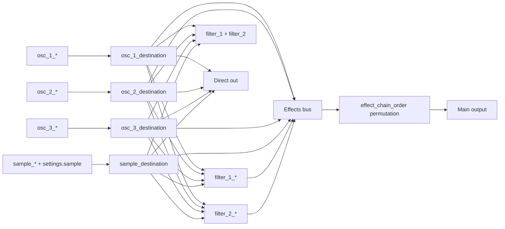
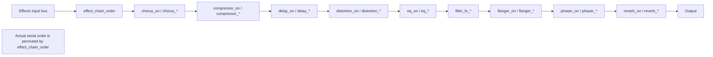

# Vital Preset JSON and Settings Schema

For the executable **full 1.5.5 field contract**, corpus verification, and measured
1.6.4 renderer bounds, see [Full contract verification](FULL_CONTRACT_1_5_5.md).
The source-era inventory below remains historical context; its ranges do not
describe every later control choice.

## Executive summary

A `.vital` preset is a JSON document. At the outermost level, Vital writes preset metadata such as `synth_version`, `preset_name`, `author`, `comments`, `preset_style`, and `macro1` through `macro4`, plus a large `settings` object. When loading a preset, Vital parses the JSON text directly and then applies `settings` into the synth state; any missing scalar control key falls back to the parameter metadata default from the built-in parameter table.

For modeling, the crucial point is that `settings` is not just a small “main controls” object. It is the **full control-state carrier**. It contains: a flat map of scalar control values keyed by control name; a nested `sample` object; a `modulations` array; a `wavetables` array; and an `lfos` array. Vital serializes all current control values first, then appends those nested structures.

The most important corrections to earlier descriptions are these. `beats_per_minute` is stored in **beats per second** in raw JSON, not BPM; Vital’s metadata applies a display multiplier of `60`, so raw `2.0` displays as `120 BPM`. `voice_priority` and `voice_override` are stored as **numeric enum ordinals**, not strings. `distortion_drive` is `-30..30 dB`, coming directly from the distortion DSP header. The compressor block is not sparse; it is a **21-scalar family** in the top-level flat controls.

The maximal `settings` schema is therefore best understood as four layers. First, a flat scalar control namespace. Second, repeated scalar families for oscillators, filters, envelopes, LFOs, random modulators, and modulation slots. Third, nested state-bearing objects like `sample`, `wavetables`, and drawable `lfos`. Fourth, relationship objects in `settings.modulations`, where each modulation connection stores `source`, `destination`, and optionally a non-linear `line_mapping`.

For an audio→`.vital` model under your stated constraints—**default sample oscillator** and **default wavetables only**—the cleanest target representation is: emit raw scalar controls exactly as Vital stores them; emit modulation connections explicitly; and either hold `settings.sample`, `settings.wavetables`, and the custom drawable `settings.lfos` at canonical defaults or predict them in a constrained secondary stage. That avoids unit-conversion ambiguity and prevents display-space errors.

## Revision-scoped source and corpus audit (2026-08-06)

The reproducible atlas target for this iteration is the Vital source snapshot
`mtytel/vital@636ca0ef517a4db087a6a08a6a8a5e704e21f836` (commit date
2022-04-20). The repository has no release tags in the fetched history, and
the source tree does not provide a reliable binary-release mapping, so this
is an exact source target rather than a claim that the snapshot is binary
Vital 1.5.5. The corpus is a compatibility supplement and is explicitly
mixed-version.

The tracked executable schema bundle is the
[Vital 1.0.8 schema directory](../data_generation/obruxo_data/vital/schema/vital-1.0.8-vita-0.1.0/).
It contains the pinned [source manifest](../data_generation/obruxo_data/vital/schema/vital-1.0.8-vita-0.1.0/manifest.json),
the 772-entry [runtime parameter inventory](../data_generation/obruxo_data/vital/schema/vital-1.0.8-vita-0.1.0/parameter_inventory.json),
the [modulation vocabulary](../data_generation/obruxo_data/vital/schema/vital-1.0.8-vita-0.1.0/modulation_vocab.json),
and the [source/runtime reconciliation](../data_generation/obruxo_data/vital/schema/vital-1.0.8-vita-0.1.0/reconciliation.json).
The pinned source revision is
[`636ca0ef517a4db087a6a08a6a8a5e704e21f836`](https://github.com/mtytel/vital/commit/636ca0ef517a4db087a6a08a6a8a5e704e21f836).
The sanitized corpus result is summarized in
[VITAL_CORPUS_AUDIT.md](VITAL_CORPUS_AUDIT.md); the external corpus and its raw
per-file audit are intentionally not part of the repository.

There are two useful scalar counts, and they must not be conflated:

| Scope | Count | Interpretation |
|---|---:|---|
| `ValueDetails` expanded registry | 794 | 145 global entries + 54 envelopes + 96 drawable-LFO controls + 32 random-LFO controls + 87 oscillator controls + 60 filter-family registry entries + 320 modulation-slot scalars. This includes migration-only definitions. |
| Reconciled current serialized baseline for this source era | 772 | The registry minus 22 legacy/migration-only fields; this matches the 772-scalar shape observed for corpus versions 1.0.5 and 1.0.8. It is a source/corpus reconciliation result, not yet a headless `stateToJson()` build count. |

The 22 registry-only fields are the eight `sub_*` fields,
`compressor_low_band_unused`, eight old `filter_1_*`/`filter_2_*` oscillator
and sample routing fields, and five old `filter_fx_*` routing fields. They are
important for migration but should not be treated as current model outputs.

The corpus confirms a version boundary: 1.0.0–1.0.4 carry 771 scalar fields;
1.0.5, 1.0.7, and 1.0.8 carry the 772-scalar baseline. The two 1.0.7 files
with 773 scalar fields contain an isolated `flanger_depth` extension.
Versions 1.5.1–1.5.5 carry 775 scalar fields and 781 total `settings` keys:
the scalar increase is the three `osc_<n>_spectral_morph_phase` fields, while
`custom_warps` and `random_values` are array-valued fields. Versions 1.6.x
carry 903 scalar fields and 909 total `settings` keys, adding 128 scalar
`modulation_<n>_ramp_up`/`ramp_down` fields, two for each of 64 slots.
Do not train a mixed revision union as one fixed schema without version
conditioning or canonicalization.

## Schema overview

Vital’s save path makes the outer preset schema relatively clear. `LoadSave::stateToJson` serializes all controls into `settings_data`, then appends `sample`, `modulations`, `wavetables`, and `lfos`, and finally wraps that `settings` object with preset-level metadata.

A maximal structural skeleton looks like this:

```json
{
  "synth_version": "…",
  "preset_name": "…",
  "author": "…",
  "comments": "…",
  "preset_style": "…",
  "macro1": "…",
  "macro2": "…",
  "macro3": "…",
  "macro4": "…",
  "settings": {
    "<flat scalar control key>": <number>,
    "sample": { "...": "..." },
    "modulations": [
      {
        "source": "<mod source name>",
        "destination": "<destination name>",
        "line_mapping": { "...": "..." }
      }
    ],
    "wavetables": [
      { "...": "..." },
      { "...": "..." },
      { "...": "..." }
    ],
    "lfos": [
      { "...": "..." }
    ]
  }
}
```

That skeleton is directly supported by Vital’s serializer and loader, with one important nuance: `line_mapping` is omitted for a modulation when the remap is linear.

A breadth-first inventory of the `settings` object is below.

| Settings substructure | Shape | Status | Notes | Source |
|---|---|---:|---|---|
| Flat scalar controls | object mapping control-name → number | Resolved | Vital iterates all controls and writes their raw numeric value. | `load_save.cpp` `stateToJson` |
| `sample` | object | Resolved | `{name, length, sample_rate, samples}` plus optional `samples_stereo`; `samples` fields are base64 PCM payloads. | `sample_source.cpp`; corpus audit |
| `modulations` | array of objects | Resolved | Each element stores `source`, `destination`, and optional `line_mapping`. | `load_save.cpp` |
| `wavetables` | array of objects | Resolved | Three objects; each has `groups`, `name`, `author`, `version`, `remove_all_dc`, and `full_normalize`; groups contain components and keyframes. | `wavetable_creator.cpp`; corpus audit |
| `lfos` | array of objects | Resolved | Eight `LineGenerator` objects with `num_points`, flat `points`, `powers`, `name`, and `smooth`. | `line_generator.cpp`; corpus audit |

The scalar-family expansion is where most of the size lives. A practical count table is:

| Major component | Pattern | Scalars per instance | Resolved instance count | Resolved scalar total | Confidence |
|---|---|---:|---:|---:|---|
| Global and top-level unique controls | exact keys | — | — | 136 current baseline (145 registry entries) | High for source registry; nine global entries are migration-only in the current module graph |
| Oscillators | `osc_<n>_<field>` | 29 | 3 | 87 | High for count of 3 oscillators; field family resolved |
| Filters | `filter_1_*`, `filter_2_*`, `filter_fx_*` | 20 registry / 47 current baseline | 3 families | 47 current baseline (60 registry entries) | High; 13 old routing fields are migration-only |
| Envelopes | `env_<n>_<field>` | 9 | 6 | 54 | High; `kNumEnvelopes = 6` in source |
| Drawable LFOs | `lfo_<n>_<field>` | 12 | 8 | 96 | High; `kNumLfos = 8` in source |
| Random modulators | `random_<n>_<field>` | 8 | 4 | 32 | High; `kNumRandomLfos = 4` in source |
| Mod-matrix slot scalars | `modulation_<n>_<field>` | 5 | 64 | 320 | Medium; family resolved, 64-slot count from community/forum evidence |

The source-era current flat scalar baseline is **772 raw scalars**. The 794-entry registry is larger because it retains migration-only definitions. Later corpus revisions are larger still: 775 scalars plus two arrays in 1.5.x, and 903 scalars plus two arrays in 1.6.x. Nested shape-bearing objects remain structurally important but are a bad first target for an ML model unless you constrain them tightly.

## Scaling and value semantics

Vital’s parameter metadata lives in `ValueDetails`. Through the Vita bindings, the exposed metadata fields are `name`, `min`, `max`, `default_value`, `version_added`, `post_offset`, `display_multiply`, `scale`, `display_units`, `display_name`, `is_discrete`, and `options`. The available scale kinds are `Indexed`, `Linear`, `Quadratic`, `Cubic`, `Quartic`, `SquareRoot`, and `Exponential`. For indexed controls, Vita constructs the option labels by iterating integer ordinals from `min` through `max` and dereferencing the string lookup table when present.

That metadata implies three practical parameter classes:

| Class | Stored form in JSON | Interpretation | Typical examples | Source |
|---|---|---|---|---|
| Categorical enum | number, usually integer ordinal | Discrete label set; usually `scale = Indexed` | `voice_priority`, `voice_override`, `oversampling`, `delay_style` | `synth_parameters.cpp`, Vita `options` behavior |
| Boolean-like enum | number `0/1` | Still an indexed enum, not JSON `true/false` | `delay_on`, `reverb_on`, `mpe_enabled`, `osc_<n>_on` | `synth_parameters.cpp` |
| Continuous numeric | number | Raw DSP/UI parameter value, sometimes nonlinearly displayed | `distortion_drive`, `volume`, `attack`, `lfo_frequency` | `synth_parameters.cpp`, `distortion.h`, Vita scale helpers |

For ML purposes, the raw JSON value is the ground truth. Display values are derived from the raw value plus the metadata. From the metadata and Vita’s normalization helpers, the display side is best treated as:

- `Indexed`: raw ordinal directly selects an option label.
- `Linear`: display is approximately `raw * display_multiply + post_offset`.
- `Quadratic`, `Cubic`, `Quartic`, `SquareRoot`, `Exponential`: display first applies the associated scale function, then the multiplier and offset. This display rule is partly inferential, but it is strongly supported by the Vital metadata and Vita’s conversion code paths.

The most consequential examples are:

| Key | Raw range | Display behavior | Default raw → display | Interpretation |
|---|---|---|---|---|
| `beats_per_minute` | `0.333333333 .. 5.0` | linear, `×60`, no units string | `2.0 → 120` | Raw is **BPS**, displayed as BPM. |
| `voice_tune` | `-1 .. 1` | linear, `×100`, units `cents` | `0 → 0 cents` | Raw unit is semitone fraction; display is cents. |
| `pan` / `sample_pan` / `sub_pan` | `-1 .. 1` | linear, `×100`, units `%` | `0 → 0%` | Symmetric panning amount. |
| `volume` | `0 .. 7399.4404` | square-root scaled, then `-80 dB` offset | `5473.0404 → about -6.02 dB` | Strong example of “emit raw, not display.” |
| `env_<n>_attack` | `0 .. 2.37842` | quartic seconds | `0.1495 → about 0.0005 s` | UI time is highly non-linear. |
| `lfo_<n>_frequency` | `-7 .. 9` | exponential, invert, seconds | `1.0 → 0.5 s` | This is better thought of as a stored period exponent than literal Hz. |
| `reverb_decay_time` | `-6 .. 6` | exponential seconds | `0 → 1 s` | Raw exponent domain. |
| `distortion_drive` | `-30 .. 30` | linear dB | `0 → 0 dB` | Corrected range from the DSP header. |

The direct modeling consequence is simple: **train the model to emit raw Vital scalars, not display-space values**. Converting to display units before learning will mix multiple nonlinear transfer functions into the target space and make inversion brittle, especially for envelope times, LFO rates, and dB-style controls.

## Component field catalog

The tables below list the `settings` fields breadth-first, beginning with top-level unique controls, then repeated families. To keep the report readable, repeated indexed families are shown as key patterns. Where a label list is available from Vita or the Vital source metadata, it is given; otherwise the ordinal range is given and the label ordering is marked unresolved.

**Top-level global, voice, performance, and routing fields**

| Key | Type | Class | Raw range | Display / units | Default raw → display | Possible values / notes | Source |
|---|---|---|---|---|---|---|---|
| `bypass` | indexed ordinal | boolean-like | `0..1` | same | `0` | likely off/on; label lookup not shown here | `parameter_list` start |
| `beats_per_minute` | float | continuous | `0.333333333..5.0` | `×60`, BPM | `2.0 → 120 BPM` | **Raw is BPS** | `parameter_list` start |
| `legato` | indexed ordinal | boolean-like | `0..1` | same | `0` | off/on | `parameter_list` middle |
| `macro_control_1`..`macro_control_4` | float | continuous | `0..1` | same | `0` | 4 macro values; names live at preset top level as `macro1..macro4` | `parameter_list`; top-level metadata loop |
| `pitch_bend_range` | indexed ordinal | categorical | `0..48` | semitones | `2 → 2 semitones` | integer semitone span | `parameter_list` |
| `polyphony` | indexed ordinal | categorical | `1..32` | voices | `8` | `kMaxPolyphony = 33`, so the raw maximum is 32 | `parameter_list`, `synth_constants.h` |
| `voice_tune` | float | continuous | `-1..1` | `×100 cents` | `0 → 0` | fractional semitone stored; cents displayed | `parameter_list` |
| `voice_transpose` | indexed ordinal | categorical | `-48..48` | same | `0` | semitones | `parameter_list` |
| `voice_amplitude` | float | continuous | `0..1` | same | `1` | global voice gain | `parameter_list` |
| `stereo_routing` | float | continuous | `0..1` | `%` | `1 → 100%` | stereo routing amount | `parameter_list` |
| `stereo_mode` | indexed ordinal | categorical | `0..1` | same | `0` | `SPREAD`, `ROTATE` | `parameter_list`, `synth_strings.h` |
| `portamento_time` | float | continuous | `-10..4` | exponential seconds | `-10` | display range is nonlinear; raw exponent better for ML | `parameter_list` |
| `portamento_slope` | float | continuous | `-8..8` | same | `0` | slope shaping | `parameter_list` |
| `portamento_force` | indexed ordinal | boolean-like | `0..1` | same | `0` | off/on | `parameter_list` |
| `portamento_scale` | indexed ordinal | boolean-like | `0..1` | same | `0` | off/on | `parameter_list` |
| `velocity_track` | float | continuous | `-1..1` | `%` | `0` | velocity sensitivity | `parameter_list` |
| `volume` | float | continuous | `0..7399.4404` | square-root, `-80 dB` offset | `5473.0404 → about -6 dB` | one of the strongest raw/display mismatches | `parameter_list` |
| `effect_chain_order` | indexed ordinal | categorical | `0..factorial(kNumEffects)-1` | same | `0` | permutation index over the effect chain; with 9 effects, this is `0..362879` | `parameter_list`; Vita effect enum |
| `voice_priority` | indexed ordinal | categorical | `0..kNumVoicePriorities-1` | same | `RoundRobin` ordinal | `Newest, Oldest, Highest, Lowest, RoundRobin` | `parameter_list`; Vita enum |
| `voice_override` | indexed ordinal | categorical | `0..kNumVoiceOverrides-1` | same | `Kill` ordinal | `Kill, Steal` | `parameter_list`; Vita enum |
| `oversampling` | indexed ordinal | categorical | `0..3` | same | `1` | `1x`, `2x`, `4x`, `8x` | `parameter_list`, `synth_strings.h` |
| `pitch_wheel` | float | continuous | `-1..1` | same | `0` | live control source | `parameter_list` |
| `mod_wheel` | float | continuous | `0..1` | same | `0` | live control source | `parameter_list` |
| `mpe_enabled` | indexed ordinal | boolean-like | `0..1` | same | `0` | off/on | `parameter_list` |
| `view_spectrogram` | indexed ordinal | categorical | `0..2` | same | `0` | metadata uses `kOffOnNames` despite three ordinals; exact semantics unresolved | `parameter_list` |

**Top-level FX blocks**

| Block | Keys | Scalars | Notes |
|---|---|---:|---|
| Delay | `delay_dry_wet`, `delay_feedback`, `delay_frequency`, `delay_aux_frequency`, `delay_on`, `delay_style`, `delay_filter_cutoff`, `delay_filter_spread`, `delay_sync`, `delay_tempo`, `delay_aux_sync`, `delay_aux_tempo` | 12 | `delay_frequency` and `delay_aux_frequency` use exponential inverted seconds; the two tempo controls are indexed subsets of synced-rate names. `delay_style` has four ordinals, but exact labels were not recovered here. |
| Distortion | `distortion_on`, `distortion_type`, `distortion_drive`, `distortion_mix`, `distortion_filter_order`, `distortion_filter_cutoff`, `distortion_filter_resonance`, `distortion_filter_blend` | 8 | `distortion_type`: `Soft Clip`, `Hard Clip`, `Linear Fold`, `Sine Fold`, `Bit Crush`, `Down Sample`; `distortion_filter_order`: `None`, `Pre`, `Post`; drive is `-30..30 dB` | `parameter_list`, `synth_strings.h` |
| Reverb | `reverb_pre_low_cutoff`, `reverb_pre_high_cutoff`, `reverb_low_shelf_cutoff`, `reverb_low_shelf_gain`, `reverb_high_shelf_cutoff`, `reverb_high_shelf_gain`, `reverb_dry_wet`, `reverb_delay`, `reverb_decay_time`, `reverb_size`, `reverb_chorus_amount`, `reverb_chorus_frequency`, `reverb_on` | 13 | Mix, pre/post tonal shaping, size, delay, decay, and internal chorus controls. |
| Phaser | `phaser_on`, `phaser_dry_wet`, `phaser_feedback`, `phaser_frequency`, `phaser_sync`, `phaser_tempo`, `phaser_center`, `phaser_mod_depth`, `phaser_phase_offset` | 9 | Frequency uses exponential inverted seconds; sync is a 4-way indexed family. |
| Flanger | `flanger_on`, `flanger_dry_wet`, `flanger_feedback`, `flanger_frequency`, `flanger_sync`, `flanger_tempo`, `flanger_center`, `flanger_mod_depth`, `flanger_phase_offset` | 9 | `flanger_dry_wet` is unusual: raw `0..0.5`, displayed as `0..100%` because `display_multiply = 200`. |
| Chorus | `chorus_on`, `chorus_dry_wet`, `chorus_feedback`, `chorus_cutoff`, `chorus_spread`, `chorus_voices`, `chorus_frequency`, `chorus_sync`, `chorus_tempo`, `chorus_delay_1`, `chorus_delay_2` | 11 | Chorus is the effect block called out on Vital’s press material as a multi-voice chorus. `chorus_delay_*` are exponential milliseconds. |
| Compressor | `compressor_on`, 6 thresholds, 6 ratios, 3 gains, `compressor_attack`, `compressor_release`, `compressor_enabled_bands`, `compressor_mix`, `compressor_low_band_unused` | 21 | This is the corrected compressor inventory. `compressor_enabled_bands` labels are `Multiband`, `LowBand`, `HighBand`, `SingleBand`. |
| EQ | `eq_on`, `eq_low_mode`, `eq_low_cutoff`, `eq_low_gain`, `eq_low_resonance`, `eq_band_mode`, `eq_band_cutoff`, `eq_band_gain`, `eq_band_resonance`, `eq_high_mode`, `eq_high_cutoff`, `eq_high_gain`, `eq_high_resonance` | 13 | Low mode: `Shelf`, `High Pass`; band: `Shelf`, `Notch`; high: `Shelf`, `Low Pass` | `parameter_list`, `synth_strings.h` |

**Oscillator, sample, and filter families**

| Family | Key pattern | Type / class | Raw range | Default | Possible values / notes | Source |
|---|---|---|---|---|---|---|
| Wavetable oscillator | `osc_<n>_on` | indexed, boolean-like | `0..1` | per-osc defaults noted below | off/on | `osc_parameter_list` |
|  | `osc_<n>_transpose` | indexed, categorical | `-48..48` | `0` | semitones | |
|  | `osc_<n>_transpose_quantize` | indexed, categorical | `0..8191` | `0` | exact semantics unresolved | |
|  | `osc_<n>_tune` | float, continuous | `-1..1` | `0` | displayed in cents | |
|  | `osc_<n>_pan` | float, continuous | `-1..1` | `0` | `%` | |
|  | `osc_<n>_stack_style` | indexed, categorical | `0..kNumUnisonStackTypes-1` | `0` | `Normal, CenterDropOctave, CenterDropOctave2, Octave, Octave2, PowerChord, PowerChord2, MajorChord, MinorChord, HarmonicSeries, OddHarmonicSeries` | |
|  | `osc_<n>_unison_detune` | float, continuous | `0..10` | `4.472135955` | quadratic display | |
|  | `osc_<n>_unison_voices` | indexed, categorical | `1..16` | `1` | integer voices | |
|  | `osc_<n>_unison_blend` | float, continuous | `0..1` | `0.8` | `%` | |
|  | `osc_<n>_detune_power` | float, continuous | `-5..5` | `1.5` | same | |
|  | `osc_<n>_detune_range` | float, continuous | `0..48` | `2` | same | |
|  | `osc_<n>_level` | float, continuous | `0..1` | `0.70710678119` | quadratic amplitude | |
|  | `osc_<n>_midi_track` | indexed, boolean-like | `0..1` | `1` | off/on | |
|  | `osc_<n>_smooth_interpolation` | indexed, boolean-like | `0..1` | `0` | off/on | |
|  | `osc_<n>_spectral_unison` | indexed, boolean-like | `0..1` | `1` | off/on | |
|  | `osc_<n>_wave_frame` | float, continuous | `0..kNumOscillatorWaveFrames-1` | `0` | wavetable frame index | |
|  | `osc_<n>_frame_spread` | float, continuous | `-kNumFrames/2 .. kNumFrames/2` | `0` | unison frame spread | |
|  | `osc_<n>_stereo_spread` | float, continuous | `0..1` | `1` | `%` | |
|  | `osc_<n>_phase` | float, continuous | `0..1` | `0.5` | displayed `0..360°` | |
|  | `osc_<n>_distortion_phase` | float, continuous | `0..1` | `0.5` | `0..360°` | |
|  | `osc_<n>_random_phase` | float, continuous | `0..1` | `1` | `%` | |
|  | `osc_<n>_distortion_type` | indexed, categorical | `0..kNumDistortionTypes-1` | `0` | `None, Sync, Formant, Quantize, Bend, Squeeze, PulseWidth, FmOscillatorA, FmOscillatorB, FmSample, RmOscillatorA, RmOscillatorB, RmSample` | |
|  | `osc_<n>_distortion_amount` | float, continuous | `0..1` | `0.5` | `%` | |
|  | `osc_<n>_distortion_spread` | float, continuous | `-0.5..0.5` | `0` | displayed `%` with `×200` | |
|  | `osc_<n>_spectral_morph_type` | indexed, categorical | `0..kNumSpectralMorphTypes-1` | `0` | `NoSpectralMorph, Vocode, FormScale, HarmonicScale, InharmonicScale, Smear, RandomAmplitudes, LowPass, HighPass, PhaseDisperse, ShepardTone, Skew` | |
|  | `osc_<n>_spectral_morph_amount` | float, continuous | `0..1` | `0.5` | `%` | |
|  | `osc_<n>_spectral_morph_spread` | float, continuous | `-0.5..0.5` | `0` | displayed `%` with `×200` | |
|  | `osc_<n>_destination` | indexed, categorical | raw metadata `0..14`; labeled source table `0..13` | osc1 `0?`, osc2 `1`, osc3 `3` after defaults | labels `Filter 1, Filter 2, Filter 1+2, Effects, Direct Out, Chorus, Compressor, Delay, Distortion, EQ, FX Filter, Flanger, Phaser, Reverb`; ordinal `14` is a source-level off-by-one/inconsistency until runtime-verified | source `synth_parameters.cpp`, `synth_strings.h`, [parameter_inventory.json](../data_generation/obruxo_data/vital/schema/vital-1.0.8-vita-0.1.0/parameter_inventory.json) |
|  | `osc_<n>_view_2d` | indexed, categorical | `0..2` | `1` | semantics unresolved; lookup appears inconsistent with 3 ordinals | |
| Sample oscillator scalar layer | `sample_on`, `sample_random_phase`, `sample_keytrack`, `sample_loop`, `sample_bounce`, `sample_transpose`, `sample_transpose_quantize`, `sample_tune`, `sample_level`, `sample_destination`, `sample_pan` | mixed | see source | see source | `sample_destination` follows the same destination family as `osc_<n>_destination` | `parameter_inventory.json`; corpus audit |
| Sample oscillator nested object | `settings.sample` | object | — | — | `{name, length, sample_rate, samples}` plus optional stereo payload; source default is generated `White Noise`, 44,100 samples at 44.1 kHz | `sample_source.cpp`; corpus audit |
| Sub oscillator compatibility layer | `sub_*` | mixed | see source | see source | Migration-only fields in this source-era module graph; older presets are converted into `osc_3_*` and destinations during load | `load_save.cpp`; source/corpus reconciliation |
| Filter families | `filter_1_*`, `filter_2_*`, `filter_fx_*` | mixed | see below | varies | Same 20-field schema reused for both main filters and the FX filter block | schema bundle; source/corpus reconciliation |

Revision note: the 20-field list below is the `ValueDetails` registry shape.
For the current source-era serialized baseline, 13 old oscillator/sample
routing fields are migration-only, leaving 47 serialized filter-family
scalars. Keep the registry table when implementing legacy migration, but use
the 47-field baseline for the current model output.

Source correction: `filter_<n>_style` has raw range `0..9`, while the generic
`kFilterStyleNames` table has five labels and model-specific tables also exist
for diode and comb filters. Preserve the raw ordinal and condition its label
interpretation on `filter_<n>_model`; do not treat one five-label table as a
complete global enum.

The per-filter field inventory is:

`mix`, `cutoff`, `resonance`, `drive`, `blend`, `style`, `model`, `on`, `blend_transpose`, `keytrack`, `formant_x`, `formant_y`, `formant_transpose`, `formant_resonance`, `formant_spread`, `osc1_input`, `osc2_input`, `osc3_input`, `sample_input`, `filter_input`. The filter `model` enum labels are resolved as `Analog, Dirty, Ladder, Digital, Diode, Formant, Comb, Phase`. The filter `style` ordinals are exposed in Vita as `k12Db, k24Db, NotchPassSwap, DualNotchBand, BandPeakNotch, Shelving`; they are display-facing via `strings::kFilterStyleNames` in Vital, so user-facing wording may differ slightly.

**Envelope, drawable LFO, random source, and mod-slot families**

| Family | Key pattern | Scalars per instance | Raw ranges and categorical values | Source |
|---|---|---:|---|---|
| Envelope | `env_<n>_delay`, `attack`, `hold`, `decay`, `release`, `attack_power`, `decay_power`, `release_power`, `sustain` | 9 | Delay/Hold `0..1.4142135624` quartic secs; Attack/Decay/Release `0..2.37842` quartic secs; power fields `-20..20`; Sustain `0..1` | `env_parameter_list` |
| Drawable LFO | `lfo_<n>_phase`, `sync_type`, `frequency`, `sync`, `tempo`, `fade_time`, `smooth_mode`, `smooth_time`, `delay_time`, `stereo`, `keytrack_transpose`, `keytrack_tune` | 12 | `sync_type`: `Trigger, Sync, Envelope, Sustain Envelope, Loop Point, Loop Hold`; `sync`: `Seconds, Tempo, Tempo Dotted, Tempo Triplets, Keytrack`; `tempo` uses 13 synced-rate ordinals; frequency is exponential inverted seconds | `lfo_parameter_list`; source string tables |
| Drawable LFO shape object | `settings.lfos[i]` | object | `{num_points, points[2*num_points], powers[num_points], name, smooth}`; source default is a three-point `Triangle` shape | `line_generator.cpp`; corpus audit |
| Random source | `random_<n>_style`, `frequency`, `sync`, `tempo`, `stereo`, `sync_type`, `keytrack_transpose`, `keytrack_tune` | 8 | Styles: `Perlin, SampleAndHold, SinInterpolate, LorenzAttractor`. `frequency`, `sync`, `tempo` semantics parallel LFO/rate families | `random_lfo_parameter_list`; Vita enum |
| Mod slot scalar family | `modulation_<n>_amount`, `power`, `bipolar`, `stereo`, `bypass` | 5 | Amount `-1..1`; Power `-10..10`; Boolean-like flags `0..1` | `mod_parameter_list`; prefix construction | `parameter_inventory.json` |
| Mod connection object | `settings.modulations[i]` | object | `source`, `destination`, optional `line_mapping` only when non-linear | `load_save.cpp` |
| Mod remap object | `line_mapping` | object | Same line schema as LFO shapes; omitted when linear, otherwise `{num_points, points, powers, name, smooth}` | `load_save.cpp`, `line_generator.cpp`; corpus audit |

### Modulation source and destination identity

The tracked [modulation vocabulary artifact](../data_generation/obruxo_data/vital/schema/vital-1.0.8-vita-0.1.0/modulation_vocab.json)
is the authority for legal names at the pinned source revision. It finds 32
modulation sources: `aftertouch`, `env_1..env_6`, `lfo_1..lfo_8`, `lift`,
`macro_control_1..macro_control_4`, `mod_wheel`, `note`, `note_in_octave`,
`pitch_wheel`, `random`, `random_1..random_4`, `slide`, `stereo`, and
`velocity`. The corpus contains the same 32 non-empty source names.

The source graph expands to 428 legal modulation destination names from
`create*ModControl` calls and prefix/generated controls. The audit observes
366 non-empty destination names because it counts only serialized connection
usage. Its three extra names, `osc_1..3_spectral_morph_phase`, are 1.5.x
version extensions absent from the pinned source snapshot; its source-only
names are not evidence of rejection. Keep the full source-derived destination
set as the model constraint and use corpus counts only as frequency evidence.

## Interdependencies and routing

Two different routing systems coexist in Vital presets. The first is **audio routing**, governed by source destinations, filter input flags, and the effect chain order. The second is **modulation routing**, governed by the `settings.modulations` objects plus the per-slot scalar family. Those two systems meet when a modulation destination points at an audio parameter.

The audio routing structure can be summarized like this:


```mermaid
flowchart LR
  OSC1[osc_1_*] --> DEST1[osc_1_destination]
  OSC2[osc_2_*] --> DEST2[osc_2_destination]
  OSC3[osc_3_*] --> DEST3[osc_3_destination]
  SMP[sample_* + settings.sample] --> DESTS[sample_destination]

  DEST1 --> F1[filter_1_*]
  DEST1 --> F2[filter_2_*]
  DEST1 --> BOTH[filter_1 + filter_2]
  DEST1 --> FXBUS[Effects bus]
  DEST1 --> DOUT[Direct out]

  DEST2 --> F1
  DEST2 --> F2
  DEST2 --> BOTH
  DEST2 --> FXBUS
  DEST2 --> DOUT

  DEST3 --> F1
  DEST3 --> F2
  DEST3 --> BOTH
  DEST3 --> FXBUS
  DEST3 --> DOUT

  DESTS --> F1
  DESTS --> F2
  DESTS --> BOTH
  DESTS --> FXBUS
  DESTS --> DOUT

  F1 --> FXBUS
  F2 --> FXBUS
  FXBUS --> ORDER[effect_chain_order permutation]
  ORDER --> OUT[Main output]
```

Source correction: the string table resolves destination labels for ordinals `0..13` in this order: `Filter 1`, `Filter 2`, `Filter 1+2`, `Effects`, `Direct Out`, `Chorus`, `Compressor`, `Delay`, `Distortion`, `EQ`, `FX Filter`, `Flanger`, `Phaser`, `Reverb`. The parameter metadata advertises a raw maximum of `kNumSourceDestinations + kNumEffects = 14`, while the lookup table has only 14 entries (`0..13`). Treat ordinal `14` as a source-level off-by-one/inconsistency and constrain model outputs to the labeled `0..13` set until a runtime build proves otherwise. The corpus only observes `0..4` for `sample_destination` and `0..9` for oscillator destinations.

The first five destination ordinals are `Filter1`, `Filter2`, `DualFilters`, `Effects`, and `DirectOut`, as also used by the legacy conversion logic. The complete source label table and its ordinal-14 inconsistency are recorded in the source correction immediately above.

The effects system itself contains nine effect identities in the Vita constants: `Chorus`, `Compressor`, `Delay`, `Distortion`, `Eq`, `FilterFx`, `Flanger`, `Phaser`, and `Reverb`. `effect_chain_order` is therefore a permutation index over those nine effects, with raw range `0..factorial(9)-1 = 362879`. Effect on/off controls and mix controls interact with that permutation: the chain order sets the serial order, while each block’s `*_on` and `*_dry_wet` or `*_mix` determine whether and how much of that effect contributes.


```mermaid
flowchart LR
  FXBUS[Effects input bus] --> CHAIN[effect_chain_order]
  CHAIN --> C[chorus_on / chorus_*]
  C --> CO[compressor_on / compressor_*]
  CO --> D[delay_on / delay_*]
  D --> DI[distortion_on / distortion_*]
  DI --> E[eq_on / eq_*]
  E --> FF[filter_fx_*]
  FF --> FL[flanger_on / flanger_*]
  FL --> PH[phaser_on / phaser_*]
  PH --> R[reverb_on / reverb_*]
  R --> OUT[Output]

  note1[Actual serial order is permuted by effect_chain_order]
```

The modulation path is separate and cleaner than it first appears. `settings.modulations[i]` holds the **connection identity**: source name, destination name, and optional remap curve. The flat `modulation_<i>_*` controls hold that connection’s **scalar behavior**: amount, power, bipolar mode, stereo mode, and bypass. A modulation slot is therefore represented by both a scalar family and a connection object. That is one of the most important structural facts for any ML target format.

```mermaid
flowchart LR
  SRC[modulation source name] --> CONN[settings.modulations[i]]
  CONN --> DST[destination name]
  CONN --> MAP[line_mapping if non-linear]

  SLOT[modulation_i_amount / power / bipolar / stereo / bypass] --> CONN
  SLOT --> DST
```

A few key interdependencies matter operationally:

- Missing scalar keys do **not** stay missing after load; Vital fills them with metadata defaults. That means “minimal JSON” and “maximal JSON” are not equivalent for training unless you canonicalize omitted keys yourself.
- Old presets are normalized on load. The clearest case is the pre-`0.5.0` sub oscillator path, which is converted into `osc_3_*` values and a destination ordinal. This is another reason to train on **canonicalized post-load state** rather than arbitrary source files when possible.
- Modulation remaps are sparse: `line_mapping` appears only when the remap is non-linear. Linear remaps are implicit.
- LFO and modulation-remap shapes both serialize through the same line-generator family. Structurally, those are cousins, not unrelated blobs.

Canonicalization claims in this document are limited to the tracked schema
bundle and repository tests. They are source/corpus evidence, not runtime-
verified round trips, unless explicitly marked otherwise.

## Corrections, unresolved items, and modeling implications

The strongest corrections and errata are all source-backed. `beats_per_minute` is raw `0.333333333..5.0` with display multiplier `60`, so it is a **stored BPS parameter mislabeled as BPM** in the control name. `voice_priority` and `voice_override` are numeric enum indices, with Vita exposing the concrete label sets `Newest/Oldest/Highest/Lowest/RoundRobin` and `Kill/Steal`. `distortion_drive` inherits `-30..30 dB` from `Distortion::kMinDrive` and `kMaxDrive`. The compressor family spans **21 scalar controls**, not a minimal three- or four-knob abstraction.

Remaining uncertainties after this source/corpus pass should be treated explicitly:

- The exact binary release/build corresponding to the source snapshot; no
  release tag or reliable source-to-binary mapping was recovered.
- A headless runtime verification of the 772 current-control count, omitted
  nested-state behavior, destination ordinal 14, and save/load canonicalization.
- The source revision that introduced the five 1.5.x fields and the 128 1.6.x
  modulation-ramp fields.
- The semantics of three-state UI-like fields whose lookup table reference is
  inconsistent with the raw range, especially `view_spectrogram` and
  `osc_<n>_view_2d`.
- A stable default sample payload: source initialization generates random
  white noise, so the default must be represented by a fixed exemplar or
  excluded as an opaque payload.

For your training setup—default sample oscillator and default wavetables only—the best ML output format is:

- **Emit raw scalar controls exactly as Vital stores them.**
- **Emit categorical parameters as numeric ordinals**, not strings.
- **Emit modulation connections explicitly** as `{source, destination, line_mapping?}` plus the corresponding `modulation_<n>_*` slot scalars.
- **Canonicalize nested shape/content objects** that you are constraining to defaults: `settings.sample`, `settings.wavetables`, and possibly `settings.lfos` if you are not yet modeling custom curves.
- **Normalize legacy presets through Vital’s load path before training**, so converted fields like old `sub_*` routings collapse into the modern canonical schema.

If you want the shortest practical rule set, it is this: train on **canonical post-load raw JSON state**, not on user-facing units and not on partially omitted source presets. Raw values preserve Vital’s true parameter manifold, while display units and missing-key presets introduce avoidable ambiguity.
