# Vital Preset Usage Census

## Main findings

The corpus contains **9,618 parsed presets** in the file-weighted view and **9,595 exact raw-byte content groups** after duplicate collapse. Exact duplicates therefore account for **23 additional files** (0.24% of parsed files).

The largest operational family is **oscillator** at **97.9%** (9,413/9,618). Oscillator identity is not reduced to a count: the most common exact mask is **1**, occurring in **15.4%** (1,477/9,618) of presets. The median number of live, non-bypassed, non-zero modulation routes is **6**.

The most frequently changed shared scalar is **`modulation_1_amount`** at **86.7%** (8,343/9,618) of atlas-supported presets.

These are descriptive storage/use measures, not claims about audibility or perceptual importance. A serialized key is not treated as evidence of use.

## Corpus and version support

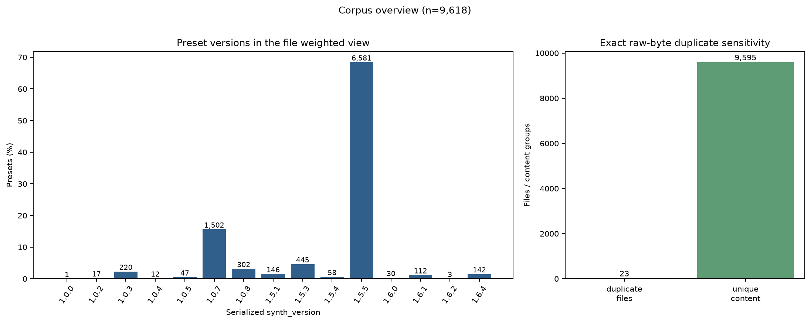

Figure 1 uses the file weighted denominator (`n=9,618`). Version bars are counts of parsed presets. The duplicate panel is a sensitivity check: later tables and plots retain both file-weighted and exact-deduplicated aggregates, rather than silently choosing one.

The shared parameter space uses the pinned atlas defaults and treats a missing common scalar as its canonical default, matching Vital's load behavior. The 1.5.x spectral-morph phase fields, 1.6.x modulation-ramp fields, and the isolated `flanger_depth` extension are kept in version-eligible groups. Their defaults are not present in the pinned atlas, so the machine-readable output reports nonzero observations and marks default-qualified non-default percentages as unsupported rather than inventing a denominator or default.

## Component activity and repeated-slot identity

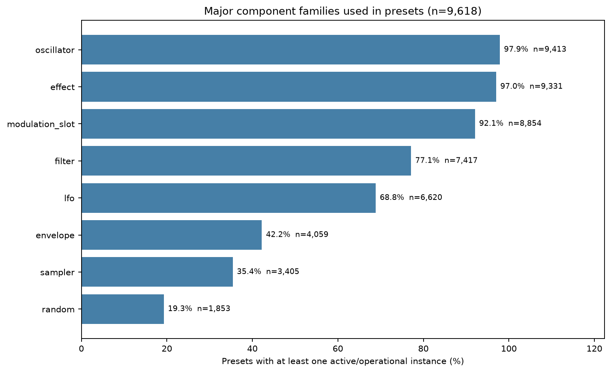

Figure 2 counts direct `*_on` state for oscillators, filters, effects, and the sampler. Envelopes, LFOs, and random sources use operational activity: their numbered slot is active only when it is the source of a live modulation route. This keeps direct enablement separate from routing.

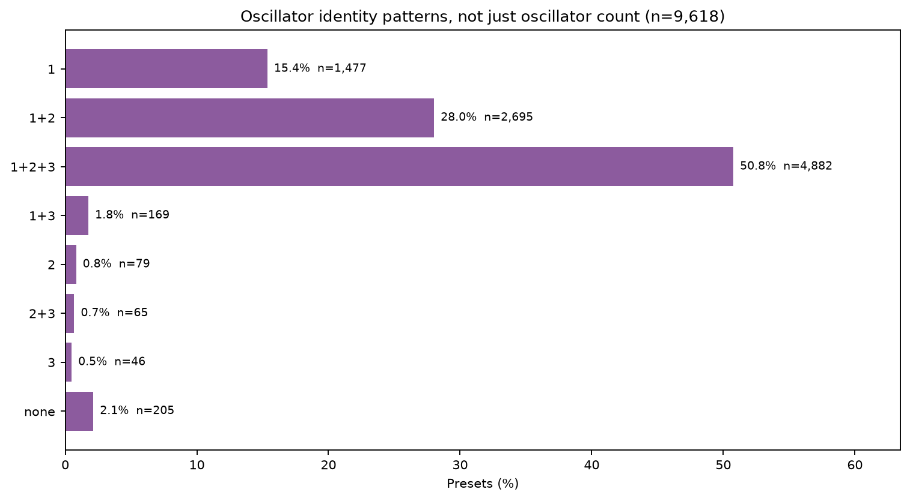

Figure 3 preserves exact oscillator identity masks. `2` means oscillator 2 only; it is not merged with `1` merely because both masks have cardinality one. Any skipped-slot mask visible in the figure is therefore an observed non-prefix pattern.

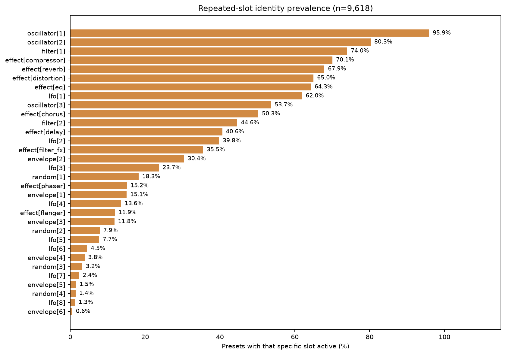

Figure 4 gives the independent prevalence of each numbered slot. Figure 5 then switches back to cardinality, showing how many oscillators, routed LFOs, effects, and live modulation slots occur per preset. The two views answer different questions and should not be substituted for one another.

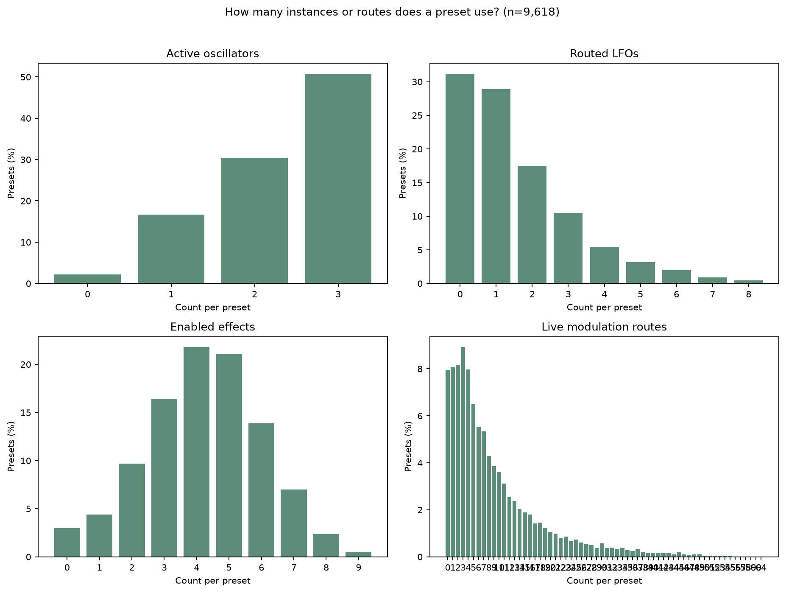

## Scalar parameter sparsity and modulation

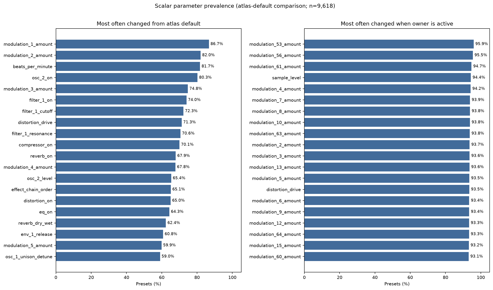

Figure 6 ranks atlas-backed scalar changes globally and conditional on an active owner. For LFO, envelope, random, and modulation-slot parameters, the conditional denominator is the operationally routed/connected slot population. This highlights parameters that look globally rare because their component is rarely used.

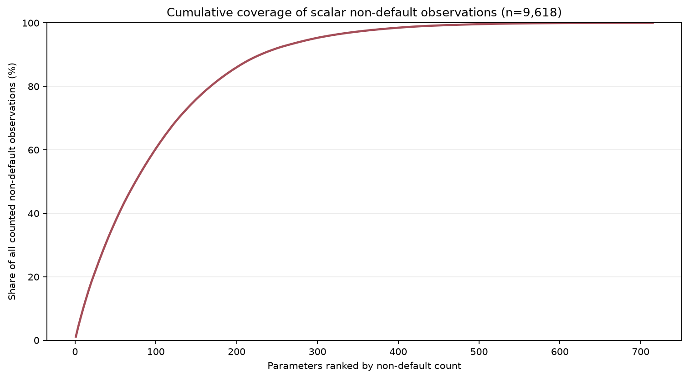

Figure 7 is a cumulative head-versus-tail view. The x-axis is the rank of a parameter by non-default count; the y-axis is the share of all counted non-default observations covered by that prefix. It shows concentration without imposing an arbitrary prevalence cutoff.

## Parameter value distributions

The prevalence figures above answer whether a control changed. The companion [parameter value distribution report](VITAL_PARAMETER_DISTRIBUTIONS.md) adds exact frequencies for **351 categorical/enum parameters** and scale-aware distributions for **553 continuous parameters**.

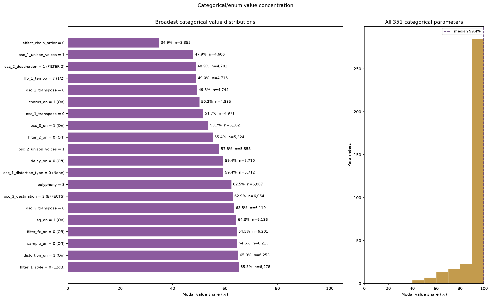

The categorical summary chart shows the modal value and its observed share for the 20 least concentrated (most varied) categorical/enum parameters, alongside the modal-share distribution across all **351** categorical/enum parameters. Labels use the pinned atlas option names where available; the full frequency table remains in the companion CSV.

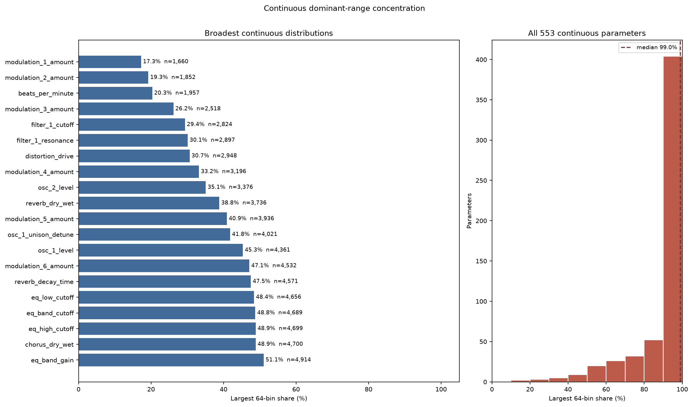

The continuous summary chart shows the largest 64-bin mass for the 20 least concentrated (most varied) continuous parameters with at least 100 observations, alongside the distribution of largest-bin share across all **553** continuous parameters. Each bar represents a range rather than an exact floating-point mode; raw/normalized edges, quantiles, defaults, zero prevalence, sparse controls, and fallback notes remain in the companion report and CSV.

The complete categorical value table is `vital_usage_categorical_values.csv`; the complete continuous 64-bin table is `vital_usage_continuous_bins.csv`. The main parameter CSV also carries per-parameter summaries and dominant-bin JSON.

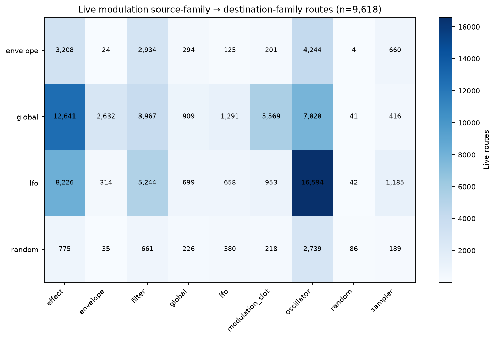

Figure 8 counts live routes only: connected routes that are not bypassed and have non-zero amount. The census separately retains connected-route source/destination vocabularies, connected, bypassed, zero-amount, non-zero-amount, bipolar, stereo, explicit-linear, and custom-remap counts. In this view, the plotted source/destination prevalence is therefore about operational routing, while a populated but bypassed or zero-amount connection remains visible in the supporting JSON.

## Co-occurrence and nested state

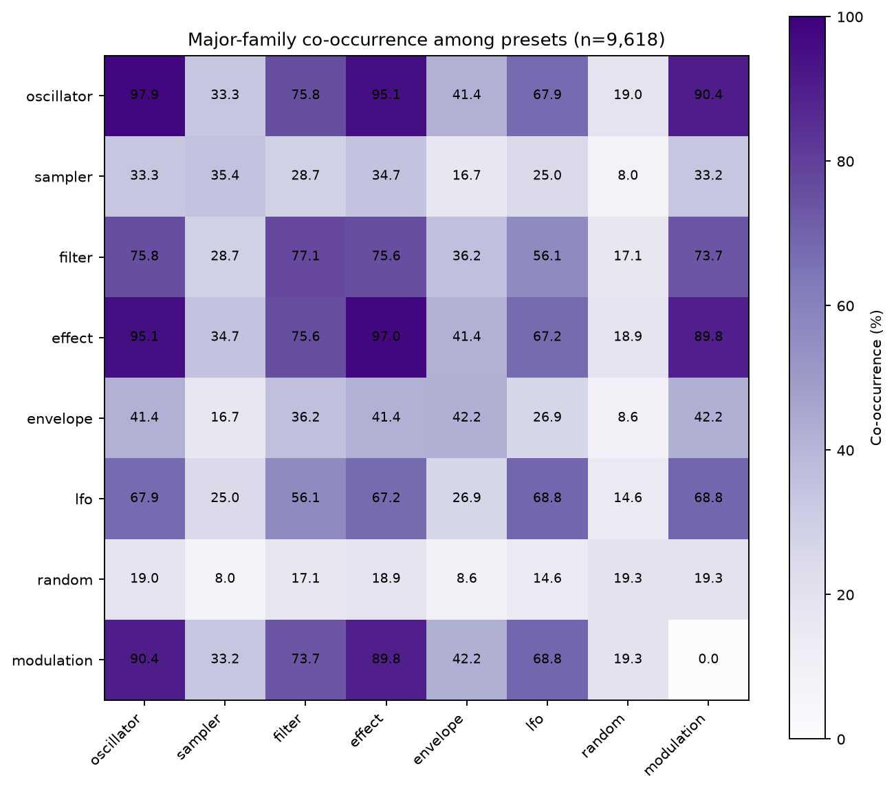

Figure 9 uses preset-level presence flags and normalized percentages. Diagonal cells are the family prevalence; off-diagonal cells are the percentage of presets containing both families. LFO, envelope, and random presence again means live source routing, not merely non-default scalar state.

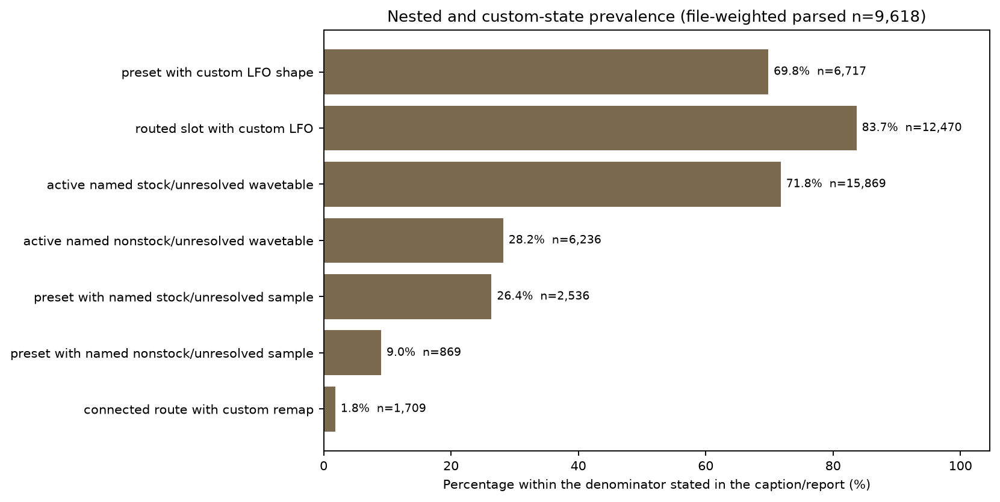

Figure 10 treats nested structures semantically. LFO shape comparison ignores display names and compares the drawable shape fields. Wavetables retain a canonical-init descriptor comparison in the JSON, but the figure classifies active slots conservatively by known stock names: named stock content is reported as `named_stock_or_unresolved_content`, while unknown names remain unresolved rather than being called custom from a byte comparison. This avoids mistaking a version/rendering difference in a stock asset for a user-authored wavetable. Preset bars use `n` parsed presets; routed-LFO and wavetable bars use routed/active slot denominators; remap bars use connected-route denominators.

## Version-introduced features and duplicate sensitivity

The version-introduced parameter groups contain **132 scalar names** in the pooled output. Their eligible denominators are restricted to versions that can contain them; older presets are never put in the denominator. Because the pinned atlas does not define their defaults, use the `nonzero` field for the neutral-state observation and do not read their `non_default` field as zero.

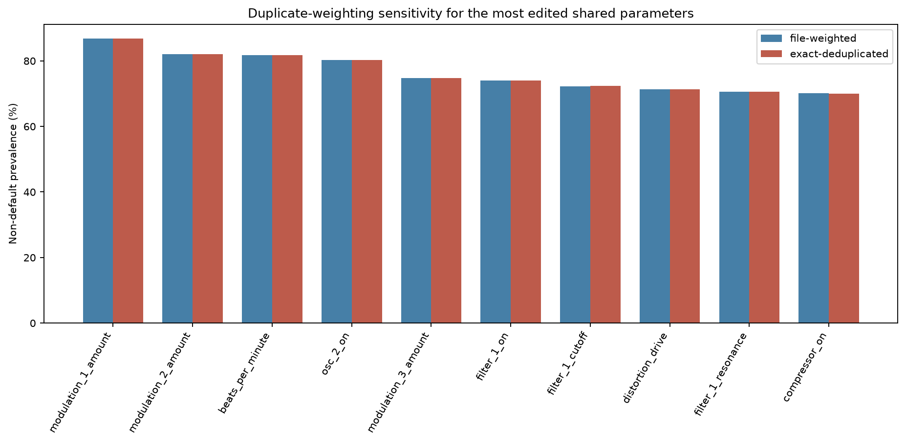

Figure 11 compares the file-weighted and exact-deduplicated estimates for the most edited shared parameters. The JSON and parameter CSV retain the complete comparison, including numerator and denominator for every parameter; the figure is only a readable headline slice.

## Method notes

- The corpus is scanned recursively one `.vital` file at a time and is never rewritten.
- File-weighted aggregates include every successfully parsed file. Exact-deduplicated aggregates include one representative for each raw-byte SHA-256; this is analysis-only and does not remove or alter source files.
- Direct component usage is `*_on != 0`. Modulation `connected`, `bypassed`, `amount_zero`, `amount_nonzero`, and `live` are separate counters. A live route is connected, not bypassed, and non-zero amount.
- Every scalar percentage has an eligible count in `vital_usage_parameters.csv` and the JSON. Atlas-backed defaults come from `VitalSchema.parameters`; missing common scalar keys are filled with that default for comparison.
- Custom LFO shapes, wavetable name/content statuses, non-init wavetable descriptors, route remaps, and sampler statuses are aggregate semantic labels only. Raw preset paths, names, authors, payloads, and per-file records are not report content.
- The pinned source/schema context is documented in [`PRESET_SCHEMA.md`](PRESET_SCHEMA.md) and [`VITAL_CORPUS_AUDIT.md`](VITAL_CORPUS_AUDIT.md).

## Reproduction and artifacts

```powershell
conda activate py312
python research/vital/build_vital_usage_census.py
python research/vital/build_vital_usage_report.py
```
The aggregate source of truth is [`vital_usage_census.json`](vital_usage_census.json); the complete scalar lookup table is [`vital_usage_parameters.csv`](vital_usage_parameters.csv), with row-level categorical and continuous distribution exports beside it.
